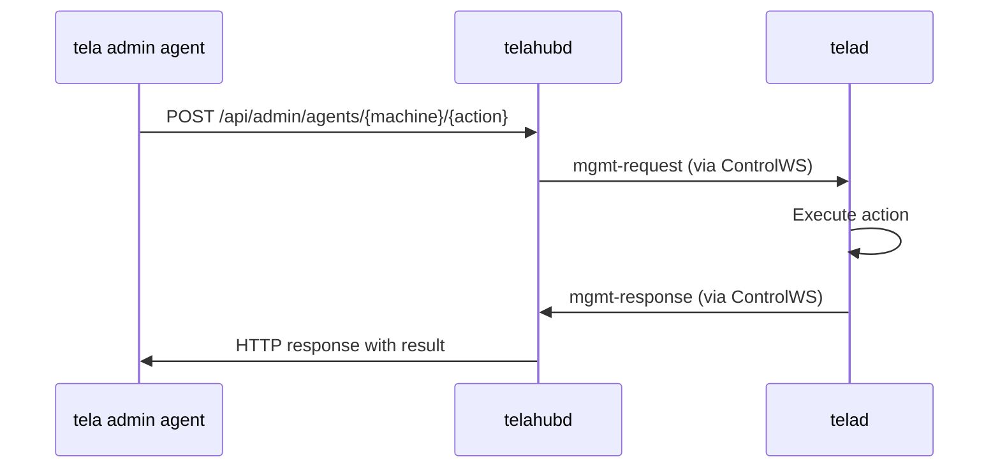
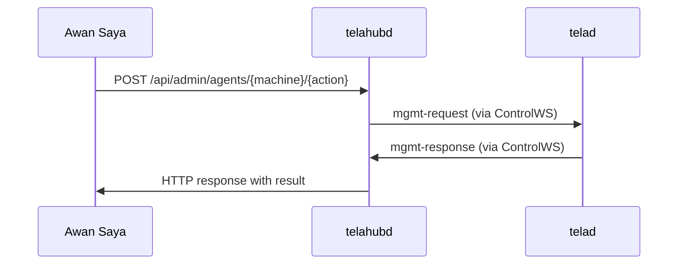

# Design: Remote Administration

This document describes the design for remote administration of telad agents and telahubd hubs from the tela CLI, TelaVisor, and Tela portals (such as Awan Saya). The goal is to manage agents and hubs from any machine without SSH access, using the existing encrypted tunnel infrastructure. The design supports both single-hub administration and enterprise fleet management across many hubs and agents through a portal.

## Principles

1. **All functionality lives in the CLI tools and APIs.** TelaVisor is a shell. Every management operation must be available as a `tela` CLI command or an API endpoint before TelaVisor wraps it.

2. **No new inbound ports.** Agents and hubs are reachable only through their existing connections (agents via their hub WebSocket, hubs via their HTTPS endpoint). No new listeners are opened on agent machines.

3. **Hub-mediated agent management.** The hub proxies management commands to agents through the existing control WebSocket. This preserves the "outbound-only" architecture where agents never accept inbound connections.

4. **Role-based access.** Management operations are governed by the same token/role/ACL model already in telahubd. New permissions extend the existing model rather than replacing it.

5. **Local and remote.** The same APIs work for local management (TV detecting a local telad/telahubd) and remote management (TV sending commands through the hub).

## Current state

### What exists

| Component | Local management | Remote management |
|-----------|-----------------|-------------------|
| telahubd | Admin API (HTTP), `telahubd user` CLI | `tela admin` CLI, TelaVisor Hubs tab |
| telad | Edit YAML, restart process | None |
| tela | Control API (HTTP+WS), `tela connect` | TelaVisor launches and monitors |

### What is missing

- telad has no management API. Configuration changes require editing YAML and restarting the process.
- telahubd has no local discovery mechanism (no control file for TV to find).
- There is no way to send a command from a client to a specific agent through the hub.
- The auth model has no "agent management" permission distinct from "connect" permission.

## Design

### 1. Agent management API

Add a management message protocol to telad's existing hub WebSocket. The hub receives management requests via its admin API and forwards them to the target agent.

#### 1.1 Message flow



#### 1.2 Hub endpoints (new)

All require owner or admin role.

| Endpoint | Method | Purpose |
|----------|--------|---------|
| `/api/admin/agents` | GET | List registered agents with metadata |
| `/api/admin/agents/{machine}/config` | GET | Read agent's running config |
| `/api/admin/agents/{machine}/config` | PUT | Push config update to agent |
| `/api/admin/agents/{machine}/restart` | POST | Request agent restart |
| `/api/admin/agents/{machine}/logs` | GET | Stream recent agent log output |
| `/api/admin/agents/{machine}/update` | POST | Tell agent to self-update |

The hub does not interpret these commands. It wraps the request body in a management message and sends it to the agent's ControlWS. It then waits (with a timeout) for the agent's response message and returns it as the HTTP response.

#### 1.3 Agent-side protocol (new message types)

New control message types on the agent's hub WebSocket:

| Type | Direction | Purpose |
|------|-----------|---------|
| `mgmt-request` | Hub to agent | Management command from an admin |
| `mgmt-response` | Agent to hub | Result of a management command |

Message structure:

```json
{
  "type": "mgmt-request",
  "requestId": "unique-id",
  "action": "config-get | config-set | restart | logs | update",
  "payload": { ... }
}
```

```json
{
  "type": "mgmt-response",
  "requestId": "unique-id",
  "ok": true,
  "payload": { ... }
}
```

The `requestId` correlates responses with requests. The hub maintains a pending-request map and times out after 30 seconds.

#### 1.4 Supported actions

**config-get**: Returns the agent's current running configuration as JSON. Includes machines, services, file share settings, gateway routes, and upstreams. Sensitive fields (tokens) are redacted.

**config-set**: Accepts a partial or full config update. The agent validates the new config, applies it, and persists to disk. If validation fails, returns an error without applying. Fields that can be updated:
- Machine metadata (displayName, tags, location, owner)
- Service definitions (add, remove, modify services)
- File share settings (enable/disable, change directory, permissions)
- Gateway routes
- Upstream definitions

Fields that cannot be updated remotely (require restart):
- Hub URL
- Machine name (renaming a machine re-registers it)

**restart**: The agent performs a graceful restart. Active sessions drain (configurable timeout, default 30 seconds), then the process re-executes itself. On platforms with service managers, this delegates to the service manager.

**logs**: Returns the last N lines of the agent's log output. The agent maintains a ring buffer of recent log lines (configurable size, default 1000 lines).

**update**: The agent downloads the specified version from GitHub releases, stages the binary, and restarts. Follows the same self-update pattern as TelaVisor.

### 2. Hub local discovery

Add a control file for telahubd so that TelaVisor can detect a locally running hub.

On startup, telahubd writes a control file to the tela config directory:

```json
{
  "pid": 12345,
  "port": 8080,
  "name": "gohub",
  "adminPort": 8080
}
```

Path: `~/.tela/run/telahubd.json` (or `%APPDATA%\tela\run\telahubd.json` on Windows).

TelaVisor checks for this file to detect a local hub. The hub's admin API is already HTTP-based, so TV connects to `http://127.0.0.1:{port}` with the locally stored owner token.

### 3. Agent local discovery

Add a control file for telad:

```json
{
  "pid": 12345,
  "machines": ["barn", "gohub"],
  "hub": "wss://gohub.parkscomputing.com",
  "configPath": "/etc/tela/telad.yaml"
}
```

Path: `~/.tela/run/telad.json`.

TV always uses the hub-mediated management API, even for local agents. This ensures one code path for all agent management, consistent auth enforcement, and a complete audit trail. Local discovery (control files) is used only to detect running instances and show status indicators, not to read or write configs directly.

### 4. Auth model extensions

#### 4.1 New permission: manage

Add a `manage` permission to the machine ACL model, alongside `register` and `connect`:

```yaml
machines:
  barn:
    registerToken: "agent-token"
    connectTokens: ["alice", "bob"]
    manageTokens: ["alice"]
```

The `manage` permission allows:
- Reading and writing agent configuration
- Restarting the agent
- Viewing agent logs
- Triggering agent updates

Owner and admin roles implicitly have manage permission on all machines. User-role tokens require explicit `manageTokens` entry.

#### 4.2 CLI commands

New `tela admin agent` subcommands:

```
tela admin agent list          -hub <url> -token <tok>
tela admin agent config        -hub <url> -token <tok> -machine <id>
tela admin agent set           -hub <url> -token <tok> -machine <id> -field <path> -value <val>
tela admin agent restart       -hub <url> -token <tok> -machine <id>
tela admin agent logs          -hub <url> -token <tok> -machine <id> [-n 100]
tela admin agent update        -hub <url> -token <tok> -machine <id> [-version latest]
```

New `tela admin manage` subcommands for the manage ACL:

```
tela admin grant-manage <id> <machineId>   -hub <url> -token <tok>
tela admin revoke-manage <id> <machineId>  -hub <url> -token <tok>
```

### 5. TelaVisor integration

TelaVisor wraps the CLI commands and APIs described above. It does not implement management logic directly.

#### 5.1 Local instance detection

On startup and periodically, TV checks for control files:
- `~/.tela/run/control.json` (tela client) -- already implemented
- `~/.tela/run/telad.json` (local agent) -- new
- `~/.tela/run/telahubd.json` (local hub) -- new

When found, the corresponding Infrastructure tab lights up with a local indicator. TV can manage local instances via direct file access (config editing) or local HTTP APIs.

#### 5.2 Remote agent management in Agents tab

The existing Agents tab shows agent details read-only. With the management API:

- **Agent Info** card becomes editable (displayName, tags, location, owner)
- **Services** card gets Add/Edit/Remove buttons
- **File Share** card gets a form for all settings (enable, directory, permissions, limits)
- **Gateway** card gets route editor
- **Management** section gets working Restart and Update buttons
- **Logs** section streams live agent logs

Changes are sent via `tela admin agent set` (or the equivalent hub API call). The agent applies them and responds with success/failure.

#### 5.3 Agent config editor

A Profiles-style editor for agent configurations:

- Sidebar lists machines defined on the agent
- Main area shows a form for the selected machine's settings
- Preview shows the telad.yaml that would be generated
- Save pushes the config to the agent via the hub-mediated management API

This editor works for modifying running agents. For initial agent setup before a hub connection exists, use `telad init` to generate a starter config.

### 6. Implementation phases

#### Phase 1: Local discovery and config editing

- Add control files to telad and telahubd
- Add TV detection of local instances
- Add `telad init` CLI command for bootstrapping a new agent config
- No new hub APIs needed (local detection only)

#### Phase 2: Hub-mediated management protocol

- Add `mgmt-request`/`mgmt-response` message types to telad
- Add `config-get` and `config-set` actions
- Add `/api/admin/agents/*` proxy endpoints to telahubd
- Add `tela admin agent` CLI commands
- Add `manage` permission to ACL model

#### Phase 3: Lifecycle management

- Add `restart`, `logs`, and `update` actions to telad
- Add agent log ring buffer
- Add self-update capability to telad
- Wire up TV Agents tab management controls

#### Phase 4: Live editing in TelaVisor

- Agent config editor (Profiles-style UI)
- Real-time config push with validation feedback
- Service/file-share/gateway/upstream form editors
- Live log streaming in TV

### 7. Security considerations

**Token redaction.** The `config-get` action never returns token values. Tokens are shown as `"****"` in the response. Token changes require the `tela admin rotate` command through the hub admin API.

**Config validation.** The agent validates all config changes before applying. Invalid configs are rejected with a descriptive error. The agent never enters an inconsistent state from a bad remote config push.

**Audit trail.** All management operations are logged by the hub with the requesting identity, timestamp, and action. The agent also logs management operations locally.

**Rate limiting.** Management requests through the hub are subject to the same rate limiting as other admin API calls (when implemented per CLAUDE.md item O4).

**Scope limitation.** Remote management cannot change the agent's hub URL or authentication token. These require direct access to the agent machine. This prevents a compromised hub admin from redirecting agents to a malicious hub.

### 8. Backward compatibility

All changes are additive. Existing agents that do not understand management messages will ignore them (unknown message types are already silently skipped in the control message switch). The hub returns a timeout error to the admin API caller, which TV can display as "Agent does not support remote management. Update the agent to enable this feature."

Hub endpoints for agent management return 404 for agents that have not registered management capability. Agents advertise management support via a new `management: true` field in their capabilities during registration.

### 9. Portal integration (Awan Saya and third-party portals)

The management APIs described above are designed to be consumed by portals for enterprise fleet management. A portal like Awan Saya aggregates many hubs and their agents into a single management plane, scoped by organization, team, and role.

#### 9.0 Terminology: agent vs fleet

An **agent** is a single telad instance registered with a hub. It is the concrete unit users interact with: one machine, one daemon, one identity in the hub's machine table.

A **fleet** is a *view* across many agents. It is the cross-hub aggregate that only the portal can produce, because only the portal knows which hubs belong to which organization. A user with TelaVisor sees their agents one hub at a time; the same user signed into the portal sees the same agents collected into a fleet.

The user-facing label across all Tela products is **Agents** (the noun for the thing). "Fleet" appears only as a description of the aggregate or as part of internal API paths (`/api/fleet/agents/...`). Both TelaVisor's Infrastructure mode and the Awan Saya portal use the navigation label "Agents" so users moving between them see consistent terminology.

#### 9.1 Current portal-hub relationship

Today, the portal:
- Registers hubs and stores their viewer tokens for status/history proxying
- Provides a hub directory (`/api/hubs`) for name resolution
- Manages hub visibility through org/team membership
- Proxies read-only status and history queries to hubs
- Generates pairing codes by proxying to the hub's admin API
- Stores per-account Tela tokens in `hub_tokens` (schema exists, provisioning not yet implemented)

The portal cannot manage machines or agents. All machine-level operations require direct use of the hub admin CLI or API.

#### 9.2 Portal as fleet management plane

With the management APIs from this design, the portal gains the ability to manage agents through hubs. The portal never communicates with agents directly. It calls the hub's admin API, which mediates the request to the agent.



This preserves the existing trust model: the portal authenticates to the hub with an admin token, the hub authenticates to the agent via the established WebSocket. The portal does not need new credentials for agents.

#### 9.3 New portal capabilities

With the hub admin API extensions from sections 1-4, the portal can offer:

**Fleet-wide agent inventory.** The portal queries each hub's `/api/admin/agents` endpoint and aggregates results into a unified agent list across all hubs in an organization. Each agent shows its hub, machine name, version, status, services, and management capability.

**Agent configuration management.** Organization admins can view and edit agent configurations through the portal UI. The portal sends config changes to the hub, which forwards them to the agent. The portal does not store agent configs; it reads them on demand via `config-get` and writes them via `config-set`.

**Agent lifecycle operations.** Restart, update, and log viewing for any agent in the fleet, gated by the portal's org/team role model.

**Bulk operations.** The portal can issue the same management command to multiple agents across multiple hubs (e.g., "update all agents to v0.4.0" or "enable file sharing on all production machines"). The portal iterates over the target agents and calls the hub admin API for each.

**Compliance and audit.** The portal's activity log (`logActivity`) records all management operations with the acting account, target hub/machine, and timestamp. Combined with the hub's own audit trail, this provides end-to-end audit from portal user to agent action.

#### 9.4 Portal auth mapping

The portal's org/team/role model maps to hub permissions:

| Portal role | Hub token role | Agent management |
|-------------|---------------|------------------|
| Org owner | owner | Full management of all agents on org hubs |
| Org admin | admin | Full management of all agents on org hubs |
| Team admin | admin (scoped to team hubs) | Manage agents on team's hubs |
| Team member | user + connect ACL | Connect to permitted machines, no management |
| Team viewer | viewer | Read-only status, no connect or manage |
| Hub member (external) | user + connect ACL | Connect to permitted machines on invited hub |

When the portal provisions a Tela token for an account (via the hub admin API), it sets the role based on the account's portal role. When a portal role changes (e.g., member promoted to admin), the portal rotates the account's hub token with the new role.

#### 9.5 Token lifecycle through the portal

The `hub_tokens` table in the portal stores per-account Tela tokens. The full lifecycle:

1. **Provisioning.** When an account gains access to a hub (team membership or hub invitation), the portal calls `POST /api/admin/tokens` on the hub to create a token. The portal stores the token in `hub_tokens` and delivers it to the account's TelaVisor or CLI via the portal API.

2. **Role changes.** When the account's portal role changes, the portal calls `POST /api/admin/rotate/{id}` on the hub, then deletes the old token and provisions a new one with the correct role.

3. **Revocation.** When the account loses access (team removal, org departure), the portal calls `DELETE /api/admin/tokens?id={id}` on the hub. The portal deletes the local `hub_tokens` record.

4. **Stale detection.** If a hub admin revokes a token out-of-band (via CLI), the portal detects this when the token fails authentication on the next proxy request. The portal marks the token as `valid: false` and notifies the account.

#### 9.6 Portal API extensions

New portal API endpoints for fleet management:

```
GET  /api/fleet/agents                         -- List all agents across org hubs
GET  /api/fleet/agents/{hub}/{machine}         -- Agent detail (proxies config-get)
PUT  /api/fleet/agents/{hub}/{machine}/config  -- Push config (proxies config-set)
POST /api/fleet/agents/{hub}/{machine}/restart -- Restart agent
GET  /api/fleet/agents/{hub}/{machine}/logs    -- Stream agent logs
POST /api/fleet/agents/{hub}/{machine}/update  -- Trigger agent update
POST /api/fleet/bulk                           -- Bulk operation on multiple agents
```

All endpoints require org admin or team admin role. The portal resolves the hub URL from its registry, authenticates with its stored admin token, and proxies the request to the hub's `/api/admin/agents/*` endpoint.

#### 9.7 Portal UI (Awan Saya dashboard)

The portal dashboard extends with fleet management views:

**Fleet overview.** A table of all agents across the organization's hubs. Columns: machine name, hub, status (online/offline), version, services, last seen. Sortable, filterable, searchable.

**Agent detail.** Clicking an agent opens a detail view similar to TelaVisor's Agents tab: agent info, services, file share config, gateway routes, management controls. Editable for org/team admins.

**Bulk actions toolbar.** Select multiple agents and apply bulk operations: update all, restart all, enable/disable file sharing, push config template.

**Compliance view.** Audit log filtered to management operations. Shows who changed what on which agent, when, from which portal account. Exportable for compliance reporting.

#### 9.8 Third-party portal support

The design is not Awan Saya-specific. Any portal that implements the hub directory API (`/.well-known/tela`) can consume the management APIs. The contract is:

1. The portal discovers hubs via their registered URL.
2. The portal authenticates to hubs using admin tokens (provisioned during hub registration or via the sync token flow).
3. The portal calls the hub's standard admin API endpoints, including the new `/api/admin/agents/*` endpoints.
4. The portal presents management UI appropriate to its user model.

No Awan Saya-specific logic exists in telahubd or telad. The management protocol is generic.

### 10. Implementation status

#### Phase 1: Local discovery -- DONE
- telad writes `~/.tela/run/telad.json` on startup, removes on exit
- telahubd writes `~/.tela/run/telahubd.json` on startup, removes on exit
- TelaVisor `GetLocalInstances()` reads control files and checks process liveness

#### Phase 2: Hub-mediated management protocol -- DONE
- telad handles `mgmt-request` messages with `config-get` and `config-set` actions
- telad advertises `management: true` in capabilities at registration
- telahubd proxies `/api/admin/agents/{machine}/{action}` to the agent's ControlWS
- `tela admin agent config`, `set`, `list`, `logs`, `restart` CLI commands
- `manage` permission on machine ACLs with `grant-manage` / `revoke-manage` endpoints and CLI commands

#### Phase 3: Lifecycle management -- DONE
- telad log ring buffer (1000 lines) for remote log retrieval
- `logs` action returns last N lines from ring buffer
- `restart` action re-executes telad after sending response
- TelaVisor Agents tab: View Logs opens a dynamic log panel tab, View Config shows a dialog, Restart prompts for confirmation

#### Phase 4: Portal fleet management -- DONE (API and basic UI)
- `GET /api/fleet/agents` aggregates agents across all hubs the user can manage
- `POST /api/fleet/agents/{hub}/{machine}/{action}` proxies management requests with activity logging
- Fleet page at `/portal/{orgId}/fleet` with agent status table
- Fleet nav link in portal sidebar (visible to org admins)
- Remaining: agent detail page, editing forms, log viewer, bulk operations, compliance views

#### Phase 5: Live editing in TelaVisor -- IN PROGRESS
- Agent detail view uses setting-card pattern with editable fields (Display Name, Tags, Location, File Share settings)
- Save button gathers editable fields and pushes via `config-set` through the management API
- ACLs view shows Register, Connect, and Manage columns with per-identity revoke buttons
- Grant dialog supports Connect, Register, and Manage permission types
- Remaining: editable Services list, Gateway routes, Upstreams, Awan Saya editing UI
