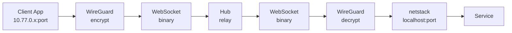
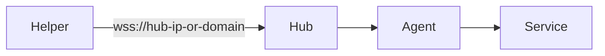
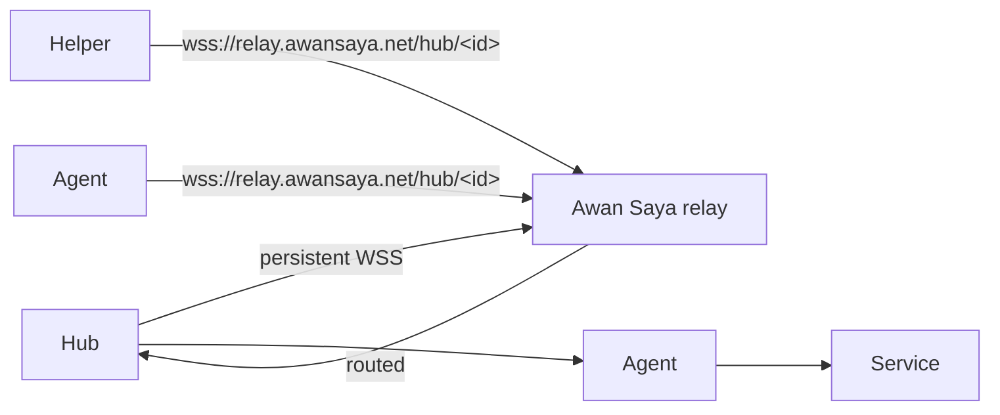
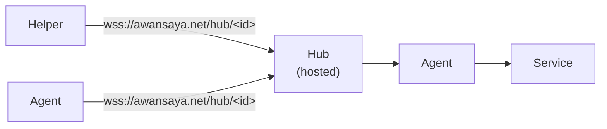

# **Tela - Design, Architecture, and Agent-Centric Development Strategy

### *FOSS Remote-Access & Connectivity Fabric (SEA-rooted, Global-ready)*

### *Version 0.4 - Authoritative Specification*

---

## 0. Purpose of This Document

Tela is a **FOSS connectivity fabric** that provides outbound-only tunnels, multiplexed TCP channels, zero-install client access, browser-mediated orchestration, helper-mediated local TCP bridging, and a stable substrate for future cloud services.

This document defines the architecture, protocol, security model, MeshCentral integration boundary, browser TCP bridge mechanism, agent concurrency model, literate coding standards, LLM agent guardrails, and roadmap.

This document is **authoritative**.
LLM agents must treat it as the **single source of truth**.
Any deviation must be explicitly approved by a human maintainer.

---

## 0.1 Glossary

This glossary defines terms as they are used in Tela.

| Term | Definition (Tela meaning) |
| --- | --- |
| **Agent (telad)** | The long-lived daemon on a managed machine that makes an outbound connection to the Hub and exposes local services. Binary: \	elad\. |
| **Awan Saya** | The cloud platform/service built on top of Tela. Provides hub registry, relay infrastructure, hosted hubs, SSO, and dashboards. Not part of Tela core. See §18. |
| **Certificate pinning** | The agent/client refuses to connect unless the Hub presents the expected TLS certificate fingerprint, preventing MITM even when a proxy can issue “valid” certificates. |
| **Channel** | A logical stream within a single WebSocket connection (e.g., one proxied TCP connection) identified by a channel ID and managed via \open\/\close\. |
| **Client (tela)** | The binary on the user’s laptop that connects through the Hub to an agent, establishes a WireGuard tunnel, and binds localhost listeners. Binary: \	ela\. Replaces the earlier “Helper” concept. |
| **Connectivity fabric (fabric)** | The stable substrate that provides secure, outbound-only connectivity and multiplexed tunnels between endpoints. |
| **Control plane** | Authentication, session creation, token issuance, device registry/metadata, and other “decisions” (not bulk data transport). |
| **Data plane** | The high-volume tunneled bytes (e.g., an RDP stream) flowing between client↔agent via the Hub. |
| **Ephemeral port / localhost binding** | A temporary W.0.0.1:<port>\ listener created by the client so native apps (mstsc, ssh, etc.) can connect without installing anything system-wide. |
| **Fingerprint (certificate fingerprint)** | A short hash derived from the Hub’s TLS certificate (or public key) used for pinning; must match the expected value exactly. |
| **Frame** | One protocol unit on the wire: a fixed header plus a payload (control JSON, TCP data, or heartbeat). |
| **Hub** | The central relay/coordinator that accepts agent and client connections, brokers sessions, allocates channels, and routes frames between parties. Binary: `telahubd`. |
| **Hub Console** | The web interface served by a Hub (e.g., \https://tela.awansaya.net/\). Shows registered machines, services, and session status. |
| **HTTP** | Hypertext Transfer Protocol; commonly tunneled to validate connectivity (e.g., a static page). |
| **Locked-down environment** | A network or workstation that restricts inbound ports, VPNs, and/or installation, but still allows outbound HTTPS/WebSocket traffic. |
| **Machine** | A named resource registered by an agent (e.g., \arn-wg\). One agent registers one machine. |
| **Mesh** | A connected set of agents and sessions forming a network of reachable services through the Hub (not necessarily peer-to-peer). |
| **MITM (man-in-the-middle)** | An attacker (or intercepting proxy) that attempts to observe/modify traffic between endpoints by inserting itself between client and server. |
| **Multiplexing** | Carrying multiple channels (control + multiple TCP streams) over a single WebSocket connection using a framing header and channel IDs. |
| **NAT** | Network Address Translation; a common reason inbound connections to a machine are not possible without port forwarding. |
| **Outbound-only** | Agents and clients initiate connections out to the Hub; no inbound ports are required on managed machines. |
| **Portal** | The Awan Saya multi-hub dashboard at `awansaya.net/`. Aggregates machines, services, and sessions across all hubs a user has been granted access to. Provides SSO, RBAC, and centralized management. Distinct from the single-hub Console. Implements the hub directory API (`/api/hubs`); the Tela CLI can add it as a remote: `tela remote add awansaya https://awansaya.net`. See §18.7-18.11. |
| **RDP** | Microsoft Remote Desktop Protocol (typically TCP/3389); a primary example of a tunneled service. |
| **Registry** | The directory of Hubs maintained by Awan Saya (§18.2). Maps hub identifiers to live connections. |
| **Relay** | Awan Saya’s rendezvous service for self-hosted Hubs (§18.3). Transparently forwards WebSocket frames. |
| **Service** | A TCP endpoint exposed through a machine (e.g., SSH on port 22, RDP on port 3389). Identified by port (and proto), with optional name/description metadata. |
| **Session** | An active encrypted tunnel between a client and an agent, brokered by the Hub. |
| **Session token** | A short-lived, single-use credential issued by the Hub that authorizes a client for a specific session. |
| **SFTP** | SSH File Transfer Protocol; a file transfer protocol that runs over SSH. |
| **SSH** | Secure Shell (typically TCP/22); commonly used for remote terminals and file transfer (SCP/SFTP). |
| **TCP** | Transmission Control Protocol; Tela tunnels TCP streams (RDP/SSH/HTTP/etc.) without needing to understand the application protocol. |
| **TLS** | Transport Layer Security; provides encrypted and authenticated transport. Tela uses TLS 1.3 for Hub connections. |
| **Tunnel** | The end-to-end forwarding path \client → tela → Hub → telad → service\ that makes a remote service appear local. |
| **VNC** | Virtual Network Computing; another example of a TCP service that can be tunneled. |
| **WebSocket (WS/WSS)** | A persistent full-duplex connection over HTTP(S). Tela uses \wss://\ for secure transport once deployed. |

# **1. Identity & Positioning

## 1.1 Name

**Tela**: Filipino for *fabric*.
Represents a woven mesh of nodes, tunnels, and services.
Short, global-friendly, SEA-rooted, and brandable.

## 1.2 Positioning

Tela is the **engine**. Awan Saya is the **platform**.

- **Tela : Awan Saya :: Docker : Kubernetes
- **Tela : Awan Saya :: WireGuard : Tailscale
- **Tela : Awan Saya :: git : GitHub

Tela is the runtime, the connectivity substrate, the stable, boring, long-lived layer.
Awan Saya is the orchestrator, the identity and policy layer, the multi-service cloud platform.

Critically, Awan Saya is also a **connectivity service**: it can serve as a rendezvous relay for self-hosted Hubs (eliminating the need for Cloudflare Tunnels, port forwarding, or static IPs), or it can host Hubs directly as a managed service. Users choose their deployment model; Tela's protocol is identical across all of them. See §18.

Tela must remain small, stable, and protocol-frozen so Awan Saya can evolve rapidly above it.

## 1.3 What Tela Is

Tela is a **connectivity fabric**, not a remote desktop tool.
Remote desktop is simply the first module that runs on the fabric.

Tela provides access to any machine or service from any locked-down environment with zero installation. It does this via outbound-only agents, browser orchestration, a helper binary for local TCP binding, multiplexed WebSocket channels, and protocol-agnostic tunneling.
## 1.4 License

Tela is released under the **Apache License 2.0**.

Apache 2.0 is chosen because:

- Permissive enough to encourage adoption and contribution.
- Includes an explicit patent grant (protects contributors and users).
- Compatible with Awan Saya being a proprietary or differently-licensed commercial layer.
- Widely understood in the FOSS ecosystem.

**All contributions to the Tela project must be licensed under Apache 2.0.** The Awan Saya platform may use a different license.

---

# **2. Goals & Non-Goals

## 2.1 Goals

Tela must:

- Provide **zero-install client access** for RDP, SSH, SFTP, VNC, HTTP, and arbitrary TCP services.
- Use **outbound-only connectivity** from agents (no inbound ports, no VPN).
- Support **Windows, Linux, and macOS** agents.
- Provide a **browser-based orchestration layer**.
- Provide a **helper binary** that exposes ephemeral `localhost:<port>` endpoints.
- Support **protocol-agnostic multiplexed TCP channels**.
- Maintain **long-term backward compatibility**.
- Use **minimal dependencies** and "boring tech."
- Serve as the **substrate for Awan Saya**.

## 2.2 Non-Goals

Tela must not:

- Implement dashboards, RBAC, or identity providers (Awan Saya's domain).
- Become a monolithic remote-desktop suite.
- Adopt trendy frameworks or complex build systems.
- Introduce microservices.
- Allow protocol churn or dependency creep.
- Become a general cloud platform (Tela is the substrate, not the platform).

> **Implementation note:** The hub now includes a token-based RBAC system with four roles (owner, admin, user, viewer) and per-machine ACLs. This was implemented as part of the hub's auth model (section 13), not as an external identity provider.

---

# **3. Design Philosophy & Invariants

## 3.1 Stability First

Tela must be stable enough to run for 10+ years with minimal changes: frozen protocol structures, additive-only control messages, strict backward compatibility, minimal dependencies, predictable behavior.

## 3.2 Boring Technology

Go for the agent (`telad`) and Hub (`telahubd`), vanilla JS for the browser, Go for the CLI. These choices minimize churn and maximize longevity.

> **Implementation note:** The original design specified C/C++ for the agent and Node.js for the Hub. Both were implemented in Go, a deliberate simplification that preserves the "boring technology" intent while using a single language across all server-side components.

## 3.3 Agent-Centric Development

Tela assumes LLM agents will contribute code. Literate coding is mandatory, invariants must be explicit, "DO NOT MODIFY" markers must be used, concurrency models must be locked down, and protocol structures must be immutable.

## 3.4 Guiding Invariants

Tela must always remain:

- outbound-only
- protocol-agnostic
- dependency-minimal
- backward-compatible
- agent-centric
- browser-accessible
- platform-neutral
- stable

These invariants shape every architectural decision.

---

# **4. Architecture Overview

## 4.1 Components

- **telad**: Go static binary (daemon/agent). Runs on managed machines. Registers services with the Hub, brokers WireGuard sessions.
- **telahubd**: Go HTTP+WebSocket server (Hub). Central coordination point. Serves hub console, `/api/status`, `/api/history`.
- **tela**: Go static binary (client). Connects through the Hub to an agent, establishes WireGuard tunnel, binds localhost listeners.
- **Tela Web**: Vanilla JS browser UI. Orchestration only.
- **Awan Saya**: Future control plane and optional connectivity/hosting service. Not part of Tela core. See §18.

> **Implementation note:** The original design specified separate "Agent" (C/C++), "Hub" (Node.js), "Helper" (Go), and "CLI" (Go) binaries. The implementation consolidates these into three Go binaries: `telad` (agent/daemon), `telahubd` (hub), and `tela` (client/helper/CLI).

## 4.2 Data Flow

### Agent Connection

1. Agent opens outbound TLS+WebSocket to Hub.
2. Agent registers identity and capabilities.
3. Agent maintains heartbeats and reconnect logic.

### Browser Orchestration

1. User logs into Tela Web.
2. User selects a machine.
3. Browser requests a session token from Hub.
4. Browser provides helper download and a run command with pre-filled arguments (or triggers `tela://` URI if registered).
5. User runs the helper.

### Helper Connection

1. Helper validates Hub certificate fingerprint.
2. Helper opens its own WebSocket to Hub.
3. Helper authenticates using the session token.
4. Helper binds `localhost:<port>`.
5. Native client (mstsc/ssh/etc.) connects to that port.
6. Helper forwards TCP → Hub → Agent → target service.

### Multiplexed Channels

All traffic flows through a single WebSocket per endpoint (Agent ↔ Hub, Helper ↔ Hub). Each WebSocket carries a control channel, heartbeat channel, multiple TCP data channels, and optional file transfer channels.

## 4.3 Component Interaction Model

Tela uses a **three-party interaction model**:

| Path | Purpose |
|------|---------|
| **Browser → Hub** | Auth, session creation, token issuance, UI |
| **Helper → Hub** | TCP forwarding, session token auth, local binding |
| **Agent → Hub** | Service proxying, capability reporting, heartbeats |

**The browser never carries data traffic. It only orchestrates.
Once the helper is launched, the browser can close.

---

# **5. MeshCentral Integration Boundary

MeshCentral is a mature, stable, widely deployed remote-access system with a proven agent transport layer. Tela builds on selected MeshCentral components to avoid reinventing complex, battle-tested functionality.

This section defines exactly what Tela reuses, what Tela replaces, and why. This prevents the Hub from becoming an accidental fork.

## 5.1 Components Reused

Tela reuses only parts that are stable, protocol-agnostic, dependency-minimal, well-tested, and unlikely to change:

- **WebSocket multiplexing engine**: channel framing, lifecycle, binary data handling, flow control. Tela layers its own protocol on top.
- **Agent connection lifecycle**: persistent WebSocket logic, reconnect, heartbeat, basic registration.
- **Minimal device registry logic**: agent ID storage, basic metadata, online/offline tracking. Not the full device management model.
- **Core agent transport code**: socket abstraction, platform-specific networking, TLS handling, WebSocket framing. Everything above the transport layer is replaced.

## 5.2 Components Replaced

Tela replaces all MeshCentral components that are UI-heavy, RDP-specific, opinionated, or tied to MeshCentral's identity/device management model:

- **Entire Web UI**: Tela Web is new, minimal, vanilla JS.
- **Browser TCP bridge**: MeshCentral does not have a local-client TCP bridge. Tela's helper architecture is original.
- **Local-client ephemeral port mechanism**: unique to Tela.
- **Service exposure API**: MeshCentral is RDP-centric; Tela exposes arbitrary TCP services.
- **Metadata & tagging system**: new, lightweight model.
- **Authentication model**: Tela uses local auth (standalone) or SSO (Awan Saya).
- **Protocol specification**: Tela freezes v1 for long-term stability; MeshCentral evolves faster.

## 5.3 Rationale

> **Implementation note (§5.1-§5.3):** MeshCentral integration was not pursued. The current implementation (`telahubd`, `telad`, `tela`) is written entirely from scratch in Go, using `gorilla/websocket`, `wireguard-go`, and gVisor netstack. No MeshCentral code is integrated. The architectural intent (minimal hub, outbound-only agents, protocol-agnostic tunnels) is preserved.

MeshCentral would have solved the hardest problems (cross-platform agent, stable WebSocket transport, NAT traversal, multiplexing, reconnect logic, TLS handling) without reinventing them. The from-scratch Go implementation achieves the same goals via a simpler architecture.

---

# **6. Protocol Specification

This section is **authoritative**. All implementations must follow it exactly.

## 6.1 Transport

- TLS 1.3
- WebSocket (wss://)
- Binary frames only
- No compression (avoids complexity and side-channel attacks)

WebSocket is chosen because it works through corporate proxies, locked-down networks, and Cloudflare Tunnel, and is supported by all browsers and MeshCentral's transport layer.

**Compression caveat:** Disabling compression means all tunneled data traverses the wire at full size. For bandwidth-heavy protocols like RDP, this is acceptable because RDP applies its own compression internally. For other protocols, the bandwidth cost of no compression is the explicit tradeoff for simplicity and side-channel resistance. If this becomes a bottleneck in production, compression may be revisited as an opt-in feature in a future phase, applied only to the data payload (never to headers or control messages).

## 6.2 Multiplexing (v1: single-channel)

**v1 ships single-channel.** One WebSocket carries one session.
Multiplexing multiple sessions over a single connection is not part
of v1 and is reserved for a hypothetical v2.

The relay frame header (see [DESIGN-relay-gateway.md](DESIGN-relay-gateway.md)
section 2) already includes a 4-byte `session_id` field that is
constant for the life of the connection in v1. The field exists so
that future multiplexing can be added without a wire-format change:
a v2 client could open one WebSocket and multiplex N sessions over
it, demultiplexing inbound frames by `session_id`, without breaking
v1 peers (which continue to see one session per connection).

### Why single-channel for v1

A multiplexing experiment landed on `main` between commits efeafac
and 14a731f and was reverted after dogfood issues. The complexity
of correctly serializing N sessions over one connection (head-of-line
blocking, fairness, framing accidents under reconnect) outweighed
the benefit at this stage of the project. The session_id reservation
in the wire format keeps the door open without committing to it.

### What this means for clients and agents

- Each `tela connect` to a machine opens exactly one WebSocket to the
  hub. Connecting to N machines opens N WebSockets.
- Each agent registration uses one persistent control WebSocket
  (`telad`'s ControlWS). Per-session WebSockets are opened on demand
  for each pairing, one per session.
- The bridging hub (relay gateway) opens one outbound WebSocket per
  bridged session.

A v2 implementation that adds multiplexing would consume the
reserved `session_id` field, but v1 implementations (which keep
`session_id` constant) would continue to interoperate as long as
v2 negotiates multiplexing as a capability rather than assuming it.

## 6.3 Frame Format

The v1 relay frame header is a 7-byte big-endian prefix on every
binary message that crosses the relay path: `magic` (1 byte),
`hop` (1 byte TTL), `flags` (1 byte; bit 0 selects DATA vs
CONTROL), and `session_id` (4 bytes). The full specification,
including transport integration (WebSocket, UDP relay, direct
tunnel), hop-count semantics on bridged sessions, and the in-band
CONTROL frame types, lives in [DESIGN-relay-gateway.md](DESIGN-relay-gateway.md)
section 2. The implementation is in `internal/relay/frame.go`; all
binaries produce and consume exactly this format.

An earlier draft of this section declared a 12-byte aspirational
header (version + session_id + channel_id + type + payload_length)
that was never implemented. The shipped 7-byte format replaces it.
Multiplexed channels (the `channel_id` field in the earlier draft)
are not a v1 feature; see the channel-multiplexing scope decision
in ROADMAP-1.0.md.

## 6.4 Control Messages (v1)

Control messages are JSON text frames carried over the same WebSocket
the relay frames travel on. They are additive: receivers MUST ignore
fields they do not recognize so the protocol can grow without breaking
older peers.

Every control message has a `type` field that selects the message
shape. The full envelope (the union of all known fields, optional
where not relevant to a given type) is defined in
[`internal/agent/agent.go`](internal/agent/agent.go) as
`controlMessage` and in [`internal/hub/hub.go`](internal/hub/hub.go)
as `signalingMsg`. The two types track each other.

### 6.4.1 Protocol version negotiation

`register` and `connect` carry an optional `protocolVersion` integer
field naming the v1 protocol (the only published version). A receiver
that sees a value it does not recognize MAY refuse the connection;
the absence of the field is treated as `protocolVersion: 1` for
backward compatibility with pre-1.0 binaries that did not send it.

### 6.4.2 Agent registration

Agent → Hub (over the agent's persistent control WebSocket, immediately
after WS upgrade):

```json
{
  "type": "register",
  "protocolVersion": 1,
  "agentId": "<uuid>",
  "machineRegistrationId": "<uuid>",
  "machineName": "barn",
  "displayName": "BARN",
  "hostname": "barn.local",
  "os": "linux",
  "agentVersion": "v0.16.0",
  "tags": ["production", "us-west"],
  "location": "Owl's Nest",
  "owner": "alice",
  "token": "<connect-token-or-pair-redeemed-token>",
  "ports": [22, 3389],
  "services": [
    { "port": 22, "proto": "tcp", "name": "SSH", "description": "" },
    { "port": 3389, "proto": "tcp", "name": "RDP", "description": "" }
  ],
  "capabilities": {
    "shares": [{ "name": "legacy", "writable": true, "allowDelete": true }],
    "management": true
  }
}
```

`agentId` is the stable per-installation UUID generated by `telad`
on first start and persisted in `telad.state`. `machineRegistrationId`
is the stable per-machine UUID; one telad install can register
multiple machines, each with its own registration ID. The composite
key `(agentId, machineName)` selects an entry in the hub's machines
map; the `machineRegistrationId` index handles renames so a machine
keeps its hub-side identity across name changes. The `token` is
authenticated against the hub's per-machine ACL via the `register`
permission (see [ACCESS-MODEL.md](ACCESS-MODEL.md)).

Hub → Agent (response):

```json
{
  "type": "registered",
  "machineId": "<machineKey>",
  "defaultUpdate": {
    "channel": "stable",
    "sources": { "stable": "https://...", "beta": "https://..." }
  }
}
```

`defaultUpdate` is optional and carries the hub's recommended channel
and sources for the agent. Agents merge it into their local update
config with local entries winning on conflict. See
[DESIGN-channel-sources.md](DESIGN-channel-sources.md).

### 6.4.3 Client connect

Client → Hub (over the client's WebSocket, immediately after WS
upgrade):

```json
{
  "type": "connect",
  "protocolVersion": 1,
  "machineId": "barn",
  "token": "<connect-token>",
  "wgPubKey": "<base64 Curve25519 public key>",
  "ports": [22, 3389]
}
```

The client identifies the target machine by name in the `machineId`
field (same field name the agent uses on `register`, but here it
carries the machine name not the machine UUID). The `token` is
authenticated against the hub's per-machine ACL via the `connect`
permission, with optional service filtering (see
[ACCESS-MODEL.md](ACCESS-MODEL.md) on the `services` filter).
`wgPubKey` is the client's ephemeral WireGuard public key for the
session. `ports` is an optional preferred-port list; the hub may
narrow the offered services to this list per the per-token services
filter.

### 6.4.4 Session setup signalling

After the hub matches a client to a machine, it runs the following
four-message setup over the existing control WebSockets:

1. Hub → Agent (control WS): `{ "type": "session-request", "sessionId": "<hex>" }`
2. Agent → Hub (per-session WS, freshly opened): `{ "type": "session-join", "sessionId": "<hex>", "machineId": "<name>", "token": "<token>" }`
3. Hub → Agent (per-session WS): `{ "type": "session-start", "wgPubKey": "<client WG pubkey>" }`
4. Agent → Hub (per-session WS): `{ "type": "wg-pubkey", "wgPubKey": "<agent ephemeral WG pubkey>" }` — the hub relays this to the client

After step 4 the hub also sends `{ "type": "ready", "sessionIdx": N }`
to the client where `N` is the per-machine session index used to
derive the WireGuard subnet (`10.77.N.1` for the agent,
`10.77.N.2` for the client).

The two ends now have each other's WireGuard public keys. The
WireGuard Noise_IK handshake proceeds end-to-end over the relay path
as binary frames carrying the 7-byte v1 frame header (see
[DESIGN-relay-gateway.md](DESIGN-relay-gateway.md) section 2 for the
header layout, section 3.4 for the bridged case).

### 6.4.5 Transport upgrade signalling

After session setup, the hub may offer transport upgrades:

```json
{
  "type": "udp-offer",
  "sessionId": "<hex>",
  "port": 41820,
  "host": "hub.example.com",
  "token": "<8-byte UDP relay token, hex-encoded>"
}
```

Sent to both the agent and the client (with their respective tokens).
On receipt, each side probes UDP to the hub at `host:port` and, if
successful, switches WireGuard datagrams from the WebSocket to UDP
relay. Format on the UDP path is `[8-byte token][7-byte frame header][WireGuard datagram]`.

```json
{
  "type": "peer-endpoint",
  "sessionId": "<hex>",
  "host": "203.0.113.42",
  "port": 51820
}
```

Sent to both peers after the hub mediates STUN. On receipt, each side
attempts a direct UDP path to the peer (hole-punching). On success,
WireGuard datagrams travel directly between agent and client without
the hub on the data path, format `[7-byte frame header][WireGuard datagram]`.

Both upgrades are opportunistic: failure leaves the session on
WebSocket relay (the always-available baseline). Both can be
attempted on a bridged session (each leg negotiates independently
with its hub; see [DESIGN-relay-gateway.md](DESIGN-relay-gateway.md)
section 6.1).

### 6.4.6 Session teardown

Either side can end a session by sending:

```json
{ "type": "session-end", "sessionId": "<hex>", "message": "<reason>" }
```

The hub propagates teardown to the other side. Bridged sessions
propagate `session-end` across the bridge connection so both hops
tear down cleanly.

### 6.4.7 Errors

```json
{ "type": "error", "message": "<short human-readable reason>" }
```

Sent in either direction. The hub closes the connection after
sending an `error` for an authentication or precondition failure;
clients and agents reconnect with backoff.

### 6.4.8 Liveness

Two complementary mechanisms protect against silent peer death:

1. **WebSocket ping/pong** (per-connection, hop-by-hop). The hub
   sends a WS ping every 10 seconds on each control WebSocket
   (agent control WS, bridge WS). A pong resets a 30-second read
   deadline; absent pong tears down the connection. See
   `runKeepalive` in `internal/hub/hub.go` and the bridge pinger in
   `internal/hub/bridge.go`.

2. **In-band session keepalive** (per-session, end-to-end). The
   client periodically sends a CONTROL frame (frame header `flags`
   bit 0 = 1) with payload byte `0x01` (keepalive request). The far
   end echoes payload `0x02` (keepalive response). If no response
   arrives within the keepalive timeout (default 45 seconds), the
   session is considered dead. See `relay.ControlKeepaliveReq` in
   [`internal/relay/frame.go`](internal/relay/frame.go) and the
   discussion in [DESIGN-relay-gateway.md](DESIGN-relay-gateway.md)
   section 3.7.

Both mechanisms are required: WS ping detects per-hop TCP-level
failures (a middlebox silently dropping the connection); in-band
keepalive detects end-to-end session-level failures on bridged paths
where every WS hop is healthy but the chain is broken.

### 6.4.9 Mediated agent management

The hub forwards admin requests to agents over the existing control
WebSocket as `mgmt-request` / `mgmt-response` pairs:

Hub → Agent (on the control WS):

```json
{
  "type": "mgmt-request",
  "requestId": "<random hex>",
  "action": "config-get",
  "payload": { ... action-specific JSON ... }
}
```

Agent → Hub (response):

```json
{
  "type": "mgmt-response",
  "requestId": "<echo>",
  "ok": true,
  "payload": { ... action-specific JSON ... }
}
```

Action names and payloads are documented in
[DESIGN-remote-admin.md](DESIGN-remote-admin.md). Hub-side dispatch
is under `/api/admin/agents/{machine}/{action}`; see the lightweight
presence probe at `/api/admin/agents/{machine}` (no action) for the
read-only case.

### 6.4.10 Proxy keepalive

A single text frame is reserved for keeping idle WebSockets open
through proxies that drop quiet connections:

```json
{ "type": "keepalive" }
```

The hub recognizes and absorbs these (does not relay, does not log).
Sent on a 60-second cadence from the client side when no other
traffic has flowed. Distinct from the in-band session keepalive
(§6.4.8) which is a relay-frame CONTROL payload, not a JSON message.

## 6.5 Tokens (v1)

Tokens in v1 are static, hex-encoded shared secrets. They are
produced by the hub (auto-generated owner token on first start, or
through the admin API), distributed to operators by the hub
administrator (directly, or indirectly via short-lived
[pairing codes](book/src/guide/credentials.md)), and presented by
agents and clients on every `register` or `connect` to authorize the
operation against the hub's per-machine ACL. The hub compares
tokens with `crypto/subtle.ConstantTimeCompare`; valid tokens have
no expiration in v1 and are revoked by removing them from the hub
config (which hot-reloads).

The full role + permission model is documented in
[ACCESS-MODEL.md](ACCESS-MODEL.md). The token storage and
distribution model is documented in the
[Credentials and pairing](book/src/guide/credentials.md) book
chapter.

### What v1 deliberately does not include

- **No expiration.** Tokens are valid until revoked.
- **No structured claims.** The token is an opaque secret; identity
  and permissions live in the hub's ACL keyed on the token's hex
  value, not in the token itself.
- **No rotation without operator action.** Rotating a token requires
  generating a new one and re-distributing it.

These are real gaps. A 1.x cycle will replace the static-secret
model with structured, revocable, rotatable session tokens; design
work is tracked as
[issue #24](https://github.com/paulmooreparks/tela/issues/24). The
replacement is expected to be backward-compatible with the existing
ACL model: structured tokens add fields, the hub keeps accepting
the legacy hex-string form during the transition window per the
1.x compat policy in §6.6.

## 6.6 Backward Compatibility (1.x policy)

This section describes the compatibility contract Tela commits to
between minor versions of the 1.x line. It applies from v1.0.0
forward; pre-1.0 releases reserved the right to break any of these
rules and frequently did, but everything in this document describes
what the wire format, REST APIs, configuration files, and CLI surface
look like at v1.0.0 and what the project will and will not change in
1.x.

### 6.6.1 Covered surface

The 1.x compatibility contract covers:

| Surface | Stability |
|---|---|
| Wire protocol (this section §6) | Backward-compatible only. New fields additive; old peers continue to work. |
| Relay frame header (DESIGN-relay-gateway.md §2) | Frozen. v2 would use a new magic byte. |
| REST API on telahubd (`/api/admin/*`, `/api/status`, `/api/history`, `/api/pair`) | Backward-compatible; new endpoints and fields additive. |
| CLI flags and subcommands on `tela`, `telad`, `telahubd` | Existing flags and subcommands are not removed or repurposed within 1.x. |
| Configuration YAML (`telad.yaml`, `telahubd.yaml`, `~/.tela/credentials.yaml`, hub `auth` schema) | Field names and shapes preserved. New fields additive with safe defaults. |
| Channel manifest schema (`dev.json`, `beta.json`, `stable.json`, custom) | Frozen at the shape documented in [`internal/channel/`](internal/channel/). |
| Pairing code shape (`XXXX-1234`) and redemption flow | Frozen. |

Explicitly NOT covered:

| Surface | Why |
|---|---|
| Go packages under `internal/` | Tela ships no public Go API at 1.0. See §6.9. |
| Hub admin web console HTML/JS | Internal. The same data is exposed through the admin REST API which is covered. |
| TelaVisor's internal Wails bindings (`cmd/telagui/frontend/wailsjs/`) | Generated; consumed only by TelaVisor. |
| Log message text and event-history string formats | Stable enough for human eyes; not a parseable contract. |
| Specific binary download URLs (the actual `releases/download/...` paths) | Resolved through the channel manifest, which is covered. The URLs themselves move when the manifest moves. |
| Internal database, ring buffer, and on-disk state file shapes | Migrated forward by the binary that owns them. |

### 6.6.2 Hard rules for covered surfaces

- **Receivers ignore unknown fields.** Every JSON parser in the
  wire-protocol path uses Go's default decoder (which ignores unknown
  fields). Adding a new field never breaks an older peer.
- **Senders never remove or rename a field.** Fields go from
  required-and-used to optional-and-deprecated to documented-as-removed-in-2.0
  but never disappear within 1.x.
- **Senders never repurpose a field.** A field that meant X in 1.0
  cannot mean Y in 1.5 even if no peer ever set it. New meanings
  require new fields.
- **The relay frame header is frozen.** The 7-byte layout
  (magic + hop + flags + session_id) cannot change in 1.x. Adding a
  new flag bit (bits 1-7 of `flags`) is allowed only if the rule
  "receivers MUST ignore unknown flag bits" continues to hold.
- **The CONTROL frame payload-byte registry is forward-compatible.**
  v1 defines two payload bytes (`0x01` keepalive request, `0x02`
  keepalive response). New CONTROL types take new payload bytes;
  receivers ignore CONTROL frames with unknown payload bytes per
  [DESIGN-relay-gateway.md](DESIGN-relay-gateway.md) section 3.7.

### 6.6.3 Additive changes (allowed in 1.x)

- New control message `type` values. Receivers tolerate unknown
  types (log and drop, do not close the connection).
- New optional fields on existing message types. Receivers ignore
  unknown fields per the JSON decoder default.
- New REST endpoints under `/api/admin/`. Existing endpoints keep
  their shape and status code semantics.
- New configuration YAML fields with safe defaults. Older binaries
  ignore them; newer binaries treat absence as the documented
  default.
- New CLI flags. Existing flags keep their meaning and short forms.
- New mgmt-request actions. Older agents respond with an error to
  unknown actions, which the hub's admin proxy surfaces as a 4xx
  rather than a 5xx.

### 6.6.4 Deprecation procedure

A field, message type, endpoint, flag, or YAML key that is no
longer the right shape is marked deprecated in the documentation
and the corresponding code, but kept working for the rest of the
1.x line. Removal happens at 2.0, never inside 1.x.

Deprecation steps:

1. Add the replacement (the new field, message type, endpoint, etc.).
2. Update the documentation to recommend the replacement and mark
   the old form as deprecated, with a note about when the old form
   was added and a forward pointer to where it goes away.
3. Continue to accept and produce the old form for the rest of 1.x.
4. At 2.0, remove the old form.

### 6.6.5 Cross-version compatibility matrix

A 1.x hub MUST accept agents and clients running any 1.y release
(y &le; x). A 1.x agent or client MUST work against any 1.y hub
(y &ge; x). The combinations are:

- **Old client + new hub.** The new hub knows everything the old
  client knows and accepts old-shape messages. New optional fields
  the client does not send default to their documented defaults.
- **New client + old hub.** The new client may send fields the old
  hub does not understand. The old hub ignores them. Features that
  require hub-side support (a new endpoint, a new mgmt action) are
  detected by the client either probing for the endpoint or by the
  hub's `/.well-known/tela` capability advertisement.
- **Old agent + new hub.** Same as old client + new hub. The new
  hub treats missing fields per their documented defaults.
- **New agent + old hub.** Same as new client + old hub.

Specifically, the `protocolVersion` field added in v0.16 is treated
as `1` when absent so pre-0.16 binaries work unchanged against any
1.x hub, and pre-0.16 hubs accept the field by ignoring it.

### 6.6.6 The "what about a v2 wire format" question

A v2 wire format would not happen lightly. v1 is committed to
indefinitely. The relay frame header reserves one byte for `magic`
(currently `0x54` = 'T') and a second byte for `hop` (currently a
TTL); a v2 frame format would use a different magic byte so v1 and
v2 peers can be told apart on the first byte without ambiguity.
Adding a v2 would require concurrent v1 and v2 support on the hub
for the rest of v1's deprecation window.

The mid-2020s baseline assumption is that v1 is the only published
version of the Tela wire protocol for the foreseeable life of the
project. The protocolVersion field exists not because v2 is planned,
but because saying "the protocol has a version" is itself a forcing
function: it commits us to the discipline of explicit numbered
revisions if we ever do change anything.

## 6.7 Error Handling

### Error Types

`protocolError`, `authError`, `channelError`, `internalError`

### Behavior

- Errors must not close the WebSocket unless fatal.
- Channels may be closed individually.
- Hub logs all errors.

## 6.8 WireGuard L3 Transport

For protocols that bind authentication to the target hostname (e.g., RDP with NLA/CredSSP), Tela supports an alternative transport mode: **WireGuard L3 tunneling**. This replaces the TCP-over-WebSocket relay (§4.2, §10.4) with a full IP-level tunnel.

### Motivation

TCP relay through `localhost` works for protocols that don't verify server identity against the target address (SSH, HTTP, VNC). However, RDP with Network Level Authentication (NLA/CredSSP) performs server identity verification tied to the target hostname. Connecting to `localhost` produces an incorrect Service Principal Name (SPN), causing CredSSP to fail.

This is a fundamental limitation of L4/L7 proxying. Tailscale and Cloudflare solve it using L3 tunneling, not TCP relay. Tela does the same.

### Architecture

Each machine in a Tela network receives a virtual IP from the `10.77.0.0/16` range. Traffic flows through a WireGuard tunnel whose datagrams are encapsulated as binary WebSocket messages through the Hub.



### Components

| Component | WireGuard mode | TUN required | Admin required |
|-----------|---------------|--------------|----------------|
| **Agent (telad)** | wireguard-go + gVisor netstack | No (userspace) | No |
| **Client (tela)** | wireguard-go + gVisor netstack | No (userspace) | No |
| **Hub** | Unchanged; transparent binary relay | N/A | N/A |

Both sides use gVisor netstack (pure userspace). Neither side requires a TUN adapter or admin privileges. This is a key differentiator from Tailscale, which requires admin for TUN creation.

### Key Exchange

WireGuard Curve25519 public keys are exchanged during the Hub signaling phase:

1. Agent registers: `{ type: "register", machineId: "...", token: "...", ports?: [...], services?: [...], displayName?: "...", hostname?: "...", os?: "...", agentVersion?: "...", tags?: [...], location?: "...", owner?: "..." }`
2. Client connects: `{ type: "connect", machineId: "...", wgPubKey: "<hex>", token: "..." }`
3. Hub forwards client's public key to agent in `session-start`.
4. Agent generates ephemeral keypair and sends its public key back via `wg-pubkey`.
5. WireGuard Noise\_IK handshake follows as binary WebSocket messages.

The Hub never sees private keys and cannot decrypt tunnel traffic (**zero-knowledge relay**).

### IP Assignment

> **Implementation note:** The original design specified fixed IPs. The implementation uses per-session addressing to support multiple simultaneous sessions on the same hub.

- Agent: `10.77.{N}.1/32` (N = session index, 1-254)
- Client: `10.77.{N}.2/32`
- MTU: 1100 (default, configurable via -mtu flag or TELA_MTU / TELAD_MTU environment variables)

### Security Properties

- **Curve25519** ECDH key agreement
- **ChaCha20-Poly1305** AEAD encryption
- **BLAKE2s** MAC
- Combined with TLS on the WebSocket: defense-in-depth
- Even if TLS is terminated at a relay (Cloudflare, Awan Saya), WireGuard encryption protects all data end-to-end (see §12.5)

### UDP Relay Mode (Latency Optimization)

WireGuard datagrams are natively UDP, but the WebSocket transport wraps them in TCP, creating a **TCP-over-TCP meltdown** scenario where competing congestion control and retransmission mechanisms interact poorly. This manifests as latency spikes and throughput degradation under packet loss.

To mitigate this, the Hub provides a **UDP relay** alongside the WebSocket relay. After the WebSocket signaling phase completes, the Hub sends a `udp-offer` control message to both sides containing an 8-byte session token and the Hub's UDP port (default: 41820).

#### Protocol

1. Hub generates two 8-byte cryptographic tokens (one per side) during `pair()`.
2. Hub sends `{ type: "udp-offer", token: "<hex>", port: 41820 }` to both sides. If `udpHost` is configured, the message also includes `host: "<ip-or-hostname>"`.
3. Each side sends a probe packet `[8-byte token]["PROBE"]` to the Hub's UDP address (using `host` from the offer if present, otherwise the WebSocket hostname).
4. Hub records the sender's address and replies `[token]["READY"]`.
5. On success, that side switches WireGuard `Send()` to emit `[token][datagram]` over UDP.
6. Hub strips the token, looks up the peer's token and address, prepends the peer's token, and forwards the datagram.

#### Asymmetric Mode

Each side upgrades independently. If one side can reach the Hub via UDP (e.g. telad in Docker) but the other cannot (e.g. tela behind a firewall that blocks UDP 41820), the Hub handles the asymmetry:

- Packets from the UDP side are delivered to the WebSocket side via the peer's WebSocket connection.
- Packets from the WebSocket side are delivered to the UDP side via the normal WebSocket relay path.

This means even a half-upgrade (only the downstream direction on UDP) reduces latency, because the heavier traffic direction (screen data, file contents) typically flows from agent to client.

#### Fallback

If the UDP probe times out (2 seconds), the side stays on WebSocket with zero degradation. No configuration change, no error, no user action required. The upgrade is fully opportunistic.

#### Port

The Hub's UDP relay port defaults to **41820** (a nod to WireGuard's standard port 51820). It is configurable via the `TELAHUBD_UDP_PORT` environment variable. When the hub is behind a proxy or tunnel that doesn't forward UDP (e.g. Cloudflare), set `TELAHUBD_UDP_HOST` to the hub's real public IP or a DNS name that resolves directly. The hub includes this address in `udp-offer` messages so that clients and agents send UDP to the actual host rather than the proxy.

### Direct Tunnel (Phase 3 - STUN + Hole Punching)

When both peers have upgraded to UDP, they can attempt to establish a **direct** peer-to-peer UDP path that bypasses the hub entirely for data traffic.

#### Protocol

1. **STUN Discovery**: Each peer sends a STUN Binding Request (RFC 5389) to `stun.l.google.com:19302` using the same UDP socket opened during the relay upgrade. The STUN server returns the peer's server-reflexive address (public IP:port as seen after NAT).

2. **Endpoint Exchange**: Each peer sends `{ type: "peer-endpoint", message: "IP:port" }` to the other via the hub's existing paired WebSocket relay. No hub changes are needed; the paired relay already forwards both binary and text messages.

3. **Simultaneous Hole Punch**: Both peers send `TPUNCH` (6-byte magic) to each other's reflexive address every 100 ms for up to 5 seconds. When a NAT sees outbound traffic to a new destination, it creates a mapping. If both sides punch simultaneously, each side's outbound packet creates the mapping the other side's inbound packet needs.

4. **Direct Activation**: When a peer's `udpReader` receives a `TPUNCH` from a non-hub address, it records that address and signals the `AttemptDirect` goroutine. The bind begins routing raw WireGuard datagrams (no token prefix) directly to the peer.

5. **Receive Transition**: The `udpReader` classifies incoming packets by source:
   - From hub address → relayed (strip token prefix)
   - STUN magic cookie → STUN response (route to `stunCh`)
   - `TPUNCH` → hole-punch signal (record peer, signal `punchCh`)
   - From known direct peer → raw WG datagram (deliver to WireGuard)

#### Packet Demux

`TPUNCH` starts with `0x54` (`T`), which cannot conflict with WireGuard (type bytes 1-4) or STUN (first two bits `00`). This allows reliable demultiplexing on a single UDP socket.

#### Send Priority

`Send()` prefers: **direct** → **UDP relay** → **WebSocket**. On write failure at any tier, the bind deactivates that tier and falls through to the next.

#### When It Fails

Hole punching fails when:
- Both peers are behind **symmetric NAT** (different external port per destination)
- Both peers are behind the **same NAT** (hairpin NAT not supported)
- A firewall blocks outbound UDP entirely

On timeout, the bind stays on UDP relay (or WebSocket) with zero user impact.

### Coexistence with TCP Relay

Both transport modes coexist. The Hub does not distinguish between TCP-relay binary messages and WireGuard datagrams; it relays both identically. Agents and clients negotiate the transport mode during signaling:

- Agents that support WireGuard include `wgPubKey` in their registration.
- Clients detect WireGuard support from the `ready` response.
- If either side does not support WireGuard, the connection falls back to TCP relay mode.

## 6.9 Public Go API surface (decision: none at 1.0)

Tela ships **no stable Go API at 1.0.** Every package under
[`internal/`](internal/) is private by Go's import rules and stays
that way. Embedders who want to consume Tela from another Go program
have three options, in decreasing order of stability:

1. **The CLI.** Shell out to `tela`, `telad`, or `telahubd`. The CLI
   surface is covered by the 1.x compatibility contract (§6.6).
   Flag set, subcommand layout, exit codes, and stdout/stderr shapes
   are stable. This is the recommended embedding path and the one
   the project commits to.
2. **The wire protocol or REST API.** Speak the protocol directly.
   Both surfaces are covered by §6.6. This is the right choice when
   shelling out to a separate process is not viable (a custom client
   that needs to manage many connections from one process, for
   example) and the embedder is prepared to implement the wire
   format from the spec in this section.
3. **A fork.** Vendor the source and import what you need. Without
   stability promises, but with full access to the implementation.
   The Apache 2.0 license permits this.

### Why no Go API

The 1.x compat contract is large enough already. Adding a Go package
surface to it would mean: Tela cannot rename or restructure any
exported identifier without a major release; Tela cannot tighten
internal interfaces or split files without breaking embedders;
every internal abstraction becomes load-bearing for an unknown
audience. The cost is paid by every refactor, every bug fix, every
internal cleanup; the benefit accrues only to embedders who could
have used the CLI or wire protocol instead.

The decision can be revisited at 2.0. Until then, `internal/` means
internal: subject to change without notice between any two commits,
not subject to the 1.x compatibility contract.

### What about reflection-based access (the "internal/ trick")

Go's import enforcement of `internal/` is module-scoped, not
language-level. A determined embedder can vendor the Tela source
into their own module's `internal/` tree and import the packages.
This works mechanically but is not a supported path: Tela makes no
guarantees about those packages' shape between versions, and an
embedder who relies on it inherits the maintenance burden of every
breaking change. The supported answer remains the CLI or the wire
protocol.

---

# **7. Tela Agent

The agent is the core runtime component that runs on every managed machine.

## 7.1 Responsibilities

- Open and maintain outbound TLS+WebSocket connection to Hub.
- Reconnect automatically; validate Hub certificate fingerprint; maintain heartbeats.
- Participate in session establishment; open channels on Hub request.
- Proxy TCP traffic to local services (RDP on 3389, SSH on 22, etc.).
- Discover local services (scan common ports or read local config).
- Enforce policy (which services may be exposed, which ports may be forwarded).
- Report metadata (OS, hostname, uptime, capabilities, tags).

## 7.2 Implementation

- **Language:** Go
- **Binary:** `telad`, static, cross-compiled, no CGO.
- **Dependencies:** `gorilla/websocket` (WS), `wireguard-go` + gVisor netstack (WireGuard L3), `gopkg.in/yaml.v3` (config). No libuv, no C/C++, no OpenSSL.
- **Platforms:** Windows, Linux, macOS (all supported via CI cross-compilation).

> **Note:** Original design specified C/C++ + libuv + OpenSSL/mbedTLS. Implementation uses Go throughout.

> **Implementation note (§7.2):** The `telad` binary also supports `service` subcommands for OS service management: `telad service install -config telad.yaml` copies the config to the system-wide path and registers a native OS service (Windows SCM, Linux systemd, macOS launchd). Other service subcommands: `start`, `stop`, `restart`, `uninstall`.

## 7.3 Concurrency Model

The agent uses a **strict, invariant concurrency model**.

> **Implementation note:** The original design specified the libuv event loop. The Go implementation uses Go's goroutine + channel model instead. There is one goroutine per connection, channels for coordination between them. The invariants below are updated to reflect the actual model.

### Goroutines

Each WebSocket connection (hub, UDP relay) runs a dedicated read goroutine. Each accepted service session runs a pair of copy goroutines. The WireGuard device runs its own internal goroutines managed by `wireguard-go`.

### Concurrency Invariants

These rules must never be violated:

- No shared mutable state without a mutex or channel.
- No goroutine-per-byte stream (use `io.Copy` pairs).
- No new global state without human approval.
- No blocking calls on the main goroutine after startup.

## 7.4 Configuration

YAML config file (`telad.yaml`) containing: hub URL, token, machine definitions (ID, display name, services, target host, OS, tags, location, owner). Loaded via `-config <path>` flag or `TELA_CONFIG` env var.

System-wide service path: `%ProgramData%\Tela\telad.yaml` (Windows) / `/etc/tela/telad.yaml` (Linux/macOS), written by `telad service install`.

Flags and env vars override config file values. The agent must not fetch remote configs or auto-update its config file.

## 7.5 Logging

Connection events, errors, channel lifecycle events, service access events. Local only, plaintext, rotated automatically. No remote log upload in Tela core.

## 7.6 Updates

Manual, explicit, version-pinned. Awan Saya may later introduce remote updates and staged rollouts. Tela core remains manual.

---

# **8. Tela Hub

The Hub is the central coordination point. It is intentionally lightweight and minimal.

## 8.1 Responsibilities

- Accept agent and helper connections.
- Authenticate users (local auth in Tela standalone).
- Issue and validate session tokens.
- Broker sessions; allocate channels; manage channel lifecycle.
- Multiplex and route traffic between helper and agent.
- Maintain basic device metadata.
- Expose a minimal REST API.

The Hub is **not** an identity provider, dashboard engine, policy engine, orchestration system, or multi-tenant platform. Those belong to Awan Saya.

## 8.2 Implementation

- **Language:** Go
- **Binary:** `telahubd`, static, cross-compiled, no CGO.
- **Dependencies:** `gorilla/websocket` (WS+HTTP), `gopkg.in/yaml.v3` (config). No Node.js, no MeshCentral, no ORMs.
- **Config:** YAML file (`telahubd.yaml`) with `port`, `udpPort`, `name`, `wwwDir`, `auth`, and `portals` fields. Loaded via `-config` flag; env vars (`TELAHUBD_PORT`, `TELAHUBD_UDP_PORT`, `TELAHUBD_NAME`, `TELAHUBD_WWW_DIR`) override file values.
- **Dependency constraints:** No frontend frameworks, no complex dependency trees, no microservices, no build systems.

> **Implementation note (§8.2):** The `telahubd` binary also supports three subcommand families:
> - `telahubd service install/start/stop/restart/uninstall` for OS service management.
> - `telahubd user bootstrap/list/add/remove/grant/revoke/rotate` for local CLI-based token and ACL management (see §13).
> - `telahubd portal add/remove/list` for portal registration (see §8.5).

## 8.3 Storage

### SQLite (Tela Standalone)

Users, agent registry, metadata, session logs. Simple, reliable, dependency-minimal, perfect for single-node deployments.

### Postgres (Phase 3+)

Multi-node deployments, HA, multi-tenant environments. Required for HA Hub (Phase 3) before Awan Saya exists. Tela’s single-node standalone mode remains SQLite-based.

## 8.4 REST API

Current hub endpoints:

- `GET /api/status`: machine + hub status
- `GET /api/history`: session event history
- `GET /api/admin/access`: unified view of identities + per-machine permissions
- `GET /api/admin/access/{id}`: single access entry
- `PATCH /api/admin/access/{id}`: rename identity
- `DELETE /api/admin/access/{id}`: remove identity + scrub ACLs
- `PUT /api/admin/access/{id}/machines/{m}`: set permissions
- `DELETE /api/admin/access/{id}/machines/{m}`: revoke permissions on a machine
- `GET /api/admin/tokens`: list token identities
- `POST /api/admin/tokens`: add a token identity
- `DELETE /api/admin/tokens/{id}`: remove a token identity

Legacy grant/revoke/rotate endpoints remain for backward compatibility.
Additive-only changes. 12-month deprecation window.

## 8.5 Portal Management

Hub operators can register their hub with one or more Tela portals (like Awan Saya) using the `telahubd portal` subcommand:

- `telahubd portal add <name> <url>`: discover the portal's hub directory via `/.well-known/tela` (RFC 8615), register the hub via `POST /api/hubs`, and store the portal association in the hub config.
- `telahubd portal remove <name>`: deregister the hub from the portal (best-effort `DELETE /api/hubs`) and remove the association from config.
- `telahubd portal list`: list configured portal registrations.

Portals are stored in the `portals:` map in `telahubd.yaml`:

```yaml
portals:
  awansaya:
    url: https://awansaya.net
    token: tela_abc123...
    hubDirectory: /api/hubs
```

This mirrors the `tela remote` model on the client side: `tela remote add` registers a *user* with a portal, `telahubd portal add` registers a *hub* with a portal. The web-based "Add Hub" form in the portal UI remains available as an alternative for admins who don't have shell access to the hub.

## 8.6 Multiplexing

Uses MeshCentral's multiplexing engine with Tela's protocol layered on top. Allocates channel IDs, routes frames, enforces channel lifecycle, detects errors, closes channels cleanly. Channel routing: Helper ↔ Hub ↔ Agent. No browser involvement in data path.

## 8.7 Logging & Observability

Agent connections, helper connections, authentication events, session creation, channel lifecycle, errors. Future metrics channels (Phase 3): active sessions, channel counts, bandwidth usage, agent health.

## 8.8 Updates

Manual, explicit, version-pinned. Awan Saya may later introduce rolling updates and multi-node orchestration.

---

# **9. Tela Web

## 9.1 Responsibilities

The browser UI performs **orchestration only**:

- Authenticate user.
- Display machine list.
- Request session token from Hub.
- Provide a one-click download button for the helper binary.
- Display clear instructions for the user to run the helper manually.
- Pass connection parameters (Hub URL, session token, target agent ID, target service) via:
  - command-line arguments shown to the user, or
  - a `tela://` custom URI scheme if the helper has been registered (optional, not required).
- Display ephemeral `localhost:<port>` once the helper reports back via a short-lived polling endpoint or WebSocket.
- Optionally provide in-browser fallback clients (SSH/RDP/terminal).

## 9.2 Non-Responsibilities

The browser must **never**: proxy TCP traffic, hold open a data channel, participate in multiplexing, or remain open for the session to continue. Once the helper is running, the browser can close.

## 9.3 Helper Launch Reality

Browsers **cannot launch executables directly**. The primary UX is:

1. User clicks "Connect" in Tela Web.
2. Browser downloads the helper binary (or uses a cached copy).
3. Browser displays: a run command with pre-filled arguments, or triggers via `tela://` URI scheme if registered.
4. User executes the helper.
5. Helper binds `localhost:<port>` and reports the port back to the browser page.
6. Browser displays the port; user connects with their native client.

This is honest and reliable. The `tela://` URI scheme is a convenience optimization, not a requirement. First-time users download and run manually. Repeat users may register the URI scheme for one-click launch.

## 9.3 Constraints

No frameworks. No build tools. No dependency creep. Vanilla JS only.

---

# **10. Tela Helper

The helper is the key to Tela's zero-install local-client access. Implemented in **Go** (same toolchain as Tela CLI; produces small static binaries with no runtime dependencies).

## 10.1 Responsibilities

- Validate Hub certificate fingerprint.
- Open its own outbound TLS+WebSocket connection to Hub.
- Authenticate using the session token.
- Bind `localhost:<port>`.
- Accept TCP connections from native clients (mstsc, ssh, sftp, vnc, etc.).
- Forward TCP → WebSocket → Hub → Agent.
- Handle channel lifecycle.
- Self-terminate when session ends.
- Best-effort cleanup after exit (see §10.3 Execution Model for platform caveats).

## 10.2 Non-Responsibilities

The helper must **not**: store credentials, store configuration, persist any state, modify system settings, install itself, run as a service, or write to protected directories. It must be a pure user-mode, ephemeral process.

**Exception, WireGuard L3 mode (§6.8):** Creating a TUN adapter requires one-time admin/root elevation on the host OS. This is the same requirement as Tailscale. In TCP-relay mode, the helper requires no admin rights.

## 10.3 Distribution & Signing

### Source

Served directly by the Tela Hub over HTTPS:

- `/helper/windows/tela-helper.exe`
- `/helper/linux/tela-helper`
- `/helper/macos/tela-helper`

### Version Matching

The helper must be version-matched to the Hub. Hub v1.0 only serves helper v1.0. This prevents protocol mismatches.

### Code Signing

- **Windows:** Authenticode signature.
- **macOS:** Notarized and signed with Developer ID.
- **Linux:** Detached GPG signature.

Unsigned helpers will trigger SmartScreen/Gatekeeper blocks.

### Execution Model

Downloaded to a temporary directory, executed directly, receives arguments from the browser or CLI.

**Cleanup:** On exit, the helper attempts to delete its own binary. On Linux/macOS this is straightforward. On Windows, a running process cannot delete its own executable; the helper uses a best-effort deferred-delete mechanism (e.g., a short-lived batch wrapper or `MoveFileEx` with `MOVEFILE_DELAY_UNTIL_REBOOT`). Cleanup failure is non-fatal. Stale helper binaries in temp directories are harmless.

## 10.4 Data Path

```
native client → helper → Hub → Agent → target service
```

The browser is not in the data path. It only requests the session token, launches the helper, and displays the port.

## 10.5 Fallback Modes

If the helper cannot execute (locked-down environment blocks downloads or execution):

- Browser launches in-browser RDP/SSH client via WebRTC DataChannel + WebAssembly.
- Performance is lower; no local-client mode.
- User is informed that local-client mode is unavailable.

---

# **11. Tela CLI

## 11.1 Purpose & Rationale

A Go static binary for administrative and automation workflows.

Go is chosen because: static binaries, instant cross-compilation, no runtime dependencies, excellent for small utilities, and avoids coupling the CLI to either the Hub (Node.js) or Agent (C/C++) codebases.

The CLI is intentionally not part of the core runtime.

## 11.2 Core Commands

Phase 1:

- `tela remote add <name> <url>`: add a hub directory remote, store credentials locally.
- `tela remote remove <name>`: remove a remote.
- `tela remote list`: list configured remotes.
- `tela machines`: list registered machines and their online/offline status.
- `tela services -machine <machineId>`: list exposed services on a machine.
- `tela connect -hub <name-or-url> -machine <machineId>`: establish a WireGuard tunnel, bind local listeners.
  - `-ports`: comma-separated `local:remote` port mappings.
  - `-services`: comma-separated service names (resolved via hub API, e.g. `ssh,rdp`).
  - `-profile`: named connection profile from `~/.tela/profiles/<name>.yaml`.
- `tela status`: show current Hub connection and active sessions.
- `tela admin <subcommand>`: remote hub auth management (tokens, ACLs). Subcommands: `list-tokens`, `add-token`, `remove-token`, `grant`, `revoke`, `rotate`. All require owner or admin token.
- `tela version`: print version and exit.
- `tela login <url>` *(deprecated)*: alias for `tela remote add portal <url>`.
- `tela logout` *(deprecated)*: alias for `tela remote remove portal`.

Phase 2+:

- `tela transfer <machineId> <localPath> <remotePath>`: file transfer (Phase 2).
- `tela config`: manage CLI configuration (Hub URL, stored credentials).
- `tela helper`: run the helper directly (for scripted/headless workflows).

The CLI must remain additive-only. No subcommand removals or renames after release.

---

# **12. Security Model

Tela's security model is intentionally simple, strong, and long-lived. This section is the **unified security reference** across agent, helper, and Hub.

> **Implementation status:** Of the security properties described in §12.1-12.3, only **WireGuard E2E encryption (§12.5) is currently implemented**. Ed25519 agent identity, certificate pinning, and signed session tokens are designed but not yet built. The hub's WebSocket endpoint currently accepts any registering agent. See §12.6 for what the current implementation does and does not protect against.

## 12.1 Identity** *(NOT YET IMPLEMENTED)*

### Agent Identity

- Each agent generates a long-lived **Ed25519 keypair**.
- Private key stored locally.
- Public key registered with Hub.
- Used for agent authentication.

*Current implementation: machine ID is a plain string. No cryptographic agent identity exists.*

### Helper Identity

- Authenticated via session token.
- No persistent identity.
- No long-term keys.

### Hub Identity

- TLS certificate.
- Fingerprint pinned by agent and helper.

*Current implementation: TLS is terminated externally (Cloudflare tunnel). `tela` and `telad` perform standard TLS CA validation; no fingerprint pinning.*

## 12.2 Certificate Pinning** *(NOT YET IMPLEMENTED)*

Both agent and helper must: validate Hub certificate fingerprint, refuse to connect if mismatched, log all failures. This prevents MITM attacks even if TLS infrastructure is compromised.

*Current implementation: not implemented. Standard TLS CA validation only.*

## 12.3 Session Tokens** *(PARTIAL - shared secret only)*

Short-lived, single-use, signed by Hub, passed from browser → helper, validated by Hub, invalidated immediately after use. See §6.5 for full specification.

*Current implementation: the `-token` flag carries a plain shared secret. The hub stores the token set by the registering `telad` and rejects clients that present a different value. Token is not signed, not time-limited, and not single-use.*

## 12.4 Transport Security

All traffic encrypted via TLS 1.3 over WebSocket.

## 12.5 E2E Encryption

**Implemented.** WireGuard (Curve25519 key exchange + ChaCha20-Poly1305 data) provides end-to-end encryption between `tela` (client) and `telad` (daemon). The Hub is a zero-knowledge relay; it sees only encrypted WireGuard datagrams and cannot inspect or tamper with tunnel traffic.

Ephemeral keypairs are generated per session; no long-term WireGuard keys are stored.

> *The original design described WireGuard as optional Phase 2 work. It was implemented as the primary transport in the current version.*

## 12.6 Threat Model

### Protects Against

- **MITM**: TLS 1.3 + certificate pinning prevents interception by third parties.
- **Replay attacks**: single-use, short-lived session tokens with nonces.
- **Unregistered agents**: only agents with Ed25519 keys registered at the Hub can connect. Does *not* protect against a registered agent whose key has been stolen.
- **Forged certificates**: certificate pinning rejects certificates from a different key. Does *not* protect against compromise of the Hub's actual private key.
- **Compromised networks**: all traffic is encrypted end-to-hop via TLS.

### Fails Closed In Presence Of

- **TLS-intercepting corporate proxies**: certificate pinning will cause connection failure (correct security behavior). Users in these environments must use the in-browser fallback.

### Does Not Protect Against

- Compromised endpoint machines.
- Compromised user accounts (credential theft).
- Agents with stolen registered keys.
- Hub private key compromise.
- Local malware on either end.
- Physical access attacks.

---

# **13. Authentication

> **Status:** Token-based authentication is implemented. The hub supports named token identities with role-based access control (owner/admin/user/viewer), per-machine ACLs, environment-variable bootstrap for Docker deployments, an admin REST API for remote management, and a `tela admin` CLI. A `console-viewer` identity is auto-generated at startup for the hub's built-in web console. When no tokens are configured, the hub runs in open mode (backward compatible). The spec's vision of bcrypt + cookies + TOTP for browser-based user auth is not yet implemented; the current system is token-based (like SSH `authorized_keys`).

## 13.1 Tela Standalone (Before Awan Saya)

### Current implementation (token-based)

The hub stores named **token identities** in its YAML config file:

- Each identity has an `id`, a hex `token`, and an optional `hubRole` (owner, admin, viewer, or empty for regular user).
- The hub auto-generates a `console-viewer` identity (viewer role) at startup for the built-in web console.
- Per-machine **ACLs** control which tokens can register or connect to each machine.
- A `"*"` wildcard key applies to all machines.
- An **admin REST API** (`/api/admin/*`) allows remote token and ACL management.
- `tela admin` CLI commands provide a convenient interface to the admin API.
- `TELA_OWNER_TOKEN` env var bootstraps the first owner identity for Docker deployments.
- Changes via the admin API take effect immediately (hot-reload). No hub restart needed.

### Future (spec vision)

Tela Hub will include a minimal local authentication system for browser-based access:

- bcrypt-hashed passwords
- SQLite storage
- Secure HTTP-only cookies
- Optional TOTP

Intentionally simple and self-contained. No external dependencies.

## 13.2 Awan Saya (Future)

Awan Saya replaces local auth with: Cloudflare Access, OIDC, SAML, enterprise identity providers. Tela Hub becomes a **resource server**, not an identity provider.

---

# **14. End-to-End Usage Flow

> **Implementation status:** Steps dependent on user authentication ("Create local Tela user", "log in", "session token", "browser downloads helper") are not yet implemented. The current working flow is described in the tela README and `howto/` docs.

## 14.1 Setup (Tela Standalone)

1. Deploy `telahubd` (via Docker Compose or as a service).
2. Put it behind Cloudflare Tunnel or reverse proxy for TLS.
3. *(Planned)* Create local Tela user.
4. Run `telad -config telad.yaml` on target machines (or `telad service install -config telad.yaml` for a persisted service).
5. *(Planned)* Register agents using provisioning tokens.

## 14.2 Accessing a Machine from a Locked-Down Laptop

1. User opens browser → `https://tela.yourdomain.com`.
2. User logs in.
3. User selects a machine.
4. Browser requests session token from Hub.
5. Browser downloads helper binary (or uses cached copy).
6. User runs the helper with the provided command / arguments (or clicks `tela://` URI if registered).
7. Helper validates Hub certificate.
8. Helper opens WebSocket to Hub.
9. Helper binds `localhost:<port>`.
10. User runs `mstsc /v:localhost:<port>` or `ssh localhost -p <port>`.
11. Traffic flows: `client → helper → Hub → Agent → target service`.

Browser can close once the helper is running. No VPN. No admin rights.

## 14.3 In-Browser Fallback

If the helper cannot run, the browser launches an in-browser RDP/SSH client. Performance is lower. No local-client mode.

---

# **15. Literate Coding Standards

Tela requires **literate coding** to ensure clarity, maintainability, safe LLM contributions, explicit invariants, and long-term stability. These standards apply to **all** Tela components.

## 15.1 Narrative Header Blocks

Every source file must begin with a narrative header describing: purpose, architectural role, invariants, constraints, security boundaries, backward-compatibility requirements, and warnings for LLM agents.

```c
/*
  tela_agent_connection.c
  Purpose: Manages outbound TLS+WebSocket connection to Tela Hub.

  Invariants:
    - Must use libuv event loop.
    - Must not introduce new concurrency primitives.
    - Must not modify handshake sequence.
    - Must validate Hub certificate fingerprint.

  Security:
    - Handles agent identity and TLS pinning.
    - Any change requires human review.

  WARNING:
    DO NOT MODIFY handshake logic or frame header.
*/
```

## 15.2 Inline Intent Comments

Comments must explain **why**, not just **what**.

```c
// We use a single write buffer here to avoid partial frame writes,
// which would break channel framing and cause desync.
```

## 15.3 Embedded Protocol Excerpts

Files that implement protocol logic must embed relevant protocol excerpts so LLM agents cannot drift:

```c
// Protocol v1 frame header (DO NOT MODIFY):
// #pragma pack(push, 1)
// typedef struct {
//     uint8_t  version;
//     uint32_t session_id;
//     uint16_t channel_id;
//     uint8_t  type;
//     uint32_t payload_length;
// } tela_frame_header_t;
// #pragma pack(pop)
// Wire: big-endian, packed, 12 bytes total.
```

## 15.4 "DO NOT MODIFY" Markers

Used for public APIs, protocol structures, security-critical code, and concurrency primitives:

```c
// WARNING: DO NOT MODIFY THIS FUNCTION.
// Called by Hub during session establishment.
// Changing behavior breaks backward compatibility.
```

## 15.5 Explicit Invariants

Every file must list invariants that LLM agents must not violate:

```c
// Invariants:
// - Must run on libuv loop thread.
// - Must not block.
// - Must not allocate large buffers on stack.
// - Must not introduce recursion.
```

## 15.6 No Hidden Magic

All behavior must be explicit. No implicit state machines. No "clever" code.

## 15.7 Language-Specific Conventions

The examples above use C. Equivalent standards apply to all Tela languages:

### Node.js / JavaScript (Hub, Web)

Use JSDoc block comments at the top of every file:

```js
/
 * tela_session_broker.js
 * Purpose: Allocates channels and routes traffic between helper and agent.
 *
 * Invariants:
 *   - Must not introduce external dependencies.
 *   - Must not modify channel lifecycle sequence.
 *   - Must not change REST API response shapes.
 *
 * Security:
 *   - Validates session tokens. Any change requires human review.
 *
 * WARNING: DO NOT MODIFY token validation logic.
 */
```

### Go (CLI, Helper)

Use Go doc comments at the package and function level:

```go
// Package helper implements the Tela local TCP bridge.
//
// Invariants:
//   - Must validate Hub certificate fingerprint before connecting.
//   - Must not persist any state to disk.
//   - Must not require admin/root privileges.
//
// WARNING: DO NOT MODIFY the session token validation flow.
package helper
```

---

# **16. LLM Agent Guardrails

Tela assumes LLM agents will contribute code. Strict guardrails are required.

## 16.1 Hard Rules

LLM agents must **not**:

- Modify protocol structs.
- Rename public functions.
- Change handshake sequences.
- Introduce new dependencies.
- Refactor concurrency models.
- Alter security logic.
- Modify file layout.
- Change naming conventions.
- Remove warnings or invariants.

## 16.2 Allowed Changes

LLM agents may:

- Add new optional control messages.
- Add new channel types.
- Add new helper features.
- Add new metadata fields.
- Add new CLI commands.
- Add new documentation.
- Fix bugs in non-frozen, non-security-critical code.
- Improve comments.

All changes must be **additive** and **non-breaking**.

## 16.3 Human Review Requirements

Human maintainers must review:

- Protocol changes.
- Security logic.
- Concurrency logic.
- Public API changes.
- Helper distribution logic.
- Certificate pinning logic.

---

# **17. Roadmap

## 17.1 Phase 1 - Minimum Viable Fabric (0-3 months)

This phase delivers the core Tela substrate. The 3-month timeline is feasible because core transport, multiplexing, agent lifecycle, and reconnect logic are inherited from MeshCentral (see §5). Net-new work is marked with †.

- Outbound-only agent (Windows + Linux): MeshCentral-derived transport + Tela protocol layer†
- Multiplexed WebSocket channels: MeshCentral-derived
- Session broker†
- Browser orchestration†
- Helper binary (signed, ephemeral, direct-to-Hub)†
- Local-client mode (RDP/SSH/SFTP/VNC via localhost)†
- Minimal Tela Web UI†
- Minimal Tela CLI†
- SQLite-backed Hub†
- Certificate pinning
- Session tokens†
- Protocol conformance test suite†

## 17.2 Phase 2 - Fabric Extensions (3-6 months)

- macOS agent
- Metadata + tagging
- Service exposure API
- File transfer channels
- In-browser RDP/SSH fallback
- Helper improvements (auto-cleanup, better UX)
- Capability discovery
- Improved logging
- E2E encryption (optional)

## 17.3 Phase 3 - Substrate for Awan Saya (6-12 months)

- Postgres backend
- HA Hub
- Multi-node Hub clustering
- Metrics/logs channels
- Node grouping
- Service catalogs (read-only)

## 17.4 Phase 4 - Awan Saya v0.1 (12-18 months)

- Hub registry (users register self-hosted Hubs with Awan Saya)
- Relay infrastructure (Awan Saya provides stable, publicly-reachable relay endpoints)
- Hosted Hub option (Awan Saya runs a Hub as a managed service)
- Cloudflare Access / OIDC SSO
- RBAC
- Provisioning tokens
- Machine inventory
- Session initiation
- Multi-tenant isolation
- Billing foundations

Tela remains stable and unchanged except for additive features. See §18 for architecture details.

---

# **18. Awan Saya Architecture

This section previews how Awan Saya extends Tela from a self-hosted tool into a cloud service. Detailed Awan Saya specifications will live in a separate document; this section establishes the architectural contract between Tela and Awan Saya.

## 18.1 Three Connectivity Models

Tela's protocol is identical regardless of deployment model. The Hub does not know or care how it became reachable. This is the key architectural invariant that allows the three models below to coexist.

### Model A: Direct / Standalone (no Awan Saya)



The user deploys a Hub, obtains a TLS certificate (Let's Encrypt, self-signed, etc.), and exposes it directly via port forwarding, VPN, or LAN. No external service is involved. This is the base Tela experience defined in the rest of this document.

### Model B: Self-Hosted Hub + Awan Saya Relay



The user runs their own Hub but registers it with Awan Saya. The Hub maintains a persistent outbound connection to an Awan Saya relay endpoint. Agents and helpers connect to the Awan Saya relay URL; Awan Saya routes traffic to the correct registered Hub.

This eliminates the need for:

- Cloudflare Tunnel (or any third-party tunnel service)
- Static IP addresses or dynamic DNS
- Port forwarding or firewall changes
- Manual DNS and TLS certificate management

The user's Hub is reachable via a stable Awan Saya-provided URL without exposing any inbound ports.

### Model C: Awan Saya-Hosted Hub (Fully Managed)



Awan Saya runs the Hub on the user's behalf. The user registers agents and creates sessions through the Awan Saya dashboard or API. No self-hosting required.

This is the "Tailscale experience": sign up, install agents, connect.

## 18.2 Hub Registry

Awan Saya maintains a **Hub registry**: a directory of Hubs, their owners, connectivity endpoints, and online/offline status.

- **Self-hosted Hubs** register by establishing a persistent control connection to Awan Saya and proving ownership via a registration token or keypair.
- **Managed Hubs** are created and lifecycle-managed by Awan Saya directly.
- The registry maps stable Hub identifiers to live relay connections or managed instances.

## 18.3 Relay Protocol

The Awan Saya relay is transparent to the Tela protocol:

- It forwards WebSocket frames between clients (agents/helpers) and the target Hub.
- It does not inspect, modify, or interpret Tela frames.
- It terminates TLS and re-encrypts to the Hub (or, for managed Hubs, uses internal transport).
- It adds only routing metadata (which registered Hub should receive this connection).

From Tela's perspective, the relay is equivalent to a reverse proxy. No changes to Tela's frame format, handshake, or channel lifecycle are required.

**E2E encryption note:** Because the relay terminates TLS, it can theoretically observe traffic in transit. This is the same concern that applies to any TLS-terminating proxy (including Cloudflare). The optional E2E encryption described in §12.5 mitigates this for deployments that require zero-trust relay transit.

## 18.4 What Changes in Tela (Nothing)

This is the critical point: **Tela's protocol, agent, helper, and Hub implementations do not change.** The relay is an infrastructure layer below Tela; the Hub registry and managed hosting are Awan Saya features above Tela. Tela remains the stable substrate.

| Concern | Owner |
|---------|-------|
| Frame format, multiplexing, channels | Tela (frozen) |
| Agent/helper protocol, handshake | Tela (frozen) |
| Hub session brokering, auth | Tela Hub |
| Relay routing, Hub registry | Awan Saya |
| Managed Hub provisioning | Awan Saya |
| SSO, RBAC, billing, dashboards | Awan Saya |

## 18.5 Eliminating External Dependencies

Awan Saya as a connectivity service means users no longer need:

| Self-hosting requirement | Replaced by |
|--------------------------|-------------|
| Cloudflare Tunnel | Awan Saya relay (Model B) |
| Static IP / DDNS | Awan Saya relay URL |
| Port forwarding | Hub connects outbound to relay |
| TLS certificate management | Awan Saya handles TLS termination |
| Reverse proxy (Caddy/nginx) | Not needed for relay or managed model |
| DNS configuration | Awan Saya provides stable URLs |

Users who prefer full control continue using Model A (direct/standalone). Awan Saya is always optional.

## 18.6 Analogy Summary

| Layer | Self-hosted | Managed service |
|-------|-------------|------------------|
| git | local repo | **GitHub** |
| WireGuard | self-hosted mesh | **Tailscale** |
| Docker | local engine | **Docker Hub / ECS** |
| **Tela** | local Hub (Model A) | **Awan Saya** (Models B & C) |

## 18.7 Portal - The Multi-Hub Aggregation Layer

Awan Saya provides a **Portal** at `awansaya.net/`, a centralized dashboard that aggregates status, machines, and services across all Hubs registered to a user's account.

The Portal is architecturally separate from the Hub Console:

| | Hub Console | Awan Saya Portal |
|---|-----------|-----------------|
| **URL** | Served by each hub (e.g. `/`) | `awansaya.net/` (separate service) |
| **Scope** | Single hub: its machines, sessions, history | All hubs the user can access |
| **Auth** | Hub-local (token, cookie, optional TOTP) | SSO / OIDC (centralized identity) |
| **Owner** | Tela (part of the hub runtime) | Awan Saya (platform layer) |
| **Requires AS** | No, works standalone | Yes, is Awan Saya |

The Portal queries each registered hub's standard API endpoints (`/api/status`, `/api/history`) and presents a unified view. The hub does not need to know it is being aggregated.

## 18.8 Path-Based Hub Routing

Awan Saya uses **path-based routing** under a single domain rather than per-hub subdomains:

```
awansaya.net/                     → Portal dashboard
awansaya.net/hub/<name>/          → Hub console (proxied)
awansaya.net/hub/<name>/api/...   → Hub API (proxied)
wss://awansaya.net/hub/<name>/ws  → WebSocket endpoint (agent + client)
```

Benefits over subdomains:

- One TLS certificate, no wildcard required.
- One Cloudflare Tunnel (or reverse proxy), single ingress.
- One origin for cookies, CORS, and CSP.
- Adding a hub is a config/database row, not a DNS record.
- Self-hosted hubs still use their own domain (e.g. `tela.mycompany.com`); path-based routing applies only to Awan Saya-managed or relay-connected hubs.

## 18.9 User-Centric Access Model

In standalone Tela, a user must know the hub URL and any access token. In Awan Saya, the user sees **machines, not infrastructure**.

### Roles

| Role | Can do |
|------|--------|
| **Hub owner** | Registers a hub with Awan Saya, manages its machines, grants access to users |
| **User** | Logs into Awan Saya, sees machines they've been granted access to, connects |
| **Org admin** | Manages users, roles, and access policies across hubs owned by the org |

### Access grant flow

1. Hub owner registers their hub with Awan Saya (outbound connection or managed instance).
2. Hub owner grants user X access to machine(s) on that hub via the Portal.
3. User X logs into Awan Saya (SSO) and sees all machines across all hubs where they have grants.
4. User X connects. They never see a hub URL, IP address, or token.

### What the user sees

```
> tela machines -portal https://awansaya.net
MACHINE      HUB              STATUS  SERVICES
api-gw       Acme Production  online  HTTPS:443
nas          Paul's Home      online  Postgres:5432, MinIO:9000
workstation  Paul's Home      online  ML:8090

> tela connect -portal https://awansaya.net -machine nas
Authenticating via awansaya.net... OK
Routing through hub "Paul's Home"...
Connected. Listening:
  localhost:5432 → nas:5432 (Postgres)
  localhost:9000 → nas:9000 (MinIO)
```

The user does not know or care that "Paul's Home" hub is at `192.168.1.50` behind NAT, reached via the Awan Saya relay. Awan Saya resolves the machine name to the correct hub, establishes the relay path, and handles authentication.

## 18.10 CLI Integration - `tela` Talks to Hub Directories

There is **one CLI**: `tela`. It supports **remotes**: named URLs pointing to hub directory services (such as Awan Saya). No separate `awansaya` CLI is needed.

### Direct mode (standalone, no remote)

```
tela connect  -hub wss://hub.example.com -machine mybox
tela machines -hub wss://hub.example.com
```

The user specifies the hub directly. Authentication is hub-local (token, cookie). This is the base Tela experience and always works without any remote.

### Remote mode (via hub directory)

```
tela remote add awansaya https://awansaya.net
tela connect  -hub myhub -machine mybox
tela machines -hub myhub
```

The client queries configured remotes to resolve the hub name to a WebSocket URL, then connects as if it were a direct hub connection.

### Resolution order

When `-hub` is a short name (not `ws://` or `wss://`):

1. **Configured remotes**: queried in alphabetical order. Each remote's `/api/hubs` endpoint is called. First match wins.
2. **Local `hubs.yaml`**: fallback to the local config file.
3. **Error**: if neither source resolves the name, the CLI exits with an error.

When `-hub` is omitted, `tela` checks `TELA_HUB` (may be a URL or a short name). If unset → error.

## 18.11 Hub Owner ≠ Hub User

A critical distinction: the person who runs a hub is not necessarily the person who uses machines on it.

**Example:** A company's IT department runs a hub on a cloud VM. They register it with Awan Saya and grant access to 50 employees. Each employee sees only the machines they're authorized for. The employees never SSH into the hub VM, never see its IP, and never manage it. They just run `tela connect -machine dev-server` and work.

This separation is what makes Awan Saya a **platform** rather than just a prettier standalone hub. The hub is infrastructure; the portal is the user-facing product.

## 18.12 Hub Aliases - Named Hubs

Users should not need to memorize or type full WebSocket URLs. The `tela` CLI supports **hub names**: short identifiers that resolve to hub WebSocket URLs.

### Resolution Order

When the `-hub` flag (or `TELA_HUB` env var) does not start with `ws://` or `wss://`, the CLI resolves the name in this order:

1. **Configured remotes**: The CLI iterates all remotes (sorted alphabetically by name) and queries `GET <remote-url>/api/hubs` (with Bearer token if configured). The remote returns the hub list; a case-insensitive match on `name` yields the URL. The URL is converted from `https://` to `wss://` (or `http://` to `ws://`). First match wins.

2. **Local config file**: If no remote resolves the name, the CLI falls back to a local YAML file:

| Platform | Path |
|---|---|
| Windows | `%APPDATA%\tela\hubs.yaml` |
| Linux / macOS | `~/.tela/hubs.yaml` |

**Config file format:

```yaml
hubs:
  owlsnest: wss://tela-local.awansaya.net
  work:     wss://hub.corp.example.com
```

3. **Error**: If neither source resolves the name, the CLI exits with an error listing known hub names from whichever source was available.

### Managing Remotes

```
tela remote add awansaya https://awansaya.net    # discover endpoints, verify, store
tela remote list                                  # show configured remotes
tela remote remove awansaya                       # remove a remote
```

Remote credentials are stored in `%APPDATA%\tela\config.yaml` (Windows) or `~/.tela/config.yaml`.

### Endpoint Discovery (RFC 8615)

When `tela remote add` is run, the CLI discovers hub directory endpoints via a Well-Known URI:

```
GET /.well-known/tela HTTP/1.1
Host: awansaya.net

200 OK
Content-Type: application/json
Cache-Control: public, max-age=86400

{ "hub_directory": "/api/hubs" }
```

The `hub_directory` value tells the CLI where to query for hub listings. This is the **only** convention; the well-known path itself (governed by RFC 8615). Everything else is discovered from the response.

If `/.well-known/tela` returns 404 (e.g., an older directory service), the CLI falls back to the conventional `/api/hubs` path. The discovered path is stored in the config and used for all subsequent queries.

**Hub directory endpoint (discovered):

```
GET /api/hubs
Authorization: Bearer <token>    (optional; omitted in open mode)

200 OK
{ "hubs": [ { "name": "owlsnest", "url": "https://owlsnest-hub.parkscomputing.com" } ] }
```

Any service that implements `/.well-known/tela` (or at minimum `GET /api/hubs`) can be added as a Tela remote. Awan Saya is one such service; others can place their hub directory at any path they choose.

### Deprecated: `tela login` / `tela logout`

The legacy `tela login <url>` and `tela logout` commands still work as aliases for `tela remote add portal <url>` and `tela remote remove portal`, respectively, with a deprecation notice.

### Usage

```
tela remote add awansaya https://awansaya.net
tela connect  -hub owlsnest -machine barn
tela machines -hub owlsnest
export TELA_HUB=owlsnest
tela machines
```

This keeps the CLI ergonomic for daily use while preserving full URL support for scripts and automation. With a remote configured, users need only `tela remote add` once. No local config file is required.

---

# **19. Risks & Mitigations

## 19.1 Agentic Coding Risks

- **Protocol drift** → mitigated by literate coding, embedded protocol excerpts, DO NOT MODIFY markers.
- **Security regressions** → mitigated by human review requirements, explicit threat model.
- **Concurrency bugs** → mitigated by strict invariants, locked concurrency model.
- **Dependency creep** → mitigated by hard rules, boring tech philosophy.

## 19.2 Platform Risks

- **Scope creep** → mitigated by Tela/Awan Saya separation.
- **Identity complexity** → mitigated by deferring to Cloudflare Access.
- **MeshCentral drift** → mitigated by explicit integration boundary (§5).
- **Helper execution blocks** → mitigated by in-browser fallback (§10.5).

---

# **20. Testing Strategy

Tela’s emphasis on stability, backward compatibility, and 18-month support windows requires a structured testing approach.

## 20.1 Protocol Conformance Tests

A dedicated test suite must validate:

- Frame serialization/deserialization (byte order, packing, payload length).
- Handshake sequences (agent and helper variants).
- Channel lifecycle (open, data, close, error).
- Unknown-field tolerance in control messages.
- Backward compatibility with older protocol versions.

These tests are **mandatory before any release** and must run against every supported platform.

## 20.2 Integration Tests

- Agent → Hub → Helper end-to-end tunnel establishment.
- Session token lifecycle (issue, use, invalidate).
- Certificate pinning validation (accept correct, reject wrong).
- Reconnect/heartbeat behavior.
- Channel multiplexing under load.

## 20.3 Regression Suite

- Every bug fix must include a regression test.
- Every protocol change must include conformance tests for the new behavior.
- Tests must cover Windows and Linux at minimum; macOS added in Phase 2.

## 20.4 What Is Not Tested in Tela Core

- UI testing (Tela Web is minimal; manual verification is acceptable for Phase 1).
- Performance benchmarking (deferred to Phase 3).
- Multi-tenant isolation (Awan Saya’s domain).

