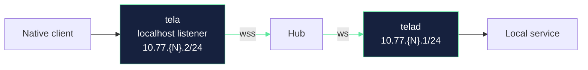

# Tela / Awan Saya - Local Implementation & Deployment Runbook (POC)

This document is a **practical runbook** for implementing and running Tela locally, exposing a Hub for internet access, and starting a POC path toward Awan Saya.

It complements the authoritative specification in `DESIGN.md`.

## Scope (what this runbook covers)

- Running a Hub as a container on a workstation/home server.
- Exposing the Hub securely over **`wss://`**.
- Two ingress modes:
  - **Direct public exposure** (port forward + DNS)
  - **Cloudflare Tunnel** (no inbound ports)
- How to keep Cloudflare **optional** (not required by architecture).
- Key security implications (especially **certificate pinning** vs TLS termination).

## Non-goals (what this runbook does not cover)

- Full Tela Hub implementation details (auth, tokens, multiplex framing).
- Full Awan Saya features (RBAC, policy, SSO, dashboards).
- High availability / multi-hub clustering.

---

## 1) Mental model: what must be reachable

Even though agents/helpers are **outbound-only**, they must connect to something reachable.

- The Hub (or the TLS endpoint in front of it) must be reachable at a stable address:
  - `wss://tela.yourdomain.example/...`
  - usually on TCP **443**

A simple reference topology:



> WireGuard L3 tunnel (encrypted, gVisor netstack) spans `10.77.{N}.2/24` ↔ `10.77.{N}.1/24`, where N is the session index (1-254).

A practical rule:

- Expose **one** thing publicly: **TCP 443** to a TLS endpoint.
- Everything else stays internal.

---

## 2) Recommended container shape (Cloudflare optional)

To keep Cloudflare optional, keep your internal deployment consistent and swap only the ingress method.

**Current setup (1 container):**

- `gohub` (`telahubd`): Go hub, listens on `:8080` (HTTP/WS) and `:41820` (UDP relay). Published on the host as `3002:8080` and `41821:41820/udp`.
- TLS is terminated externally by **Cloudflare Tunnel** (no reverse proxy container needed).
- `cloudflared` (host service, not a container) routes `gohub.parkscomputing.com` → `http://localhost:3002`.

This yields:

- Tunnel mode: Internet → Cloudflare → `cloudflared` (host) → `gohub:3002` → `telahubd:8080`

---

## 3) TLS (`wss://`) and reverse proxy

TLS is terminated at **Cloudflare Tunnel** (cloudflared). No separate reverse proxy (Caddy, Nginx, etc.) is needed. The hub container exposes its plain HTTP/WS listener internally; cloudflared handles the public `wss://` endpoint and certificate.

This means:
- No Let's Encrypt configuration required.
- No inbound port exposure on the host -- cloudflared makes an outbound connection to Cloudflare.
- Certificate pinning (see §6) is applied between hub and agent, not at the TLS edge.

The Docker Compose service maps `3002:8080` (host:container) for local development access.

---

## 4) Ingress mode 1 - Direct public exposure (no tunnel)

This is the most Cloudflare-independent option.

### Requirements

- You control your router/firewall.
- You have a public IPv4 (or IPv6) address with inbound connectivity.
- You can forward TCP 443 to the workstation/server.

### Steps (high level)

1. Choose a hostname, e.g. `tela.example.com`.
2. Point DNS at your public IP.
   - If the IP can change, use dynamic DNS.
3. Port-forward **TCP 443** on your router -> the machine running the reverse proxy.
4. Run the reverse proxy container on the host, publishing `443:443`.
5. Configure proxy -> hub forwarding.
6. Agents/helpers connect to `wss://tela.example.com/...`.

### Notes

- If you are behind CGNAT, you may not be able to do this reliably.
- Keep the hub off the public internet directly; publish only the proxy.

---

## 5) Ingress mode 2 - Cloudflare Tunnel (optional convenience)

This is the easiest way to avoid inbound firewall changes.

### What you get

- A stable DNS name.
- No inbound ports.
- Easy TLS termination.

### What you trade

- You now rely on Cloudflare for *connectivity*, not just DNS.
- Strict certificate pinning becomes tricky if the client pins what Cloudflare presents.

### Steps (high level)

1. Run `cloudflared` (host or container).
2. Configure it to forward the hostname to your local reverse proxy.
3. Keep your local reverse proxy config the same as direct mode.

Practical pattern:

- `cloudflared` -> `https://proxy:443`
- `proxy` -> `http://hub:8080` (or `ws://hub:8080` depending on your hub endpoints)

---

## 6) Certificate pinning vs Cloudflare (important)

Tela’s design includes **certificate pinning** for agent and helper.

### Why Cloudflare conflicts with naive pinning

- If Cloudflare is in front, the client’s TLS connection terminates at Cloudflare.
- The certificate the client sees is Cloudflare-managed and can rotate.
- Pinning that leaf certificate is fragile.

### Ways to stay aligned with the design while keeping Cloudflare optional

Pick one approach explicitly and document it as a phase decision:

1) **Direct mode is the “pinned” mode; tunnel mode is allowed but not pinned** (Phase 1 pragmatic)
- Agent/helper enforces pinning only when connecting directly to your proxy.
- When connecting via tunnel, rely on normal TLS + session tokens.

2) **Pin a stable key you control (preferred long term)**
- Terminate TLS on a proxy you control in direct mode.
- For tunnel mode, pinning must be re-thought (e.g., pin an application-layer public key and do a secondary handshake that proves hub identity independent of TLS termination).

3) **Avoid TLS termination at Cloudflare for agent/helper paths**
- Keep Cloudflare only for the browser UI, not the data-plane endpoints.
- Requires additional routing/hostnames and is more complex.

For a POC, option (1) is often the fastest while preserving the long-term direction.

---

## 7) Ports and routing conventions

### Recommended

- Public: **443/tcp** only
- Internal:
  - Proxy listens on 443
  - Hub listens on a private port (e.g., 8080)

### Why 443

- It’s the least blocked egress from locked-down networks.
- It’s the normal home for `https://` and `wss://`.

---

## 8) Docker Compose skeleton

**Current production setup.** See `docker-compose.yml` in the repo root:

```yaml
services:
  gohub:
    build:
      context: .
      dockerfile: docker/gohub/Dockerfile
    container_name: tela-gohub
    ports:
      - "3002:8080"         # HTTP + WebSocket (cloudflared points here)
      - "41821:41820/udp"   # UDP relay for WireGuard datagrams
    environment:
      - HUB_PORT=8080
      - HUB_UDP_PORT=41820
      - HUB_NAME=gohub
      # - TELA_OWNER_TOKEN=<hex>   # uncomment to enable auth (see §8.1)
    volumes:
      - hub-data:/app/data
    restart: unless-stopped

volumes:
  hub-data:
```

Notes:
- TLS is terminated by Cloudflare Tunnel (`cloudflared` host service routes `gohub.parkscomputing.com` → `http://localhost:3002`).
- UDP port 41821 must be published for the WireGuard UDP relay optimisation.
- The image is a multi-stage build: Go builder stage → minimal Alpine runtime with `telahubd` + static console files.

---

## 8.1) Authentication bootstrap (Docker)

The hub supports token-based authentication with named identities and per-machine ACLs. For Docker deployments where you don't have shell access to the hub container, authentication is bootstrapped via an environment variable.

### Quick start (enable auth)

```bash
# 1. Generate an owner token
openssl rand -hex 32
# Example output: a1b2c3d4e5f6...

# 2. Add to docker-compose.yml:
#    environment:
#      - TELA_OWNER_TOKEN=a1b2c3d4e5f6...

# 3. Redeploy
docker compose up --build -d
```

On first startup (when no tokens exist in the hub config), the hub automatically:
- Creates an `owner` identity with the provided token
- Adds a wildcard `*` machine ACL granting the owner full access
- Persists the auth config to `/app/data/telahubd.yaml` on a named Docker volume (`hub-data`), so data survives container recreation.

On subsequent restarts, the env var is ignored because tokens already exist in the persisted config.

### Managing tokens remotely

Once bootstrapped, use `tela admin` from any workstation:

```bash
# List identities
tela admin list-tokens -hub wss://gohub.parkscomputing.com -token <owner-token>

# Add a user
tela admin add-token alice -hub wss://gohub.parkscomputing.com -token <owner-token>
# → prints the new token (save it!)

# Grant connect access to a machine
tela admin grant alice barn -hub wss://gohub.parkscomputing.com -token <owner-token>

# Revoke access
tela admin revoke alice barn -hub wss://gohub.parkscomputing.com -token <owner-token>

# Rotate a compromised token
tela admin rotate alice -hub wss://gohub.parkscomputing.com -token <owner-token>

# Remove an identity entirely
tela admin remove-token alice -hub wss://gohub.parkscomputing.com -token <owner-token>
```

All changes take effect immediately (hot-reload). No hub restart required.

### Using environment variables to avoid repeating flags

```bash
export TELA_HUB=wss://gohub.parkscomputing.com
export TELA_OWNER_TOKEN=<owner-token>   # used by tela admin
export TELA_TOKEN=<your-user-token>      # used by tela connect

tela admin list-tokens
tela admin add-token alice
tela admin grant alice barn
```

### Auth model summary

| Concept | Description |
|---------|-------------|
| **Identity** | A named token entry (`id` + `token` + optional `hubRole`) |
| **Role** | `owner` (full control), `admin` (can manage tokens), `viewer` (read-only API access), or empty (regular user) |
| **Machine ACL** | Per-machine `registerToken` and `connectTokens` lists |
| **Wildcard** | `"*"` machine key applies to all machines |
| **Open mode** | When no tokens are configured, the hub allows all connections (backward compatible) |

See [CONFIGURATION.md](CONFIGURATION.md) for the full YAML schema and admin API reference.

---

## 9) Add Cloudflare Tunnel (optional)

A typical pattern is to add a `cloudflared` service that targets your local proxy.

Conceptually:

- `cloudflared` listens inside your network and creates an outbound tunnel.
- Cloudflare maps `tela.example.com` -> that tunnel.

If you do this, try to keep the local origin stable:

- Tunnel forwards to `http://proxy:80` or `https://proxy:443`.

---

## 10) Live data path and workflow (current state)

The live data path is:

```
tela.exe (Go, WireGuard client) --wss--> telahubd (Go relay) <--ws-- telad (Go, WireGuard agent)
                                               ^
                                          UDP 41820 (optional relay)
```

### Running locally (development)

1. **Build Go binaries:** `go build ./cmd/tela && go build ./cmd/telad && go build ./cmd/telahubd`
2. **Start the hub:** `./telahubd` (listens on `:8080` HTTP/WS + `:41820` UDP)
3. **Start telad:** `./telad -hub ws://localhost:8080 -machine mybox -ports "22:SSH:SSH server,3389:RDP:Remote Desktop"`
4. **Start tela:** `./tela connect -hub ws://localhost:8080 -machine mybox`
5. Connect to `localhost:<advertised-port>` -- traffic flows through the WireGuard tunnel.

### Running via Docker (production)

```bash
docker compose up --build -d

# Connect by hub URL
./tela connect -hub wss://gohub.parkscomputing.com -machine barn

# Or add a remote and use hub names
tela remote add myportal https://your-portal.example
tela connect -hub barn-hub -machine barn
```

### Remaining iteration targets

- Binary multiplexed framing (DESIGN.md §6.3)
- Multiple simultaneous sessions per machine

---

## 11) VPS vs home-hosting (what changes)

If you host the Hub on a VPS:

- You usually don’t need Cloudflare Tunnel.
- You typically don’t need port forwarding.
- You still want the same `proxy + hub` shape.

If you host at home:

- Direct mode requires port-forwarding.
- Tunnel mode avoids port-forwarding.

Either way, keeping the same internal deployment shape reduces churn.

---

## 12) Quick decision checklist

- Do you want to open inbound ports?
  - Yes -> Direct mode + Let’s Encrypt
  - No -> Cloudflare Tunnel
- Do you require strict certificate pinning in the earliest POC?
  - Yes -> Prefer direct mode for agent/helper paths
  - Not yet -> Tunnel mode is acceptable, document the pinning caveat
- Do you need the Hub to run on your workstation?
  - Not required; any machine you control works (home server, VPS, etc.)

---

## 13) Latency optimisation roadmap

Interactive protocols (SSH, RDP) are sensitive to per-keystroke latency.
The relay path `client → helper → Cloudflare → hub → agent → service`
adds multiple hops and framing layers. Below are the known contributors
and their mitigations, roughly ordered from easiest to hardest.

### 13.1 TCP_NODELAY (implemented)

Nagle's algorithm batches small TCP writes into larger segments, adding up
to 40 ms of delay per write on each TCP socket in the path. Disabling it
with `TCP_NODELAY` is the single biggest quick-win for interactive feel.

**Status:** Applied in `telad` and `tela` (`SetNoDelay(true)`) as of the current build.

### 13.2 Cloudflare round-trip

Every WS frame transits Cloudflare edge → origin and back. This adds one
RTT to every data exchange, typically 10-50 ms depending on edge
proximity. There is no way to reduce this while using the tunnel.

**Mitigation:**

- **Direct mode (done)**: Caddy with DNS-01 (Cloudflare API) serves
  a direct hostname with valid Let's Encrypt TLS, bypassing the
  Cloudflare edge entirely. This is the recommended path for local and
  LAN-adjacent use.
- **Tunnel mode**: still available via Cloudflare Tunnel for scenarios
  where inbound ports are blocked.
- Long-term: allow the Hub to advertise both URLs and let the client
  prefer the direct path automatically.

### 13.3 WebSocket framing overhead

Each TCP segment is wrapped in a WS frame (2-14 bytes header + masking on
client-to-server direction). For bulk transfers this is negligible, but
for many tiny SSH packets it multiplies syscalls and copies.

**Mitigation (future):**

- **Binary multiplexed framing** as specified in DESIGN.md §6.3. A thin
  12-byte Tela frame header replaces per-message WS framing, and multiple
  logical channels share a single WS connection.
- **Per-message-deflate** (`permessage-deflate` WS extension) can compress
  repetitive terminal output but adds CPU cost; benchmark before enabling.

### 13.4 Double relay (hub as pure relay)

The Hub receives every byte from one side and writes it to the other.
For the Go hub, each hop passes through goroutine scheduling and
`gorilla/websocket` library buffers.

**Current mitigation - UDP relay (done):**

The hub now offers a UDP port (41820) alongside WebSocket. When both
peers upgrade, WireGuard datagrams bypass the WS framing layer entirely.
When only one side upgrades (asymmetric mode), the hub bridges
UDP↔WebSocket so the faster side still benefits. This eliminates the
TCP-over-TCP overhead that was the biggest contributor to interactive
latency via the relay.

**Future mitigation:**

- **Native hub data-plane**: rewrite the relay in Go where `splice(2)`
  / zero-copy IO can eliminate userspace copies for the remaining WS path.
- **Peer-to-peer direct tunnel (done)**: STUN-based hole punching lets
  tela and telad establish a direct UDP path, removing the hub from the
  data plane entirely. Implemented in Phase 3 with automatic fallback
  cascade (direct → UDP relay → WebSocket).

### 13.5 Summary table

| Optimisation          | Latency saved   | Effort  | Status       |
|-----------------------|-----------------|---------|--------------|
| TCP_NODELAY           | up to ~40 ms    | trivial | **done**     |
| Direct (skip CF)      | 10-50 ms RTT    | low     | **done** (Caddy + DNS-01) |
| UDP relay             | TCP-over-TCP    | medium  | **done** (hub port 41820) |
| P2P direct connect    | full relay hop   | high    | **done** (STUN + hole punch) |
| Binary framing        | syscall overhead | medium  | design-phase |
| Native hub data-plane | copy overhead    | high    | future       |

---

## 14) Where to record environment-specific details

As you implement, keep a small private note (not necessarily in git) with:

- Domain name(s)
- DNS provider
- Whether you use direct or tunnel ingress
- Public IP / dynamic DNS settings
- Which ports are forwarded (if any)
- Certificate strategy (Let’s Encrypt vs self-signed vs Cloudflare)

That keeps the repo portable and avoids baking your personal details into docs.
