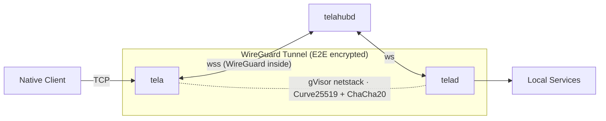

# Tela

Secure remote access to TCP services (SSH, RDP, HTTP, etc.) through an encrypted WireGuard tunnel relayed over WebSocket. No admin privileges or TUN devices required on either end.



## How it works

**tela** (client) and **telad** (daemon) each create a userspace WireGuard tunnel using gVisor netstack — pure Go, no kernel TUN, no elevated privileges. The hub relays encrypted WireGuard datagrams between them over WebSocket, with automatic upgrades to faster transports when available:

| Transport | Path | When |
|-----------|------|------|
| WebSocket | tela → hub → telad | Always works (even through corporate proxies) |
| UDP relay | tela → hub:41820 → telad | When outbound UDP is open |
| Direct P2P | tela → telad | When STUN hole-punch succeeds |

The hub never sees plaintext — it relays opaque WireGuard ciphertext.

## Components

| Component | Language | Description |
|-----------|----------|-------------|
| **tela** | Go | Client — connects to hub, establishes WG tunnel, binds localhost listeners |
| **telad** | Go | Daemon — registers with hub, exposes local services through WG tunnel |
| **telahubd** | Go | Hub server — pairs daemons with clients, relays WS/UDP, serves hub console |
| **hub.js** | Node.js | Legacy hub (identical functionality to telahubd, still operational) |

## Networking & port requirements

Tela is outbound-only for daemons and clients, but the **Hub must be reachable**.

At a minimum:

- The **Hub** must accept inbound HTTPS/WebSocket traffic from both `tela` (client) and `telad` (daemon).
- `telad` must be able to reach the **services** it exposes (either on `localhost` or via `target:` in gateway/bridge mode).

Common requirements by component:

| Component | Needs inbound from Internet | Needs outbound | Notes |
|----------|------------------------------|---------------|------|
| **Hub** (`telahubd`) | TCP 443 (recommended) for HTTPS + WebSockets | none special | Optional: UDP 41820 for UDP relay (faster than WS when available). |
| **Daemon** (`telad`) | none | TCP 443 to Hub (`wss://...`) | Optional: outbound UDP to Hub:41820 (UDP relay) and outbound UDP to STUN (direct P2P). |
| **Client** (`tela`) | none | TCP 443 to Hub (`wss://...`) | Optional: outbound UDP to Hub:41820 and STUN. Binds `127.0.0.1:<port>` locally for apps (SSH/RDP/etc.). |
| **Portal (browser)** | n/a | HTTPS to each Hub’s `/api/status` and `/api/history` | Cross-origin fetch requires CORS from the Hub (the current hub implementation sets `Access-Control-Allow-Origin: *` for these endpoints). |

See also:

- `howto/networking.md`
- `howto/hub.md`
- `howto/telad.md`

## Quick start

### Build

```bash
go build -o tela ./cmd/tela
go build -o telad ./cmd/telad
go build -o telahubd ./cmd/telahubd
```

### Run locally (3 terminals)

```bash
# Terminal 1 — Hub
./telahubd

# Terminal 2 — Daemon (exposes SSH + RDP)
./telad -hub ws://localhost:8080 -machine mybox -ports "22,3389"

# Terminal 3 — List machines
./tela machines -hub ws://localhost:8080

# Terminal 3 — Connect to a machine
./tela connect -hub ws://localhost:8080 -machine mybox
```

Or set environment variables to skip repeating flags:

```bash
export TELA_HUB=ws://localhost:8080 TELA_MACHINE=mybox
./tela connect
./tela machines
./tela services
```

Then connect: `ssh localhost` or `mstsc /v:localhost`

### Portal login (hub name resolution)

If your hubs are registered on a portal (e.g., Awan Satu), log in once and use short hub names:

```bash
tela login https://awansatu.net    # authenticate once, config stored locally
tela machines -hub owlsnest         # hub name resolved via portal
tela connect -hub owlsnest -machine barn
tela logout                         # remove stored credentials
```

Short hub names are resolved via: (1) portal API, (2) local `hubs.yaml` fallback.

### Run with Docker (production)

```bash
docker compose up --build -d

# With flags:
./tela connect -hub wss://your-hostname -machine barn

# Or log in to a portal and use hub names:
tela login https://your-portal.example
tela connect -hub your-hub -machine barn
```

See [IMPLEMENTATION.md](IMPLEMENTATION.md) §8 for the full Docker Compose setup and Caddyfile.

## Security

- **End-to-end encryption**: WireGuard (Curve25519 key exchange, ChaCha20-Poly1305 data) between tela and telad. The hub is a blind relay.
- **Token authentication**: `-token` flag on both sides; hub validates before pairing.
- **No admin required**: gVisor netstack operates entirely in userspace — no TUN device, no root/Administrator.
- **Outbound-only**: Both tela and telad initiate outbound connections to the hub. No inbound ports needed on either end.

## Transport upgrade cascade

After the initial WebSocket connection, tela and telad automatically negotiate faster transports:

1. **UDP relay** — Hub offers a UDP port alongside WebSocket. Both sides probe it; if reachable, WireGuard datagrams switch to UDP (eliminates TCP-over-TCP). Falls back to WebSocket on timeout.
2. **Direct tunnel** — Both sides perform STUN discovery (RFC 5389) to learn their public IP:port, exchange endpoints via the hub, and attempt simultaneous UDP hole punching. On success, WireGuard datagrams flow peer-to-peer with zero relay overhead.

The cascade is fully automatic. Each tier falls through on failure with no user action.

## Running as an OS service

Both `telad` and `telahubd` can run as native OS services (Windows SCM, Linux systemd, macOS launchd). Configuration lives in a YAML file in a system-wide directory — edit the file and restart to reconfigure, no reinstallation needed.

```bash
# Install telad as a service (copies config to system dir)
telad service install -config telad.yaml
telad service start

# Install telahubd as a service (generates config from flags)
telahubd service install -name myhub -port 8080
telahubd service start

# Reconfigure: edit the config, then restart
telad service restart
telahubd service restart
```

See [howto/services.md](howto/services.md) for full details.

## Project structure

```
cmd/tela/          Client binary (subcommands: connect, machines, services, status, login, logout)
cmd/telad/         Daemon binary
cmd/telahubd/      Hub server binary
internal/service/   Cross-platform OS service management (Windows SCM, systemd, launchd)
internal/wsbind/   WireGuard conn.Bind over WebSocket/UDP/direct
howto/             Guides (hub setup, services, networking, use cases)
poc/hub.js         Legacy hub relay (Node.js)
poc/www/           Hub console (web UI)
docker/gohub/      Dockerfile for telahubd
docker/            Caddyfile, docker-compose, cloudflared config
```

## Glossary

| Term | Meaning |
|------|---------|
| **Hub** | Central relay (`telahubd`) that pairs daemons with clients. Serves the hub console. |
| **Hub Console** | Web interface for a hub (e.g., `https://tela.awansatu.net/`). |
| **Daemon / telad** | Long-lived daemon on a managed machine that registers with the hub. |
| **Client / tela** | Binary on the user's laptop that tunnels through the hub to an agent. |
| **Machine** | A named resource registered by an agent (e.g., `barn`). |
| **Service** | A TCP endpoint exposed through a machine (e.g., SSH :22, RDP :3389). |
| **Session** | An active encrypted tunnel between a client and an agent. |
| **Portal** | Multi-hub dashboard (e.g., Awan Satu). The CLI resolves hub names via the portal API. |
| **Awan Satu** | Cloud platform built on Tela (hub registry, relay, hosted hubs). |

## Documentation

- [DESIGN.md](DESIGN.md) — Architecture specification (includes full glossary)
- [IMPLEMENTATION.md](IMPLEMENTATION.md) — Deployment runbook
- [TODO.md](TODO.md) — Roadmap
- [STATUS.md](STATUS.md) — Traceability matrix (design → implementation)
- [poc/README.md](poc/README.md) — Detailed CLI reference and troubleshooting

## License

Apache 2.0 — see [LICENSE](LICENSE).
