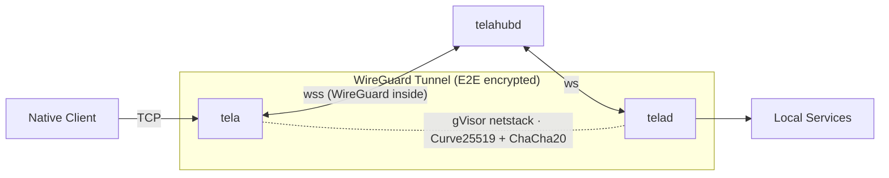
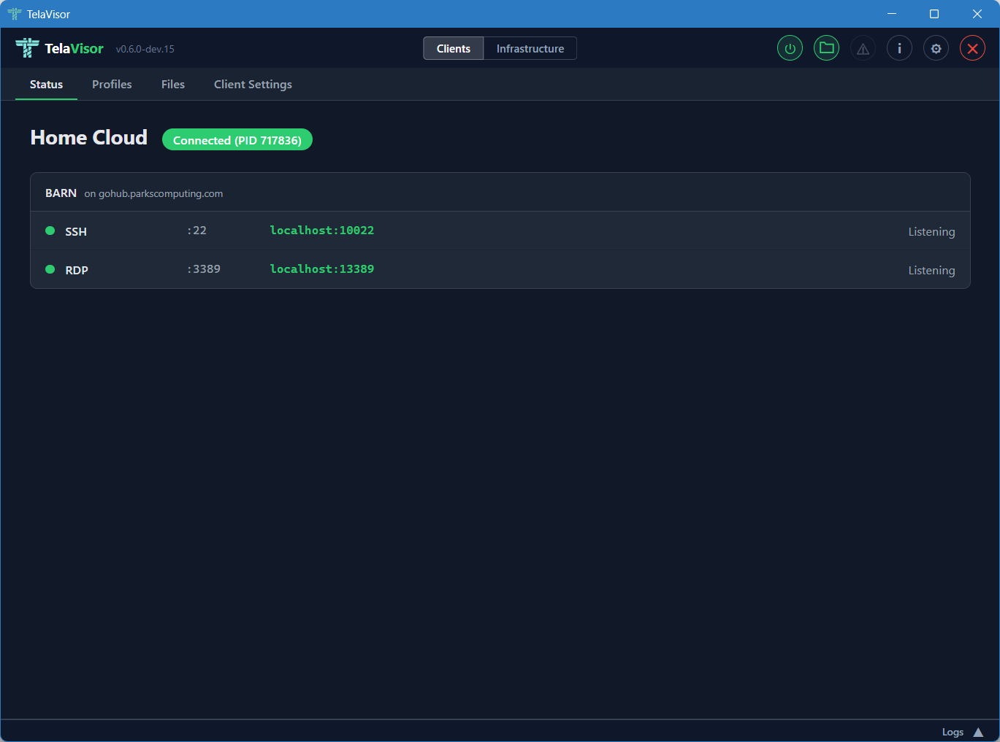
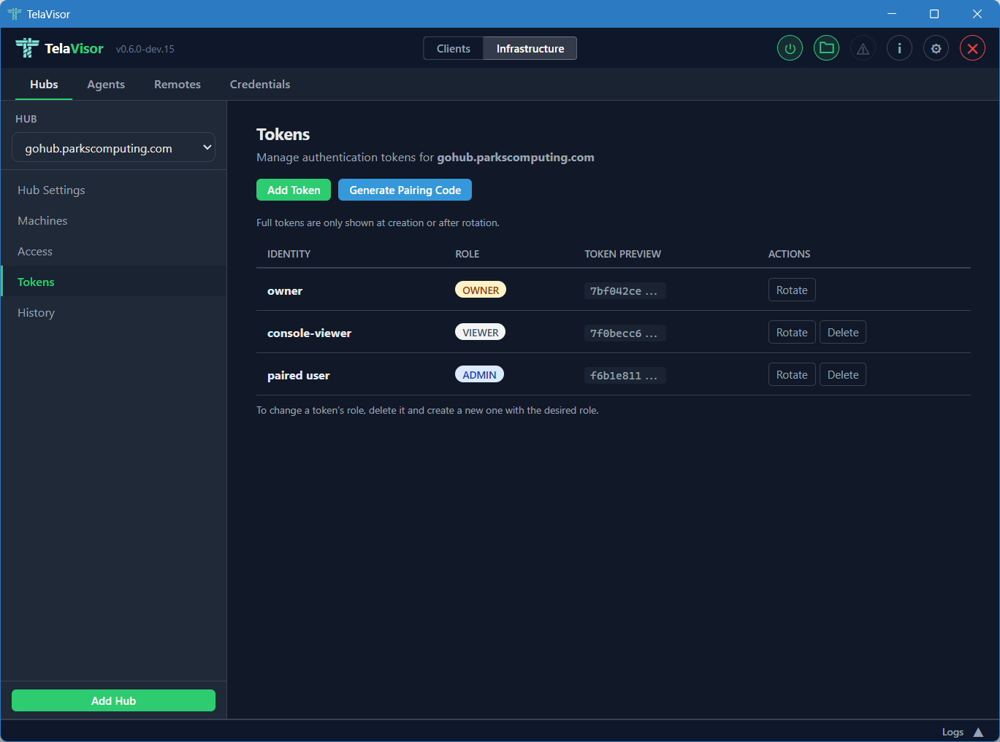
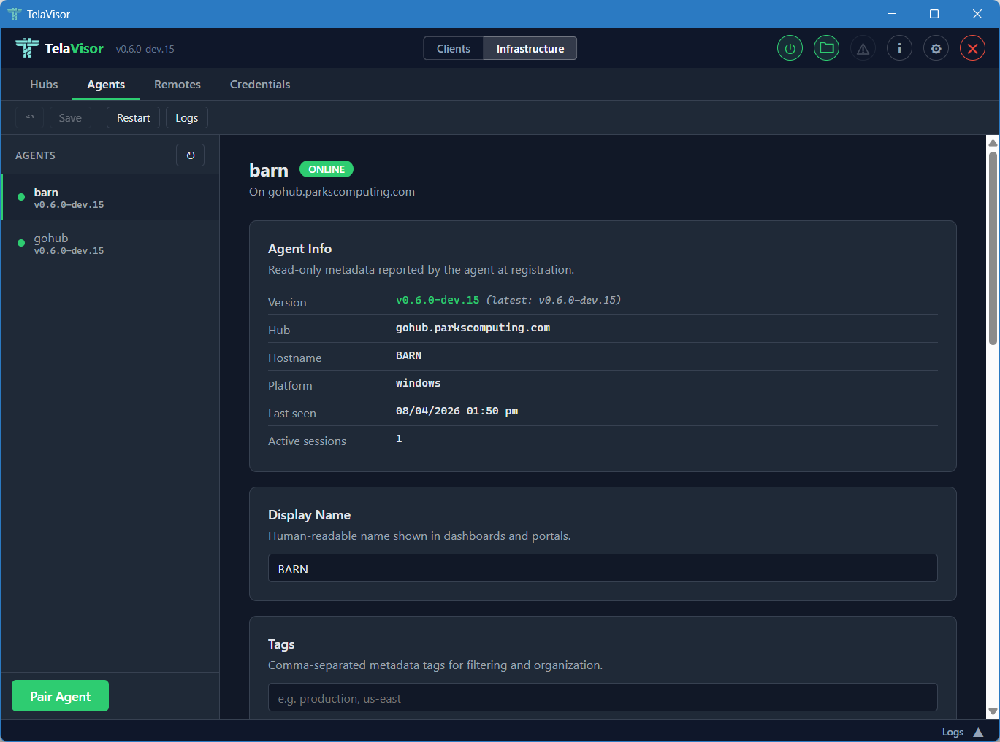
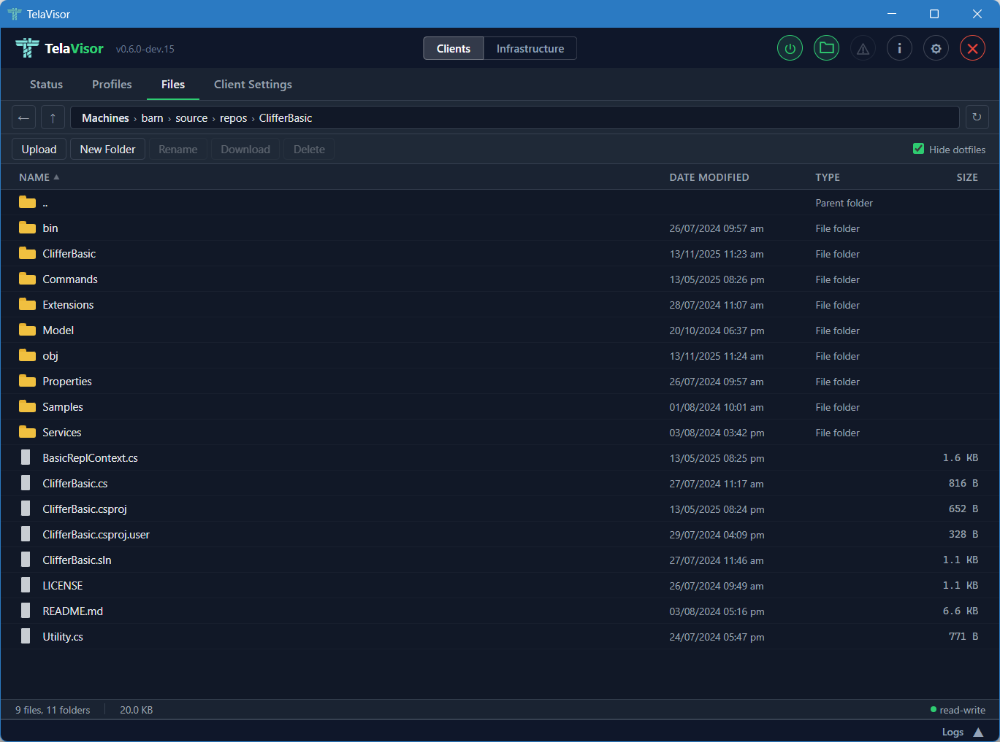
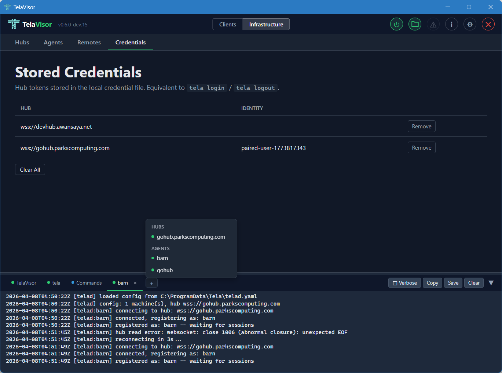

# Tela

[](https://github.com/paulmooreparks/tela/actions/workflows/ci.yml)
[](https://github.com/paulmooreparks/tela/actions/workflows/release.yml)
[](https://github.com/paulmooreparks/tela/releases/latest)
[](LICENSE)
[](go.mod)
[](https://github.com/paulmooreparks/tela/releases)

**Channels** (see [RELEASE-PROCESS.md](RELEASE-PROCESS.md) for the model):

[](https://github.com/paulmooreparks/tela/releases/download/channels/dev.json)
[](https://github.com/paulmooreparks/tela/releases/download/channels/beta.json)
[](https://github.com/paulmooreparks/tela/releases/download/channels/stable.json)

Tela is a free and open-source (FOSS) remote-access system that lets you reach TCP services on remote machines through an encrypted WireGuard tunnel. It works through firewalls, NATs, and corporate proxies without requiring inbound ports, VPN software, kernel drivers, or administrator privileges on either end.

You run a small agent (`telad`) on the machine you want to reach. It connects outbound to a relay hub (`telahubd`). From any other machine, you run the client (`tela`) or the desktop app (TelaVisor) to connect through the hub. The hub pairs the two sides and relays encrypted traffic between them. It never sees the plaintext.



## Why Tela

Most remote-access tools require at least one of the following: a VPN that needs administrator privileges to install, inbound firewall rules on the target machine, a cloud account with a specific vendor, or a TUN/TAP kernel driver. Tela requires none of these.

Tela uses WireGuard for encryption, but it runs WireGuard entirely in userspace through gVisor's network stack. There is no kernel module, no TUN device, and no need for root or Administrator. Both the agent and the client make outbound connections to the hub, so neither side needs to open inbound ports or configure port forwarding.

The hub acts as a blind relay. It forwards encrypted WireGuard packets between the agent and the client without being able to decrypt them. Even if the hub is compromised, session contents are not exposed.

Tela tunnels any TCP service. SSH, RDP, HTTP, PostgreSQL, SMB, VNC, or any other protocol that runs over TCP can be reached through a Tela tunnel. The hub does not need to understand the protocol being tunneled.

## How it works

The agent (`telad`) and the client (`tela`) each create a userspace WireGuard tunnel using gVisor netstack. The hub (`telahubd`) relays encrypted WireGuard datagrams between them over WebSocket. After the initial connection, Tela automatically negotiates faster transports when available:

| Transport | Path | When it is used |
|-----------|------|-----------------|
| WebSocket | tela -> hub -> telad | Always available, works through corporate proxies |
| UDP relay | tela -> hub:41820 -> telad | When outbound UDP to the hub is open |
| Direct P2P | tela -> telad | When STUN hole-punching succeeds |

Each transport tier falls back to the previous one automatically on failure. The hub always relays opaque WireGuard ciphertext regardless of which transport is active.

## Components

Tela is built from three Go binaries and an optional desktop client:

| Component | Description |
|-----------|-------------|
| **tela** | Client CLI. Connects to a hub, establishes a WireGuard tunnel, and binds local TCP ports so native clients (ssh, mstsc, psql, etc.) can connect. |
| **telad** | Agent daemon. Runs on the target machine, registers with the hub, and exposes local TCP services through the tunnel. Includes a built-in HTTP gateway for path-based routing to multiple services. |
| **telahubd** | Hub server. Pairs agents with clients, relays encrypted traffic, and serves a built-in web console. |
| **TelaVisor** | Desktop client. A graphical interface for managing connections, browsing remote files, and administering hubs. Built with Wails v2 (Go + JavaScript). |

All three binaries are single-file executables with no runtime dependencies. They run on Windows, Linux, and macOS.

## TelaVisor

TelaVisor wraps the `tela` CLI in a graphical interface. It manages hub credentials, connection profiles, and real-time tunnel status without requiring terminal access. You select which services to connect to, click Connect, and monitor tunnel state as it updates live.



TelaVisor uses a two-mode layout. **Clients mode** manages connections, profiles, files, and client settings. **Infrastructure mode** provides full hub and agent administration: hub settings, machines, per-identity access, tokens, history, agent configuration, remote management, and credential storage.

The Hub Settings view exposes lifecycle controls (View Logs, Update, Restart) and shows version badges that compare the running hub against the latest GitHub release. The same pattern is mirrored on the Agents tab for telad instances.


The Tokens view lets you create identities, rotate tokens, delete identities, and generate one-time pairing codes that users or agents can exchange for permanent tokens.



The Agents tab lists all telad instances visible across your configured hubs without requiring an active tunnel connection. Each agent shows version, services, file share configuration, and management controls. The Software row updates the agent binary in place by downloading from GitHub releases and restarting through the OS service manager.



The Files tab provides a built-in file browser for machines with file sharing enabled. You can upload, download, rename, move, and delete files on remote machines through the encrypted tunnel. The file list updates in real time as changes happen on the remote machine.



The persistent log panel at the bottom of the window collects output from TelaVisor itself, the tela process, the Commands log (every API call and CLI command issued), and any number of dynamic tabs you attach via the `+` button. Attaching a hub or agent log source streams the remote log buffer through the hub admin API. Open log tabs are remembered between sessions.



See the [TelaVisor chapter in the book](https://paulmooreparks.github.io/tela/guide/telavisor.html) for the full reference, or [TelaVisor.md](TelaVisor.md) for a short overview.

## Quick start

### Build

```bash
go build -o tela ./cmd/tela
go build -o telad ./cmd/telad
go build -o telahubd ./cmd/telahubd
```

### Run locally (three terminals)

Start the hub:

```bash
./telahubd
```

Start the agent on the machine you want to reach. This example exposes SSH and RDP:

```bash
./telad -hub ws://localhost -machine mybox -ports "22:SSH,3389:RDP"
```

From a third terminal, list the available machines and connect:

```bash
./tela machines -hub ws://localhost
./tela connect -hub ws://localhost -machine mybox
```

You can also connect by service name:

```bash
./tela connect -hub ws://localhost -machine mybox -services ssh
```

Once connected, use your usual tools against localhost:

```bash
ssh localhost
mstsc /v:localhost
```

To avoid repeating flags, set environment variables:

```bash
export TELA_HUB=ws://localhost TELA_MACHINE=mybox
tela connect
tela machines
tela services
```

### Hub remotes (name resolution)

If your hubs are listed on a directory service, you can add it as a remote and use short hub names:

```bash
tela remote add awansaya https://awansaya.net   # configure once
tela machines -hub myhub                         # short name resolved via remote
tela connect -hub myhub -machine mybox
```

Short hub names are resolved by querying configured remotes first, then falling back to the local `hubs.yaml` file.

### Connection profiles

You can define all your tunnels in a single YAML file and open them in parallel with one command:

```yaml
# ~/.tela/profiles/work.yaml
connections:
  - hub: corp-hub
    machine: prod-web01
    token: ${CORP_TOKEN}
    services:
      - remote: 22
        local: 2201
      - remote: 8080
        local: 9001

  - hub: corp-hub
    machine: staging-db
    token: ${CORP_TOKEN}
    services:
      - name: postgres
```

```bash
tela connect -profile work
# Opens parallel tunnels to both machines. Each auto-reconnects independently.
# SSH: localhost:2201, Admin panel: localhost:9001, PostgreSQL: localhost:5432
```

Profiles support environment variable expansion (`${VAR}`), service name resolution, local port remapping, and connections across multiple hubs. See [REFERENCE.md section 7](REFERENCE.md#7-tela-the-client-cli) for the full profile schema.

### Run with Docker (production)

```bash
docker compose up --build -d

./tela connect -hub wss://your-hostname -machine barn
```

See [IMPLEMENTATION.md](IMPLEMENTATION.md) for the full Docker Compose setup.

### Enable authentication (recommended)

On first startup, the hub auto-generates an owner token (secure by default). For Docker deployments, you can bootstrap authentication with an environment variable:

```bash
# 1. Generate an owner token
openssl rand -hex 32

# 2. Add to docker-compose.yml environment:
#    - TELA_OWNER_TOKEN=<your-token>

# 3. Redeploy
docker compose up --build -d

# 4. Manage remotely from any workstation:
tela admin access -hub wss://your-hub -token <owner-token>
tela admin add-token bob -hub wss://your-hub -token <owner-token>
tela admin access grant bob barn connect -hub wss://your-hub -token <owner-token>
```

The `tela admin access` command shows a unified view of all identities and their per-machine permissions. See [CONFIGURATION.md](CONFIGURATION.md) for the full auth schema and `tela admin` reference.

## Authentication and security

Tela is designed to be secure by default. The hub auto-generates an owner token on first startup, and all administrative operations require authentication.

**End-to-end encryption.** All traffic between the client and agent is encrypted with WireGuard using Curve25519 for key exchange and ChaCha20-Poly1305 for data encryption. The hub relays opaque ciphertext and cannot read tunnel contents.

**Token-based access control.** The hub uses named token identities with four roles: owner, admin, user, and viewer. The unified access API (`/api/admin/access`) joins tokens and their per-machine permissions (register, connect, manage) into a single resource. A wildcard ACL (`*`) applies to all machines. Owner and admin tokens have implicit access to all machines.

**Remote management.** Owners and admins can manage access remotely using `tela admin access` (unified view), `tela admin access grant` (set permissions), and `tela admin access revoke` (remove permissions). No shell access to the hub is required.

**Credential storage.** The `tela login` and `telad login` commands store hub tokens in a local credential file (0600 permissions) so you do not need to pass tokens on every command.

**One-time pairing codes.** Administrators can generate short-lived pairing codes (e.g., `ABCD-1234`) for users and agents. Codes are single-use, time-limited (10 minutes to 7 days), and replace the need to copy 64-character hex tokens manually. Users paste a code in TelaVisor or run `tela pair` to exchange it for a permanent token.

**File sharing.** The agent can expose a sandboxed directory for file transfer through the tunnel. Upload, download, rename, move, and delete operations are available via the CLI (`tela files`) or the TelaVisor Files tab. File sharing is off by default and must be explicitly enabled per machine. Extension filtering, size limits, and read-only mode are configurable.

**Explorer integration.** `tela mount` starts a WebDAV server that mounts Tela file shares as a local drive. On Windows, run `tela mount -mount T:` to map a drive letter. On macOS and Linux, run `tela mount -mount ~/tela` to mount to a directory. Each connected machine with file sharing enabled appears as a top-level folder. No kernel drivers or third-party software required.

**Gateway.** The agent can run a built-in HTTP reverse proxy that routes requests by URL path to different local services. This lets you expose a multi-service application (web UI, REST API, metrics) through a single tunnel port without needing nginx, Caddy, or any other reverse proxy. See [howto/gateway.md](howto/gateway.md) for a full walkthrough or [REFERENCE.md](REFERENCE.md#gateway-path-based-reverse-proxy) for the configuration reference.

**Upstreams.** The agent can forward a service's outbound dependency calls to configurable targets. Services call `localhost:PORT` and telad routes to the real dependency, which can be local, on another machine, or in a different environment. This lets developers rewire service dependencies by editing a YAML file without changing code, containers, or remote environments. See [REFERENCE.md](REFERENCE.md#upstreams-dependency-routing) for configuration details.

**No admin required.** All three binaries run in userspace. gVisor netstack provides a full WireGuard implementation without kernel modules, TUN devices, or elevated privileges.

**Outbound-only.** Both `tela` and `telad` initiate outbound connections to the hub. No inbound ports are needed on either end.

See [CONFIGURATION.md](CONFIGURATION.md) for the full auth schema and admin API reference. See [howto/telad.md](howto/telad.md) for agent onboarding examples.

## Networking and port requirements

Tela is outbound-only for agents and clients. Only the hub needs to be reachable from the internet.

At a minimum, the hub must accept inbound HTTPS/WebSocket traffic from both `tela` (client) and `telad` (agent). The agent must be able to reach the services it exposes, either on localhost or via a target host in gateway mode.

| Component | Inbound | Outbound | Notes |
|-----------|---------|----------|-------|
| **Hub** (`telahubd`) | TCP 443 for HTTPS + WebSocket | None | Optional: UDP 41820 for the UDP relay. |
| **Agent** (`telad`) | None | TCP 443 to the hub | Optional: outbound UDP to hub:41820 and STUN. |
| **Client** (`tela`) | None | TCP 443 to the hub | Optional: outbound UDP to hub:41820 and STUN. Binds localhost ports for apps. |
| **Portal** | TCP 80/443 for the portal UI and API | HTTPS to each hub's `/api/status` and `/api/history` | Proxies hub requests server-side. Browsers do not contact hubs directly. |

See also: [howto/networking.md](howto/networking.md), [howto/hub.md](howto/hub.md), [howto/telad.md](howto/telad.md).

## Running as an OS service

All three binaries support native OS service management on Windows (SCM), Linux (systemd), and macOS (launchd). Configuration is stored in a YAML file in a system-wide directory. To reconfigure, edit the file and restart the service.

```bash
# Install telad as a service
telad service install -config telad.yaml
telad service start

# Install telahubd as a service
telahubd service install -name myhub -port 80
telahubd service start

# Install tela client as a service (always-on tunnel)
tela service install -config myprofile.yaml
tela service start

# Reconfigure: edit the config, then restart
telad service restart
telahubd service restart
tela service restart
```

See [howto/services.md](howto/services.md) for full details.

## Registering with a portal

Hub operators can register their hub with a Tela portal (such as [Awan Saya](https://awansaya.net)) so that users who query the portal can discover the hub by name:

```bash
telahubd portal add awansaya https://awansaya.net
telahubd portal list
telahubd portal remove awansaya
```

The `portal add` command discovers the portal's hub directory endpoint via `/.well-known/tela` (RFC 8615), registers the hub via its API, and stores the association in the hub config. See DESIGN.md section 8.5 for details.

## Project structure

```
cmd/tela/          Client CLI (connect, machines, services, status, remote, admin, files, profile, pair, service)
cmd/telad/         Agent daemon
cmd/telahubd/      Hub server
cmd/telagui/       Desktop client (Wails v2 app)
internal/service/  Cross-platform OS service management (Windows SCM, systemd, launchd)
internal/wsbind/   WireGuard conn.Bind over WebSocket/UDP/direct
howto/             Guides (hub setup, services, networking, use cases)
www/               Hub console (web UI)
docker/            Dockerfile, docker-compose, Caddyfile
```

## Glossary

| Term | Meaning |
|------|---------|
| **Hub** | The central relay server (`telahubd`). Pairs agents with clients and relays encrypted traffic. Also serves the hub console. |
| **Hub Console** | The web interface served by a hub (e.g., `https://hub.example.com/`). Shows registered machines, services, and session history. |
| **Agent / telad** | A long-lived daemon on a managed machine. Registers with the hub and exposes local services through the tunnel. |
| **Client / tela** | The CLI tool on the user's machine. Connects through the hub to an agent and binds local TCP ports for native clients. |
| **TelaVisor** | The desktop client. Provides a graphical interface for connections, file browsing, and hub administration. |
| **Machine** | A named resource registered by an agent (e.g., `barn`). One agent can register one or more machines. |
| **Service** | A TCP endpoint exposed through a machine (e.g., SSH on port 22, RDP on port 3389). |
| **Session** | An active encrypted tunnel between a client and an agent. Each session gets its own WireGuard keypair and virtual IP address. |
| **Portal** | A multi-hub dashboard and directory service. Implements the hub directory API (`/api/hubs`). Can be added as a remote with `tela remote add`. |
| **File Share** | A sandboxed directory on an agent machine that can be browsed, uploaded to, and downloaded from through the tunnel. |
| **Gateway** | A built-in HTTP reverse proxy in telad that routes requests by URL path to different local services through a single tunnel port. |
| **Upstream** | A dependency route in telad that forwards outbound service calls from localhost to a configurable target, providing a virtual dispatch layer for service-to-service communication. |

## Documentation

- [TELA-DESIGN-LANGUAGE.md](TELA-DESIGN-LANGUAGE.md) -- Tela Design Language (visual language specification)
- [TelaVisor chapter](https://paulmooreparks.github.io/tela/guide/telavisor.html) -- Desktop client reference (canonical), with [TelaVisor.md](TelaVisor.md) as a short overview at the repo root
- [ACCESS-MODEL.md](ACCESS-MODEL.md) -- How tokens, roles, and machine permissions work together
- [REFERENCE.md](REFERENCE.md) -- Comprehensive reference for all three CLIs, configuration, and APIs
- [CONFIGURATION.md](CONFIGURATION.md) -- Configuration file schemas for hubs.yaml, telad.yaml, telahubd.yaml, and portal config
- [DESIGN.md](DESIGN.md) -- Architecture specification
- [IMPLEMENTATION.md](IMPLEMENTATION.md) -- Deployment runbook
- [TODO.md](TODO.md) -- Roadmap
- [STATUS.md](STATUS.md) -- Design-to-implementation traceability matrix

## License

Apache 2.0. See [LICENSE](LICENSE).
