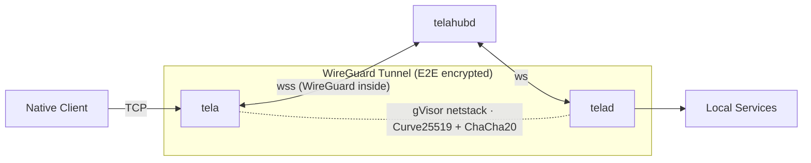

# Tela

Secure remote access to TCP services (SSH, RDP, HTTP, etc.) through an encrypted WireGuard tunnel relayed over WebSocket. No admin privileges or TUN devices required on either end.



## How it works

**tela** (client) and **telad** (daemon) each create a userspace WireGuard tunnel using gVisor netstack. This is pure Go, no kernel TUN, no elevated privileges. The hub relays encrypted WireGuard datagrams between them over WebSocket, with automatic upgrades to faster transports when available:

| Transport | Path | When |
|-----------|------|------|
| WebSocket | tela → hub → telad | Always works (even through corporate proxies) |
| UDP relay | tela → hub:41820 → telad | When outbound UDP is open |
| Direct P2P | tela → telad | When STUN hole-punch succeeds |

The hub never sees plaintext. It relays opaque WireGuard ciphertext.

## Components

| Component | Language | Description |
|-----------|----------|-------------|
| **tela** | Go | Client. Connects to hub, establishes WG tunnel, binds localhost listeners |
| **telad** | Go | Daemon. Registers with hub, exposes local services through WG tunnel |
| **telahubd** | Go | Hub server. Pairs daemons with clients, relays WS/UDP, serves hub console |

## Networking & port requirements

Tela is outbound-only for daemons and clients, but the **Hub must be reachable**.

At a minimum:

- The **Hub** must accept inbound HTTPS/WebSocket traffic from both `tela` (client) and `telad` (daemon).
- `telad` must be able to reach the **services** it exposes (either on `localhost` or via `target:` in gateway/bridge mode).

Common requirements by component:

| Component | Needs inbound from Internet | Needs outbound | Notes |
|----------|------------------------------|---------------|------|
| **Hub** (`telahubd`) | TCP 443 (recommended) for HTTPS + WebSockets | none special | Optional: UDP 41820 for UDP relay (faster than WS when available). |
| **Daemon** (`telad`) | none | TCP 443 to Hub (`wss://...`) | Optional: outbound UDP to Hub:41820 (UDP relay) and outbound UDP to STUN (direct P2P). |
| **Client** (`tela`) | none | TCP 443 to Hub (`wss://...`) | Optional: outbound UDP to Hub:41820 and STUN. Binds `127.0.0.1:<port>` locally for apps (SSH/RDP/etc.). |
| **Portal (server)** | TCP 80/443 for portal UI + API | HTTPS to each Hub's `/api/status` and `/api/history` | Portal proxies hub requests server-side using a stored viewer token. Browsers never contact hubs directly. |

See also:

- `howto/networking.md`
- `howto/hub.md`
- `howto/telad.md`

## Quick start

### Build

```bash
go build -o tela ./cmd/tela
go build -o telad ./cmd/telad
go build -o telahubd ./cmd/telahubd
```

### Run locally (3 terminals)

```bash
# Terminal 1 - Hub
./telahubd

# Terminal 2 - Daemon (exposes SSH + RDP)
./telad -hub ws://localhost -machine mybox -ports "22,3389"

# Terminal 3 - List machines
./tela machines -hub ws://localhost

# Terminal 3 - Connect to a machine
./tela connect -hub ws://localhost -machine mybox

# Connect by service name instead of port
./tela connect -hub ws://localhost -machine mybox -services ssh
```

Or set environment variables to skip repeating flags:

```bash
export TELA_HUB=ws://localhost TELA_MACHINE=mybox
./tela connect
./tela machines
./tela services
```

Then connect: `ssh localhost` or `mstsc /v:localhost`

### Hub remotes (name resolution)

If your hubs are listed on a directory service, add it as a remote:

```bash
tela remote add awansaya https://awansaya.net   # configure once, credentials stored locally
tela machines -hub myhub                         # hub name resolved via remote
tela connect -hub myhub -machine mybox
tela remote remove awansaya                      # remove the remote
```

Short hub names are resolved via: (1) configured remotes, (2) local `hubs.yaml` fallback.

### Connection profiles

Define all your tunnels in a single YAML file and open them in parallel with one command:

```yaml
# ~/.tela/profiles/work.yaml
connections:
  - hub: corp-hub
    machine: prod-web01
    token: ${CORP_TOKEN}
    services:
      - remote: 22
        local: 2201
      - remote: 8080
        local: 9001

  - hub: corp-hub
    machine: staging-db
    token: ${CORP_TOKEN}
    services:
      - name: postgres
```

```bash
tela connect -profile work
# Opens parallel tunnels to both machines; each auto-reconnects independently.
# SSH: localhost:2201, Admin panel: localhost:9001, PostgreSQL: localhost:5432
```

Profiles support environment variable expansion (`${VAR}`), service name resolution, local port remapping, and connections across multiple hubs. See [REFERENCE.md section 7](REFERENCE.md#7-tela-the-client-cli) for the full schema.

### Run with Docker (production)

```bash
docker compose up --build -d

# With flags:
./tela connect -hub wss://your-hostname -machine barn

# Or add a remote and use hub names:
tela remote add awansaya https://awansaya.net
tela connect -hub your-hub -machine barn
```

See [IMPLEMENTATION.md](IMPLEMENTATION.md) §8 for the full Docker Compose setup.

### Enable authentication (recommended)

```bash
# 1. Generate an owner token
openssl rand -hex 32

# 2. Add to docker-compose.yml environment:
#    - TELA_OWNER_TOKEN=<your-token>

# 3. Redeploy
docker compose up --build -d

# 4. Manage remotely from any workstation:
tela admin list-tokens  -hub wss://your-hub -token <owner-token>
tela admin add-token bob -hub wss://your-hub -token <owner-token>
tela admin grant bob barn -hub wss://your-hub -token <owner-token>
```

See [CONFIGURATION.md](CONFIGURATION.md) for the full auth schema and `tela admin` reference.

## Authentication & security

- **End-to-end encryption**: WireGuard (Curve25519 key exchange, ChaCha20-Poly1305 data) between tela and telad. The hub is a blind relay.
- **Token-based auth**: Named token identities with role-based access control (owner/admin/user/viewer). Per-machine ACLs control who can register and connect. On first startup, the hub auto-generates an owner token (secure by default). A `console-viewer` token is auto-generated for the hub's built-in web console.
- **Remote management**: Owner/admin tokens can manage auth remotely via `tela admin`. No shell access to the hub required.
- **Environment bootstrap**: Set `TELA_OWNER_TOKEN` in Docker Compose to auto-create the first owner identity on startup.
- **No admin required**: gVisor netstack operates entirely in userspace. No TUN device, no root/Administrator.
- **Outbound-only**: Both tela and telad initiate outbound connections to the hub. No inbound ports needed on either end.

See [CONFIGURATION.md](CONFIGURATION.md) for the full auth schema and admin API reference.

## Transport upgrade cascade

After the initial WebSocket connection, tela and telad automatically negotiate faster transports:

1. **UDP relay**: Hub offers a UDP port alongside WebSocket. Both sides probe it; if reachable, WireGuard datagrams switch to UDP (eliminates TCP-over-TCP). Falls back to WebSocket on timeout.
2. **Direct tunnel**: Both sides perform STUN discovery (RFC 5389) to learn their public IP:port, exchange endpoints via the hub, and attempt simultaneous UDP hole punching. On success, WireGuard datagrams flow peer-to-peer with zero relay overhead.

The cascade is fully automatic. Each tier falls through on failure with no user action.

## Running as an OS service

`tela`, `telad`, and `telahubd` can all run as native OS services (Windows SCM, Linux systemd, macOS launchd). Configuration lives in a YAML file in a system-wide directory. Edit the file and restart to reconfigure; no reinstallation needed.

```bash
# Install telad as a service (copies config to system dir)
telad service install -config telad.yaml
telad service start

# Install telahubd as a service (generates config from flags)
telahubd service install -name myhub -port 80
telahubd service start

# Install tela client as a service (copies connection profile to system dir)
tela service install -config myprofile.yaml
tela service start

# Reconfigure: edit the config, then restart
telad service restart
telahubd service restart
tela service restart
```

See [howto/services.md](howto/services.md) for full details.

## Registering with a portal

Hub operators can register their hub with a Tela portal (like [Awan Saya](https://awansaya.net)) so that users who query the portal can discover the hub:

```bash
telahubd portal add awansaya https://awansaya.net
telahubd portal list
telahubd portal remove awansaya
```

The `portal add` command discovers the portal's hub directory endpoint via `/.well-known/tela` (RFC 8615), registers the hub via its API, and stores the association in the hub config. See the DESIGN document §8.5 for details.

## Project structure

```
cmd/tela/          Client binary (subcommands: connect, machines, services, status, remote, admin, service)
cmd/telad/         Daemon binary
cmd/telahubd/      Hub server binary
internal/service/   Cross-platform OS service management (Windows SCM, systemd, launchd)
internal/wsbind/   WireGuard conn.Bind over WebSocket/UDP/direct
howto/             Guides (hub setup, services, networking, use cases)
www/               Hub console (web UI)
docker/gohub/      Dockerfile for telahubd
docker/            Caddyfile, docker-compose, cloudflared config
```

## Glossary

| Term | Meaning |
|------|---------|
| **Hub** | Central relay (`telahubd`) that pairs daemons with clients. Serves the hub console. |
| **Hub Console** | Web interface for a hub (e.g., `https://hub.example.com/`). |
| **Daemon / telad** | Long-lived daemon on a managed machine that registers with the hub. |
| **Client / tela** | Binary on the user's machine that tunnels through the hub to an agent. |
| **Machine** | A named resource registered by an agent (e.g., `barn`). |
| **Service** | A TCP endpoint exposed through a machine (e.g., SSH :22, RDP :3389). |
| **Session** | An active encrypted tunnel between a client and an agent. |
| **Portal** | Multi-hub dashboard. Implements the hub directory API (`/api/hubs`). Can be added as a remote: `tela remote add myportal https://...` |


## Documentation

- [REFERENCE.md](REFERENCE.md) - Comprehensive documentation for Tela and its command-line tools
- [CONFIGURATION.md](CONFIGURATION.md) - Configuration file schemas (`hubs.yaml`, `telad.yaml`, `telahubd.yaml`, portal `config.json`)
- [DESIGN.md](DESIGN.md) - Architecture specification (includes full glossary)
- [IMPLEMENTATION.md](IMPLEMENTATION.md) - Deployment runbook
- [TODO.md](TODO.md) - Roadmap
- [STATUS.md](STATUS.md) - Traceability matrix (design → implementation)

## License

Apache 2.0. See [LICENSE](LICENSE).
