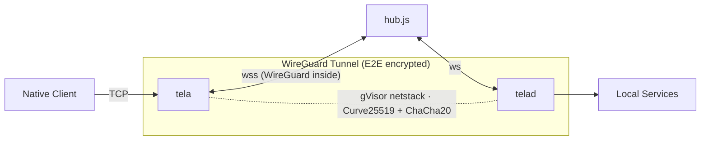

# Tela

Secure remote access to TCP services (SSH, RDP, HTTP, etc.) through an encrypted WireGuard tunnel relayed over WebSocket. No admin privileges or TUN devices required on either end.



## How it works

**tela** (client) and **telad** (daemon) each create a userspace WireGuard tunnel using gVisor netstack — pure Go, no kernel TUN, no elevated privileges. The hub relays encrypted WireGuard datagrams between them over WebSocket, with automatic upgrades to faster transports when available:

| Transport | Path | When |
|-----------|------|------|
| WebSocket | tela → hub → telad | Always works (even through corporate proxies) |
| UDP relay | tela → hub:41820 → telad | When outbound UDP is open |
| Direct P2P | tela → telad | When STUN hole-punch succeeds |

The hub never sees plaintext — it relays opaque WireGuard ciphertext.

## Components

| Component | Language | Description |
|-----------|----------|-------------|
| **tela** | Go | Client — connects to hub, establishes WG tunnel, binds localhost listeners |
| **telad** | Go | Daemon — registers with hub, exposes local services through WG tunnel |
| **hub.js** | Node.js | Relay — pairs agents with clients, relays WS/UDP, serves static site |

## Quick start

### Build

```bash
go build -o tela ./cmd/tela
go build -o telad ./cmd/telad
cd poc && npm install
```

### Run locally (3 terminals)

```bash
# Terminal 1 — Hub
node poc/hub.js

# Terminal 2 — Daemon (exposes SSH + RDP)
./telad -hub ws://localhost:8080 -machine mybox -ports "22,3389"

# Terminal 3 — Client
./tela -hub ws://localhost:8080 -machine mybox
```

Then connect: `ssh localhost` or `mstsc /v:localhost`

### Run with Docker (production)

```bash
docker compose up --build -d
./tela -hub wss://your-hostname -machine barn-wg
```

See [IMPLEMENTATION.md](IMPLEMENTATION.md) §8 for the full Docker Compose setup and Caddyfile.

## Security

- **End-to-end encryption**: WireGuard (Curve25519 key exchange, ChaCha20-Poly1305 data) between tela and telad. The hub is a blind relay.
- **Token authentication**: `-token` flag on both sides; hub validates before pairing.
- **No admin required**: gVisor netstack operates entirely in userspace — no TUN device, no root/Administrator.
- **Outbound-only**: Both tela and telad initiate outbound connections to the hub. No inbound ports needed on either end.

## Transport upgrade cascade

After the initial WebSocket connection, tela and telad automatically negotiate faster transports:

1. **UDP relay** — Hub offers a UDP port alongside WebSocket. Both sides probe it; if reachable, WireGuard datagrams switch to UDP (eliminates TCP-over-TCP). Falls back to WebSocket on timeout.
2. **Direct tunnel** — Both sides perform STUN discovery (RFC 5389) to learn their public IP:port, exchange endpoints via the hub, and attempt simultaneous UDP hole punching. On success, WireGuard datagrams flow peer-to-peer with zero relay overhead.

The cascade is fully automatic. Each tier falls through on failure with no user action.

## Project structure

```
cmd/tela/          Client binary
cmd/telad/         Daemon binary
internal/wsbind/   WireGuard conn.Bind over WebSocket/UDP/direct
poc/hub.js         Hub relay server
poc/www/           Static site served by hub
docker/            Dockerfile and Caddyfile for production
```

## Documentation

- [DESIGN.md](DESIGN.md) — Architecture specification
- [IMPLEMENTATION.md](IMPLEMENTATION.md) — Deployment runbook
- [TODO.md](TODO.md) — Roadmap
- [STATUS.md](STATUS.md) — Traceability matrix (design → implementation)
- [poc/README.md](poc/README.md) — Detailed CLI reference and troubleshooting

## License

See repository for license details.
