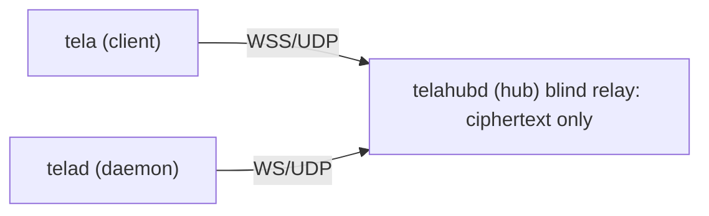
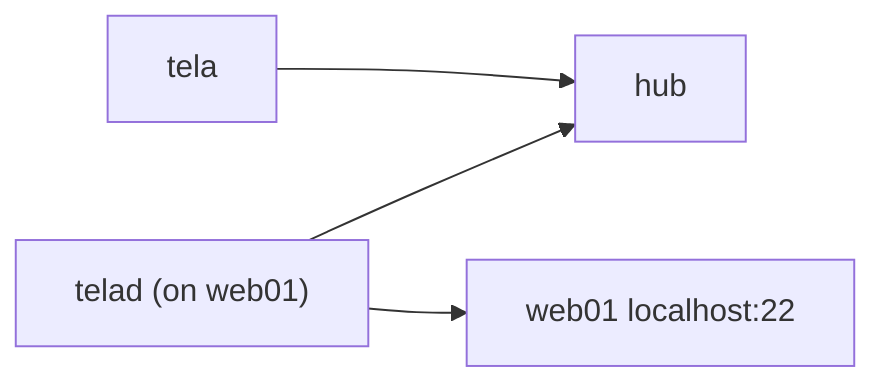
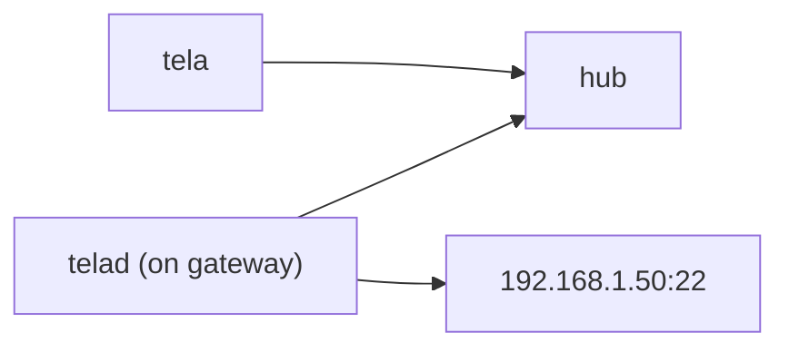
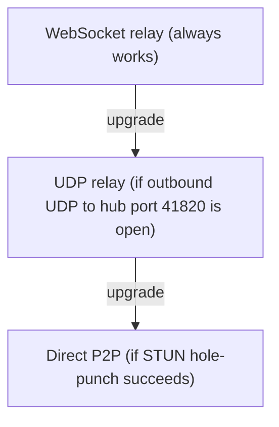

# Tela Reference Guide

Tela is a secure remote-access system built around three cooperating binaries. Together they let you reach any TCP service on a remote machine without opening inbound firewall ports, without installing kernel drivers, and without a VPN.

This guide covers all three tools in depth. It starts with a standalone deployment (no portal required) and ends with a section on adding Awan Saya as a portal for hub discovery and multi-hub management.

---

## Contents

1. [How Tela works](#1-how-tela-works)
2. [The three binaries](#2-the-three-binaries)
3. [Installation](#3-installation)
4. [Concepts and terminology](#4-concepts-and-terminology)
5. [telahubd: running a hub](#5-telahubd-running-a-hub)
6. [telad: running a daemon](#6-telad-running-a-daemon)
7. [tela: the client CLI](#7-tela-the-client-cli)
8. [Complete standalone walkthrough](#8-complete-standalone-walkthrough)
9. [Transport layers](#9-transport-layers)
10. [Security model](#10-security-model)
11. [Using Tela with Awan Saya](#11-using-tela-with-awan-saya)

---

## 1. How Tela works

A Tela connection involves three participants:



- `tela` runs on the machine the user sits at. It opens a local TCP port and forwards traffic through an encrypted tunnel.
- `telahubd` is the relay. It connects clients to daemons. It never sees plaintext; it relays opaque WireGuard ciphertext.
- `telad` runs on the machine that hosts the target service. It unwraps the tunnel and forwards traffic to the local port.

Both `tela` and `telad` make **outbound** connections to the hub. Neither side needs an inbound firewall rule. The hub is the only component that needs to be publicly reachable.

---

## 2. The three binaries

| Binary | Role | Where it runs |
|--------|------|---------------|
| `telahubd` | Hub relay | A publicly reachable server |
| `telad` | Daemon / agent | Each managed machine or gateway |
| `tela` | Client CLI | Any machine you connect *from* |
All three are single Go binaries. No runtime dependencies.

---

## 3. Installation

Download the binaries for your OS and architecture from the [GitHub Releases page](https://github.com/paulmooreparks/tela/releases).

Each binary is a self-contained executable. Copy it to a directory on your `PATH` and make it executable:

```bash
# Linux / macOS example
chmod +x tela telad telahubd
sudo mv tela telad telahubd /usr/local/bin/
```

On Windows, copy the `.exe` files to a folder in your `PATH`.

`tela` (the client) does not require administrator or root privileges on any platform.

`telad` and `telahubd` may need elevated privileges depending on the ports they bind to. Ports above 1024 do not require elevation on Linux/macOS.

---

## 4. Concepts and terminology

### Hub

A hub is a running instance of `telahubd`. It is the central relay for a group of machines and their services. Each hub has a URL, for example `https://hub.example.com`.

### Machine

A machine is an entry in the hub's registry. Each machine corresponds to a running `telad` process. The name is a short identifier you assign, for example `web01` or `db01`.

### Service

A service is a TCP port exposed through a machine. For example, the `web01` machine might expose port 22 (SSH) and port 5432 (PostgreSQL). You connect to a service by specifying the machine name and the local port you want to use.

### Token and roles

Access to a hub is controlled by tokens. Each token has one of four roles:

| Role | Permissions |
|------|-------------|
| `owner` | Full access: manage tokens, machines, services, and hub configuration |
| `admin` | Manage machines, services, and tokens; cannot change hub configuration |
| `user` | Connect to machines and query status/history (default role for new identities) |
| `viewer` | Read-only: query `/api/status` and `/api/history`; cannot connect |

Tokens are generated by `telahubd` and are shared out-of-band (for example, via a password manager or secrets vault).

### Transport

Tela negotiates the best available transport for each connection. See [section 9](#9-transport-layers) for details.

---

## 5. telahubd: running a hub

### What the hub does

`telahubd` listens for incoming WebSocket connections from both `tela` clients and `telad` daemons. It pairs them up and relays ciphertext between them. It also serves a hub console (static web UI), a status and history HTTP API, and an admin REST API for token and ACL management.

### Starting a hub

The minimal command (uses built-in defaults: port 80, UDP port 41820):

```bash
telahubd
```

With a config file:

```bash
telahubd -config telahubd.yaml
```

TLS is handled externally by a reverse proxy (Cloudflare Tunnel, Caddy, nginx, etc.). The hub itself listens on plain HTTP/WS. See [IMPLEMENTATION.md](IMPLEMENTATION.md) for ingress patterns.

### Configuration

`telahubd` uses a YAML config file with environment variable overrides.

**Precedence (highest first):**

1. Environment variables
2. YAML config file (`-config` flag)
3. Built-in defaults

**YAML config file** (`telahubd.yaml`):

```yaml
port: 80           # HTTP+WS listen port
udpPort: 41820       # UDP relay port
udpHost: ""          # public IP/hostname for UDP relay (when behind proxy)
name: myhub          # Display name for this hub
wwwDir: ./www        # Static file directory (hub console)
```

**Environment variable overrides:**

| Variable | Default | Description |
|----------|---------|-------------|
| `TELAHUBD_PORT` | `80` | HTTP+WS listen port |
| `TELAHUBD_UDP_PORT` | `41820` | UDP relay port |
| `TELAHUBD_UDP_HOST` | (empty) | Public IP/hostname advertised in UDP offers (for proxy/tunnel setups) |
| `TELAHUBD_NAME` | (empty) | Display name for this hub |
| `TELAHUBD_WWW_DIR` | `./www` | Static file directory |
| `TELA_OWNER_TOKEN` | (empty) | Bootstrap owner token on first startup (ignored if tokens already exist) |
| `TELAHUBD_PORTAL_URL` | (empty) | Portal URL for auto-registration on first startup (e.g. `https://awansaya.net`) |
| `TELAHUBD_PORTAL_TOKEN` | (empty) | Portal admin API token for registration (used once, not persisted) |
| `TELAHUBD_PUBLIC_URL` | (empty) | Hub's own public URL for portal registration (e.g. `https://gohub.example.com`) |

Flags: `-config <path>` and `-v` (verbose logging).

### Token management (local CLI)

Use `telahubd user` subcommands to manage auth tokens directly on the hub machine. All subcommands accept `-config <path>` (defaults to the system config path).

**Bootstrap the first owner token:**

```bash
telahubd user bootstrap
```

This generates an owner token and prints it. Store it securely; it is shown only once.

**Add identities:**

```bash
telahubd user add alice                 # regular user (default)
telahubd user add bob -role admin       # admin role
```

**List identities:**

```bash
telahubd user list                  # tabular output
telahubd user list -json            # JSON output (machine-readable)
```

**Grant/revoke per-machine connect access:**

```bash
telahubd user grant alice web01         # alice can connect to web01
telahubd user revoke alice web01        # remove access
```

**Rotate a compromised token:**

```bash
telahubd user rotate alice
```

**Remove an identity entirely:**

```bash
telahubd user remove alice
```

**Print the owner token:**

```bash
telahubd user show-owner
```

**Print the viewer token:**

```bash
telahubd user show-viewer
```

All changes take effect immediately (hot-reload). No hub restart required.

**Docker bootstrap (environment variable):**

For container deployments where you cannot run `telahubd user bootstrap`, set the `TELA_OWNER_TOKEN` environment variable:

```bash
TELA_OWNER_TOKEN=$(openssl rand -hex 32) docker compose up -d
```

On first startup (when no tokens exist), the hub auto-creates an `owner` identity with this token and a wildcard `*` machine ACL. On subsequent restarts, the env var is ignored because tokens already exist in the persisted config.

**Docker portal auto-registration:**

For container deployments, you can also auto-register with a portal on first startup:

```bash
TELA_OWNER_TOKEN=$(openssl rand -hex 32) \
TELAHUBD_PORTAL_URL=https://awansaya.net \
TELAHUBD_PORTAL_TOKEN=<portal-admin-token> \
TELAHUBD_PUBLIC_URL=https://gohub.example.com \
docker compose up -d
```

On first startup (when no portals are configured), the hub discovers the portal's hub directory, registers itself, and stores the sync token. The portal admin token (`TELAHUBD_PORTAL_TOKEN`) is used only for the initial POST and is **not** persisted. On subsequent restarts, the env vars are ignored because portal config already exists.

All three env vars (`TELAHUBD_PORTAL_URL`, `TELAHUBD_PORTAL_TOKEN`, `TELAHUBD_PUBLIC_URL`) plus `TELAHUBD_NAME` (or `name` in config) are required for auto-registration.

### Remote token management

Once bootstrapped, use `tela admin` from any workstation (see [section 7](#7-tela-the-client-cli) for details).

### Pairing codes

Pairing codes are single-use, time-limited codes that let users and agents get tokens without copying 64-character hex strings. An admin generates a code, sends it to the user (via email, chat, or verbally), and the user exchanges it for a permanent token.

There are two types:

- **Connect codes** (default): for users who want to connect to machines via `tela` or TelaVisor
- **Register codes**: for agents that need to register machines via `telad`

#### Client pairing (connecting users)

**Generate a connect code:**

```bash
tela admin pair-code -hub wss://hub.example.com -token <owner-token>
```

For a distributed team where the user may not be online immediately:

```bash
tela admin pair-code -hub wss://hub.example.com -token <owner-token> -expires 24h
```

Output:
```
Generated pairing code: ABCD-1234
Type: connect
Expires: 2026-03-19T10:30:00Z

User onboarding command:
  tela pair -hub wss://hub.example.com -code ABCD-1234
```

**Exchange the code (on the user's machine):**

```bash
tela pair -hub wss://hub.example.com -code ABCD-1234
```

Or in TelaVisor: click Add Hub, paste the hub URL and the pairing code. TelaVisor auto-detects that it is a pairing code (not a raw token) and exchanges it automatically.

This creates a token with `user` role (can connect to machines, cannot administer the hub) and stores it in the credential store.

**To restrict which machines the user can access:**

```bash
tela admin pair-code -hub wss://hub.example.com -token <owner-token> -machines web01,db01
```

#### Agent pairing (registering machines)

**Generate a register code:**

```bash
tela admin pair-code web01 -hub wss://hub.example.com -token <owner-token> -type register
```

**Exchange the code (on the agent machine):**

```bash
telad pair -hub wss://hub.example.com -code ABCD-1234
```

This creates a token with register permission for the specified machine and stores it in the system credential store.

**Then start the agent without passing tokens:**

```bash
telad -hub wss://hub.example.com -machine web01 -ports "22:SSH,3389:RDP"
# Token is found automatically from the credential store
```

#### Pairing code reference

| Property | Value |
|----------|-------|
| Format | `XXXX-XXXX` (alphanumeric) |
| Entropy | 36^8 = ~2.8 trillion combinations |
| Default expiry | 10 minutes |
| Maximum expiry | 7 days |
| Redemption | Single-use (deleted after exchange) |
| Brute-force risk | Infeasible within expiry window |

**Flags for `tela admin pair-code`:**

| Flag | Default | Description |
|------|---------|-------------|
| `-type` | `connect` | `connect` (for users) or `register` (for agents) |
| `-expires` | `10m` | Duration string: `10m`, `1h`, `24h`, `7d` |
| `-machines` | `*` | Comma-separated machine IDs (connect type only) |
| `-hub` | required | Hub URL |
| `-token` | required | Admin/owner token |

### Portal registration

Register your hub with a portal (like Awan Saya) for hub name resolution:

```bash
telahubd portal add myportal https://awansaya.net
telahubd portal list                                # tabular output
telahubd portal list -json                          # JSON output
telahubd portal remove myportal
telahubd portal sync                        # push viewer token to all portals
```

Registration is idempotent. Running `portal add` for an already-registered hub updates the existing entry (URL and viewer token) rather than failing.

#### Sync tokens

When a portal supports sync tokens, `portal add` returns a per-hub sync token. This token is scoped to a single hub and can only update that hub's viewer token on the portal. The hub stores the sync token in its config and does **not** persist the portal's admin API token.

The hub automatically syncs its viewer token to all registered portals:

- **On startup** (after a 2-second delay)
- **On console-viewer token rotation** (via the admin API)

You can also trigger a manual sync:

```bash
telahubd portal sync
```

If the portal is an older version that does not return a sync token, the admin API token is stored instead (with a warning). Upgrade the portal to enable automatic syncing.

#### Remote portal management (API)

Portal registrations can also be managed via the hub's admin REST API, which is useful for scripting and container environments where the CLI is unavailable:

```bash
# List portals
curl -H "Authorization: Bearer <owner-token>" https://hub.example.com/api/admin/portals

# Add/update a portal
curl -X POST -H "Authorization: Bearer <owner-token>" \
  -H "Content-Type: application/json" \
  -d '{"name":"awansaya","portalUrl":"https://awansaya.net","portalToken":"<portal-admin-token>","hubUrl":"https://hub.example.com"}' \
  https://hub.example.com/api/admin/portals

# Remove a portal
curl -X DELETE -H "Authorization: Bearer <owner-token>" \
  'https://hub.example.com/api/admin/portals?name=awansaya'
```

The `portalToken` in the POST body is the portal's admin API token. It is used for the registration request but is **not** persisted in the hub config. Only the scoped sync token returned by the portal is stored.

### Hub console

The hub serves a built-in web console that is embedded directly into the `telahubd` binary. No external static files are required. A single binary is the complete deployment.

The console uses a `console-viewer` token (auto-generated at startup) to show registered machines, services, and session history without requiring user login. The token is delivered to the browser as an `HttpOnly` cookie (`tela_viewer`), so API calls authenticate transparently.

If you need to override the embedded console with custom files, set `TELAHUBD_WWW_DIR` (or `wwwDir` in YAML). When set, the hub serves from disk instead of the embedded filesystem.

### Hub API endpoints

| Endpoint | Method | Auth | Description |
|----------|--------|------|-------------|
| `/api/status` | GET | viewer+ | Current machines, services, and session status |
| `/api/history` | GET | viewer+ | Recent connection events |
| `/api/admin/tokens` | GET | owner/admin | List all token identities |
| `/api/admin/tokens` | POST | owner/admin | Add a token identity |
| `/api/admin/tokens?id=<id>` | DELETE | owner/admin | Remove a token identity |
| `/api/admin/grant` | POST | owner/admin | Grant connect access to a machine |
| `/api/admin/revoke` | POST | owner/admin | Revoke connect access |
| `/api/admin/rotate/<id>` | POST | owner/admin | Regenerate a token |
| `/api/admin/portals` | GET | owner/admin | List portal registrations |
| `/api/admin/portals` | POST | owner/admin | Add/update a portal registration |
| `/api/admin/portals?name=<n>` | DELETE | owner/admin | Remove a portal registration |
| `/api/admin/acls` | GET | owner/admin | List per-machine ACL rules |
| `/api/admin/grant-register` | POST | owner/admin | Grant register access for a machine |
| `/api/admin/revoke-register` | POST | owner/admin | Revoke register access |
| `/api/admin/pair-code` | POST | owner/admin | Generate a pairing code |
| `/api/pair` | POST | none | Exchange a pairing code for a token |
| `/.well-known/tela` | GET | none | Hub directory discovery (RFC 8615) |
| `/api/hubs` | GET | viewer+ | Hub listing for portal/CLI resolution |

### Firewall requirements

| Port | Protocol | Required | Notes |
|------|----------|----------|-------|
| 443 (or custom) | TCP | Yes | WebSocket connections from `tela` and `telad` |
| 41820 (configurable) | UDP | Optional | UDP relay tier; improves latency when open. When the hub is behind a proxy (e.g. Cloudflare), set `TELAHUBD_UDP_HOST` to the real public IP/hostname so clients can reach the UDP port directly. |

No inbound ports are required on the machines running `telad`. Only the hub (or its reverse proxy) needs inbound access.

### Running telahubd as a service

`telahubd` has built-in service management for all platforms:

```bash
# Install as an OS service (copies config to system path)
telahubd service install -config telahubd.yaml

# Manage the service
telahubd service start
telahubd service stop
telahubd service restart
telahubd service uninstall
```

System config paths (written by `service install`):

| Platform | Path |
|----------|------|
| Linux / macOS | `/etc/tela/telahubd.yaml` |
| Windows | `%ProgramData%\Tela\telahubd.yaml` |

---

## 6. telad: running a daemon

### What telad does

`telad` runs on a managed machine or gateway. It connects outbound to a hub, registers itself under a name you choose, and declares the TCP ports it will expose. When a `tela` client requests a connection to that machine, the hub pairs the client with `telad` and relays the encrypted session.

### Endpoint agent vs gateway/bridge

**Endpoint agent:** `telad` runs on the machine that hosts the target service.



**Gateway/bridge agent:** `telad` runs on a machine that can reach the target over the LAN. The target machine does not run `telad`.



The gateway pattern is useful when target machines are locked down or when you prefer to centralize the software footprint.

### Two modes

**Config file mode** (recommended for production):

```bash
telad -config telad.yaml
```

**Single-machine mode** (quick testing):

```bash
telad -hub ws://hub -machine web01 -ports "22:SSH:OpenSSH server,3389:RDP:Remote Desktop" -token <token>
```

### telad flags

| Flag | Env var | Default | Description |
|------|---------|---------|-------------|
| `-config` | `TELAD_CONFIG` | (none) | Path to YAML config file |
| `-hub` | `TELA_HUB` | (none) | Hub WebSocket URL |
| `-machine` | `TELA_MACHINE` | (none) | Machine name for hub registry |
| `-token` | `TELA_TOKEN` | (none) | Hub auth token |
| `-ports` | `TELAD_PORTS` | (required) | Comma-separated port specs (see below) |
| `-target-host` | `TELAD_TARGET_HOST` | `127.0.0.1` | Target service host (gateway mode) |
| `-mtu` | `TELAD_MTU` | `1100` | WireGuard tunnel MTU (see [tunnel MTU](#tunnel-mtu)) |
| `-v` | | | Verbose logging |

### Service declaration format

The `-ports` flag takes comma-separated port specs in the format:

```
port[:name[:description]]
```

Examples:

```bash
# Just port numbers
-ports "22,3389"

# Port with name
-ports "22:SSH,3389:RDP"

# Port with name and description
-ports "22:SSH:OpenSSH server,3389:RDP:Remote Desktop"
```

### YAML config file

The config file supports multiple machines with rich metadata:

```yaml
hub: wss://hub.example.com
token: <default-token>

machines:
  - name: web01
    displayName: "Web Server 01"
    hostname: web01.internal
    os: linux
    tags: [production, web]
    location: "US-East"
    owner: ops-team
    services:
      - port: 22
        name: SSH
        description: "OpenSSH server"
      - port: 8080
        name: HTTP
        description: "Admin panel"

  - name: db01
    displayName: "Database Server"
    target: 192.168.1.50        # gateway mode
    token: <override-token>     # per-machine token
    ports: [5432]
    tags: [production, database]
```

Machine fields:

| Field | Required | Description |
|-------|----------|-------------|
| `name` | Yes | Machine ID as it appears in the hub registry |
| `displayName` | No | Human-friendly name |
| `hostname` | No | Override `os.Hostname()` (useful in containers) |
| `os` | No | OS identifier; defaults to `runtime.GOOS` |
| `tags` | No | Arbitrary string tags |
| `location` | No | Physical or logical location |
| `owner` | No | Owner identifier |
| `target` | No | Target host for services; defaults to `127.0.0.1` |
| `token` | No | Per-machine token override |
| `ports` | No | Simple port list (alternative to `services`) |
| `services` | No | Detailed service descriptors (port, name, description) |
| `gateway` | No | Path-based HTTP reverse proxy (see [gateway](#gateway-path-based-reverse-proxy)) |
| `upstreams` | No | Dependency forwarding (see [upstreams](#upstreams-dependency-routing)) |
| `fileShare` | No | File sharing configuration (see below) |

### File sharing

telad can expose a sandboxed directory for file transfer through the WireGuard tunnel. File sharing is off by default and must be explicitly enabled per machine.

```yaml
machines:
  - name: barn
    ports: [22, 3389]
    fileShare:
      enabled: true
      directory: C:\TelaShare     # absolute path, required when enabled
      writable: true               # allow uploads and modifications (default: false)
      maxFileSize: 50MB            # per-file upload limit (default: 50MB)
      maxTotalSize: 1GB            # total directory size limit (default: none)
      allowDelete: false           # allow file deletion (default: false, requires writable)
      allowedExtensions: []        # whitelist; empty = all allowed
      blockedExtensions: [".exe", ".bat", ".cmd", ".ps1", ".sh"]  # blacklist
```

File share configuration fields:

| Field | Default | Description |
|-------|---------|-------------|
| `enabled` | `false` | Enables file sharing for this machine |
| `directory` | (required) | Absolute path to the shared directory. Created on startup if missing. |
| `writable` | `false` | Allow uploads, mkdir, rename, move, and delete |
| `maxFileSize` | `50MB` | Maximum size of a single uploaded file |
| `maxTotalSize` | (none) | Maximum total size of all files in the directory |
| `allowDelete` | `false` | Allow file deletion (requires `writable: true`) |
| `allowedExtensions` | `[]` | Whitelist of file extensions (empty = all allowed) |
| `blockedExtensions` | see above | Blacklist of file extensions |

The shared directory must not be a system directory (`/`, `/etc`, `C:\Windows`, etc.). Symlinks inside the directory are never followed. All file operations are validated against the sandbox boundary. The directory and its contents are accessible only through authenticated Tela tunnel connections.

When file sharing is enabled, the agent advertises the capability to the hub, which includes it in `/api/status` responses. Clients and UIs (TelaVisor, hub console) can display file sharing availability without establishing a session.

The agent also watches the shared directory for changes using filesystem notifications and streams events (file created, modified, deleted, renamed) to connected clients in real time.

### Upstreams (dependency routing)

Upstreams let telad act as a routing layer for a service's outbound dependencies. Instead of a service calling its dependencies directly at hardcoded addresses, the service calls `localhost:PORT` and telad forwards the connection to a configurable target.

This provides a layer of indirection (like a virtual method dispatch) that lets you rewire service dependencies by editing a YAML file. Different developers can run the same service containers with different upstream configurations, pointing dependencies at local, test, or production instances without changing the service code or the remote environment.

```yaml
machines:
  - name: service3
    services:
      - port: 41002
        name: service3
    upstreams:
      - port: 41000
        name: service1
        target: localhost:41000       # forward to local Service 1
      - port: 41001
        name: service2
        target: localhost:41001       # forward to local Service 2
      - port: 1433
        name: db
        target: int-db.local:1433    # forward to INT database
```

In this example, Service 3 is configured to call `localhost:41000` for Service 1, `localhost:41001` for Service 2, and `localhost:1433` for the database. telad intercepts these calls and forwards them to the configured targets. To switch from INT's database to a local one, change the target:

```yaml
      - port: 1433
        name: db
        target: localhost:1433        # now uses local database
```

No code changes, no container rebuilds, no impact on other environments.

Upstream listeners bind on `0.0.0.0` so they are reachable from Docker containers on the same network. They start when telad starts and run for its lifetime, independent of tunnel sessions.

Upstream configuration fields:

| Field | Required | Description |
|-------|----------|-------------|
| `port` | Yes | Port to listen on |
| `target` | Yes | Address to forward to (`host:port`) |
| `name` | No | Human-readable label for logging |

### Gateway (path-based reverse proxy)

telad can run a built-in HTTP reverse proxy that routes requests by URL path to different local services. This eliminates the need for a separate reverse proxy (nginx, Caddy, Traefik) when exposing multiple HTTP services through a single tunnel port.

The gateway listens on a single port inside the WireGuard tunnel. Incoming requests are matched by path prefix (longest match first) and forwarded to the corresponding local service.

```yaml
machines:
  - name: myapp
    services:
      - port: 5432
        name: postgres
        proto: tcp
    gateway:
      port: 8080
      routes:
        - path: /api/
          target: 4000        # REST API on localhost:4000
        - path: /metrics/
          target: 4100        # metrics agent on localhost:4100
        - path: /
          target: 3000        # web UI on localhost:3000
```

In this example, telad exposes two tunnel services: the gateway on port 8080 and PostgreSQL on port 5432. The three HTTP services (3000, 4000, 4100) are internal to the machine and accessible only through the gateway.

A connecting client includes `gateway` in their profile:

```yaml
connections:
  - hub: wss://hub.example.com
    machine: myapp
    services: [gateway, postgres]
```

This gives the user `localhost:8080` (gateway) and `localhost:5432` (PostgreSQL). Opening `localhost:8080/` in a browser serves the web UI. Requests to `localhost:8080/api/users` are proxied to the API. The browser sees a single origin, so no CORS configuration is needed.

Gateway configuration fields:

| Field | Required | Description |
|-------|----------|-------------|
| `port` | Yes | Port to listen on inside the tunnel |
| `routes` | Yes | List of path-to-port routing rules |
| `routes[].path` | Yes | URL path prefix (e.g. `/api/`, `/`) |
| `routes[].target` | Yes | Local port to proxy to (e.g. 4000) |

Routes are matched by longest path prefix first. A route with `path: /` acts as the default and matches all requests not matched by a more specific route.

The gateway registers itself with the hub as a service named `gateway` with `proto: http`. Clients discover it through the hub's status API like any other service.

The gateway does not terminate TLS (the WireGuard tunnel provides end-to-end encryption), does not do load balancing, and does not transform requests or responses. It is a transparent HTTP reverse proxy for tunnel-internal routing.

See [DESIGN-gateway.md](DESIGN-gateway.md) for the full design specification.

### Running telad as a service

`telad` has built-in service management for all platforms. Configuration is stored securely in the service metadata (Windows registry, systemd config, launchd plist), eliminating filesystem permission issues.

**Two installation modes:**

From a config file (recommended for multi-machine setups):

```bash
telad service install -config telad.yaml
```

With inline configuration (recommended for single-machine setups):

```bash
telad service install -hub ws://your-hub:8080 -machine barn -ports "22:SSH,3389:RDP"
```

Manage the service:

```bash
telad service start       # Start the service
telad service stop        # Stop the service
telad service restart     # Stop and restart (after editing config)
telad service status      # Show current state
telad service uninstall   # Remove the service
```

Reference copy paths (if using `-config` mode):

| Platform | Path |
|----------|------|
| Linux / macOS | `/etc/tela/telad.yaml` |
| Windows | `%ProgramData%\Tela\telad.yaml` |

### Environment variables

| Variable | Default | Description |
|----------|---------|-------------|
| `TELAD_CONFIG` | (none) | Path to YAML config file |
| `TELA_HUB` | (none) | Hub WebSocket URL |
| `TELA_MACHINE` | (none) | Machine name for hub registry |
| `TELA_TOKEN` | (none) | Hub auth token |
| `TELAD_PORTS` | (none) | Comma-separated port specs (e.g. `22:SSH,3389:RDP`) |
| `TELAD_TARGET_HOST` | `127.0.0.1` | Target service host (gateway mode) |
| `TELAD_MTU` | `1100` | WireGuard tunnel MTU |

Environment variables serve as defaults. Flags override environment variables, and config file values override both.

### Credential storage for long-lived agents

For production deployments, store the agent's hub token in the system credential store so it persists across service restarts and is not exposed in config files or shell history.

**Store the token (requires elevation):**

```bash
# Linux / macOS
sudo telad login -hub wss://hub.example.com
# Prompts for token and optional identity

# Windows (PowerShell, run as Administrator)
telad login -hub wss://hub.example.com
```

**Then configure the agent without the token:**

```bash
# Config file mode (no token needed in the file)
telad -config telad.yaml
# Token is found automatically from credential store

# Single-machine mode (no -token flag needed)
telad -hub wss://hub.example.com -machine barn -ports "22:SSH,3389:RDP"
# Token is found automatically
```

**Remove stored credentials (rarely needed):**

```bash
telad logout -hub wss://hub.example.com
```

**Credential store locations:**

| Platform | User-level | System-level |
|----------|-----------|--------------|
| Linux / macOS | `~/.tela/credentials.yaml` | `/etc/tela/credentials.yaml` |
| Windows | `%APPDATA%\tela\credentials.yaml` | `%ProgramData%\Tela\credentials.yaml` |

System-level credentials are preferred for service mode (persists across service restarts). User-level credentials are used if system-level storage is not available.

---

## 7. tela: the client CLI

### What tela does

`tela` is the tool you run on any machine you want to connect *from*. It opens a WireGuard L3 tunnel to a named machine through the hub, then binds local TCP ports so native clients (ssh, mstsc, psql, etc.) can connect.

`tela` requires no admin rights and no kernel drivers. It runs as a plain user process.

### Commands

#### tela connect

Opens a tunnel to a machine and binds local listeners for its services.

```bash
tela connect -hub <hub-url-or-name> -machine <machine> [options]
```

| Flag | Env var | Description |
|------|---------|-------------|
| `-hub` | `TELA_HUB` | Hub URL (`wss://...`) or short name resolved via a configured remote |
| `-machine` | `TELA_MACHINE` | Machine name as registered with `telad` |
| `-token` | `TELA_TOKEN` | Hub auth token |
| `-ports` | | Comma-separated ports or `local:remote` pairs (e.g. `22`, `2222:22,15432:5432`) |
| `-services` | | Comma-separated service names (e.g. `ssh,postgres`); resolved via hub API |
| `-profile` | `TELA_PROFILE` | Named connection profile from `~/.tela/profiles/<name>.yaml` |
| `-port` | | Local TCP port (legacy; prefer `-ports`) |
| `-target-port` | | Target port on daemon (legacy; use with `-port`) |
| `-mtu` | `TELA_MTU` | WireGuard tunnel MTU (default 1100; see [tunnel MTU](#tunnel-mtu)) |
| `-v` | | Verbose logging |

When neither `-ports` nor `-services` is specified, `tela` auto-binds all ports the daemon advertises.

Examples:

```bash
# Connect to all services on web01
tela connect -hub wss://hub.example.com -machine web01 -token <token>

# Forward only SSH and PostgreSQL
tela connect -hub myhub -machine web01 -ports 22,5432

# Remap local ports (local 2222 -> remote 22, local 15432 -> remote 5432)
tela connect -hub myhub -machine web01 -ports 2222:22,15432:5432

# Select services by name
tela connect -hub myhub -machine web01 -services ssh,postgres

# Use a connection profile (multiple hubs/machines in parallel)
tela connect -profile mixed-env
```

After connecting, use `localhost:<port>` with your usual tools:

```bash
ssh localhost -p 22
mstsc /v:localhost:3389
psql -h localhost -p 5432 -U appuser mydb
```

#### tela machines

Lists all machines registered with a hub.

```bash
tela machines -hub <hub-url-or-name> [-token <token>]
```

#### tela services

Lists the services declared by a specific machine.

```bash
tela services -hub <hub-url-or-name> -machine <machine> [-token <token>]
```

#### tela status

Shows overall hub status: uptime, connected clients, registered machines.

```bash
tela status -hub <hub-url-or-name> [-token <token>]
```

#### tela remote

Manages hub directory remotes for short hub name resolution.

```bash
tela remote add <name> <portal-url>     # add a remote (discovers via /.well-known/tela)
tela remote remove <name>                # remove a remote
tela remote list                         # list configured remotes
```

Example:

```bash
tela remote add awansaya https://awansaya.net
tela connect -hub myhub -machine web01   # "myhub" resolved via the remote
```

#### tela profile

Manages connection profiles.

```bash
tela profile list                     # list available profiles
tela profile show <name>              # display profile YAML
tela profile create <name>            # create a new empty profile
tela profile delete <name>            # delete a profile
```

#### tela pair

Exchanges a pairing code for a hub token and stores it in the credential store.

```bash
tela pair -hub <hub-url> -code <code> # exchange a pairing code for a token
```

#### tela admin

Remote hub auth and portal management. Requires an owner or admin token.

```bash
tela admin list-tokens   -hub <hub> [-token <token>]
tela admin add-token <id> -hub <hub> [-token <token>]
tela admin remove-token <id> -hub <hub> [-token <token>]
tela admin grant <id> <machineId> -hub <hub> [-token <token>]
tela admin revoke <id> <machineId> -hub <hub> [-token <token>]
tela admin rotate <id> -hub <hub> [-token <token>]

tela admin list-portals -hub <hub> [-token <token>]
tela admin add-portal <name> -hub <hub> [-token <token>] -portal-url <url> [-hub-url <url>] [-portal-token <token>]
tela admin remove-portal <name> -hub <hub> [-token <token>]
```

Token resolution for admin commands: `-token` flag, then `TELA_OWNER_TOKEN` env var, then `TELA_TOKEN` env var.

You can set environment variables to avoid repeating flags:

```bash
export TELA_HUB=wss://hub.example.com
export TELA_OWNER_TOKEN=<owner-token>

tela admin list-tokens
tela admin add-token alice
tela admin grant alice web01
```

#### tela version

Prints version and exits.

```bash
tela version
```

#### tela service

Manages the `tela` client as a native OS service (Windows SCM, systemd, launchd). This is useful for always-on tunnel scenarios such as a jump server or workstation that must maintain persistent tunnels.

The service config is a connection profile YAML file (the same format used by `tela connect -profile`). At install time, hub values must be full `ws://` or `wss://` URLs (no name resolution in service mode), and service entries must use `remote:` port numbers (no `name:` resolution in service mode).

```bash
tela service install -config <profile.yaml>
tela service start
tela service stop
tela service restart
tela service status
tela service uninstall
```

System config paths (written by `service install`):

| Platform | Path |
|----------|------|
| Linux / macOS | `/etc/tela/tela.yaml` |
| Windows | `%ProgramData%\Tela\tela.yaml` |

#### tela files

File operations on connected machines with file sharing enabled. Requires an active `tela connect` session.

```bash
tela files ls -machine <machine> [path]
tela files get -machine <machine> <remote-path> [-o local-path]
tela files put -machine <machine> <local-path> [remote-name]
tela files rm -machine <machine> <remote-path>
tela files mkdir -machine <machine> <path>
tela files rename -machine <machine> <path> <new-name>
tela files mv -machine <machine> <source> <destination>
tela files info -machine <machine>
```

| Subcommand | Description |
|------------|-------------|
| `ls` | List files and directories |
| `get` | Download a file (saves to current directory or `-o` path) |
| `put` | Upload a file (optionally specify a remote name) |
| `rm` | Delete a file |
| `mkdir` | Create a directory |
| `rename` | Rename a file or directory (new name only, not a path) |
| `mv` | Move a file or directory to a different location within the share |
| `info` | Show file share status (file count, directory count, total size) |

All file operations use the `-machine` flag (or `TELA_MACHINE` env var) to identify the target machine. The machine must have `fileShare.enabled: true` in its telad config.

File data is transferred through the WireGuard tunnel using a chunked protocol with SHA-256 checksums. The hub never sees file contents.

#### Deprecated commands

`tela login <url>` and `tela logout <url>` are legacy commands for storing and removing hub credentials. They predate `tela remote` and serve a different purpose: `tela login` stores a hub token in the credential store (`credentials.yaml`), while `tela remote add` stores a remote entry for hub name resolution (`config.yaml`). Both are still functional.

### Connection profiles

A connection profile is a YAML file that defines multiple hub/machine connections in a single document. When you run `tela connect -profile <name>`, all connections launch in parallel, each with its own WireGuard tunnel and auto-reconnect. This lets you open tunnels to machines across different hubs with a single command.

#### Profile location

Profiles are stored in a platform-specific directory:

| Platform | Path |
|----------|------|
| Linux/macOS | `~/.tela/profiles/<name>.yaml` |
| Windows | `%APPDATA%\tela\profiles\<name>.yaml` |

You can also pass an explicit file path: `tela connect -profile /path/to/my-profile.yaml`

Set a default profile with the `TELA_PROFILE` environment variable.

#### Profile schema

```yaml
connections:
  - hub: <hub-url-or-name>
    machine: <machine-id>
    token: <auth-token>
    services:                    # optional: if omitted, all ports are forwarded
      - remote: 22               # forward by port number
        local: 2201              # optional local port remap (defaults to remote)
      - name: postgres           # forward by service name (resolved via hub API)
```

| Field | Required | Description |
|-------|----------|-------------|
| `connections` | Yes | List of connection entries |
| `connections[].hub` | Yes | Hub URL (`wss://...`) or short name |
| `connections[].machine` | Yes | Machine name on this hub |
| `connections[].token` | No | Auth token for this connection |
| `connections[].services` | No | Port/service filter; omit to forward all |
| `connections[].services[].remote` | * | Remote port number |
| `connections[].services[].local` | No | Local port override (defaults to remote) |
| `connections[].services[].name` | * | Service name to resolve via hub API |

\* Each service entry needs either `remote` or `name`, not both.

#### Environment variable expansion

Profile YAML supports `${VAR}` expansion, so you can keep tokens out of the file:

```yaml
connections:
  - hub: wss://hub.example.com
    machine: web01
    token: ${WEB_TOKEN}
    services:
      - remote: 22
      - remote: 8080
        local: 9090

  - hub: wss://hub.example.com
    machine: db01
    token: ${DB_TOKEN}
    services:
      - remote: 5432
```

Then:

```bash
export WEB_TOKEN=abc123 DB_TOKEN=def456
tela connect -profile my-env
```

#### Example: mixed-environment profile

A profile that connects to machines across two different hubs:

```yaml
# ~/.tela/profiles/mixed-env.yaml
connections:
  # Production web server (via corporate hub)
  - hub: wss://hub.corp.example.com
    machine: prod-web01
    token: ${CORP_TOKEN}
    services:
      - remote: 22
        local: 2201        # SSH on localhost:2201
      - remote: 8080
        local: 9001        # Admin panel on localhost:9001

  # Staging database (via cloud hub)
  - hub: staging-hub       # short name resolved via remote
    machine: staging-db
    token: ${STAGING_TOKEN}
    services:
      - name: postgres     # resolved to port 5432 via hub API

  # Dev box (all services)
  - hub: wss://dev.example.com
    machine: devbox
    token: ${DEV_TOKEN}
    # no services filter = forward everything the daemon advertises
```

```bash
tela connect -profile mixed-env
```

This opens three parallel tunnels. Each reconnects independently on disconnect. Press Ctrl+C to stop all connections.

#### Example: service-name-based profile

If you prefer service names over port numbers:

```yaml
connections:
  - hub: myhub
    machine: web01
    token: ${TOKEN}
    services:
      - name: ssh
      - name: http-admin
```

Service names are resolved at connect time by querying the hub's machine registry.

### Hub name resolution

When `-hub` is a short name (not starting with `ws://` or `wss://`), `tela` resolves it:

1. **Configured remotes** (sorted alphabetically): queries each remote's `/api/hubs` endpoint. First match wins.
2. **Local config file** (fallback):
   - Linux/macOS: `~/.tela/hubs.yaml`
   - Windows: `%APPDATA%\tela\hubs.yaml`
3. **Error**: if neither source resolves the name.

Local config file format:

```yaml
hubs:
  myhub: wss://hub.example.com
  work:  wss://hub.corp.example.com
```

### Environment variables

| Variable | Description |
|----------|-------------|
| `TELA_HUB` | Default hub URL or alias |
| `TELA_MACHINE` | Default machine ID |
| `TELA_TOKEN` | Default auth token (used by connect, machines, services, status) |
| `TELA_OWNER_TOKEN` | Owner/admin token (preferred by `tela admin`) |
| `TELA_PROFILE` | Default connection profile name |
| `TELA_MTU` | WireGuard tunnel MTU (default 1100) |

### Config and credential storage

| File | Platform | Path |
|------|----------|------|
| Credentials (hub tokens) | Linux/macOS | `~/.tela/credentials.yaml` |
| | Windows | `%APPDATA%\tela\credentials.yaml` |
| Config (remotes) | Linux/macOS | `~/.tela/config.yaml` |
| | Windows | `%APPDATA%\tela\config.yaml` |
| Hub aliases | Linux/macOS | `~/.tela/hubs.yaml` |
| | Windows | `%APPDATA%\tela\hubs.yaml` |
| Connection profiles | Linux/macOS | `~/.tela/profiles/<name>.yaml` |
| | Windows | `%APPDATA%\tela\profiles\<name>.yaml` |

**Storing and retrieving hub credentials:**

You can store hub tokens locally so you do not need to pass `-token` on every command:

```bash
# Store a token for a hub (prompts for token and optional identity)
tela login wss://hub.example.com

# Commands now find the token automatically
tela connect -hub wss://hub.example.com -machine web01

# Remove stored credentials when no longer needed
tela logout wss://hub.example.com
```

Credentials are stored in `~/.tela/credentials.yaml` with 0600 permissions (user-readable only).

#### tela mount

Starts a WebDAV server that exposes file shares from connected machines as a local drive. Requires a running `tela connect` session. No kernel drivers, FUSE, or third-party software required.

```bash
tela mount                          # start WebDAV server only (port 18080)
tela mount -port 9999               # custom port
tela mount -mount T:                # Windows: map drive letter T:
tela mount -mount C:\tela           # Windows: mount to directory
tela mount -mount ~/tela            # macOS/Linux: mount to directory
```

| Flag | Default | Description |
|------|---------|-------------|
| `-port` | `18080` | WebDAV listen port |
| `-mount` | (none) | Drive letter (Windows: `T:`) or directory path to mount |

On Windows, a value of exactly one letter followed by a colon (e.g., `T:`) creates a drive mapping via `net use`. Any other value is treated as a directory path. On macOS and Linux, the value is always a directory path.

When `-mount` is omitted, the WebDAV server starts but no OS mount is performed. Administrators can mount manually using platform-native tools:

```bash
# Windows
net use T: http://localhost:18080/

# macOS
mount_webdav http://localhost:18080/ /Volumes/tela

# Linux (GNOME, no root)
gio mount dav://localhost:18080/

# Linux (davfs2, requires root)
mount -t davfs http://localhost:18080/ /mnt/tela
```

The drive layout lists each connected machine as a top-level folder:

```
T:\
  barn\
    documents\
      report.pdf
    photos\
  devbox\
    logs\
```

Directory listings are cached for 3 seconds to reduce network round trips. The cache is automatically invalidated on mutations (create, delete, rename, move). On `Ctrl+C`, the mount is automatically unmapped before the WebDAV server stops.

| Environment Variable | Default | Description |
|----------------------|---------|-------------|
| `TELA_MOUNT_PORT` | `18080` | WebDAV listen port |

---

## 8. Complete standalone walkthrough

This section walks through a full deployment with one hub, two machines, and one client. No portal is involved.

### Setup

- Hub server: `hub.example.com` (public IP, port 443 open via reverse proxy)
- Machine 1: `web01` (a Linux server hosting an SSH service)
- Machine 2: `db01` (a Linux server hosting PostgreSQL)
- Client machine: a developer's laptop

### Step 1: Start the hub

On `hub.example.com`, create a minimal config:

```yaml
# telahubd.yaml
port: 80
name: my-hub
```

Start the hub:

```bash
telahubd -config telahubd.yaml
```

(In production, put a reverse proxy with TLS in front of port 80.)

### Step 2: Bootstrap auth

Generate the first owner token:

```bash
telahubd user bootstrap
# Output: owner token created: a1b2c3d4e5f6...  (save this)
```

Create a token for each daemon:

```bash
telahubd user add telad-web01
# Output: a new token for telad-web01

telahubd user add telad-db01
# Output: a new token for telad-db01
```

Create a client token for the developer:

```bash
telahubd user add alice
# Output: a new token for alice
```

Grant connect access:

```bash
telahubd user grant alice web01
telahubd user grant alice db01
```

### Step 3: Start telad on web01

On `web01`:

```bash
telad \
  -hub wss://hub.example.com \
  -token <telad-web01-token> \
  -machine web01 \
  -ports "22:SSH"
```

### Step 4: Start telad on db01

On `db01`:

```bash
telad \
  -hub wss://hub.example.com \
  -token <telad-db01-token> \
  -machine db01 \
  -ports "5432:PostgreSQL"
```

### Step 5: List machines from the client

On the developer's laptop:

```bash
tela machines -hub wss://hub.example.com -token <alice-token>
```

Expected output:

```
MACHINE  STATUS  SERVICES
web01    online  22/TCP (SSH)
db01     online  5432/TCP (PostgreSQL)
```

### Step 6: Connect to SSH on web01

```bash
tela connect \
  -hub wss://hub.example.com \
  -machine web01 \
  -token <alice-token>
```

In a second terminal:

```bash
ssh user@localhost -p 22
```

### Step 7: Connect to PostgreSQL on db01

```bash
tela connect \
  -hub wss://hub.example.com \
  -machine db01 \
  -ports 5432 \
  -token <alice-token>
```

In a second terminal:

```bash
psql -h localhost -p 5432 -U appuser mydb
```

### Using environment variables

To avoid repeating flags:

```bash
export TELA_HUB=wss://hub.example.com
export TELA_TOKEN=<alice-token>

tela machines
tela connect -machine web01
tela connect -machine db01 -ports 5432
```

---

## 9. Transport layers

Tela negotiates the best available transport automatically. No configuration is required on the client side.

### Tier 1: WebSocket relay (always available)

The initial connection always uses WebSocket (WSS). This works through HTTP proxies, corporate firewalls, and any environment that allows outbound HTTPS.

### Tier 2: UDP relay (when outbound UDP is available)

If both `tela` and `telad` can send outbound UDP to the hub's UDP relay port (default 41820), Tela upgrades to a UDP relay. This reduces latency and increases throughput.

### Tier 3: Direct P2P (when STUN hole-punch succeeds)

If STUN hole-punching succeeds, Tela upgrades further to a direct peer-to-peer connection. This completely bypasses the hub relay for data traffic.

The upgrade cascade:



Each tier falls back to the previous one automatically on failure. The hub always relays opaque WireGuard ciphertext regardless of which transport tier is active.

### Tunnel MTU

The WireGuard tunnel uses a default MTU of 1100 bytes. This is conservative: each TCP segment produced by the tunnel's gVisor netstack must survive the full encapsulation chain (WireGuard encryption, WebSocket framing, TLS record, and any virtual NIC overhead) without exceeding the path MTU of the underlying network.

The default of 1100 is chosen to work reliably in all tested environments, including WSL2 (Windows Subsystem for Linux 2). WSL2's Hyper-V virtual network adapter silently drops encapsulated packets that exceed its effective path MTU and does not relay ICMP Fragmentation Needed messages, creating an MTU black hole. At MTU 1100, the encapsulated packets stay below the WSL2 limit.

For environments without this overhead (native Linux, native Windows, direct LAN connections), you can raise the MTU for better throughput:

```bash
# Client side
tela connect -hub myhub -machine barn -mtu 1280
# or
export TELA_MTU=1280

# Agent side
telad -config telad.yaml -mtu 1280
# or
export TELAD_MTU=1280
```

Both sides should use the same MTU value. Mismatched MTUs can cause silent packet drops during large-packet operations like SSH key exchange.

| Environment | Recommended MTU |
|-------------|-----------------|
| WSL2 | 1100 (default) |
| Native Windows / Linux / macOS | 1280 |
| LAN with no proxies or tunnels | 1420 |

---

## 10. Security model

### End-to-end encryption

All data between `tela` and `telad` is encrypted with WireGuard using Curve25519 for key exchange and ChaCha20-Poly1305 for data encryption. The hub sees only ciphertext. Even if the hub server is compromised, session contents are not exposed.

### Outbound-only connectivity

Both `tela` and `telad` initiate outbound connections to the hub. Neither requires an inbound firewall rule. The attack surface on managed machines is reduced to the WireGuard session itself.

### Token-based RBAC

| Principle | Details |
|-----------|---------|
| Least privilege | Issue `viewer` tokens to read-only consumers (portal, monitoring). Issue `user` tokens to daemons and typical clients. Reserve `admin` and `owner` for operators. |
| Token rotation | Revoke and reissue tokens without restarting the hub or daemons. |
| No shared secrets | Each machine and each user gets its own token. Revoking one token does not affect others. |

### Segmentation

Use one hub per environment or per customer. If a hub is compromised or misconfigured, the blast radius is limited to the machines registered with that hub.

### Audit trail

The hub's `/api/history` endpoint records recent connections: machine name, client identity, timestamps, and service. Query it with:

```bash
curl -H "Authorization: Bearer <viewer-token>" https://hub.example.com/api/history
```

---

## 11. Using Tela with Awan Saya

Tela works entirely standalone. When you have multiple hubs or multiple users, [Awan Saya](https://awansaya.net/) adds a portal layer that simplifies hub discovery, provides a multi-hub dashboard, and manages hub-name resolution for the CLI.

**Analogy:** Tela is to Awan Saya as git is to GitHub.

### What Awan Saya adds

| Without Awan Saya | With Awan Saya |
|-------------------|----------------|
| Users need the full `wss://` URL for each hub | Users run `tela remote add` once; use short names after that |
| No central dashboard | Portal aggregates all hubs in one view |
| Onboarding requires sharing URLs and tokens manually | One `tela remote add` covers all registered hubs |
| Tokens are managed per hub | Centralized user management and personal API tokens (planned) |

### Registering a hub with Awan Saya

After your hub is running and publicly reachable, register it with a portal using the hub operator command:

```bash
telahubd portal add myportal https://awansaya.net
```

This adds your hub to the portal's directory. The portal will then proxy status checks from the browser to your hub using the stored viewer token.

You will be prompted for:
- The hub's public URL (for example, `https://hub.example.com`)
- A portal admin token (obtained from the portal's settings page)

The hub's `console-viewer` token is sent automatically. You do not need to create a separate viewer token.

Registration is idempotent. Running the same command again updates the hub's URL and viewer token on the portal. The portal returns a scoped sync token so that future viewer-token updates happen automatically (see [portal registration](#portal-registration) in section 5).

### Viewer token synchronization

Once registered, the hub keeps the portal's viewer token up to date automatically:

- On every hub restart, the current viewer token is pushed to all portals.
- When the `console-viewer` token is rotated (via the admin API), the new token is pushed immediately.
- You can also run `telahubd portal sync` to push manually.

If the portal shows a yellow "Auth Error" status for a hub, the viewer token is out of sync. Running `telahubd portal sync` or restarting the hub resolves this.

### Configuring the tela client with Awan Saya

On any machine you connect from, add awansaya.net as a remote:

```bash
tela remote add awansaya https://awansaya.net
```

If the portal requires authentication, you will be prompted for your personal API token from the portal settings page.

After that, use short hub names in all `tela` commands:

```bash
# List machines in the hub named "dev"
tela machines -hub dev

# Connect to a machine in the hub named "prod"
tela connect -hub prod -machine web01 -services ssh
```

The CLI resolves the hub name to a `wss://` URL by querying the portal's `/api/hubs` endpoint.

### The Awan Saya portal dashboard

Open the portal in a browser:

```
https://awansaya.net/portal/
```

The portal shows a card for each registered hub. Each card displays:
- Hub name and URL
- Status indicator: green (online), yellow (auth error), or red (unreachable)
- Registered machines and their connection status
- Recent history

The portal server proxies all hub status requests server-side. No direct browser-to-hub connectivity is required.

### Portal-mode networking

When using Awan Saya, note these networking differences from standalone mode:

- **Hub status**: the portal *server* fetches hub status; the browser does not contact hubs directly. The hub must be reachable from the portal server, not necessarily from the user's browser.
- **CLI hub resolution**: the CLI queries `GET /api/hubs` on the portal to convert a short hub name to a `wss://` URL. That URL must be reachable from the user's machine.
- **CORS**: no CORS headers are required on the hub when using the portal server-side proxy.

For networking troubleshooting, see [howto/networking.md](howto/networking.md).

---

## Quick reference

### telahubd commands

```bash
# Start hub
telahubd                                    # defaults (port 80, UDP 41820)
telahubd -config telahubd.yaml              # with config file

# Token management (local CLI)
telahubd user bootstrap                     # create first owner token
telahubd user list                          # list all identities
telahubd user add <id> [-role owner|admin]  # add identity
telahubd user remove <id>                   # remove identity
telahubd user grant <id> <machineId>        # grant connect access
telahubd user revoke <id> <machineId>       # revoke connect access
telahubd user rotate <id>                   # regenerate token
telahubd user show-owner                    # print the owner token
telahubd user show-viewer                   # print the viewer token

# Portal registration
telahubd portal add <name> <portal-url>
telahubd portal remove <name>
telahubd portal list
telahubd portal sync

# OS service management
telahubd service install -config telahubd.yaml
telahubd service start | stop | restart | uninstall
```

### telad commands

```bash
# Config file mode (recommended)
telad -config telad.yaml

# Single-machine mode
telad -hub wss://hub.example.com -machine web01 -ports "22:SSH,3389:RDP" -token <token>

# OS service management
telad service install -config telad.yaml
telad service install -hub <hub> -machine <id> -ports <specs>
telad service start | stop | restart | status | uninstall
```

### tela commands

```bash
# Connect to a machine
tela connect -hub <hub> -machine <machine> [-token <token>]
tela connect -hub <hub> -machine <machine> -ports 22,5432
tela connect -hub <hub> -machine <machine> -ports 2222:22,15432:5432
tela connect -hub <hub> -machine <machine> -services ssh,postgres
tela connect -profile <name>

# Query hub
tela machines -hub <hub> [-token <token>]
tela services -hub <hub> -machine <machine> [-token <token>]
tela status   -hub <hub> [-token <token>]

# Remote management
tela remote add <name> <portal-url>
tela remote remove <name>
tela remote list

# Profile management
tela profile list | show <name> | create <name> | delete <name>

# Pairing
tela pair -hub <hub-url> -code <code>

# Remote hub auth management (owner/admin)
tela admin list-tokens   -hub <hub> [-token <token>]
tela admin add-token <id> -hub <hub> [-token <token>]
tela admin remove-token <id> -hub <hub> [-token <token>]
tela admin grant <id> <machineId> -hub <hub> [-token <token>]
tela admin revoke <id> <machineId> -hub <hub> [-token <token>]
tela admin rotate <id> -hub <hub> [-token <token>]

# Remote portal management (owner/admin)
tela admin list-portals -hub <hub> [-token <token>]
tela admin add-portal <name> -hub <hub> [-token <token>] -portal-url <url> [-hub-url <url>] [-portal-token <token>]
tela admin remove-portal <name> -hub <hub> [-token <token>]

# File operations (requires active tela connect session)
tela files ls -machine <machine> [path]
tela files get -machine <machine> <path> [-o local]
tela files put -machine <machine> <local> [remote]
tela files rm -machine <machine> <path>
tela files mkdir -machine <machine> <path>
tela files rename -machine <machine> <path> <new-name>
tela files mv -machine <machine> <src> <dest>
tela files info -machine <machine>

# Mount file shares as a local drive (requires active tela connect session)
tela mount                              # WebDAV server only (port 18080)
tela mount -mount T:                    # Windows: map drive letter
tela mount -mount ~/tela                # macOS/Linux: mount to directory
tela mount -port <port>                 # custom WebDAV port

# OS service management
tela service install -config <profile.yaml>
tela service start | stop | restart | status | uninstall

# Version
tela version
```

### Token roles at a glance

| Role | Can connect | Read status/history | Manage tokens | Hub config |
|------|-------------|---------------------|---------------|------------|
| viewer | No | Yes | No | No |
| user (default) | Yes | Yes | No | No |
| admin | Yes | Yes | Yes | No |
| owner | Yes | Yes | Yes | Yes |
