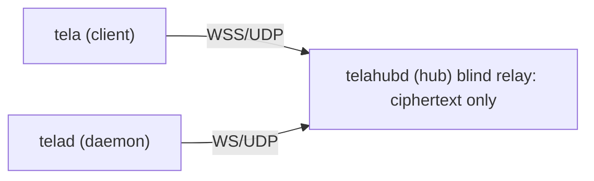
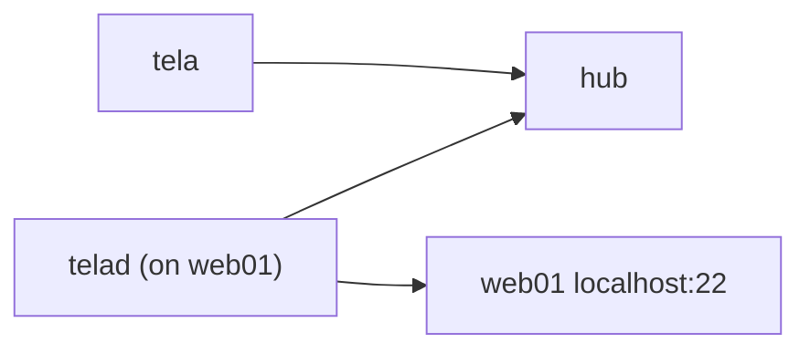
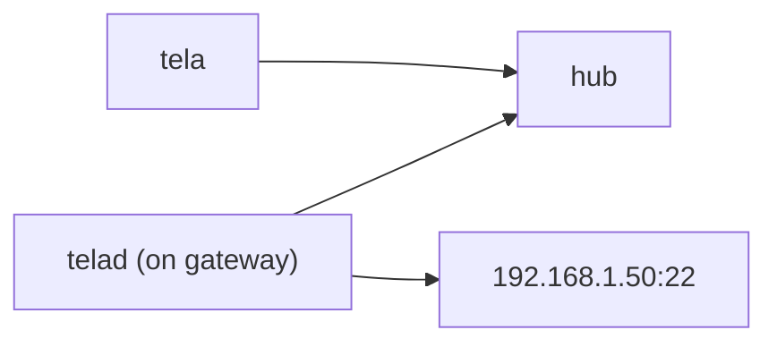
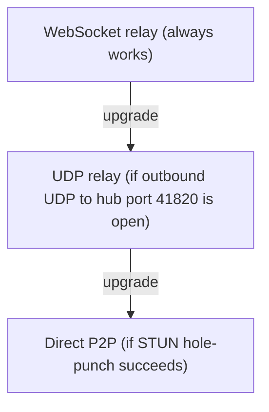

# Tela Reference Guide

Tela is a secure remote-access system built around three cooperating binaries. Together they let you reach any TCP service on a remote machine without opening inbound firewall ports, without installing kernel drivers, and without a VPN.

This guide covers all three tools in depth. It starts with a standalone deployment (no portal required) and ends with a section on adding Awan Saya as a portal for hub discovery and multi-hub management.

---

## Contents

1. [How Tela works](#1-how-tela-works)
2. [The three binaries](#2-the-three-binaries)
3. [Installation](#3-installation)
4. [Concepts and terminology](#4-concepts-and-terminology)
5. [telahubd: running a hub](#5-telahubd-running-a-hub)
6. [telad: running a daemon](#6-telad-running-a-daemon)
7. [tela: the client CLI](#7-tela-the-client-cli)
8. [Complete standalone walkthrough](#8-complete-standalone-walkthrough)
9. [Transport layers](#9-transport-layers)
10. [Security model](#10-security-model)
11. [Using Tela with Awan Saya](#11-using-tela-with-awan-saya)

---

## 1. How Tela works

A Tela connection involves three participants:



- `tela` runs on the machine the user sits at. It opens a local TCP port and forwards traffic through an encrypted tunnel.
- `telahubd` is the relay. It connects clients to daemons. It never sees plaintext; it relays opaque WireGuard ciphertext.
- `telad` runs on the machine that hosts the target service. It unwraps the tunnel and forwards traffic to the local port.

Both `tela` and `telad` make **outbound** connections to the hub. Neither side needs an inbound firewall rule. The hub is the only component that needs to be publicly reachable.

---

## 2. The three binaries

| Binary | Role | Where it runs |
|--------|------|---------------|
| `telahubd` | Hub relay | A publicly reachable server |
| `telad` | Daemon / agent | Each managed machine or gateway |
| `tela` | Client CLI | Any machine you connect *from* |

All three are single Go binaries. No runtime dependencies.

---

## 3. Installation

Download the binaries for your OS and architecture from the [GitHub Releases page](https://github.com/paulmooreparks/tela/releases).

Each binary is a self-contained executable. Copy it to a directory on your `PATH` and make it executable:

```bash
# Linux / macOS example
chmod +x tela telad telahubd
sudo mv tela telad telahubd /usr/local/bin/
```

On Windows, copy the `.exe` files to a folder in your `PATH`.

`tela` (the client) does not require administrator or root privileges on any platform.

`telad` and `telahubd` may need elevated privileges depending on the ports they bind to. Ports above 1024 do not require elevation on Linux/macOS.

---

## 4. Concepts and terminology

### Hub

A hub is a running instance of `telahubd`. It is the central relay for a group of machines and their services. Each hub has a URL, for example `https://hub.example.com`.

### Machine

A machine is an entry in the hub's registry. Each machine corresponds to a running `telad` process. The name is a short identifier you assign, for example `web01` or `db01`.

### Service

A service is a TCP port exposed through a machine. For example, the `web01` machine might expose port 22 (SSH) and port 5432 (PostgreSQL). You connect to a service by specifying the machine name and the local port you want to use.

### Token and roles

Access to a hub is controlled by tokens. Each token has one of four roles:

| Role | Permissions |
|------|-------------|
| `owner` | Full access: manage tokens, machines, services, and hub configuration |
| `admin` | Manage machines, services, and tokens; cannot change hub configuration |
| `user` | Connect to machines and use services |
| `viewer` | Read-only: query status and history APIs; cannot connect |

Tokens are generated by `telahubd` and are shared out-of-band (for example, via a password manager or secrets vault).

### Transport

Tela negotiates the best available transport for each connection. See [section 9](#9-transport-layers) for details.

---

## 5. telahubd: running a hub

### What the hub does

`telahubd` listens for incoming WebSocket connections from both `tela` clients and `telad` daemons. It pairs them up and relays ciphertext between them. It also serves a status and history HTTP API used by the portal and by `telad` during registration.

### Starting a hub

The minimal command:

```bash
telahubd --addr :443 --tls-cert /path/to/cert.pem --tls-key /path/to/key.pem
```

For development (no TLS, HTTP only):

```bash
telahubd --addr :8443
```

`tela` clients and `telad` daemons both default to `wss://` connections. Use the `--addr` with TLS for production.

### Hub configuration flags

| Flag | Default | Description |
|------|---------|-------------|
| `--addr` | `:8443` | Address and port to listen on |
| `--tls-cert` | (none) | Path to TLS certificate PEM file |
| `--tls-key` | (none) | Path to TLS private key PEM file |
| `--udp-relay-port` | `41820` | UDP port for the relay tier |
| `--data-dir` | `./data` | Directory for hub state (tokens, machine registry) |

### Token management

Before clients or daemons can connect, you need at least one token with the `owner` role. Generate the first owner token:

```bash
telahubd token create --role owner --name "initial-admin"
```

The command prints the token value. Store it securely; it is shown only once.

To create a token for a daemon (role `user` is sufficient for `telad` to register):

```bash
telahubd token create --role user --name "telad-web01"
```

To create a read-only viewer token for the portal:

```bash
telahubd token create --role viewer --name "portal-viewer"
```

To list all tokens:

```bash
telahubd token list
```

To revoke a token:

```bash
telahubd token revoke <token-id>
```

### Hub API endpoints

The hub exposes these HTTP endpoints:

| Endpoint | Method | Auth required | Description |
|----------|--------|---------------|-------------|
| `/api/status` | GET | viewer or above | Current machine and service status |
| `/api/history` | GET | viewer or above | Recent connection history |
| `/api/machines` | GET | user or above | List registered machines |

These endpoints are used by `telad` during startup, by the portal server, and by the `tela` CLI when direct hub URLs are provided.

### Firewall requirements

| Port | Protocol | Required | Notes |
|------|----------|----------|-------|
| 443 (or custom) | TCP | Yes | WebSocket connections from `tela` and `telad` |
| 41820 | UDP | Optional | UDP relay tier; improves throughput when open |

No inbound ports are required on the machines running `telad`. Only the hub needs inbound access.

### Running telahubd as a service

To run `telahubd` under systemd on Linux:

```ini
[Unit]
Description=Tela Hub
After=network.target

[Service]
ExecStart=/usr/local/bin/telahubd --addr :443 --tls-cert /etc/tela/cert.pem --tls-key /etc/tela/key.pem
Restart=on-failure
User=tela

[Install]
WantedBy=multi-user.target
```

Save as `/etc/systemd/system/telahubd.service`, then:

```bash
sudo systemctl daemon-reload
sudo systemctl enable --now telahubd
```

---

## 6. telad: running a daemon

### What telad does

`telad` runs on a managed machine or gateway. It connects outbound to a hub, registers itself under a name you choose, and declares the TCP ports it will expose. When a `tela` client requests a connection to that machine, the hub pairs the client with `telad` and relays the encrypted session.

### Endpoint agent vs gateway/bridge

**Endpoint agent:** `telad` runs on the machine that hosts the target service.



**Gateway/bridge agent:** `telad` runs on a machine that can reach the target over the LAN. The target machine does not run `telad`.



The gateway pattern is useful when target machines are locked down or when you prefer to centralize the software footprint.

### Starting a daemon

```bash
telad \
  --hub wss://hub.example.com \
  --token <user-or-admin-token> \
  --name web01 \
  --service "ssh:22:localhost:22"
```

This registers the machine `web01` with the hub and exposes SSH on port 22.

### telad configuration flags

| Flag | Description |
|------|-------------|
| `--hub` | WebSocket URL of the hub (e.g. `wss://hub.example.com`) |
| `--token` | Hub token for this daemon (user role or above) |
| `--name` | Machine name as it will appear in the hub registry |
| `--service` | Service declaration; see format below |
| `--target` | Default target host for services (gateway mode) |
| `--reconnect-interval` | Seconds to wait between reconnect attempts (default: `5`) |
| `--data-dir` | Directory for local state |

### Service declaration format

The `--service` flag takes the form:

```
<service-name>:<local-listen-port>:<target-host>:<target-port>
```

Examples:

```bash
# Expose SSH on the local machine
--service "ssh:22:localhost:22"

# Expose PostgreSQL on the local machine
--service "postgres:5432:localhost:5432"

# Gateway mode: reach a database on a different host
--service "db:5432:db-server.internal:5432"
```

You can specify `--service` multiple times to expose more than one service:

```bash
telad \
  --hub wss://hub.example.com \
  --token <token> \
  --name app-server \
  --service "ssh:22:localhost:22" \
  --service "http-admin:8080:localhost:8080"
```

### Running telad as a service

Systemd example for an endpoint agent:

```ini
[Unit]
Description=Tela Daemon
After=network.target

[Service]
ExecStart=/usr/local/bin/telad \
  --hub wss://hub.example.com \
  --token <token> \
  --name web01 \
  --service "ssh:22:localhost:22"
Restart=on-failure
User=tela

[Install]
WantedBy=multi-user.target
```

On Windows, use NSSM or the Windows Service Wrapper to run `telad.exe` as a background service.

---

## 7. tela: the client CLI

### What tela does

`tela` is the tool you run on any machine you want to connect *from*. It opens a local TCP port and forwards traffic to a named service on a named machine through the hub's encrypted relay.

`tela` requires no admin rights and no kernel drivers. It runs as a plain user process.

### Commands

#### tela connect

Opens a tunnel to a service on a remote machine.

```bash
tela connect -hub <hub-url-or-name> -machine <machine> -service <service> [-local-port <port>]
```

| Flag | Description |
|------|-------------|
| `-hub` | Hub URL (`wss://hub.example.com`) or a short name resolved via a configured remote |
| `-machine` | Machine name as registered with `telad` |
| `-service` | Service name as declared in `telad` |
| `-local-port` | Local port to listen on (default: the service's declared port) |
| `-token` | Hub token for the client (user role or above) |

After connecting, use `localhost:<local-port>` with your usual tools:

```bash
# Connect to SSH on web01 via the hub
tela connect -hub wss://hub.example.com -machine web01 -service ssh -token <token>

# In a second terminal, SSH through the tunnel
ssh localhost:22
```

#### tela machines

Lists all machines registered with a hub.

```bash
tela machines -hub <hub-url-or-name> [-token <token>]
```

Example output:

```
NAME       STATUS   SERVICES
web01      online   ssh, http-admin
db01       online   postgres
dev-box    offline
```

#### tela services

Lists the services declared by a specific machine.

```bash
tela services -hub <hub-url-or-name> -machine <machine> [-token <token>]
```

#### tela status

Shows overall hub status: uptime, connected clients, registered machines.

```bash
tela status -hub <hub-url-or-name> [-token <token>]
```

#### tela remote add

Adds a portal as a named remote. After adding a remote, you can use a short hub name instead of a full `wss://` URL in other commands.

```bash
tela remote add <remote-name> <portal-url>
```

Example:

```bash
tela remote add myportal https://awansaya.net
```

If the portal requires authentication, you will be prompted for a token.

#### tela remote remove

Removes a previously configured remote.

```bash
tela remote remove <remote-name>
```

#### tela remote list

Lists all configured remotes and their stored credentials.

```bash
tela remote list
```

### Token storage

`tela` stores hub tokens and remote credentials in a local configuration file. The default location is:

| Platform | Path |
|----------|------|
| Linux | `~/.config/tela/config.json` |
| macOS | `~/Library/Application Support/tela/config.json` |
| Windows | `%APPDATA%\tela\config.json` |

You can override this with the `--config` flag.

---

## 8. Complete standalone walkthrough

This section walks through a full deployment with one hub, two machines, and one client. No portal is involved.

### Setup

- Hub server: `hub.example.com` (public IP, port 443 open)
- Machine 1: `web01` (a Linux server hosting an SSH service)
- Machine 2: `db01` (a Linux server hosting PostgreSQL)
- Client machine: a developer's laptop

### Step 1: Start the hub

On `hub.example.com`:

```bash
telahubd \
  --addr :443 \
  --tls-cert /etc/tls/hub.example.com.crt \
  --tls-key /etc/tls/hub.example.com.key
```

Create an owner token:

```bash
telahubd token create --role owner --name admin
# Output: tok_a1b2c3d4e5f6...  (save this)
```

Create daemon tokens (one per machine):

```bash
telahubd token create --role user --name telad-web01
# Output: tok_web01xxxx...

telahubd token create --role user --name telad-db01
# Output: tok_db01xxxx...
```

Create a client token for the developer:

```bash
telahubd token create --role user --name dev-alice
# Output: tok_alicexxxx...
```

### Step 2: Start telad on web01

On `web01`:

```bash
telad \
  --hub wss://hub.example.com \
  --token tok_web01xxxx \
  --name web01 \
  --service "ssh:22:localhost:22"
```

### Step 3: Start telad on db01

On `db01`:

```bash
telad \
  --hub wss://hub.example.com \
  --token tok_db01xxxx \
  --name db01 \
  --service "postgres:5432:localhost:5432"
```

### Step 4: List machines from the client

On the developer's laptop:

```bash
tela machines -hub wss://hub.example.com -token tok_alicexxxx
```

Expected output:

```
NAME    STATUS   SERVICES
web01   online   ssh
db01    online   postgres
```

### Step 5: Connect to SSH on web01

```bash
tela connect \
  -hub wss://hub.example.com \
  -machine web01 \
  -service ssh \
  -token tok_alicexxxx
```

In a second terminal:

```bash
ssh user@localhost
```

### Step 6: Connect to PostgreSQL on db01

```bash
tela connect \
  -hub wss://hub.example.com \
  -machine db01 \
  -service postgres \
  -local-port 5432 \
  -token tok_alicexxxx
```

In a second terminal:

```bash
psql -h localhost -p 5432 -U appuser mydb
```

---

## 9. Transport layers

Tela negotiates the best available transport automatically. No configuration is required on the client side.

### Tier 1: WebSocket relay (always available)

The initial connection always uses WebSocket (WSS). This works through HTTP proxies, corporate firewalls, and any environment that allows outbound HTTPS.

### Tier 2: UDP relay (when outbound UDP is available)

If both `tela` and `telad` can send outbound UDP to the hub's UDP relay port (default 41820), Tela upgrades to a UDP relay. This reduces latency and increases throughput.

### Tier 3: Direct P2P (when STUN hole-punch succeeds)

If STUN hole-punching succeeds, Tela upgrades further to a direct peer-to-peer connection. This completely bypasses the hub relay for data traffic.

The upgrade cascade:



Each tier falls back to the previous one automatically on failure. The hub always relays opaque WireGuard ciphertext regardless of which transport tier is active.

---

## 10. Security model

### End-to-end encryption

All data between `tela` and `telad` is encrypted with WireGuard using Curve25519 for key exchange and ChaCha20-Poly1305 for data encryption. The hub sees only ciphertext. Even if the hub server is compromised, session contents are not exposed.

### Outbound-only connectivity

Both `tela` and `telad` initiate outbound connections to the hub. Neither requires an inbound firewall rule. The attack surface on managed machines is reduced to the WireGuard session itself.

### Token-based RBAC

| Principle | Details |
|-----------|---------|
| Least privilege | Issue `viewer` tokens to read-only consumers (portal, monitoring). Issue `user` tokens to daemons and typical clients. Reserve `admin` and `owner` for operators. |
| Token rotation | Revoke and reissue tokens without restarting the hub or daemons. |
| No shared secrets | Each machine and each user gets its own token. Revoking one token does not affect others. |

### Segmentation

Use one hub per environment or per customer. If a hub is compromised or misconfigured, the blast radius is limited to the machines registered with that hub.

### Audit trail

The hub's `/api/history` endpoint records recent connections: machine name, client identity, timestamps, and service. Query it with:

```bash
curl -H "Authorization: Bearer <viewer-token>" https://hub.example.com/api/history
```

---

## 11. Using Tela with Awan Saya

Tela works entirely standalone. When you have multiple hubs or multiple users, Awan Saya adds a portal layer that simplifies hub discovery, provides a multi-hub dashboard, and manages hub-name resolution for the CLI.

**Analogy:** Tela is to Awan Saya as git is to GitHub.

### What Awan Saya adds

| Without Awan Saya | With Awan Saya |
|-------------------|----------------|
| Users need the full `wss://` URL for each hub | Users run `tela remote add` once; use short names after that |
| No central dashboard | Portal aggregates all hubs in one view |
| Onboarding requires sharing URLs and tokens manually | One `tela remote add` covers all registered hubs |
| Tokens are managed per hub | Centralized user management and personal API tokens (planned) |

### Registering a hub with Awan Saya

After your hub is running and publicly reachable, register it with a portal using the hub operator command:

```bash
telahubd portal add myportal https://awansaya.net
```

This adds your hub to the portal's directory. The portal will then proxy status checks from the browser to your hub using a stored viewer token.

You will be prompted for:
- The hub's public URL (for example, `https://hub.example.com`)
- A viewer token for the hub (created with `telahubd token create --role viewer`)
- A portal admin token (obtained from the portal's settings page)

### Configuring the tela client with Awan Saya

On any machine you connect from, add awansaya.net as a remote:

```bash
tela remote add awansaya https://awansaya.net
```

If the portal requires authentication, you will be prompted for your personal API token from the portal settings page.

After that, use short hub names in all `tela` commands:

```bash
# List machines in the hub named "dev"
tela machines -hub dev

# Connect to a machine in the hub named "prod"
tela connect -hub prod -machine web01 -service ssh
```

The CLI resolves the hub name to a `wss://` URL by querying the portal's `/api/hubs` endpoint.

### The Awan Saya portal dashboard

Open the portal in a browser:

```
https://awansaya.net/portal/
```

The portal shows a card for each registered hub. Each card displays:
- Hub name and URL
- Online/offline status
- Registered machines and their connection status
- Recent history

The portal server proxies all hub status requests server-side. No direct browser-to-hub connectivity is required.

### Hub registration via config.json (self-hosted Awan Saya)

If you run your own Awan Saya instance, you can also register hubs by editing the hub directory file directly:

```json
{
  "hubs": [
    {
      "name": "dev",
      "url": "https://dev-hub.example.com",
      "viewerToken": "<viewer-token>"
    },
    {
      "name": "prod",
      "url": "https://prod-hub.example.com",
      "viewerToken": "<viewer-token>"
    }
  ]
}
```

The `viewerToken` is a hub token with the `viewer` role. The portal uses it to authenticate against the hub's status API. It is never sent to the browser.

For more detail on self-hosted Awan Saya, see the [Awan Saya setup guide](README.md).

### Portal-mode networking

When using Awan Saya, note these networking differences from standalone mode:

- **Hub status**: the portal *server* fetches hub status; the browser does not contact hubs directly. The hub must be reachable from the portal server, not necessarily from the user's browser.
- **CLI hub resolution**: the CLI queries `GET /api/hubs` on the portal to convert a short hub name to a `wss://` URL. That URL must be reachable from the user's machine.
- **CORS**: no CORS headers are required on the hub when using the portal server-side proxy.

For networking troubleshooting, see [howto/networking.md](howto/networking.md).

---

## Quick reference

### telahubd commands

```bash
telahubd --addr :443 --tls-cert cert.pem --tls-key key.pem
telahubd token create --role <owner|admin|user|viewer> --name <label>
telahubd token list
telahubd token revoke <token-id>
telahubd portal add <remote-name> <portal-url>
```

### telad commands

```bash
telad --hub wss://hub.example.com --token <token> --name <machine> --service "<name>:<port>:<host>:<port>"
```

### tela commands

```bash
tela connect -hub <hub> -machine <machine> -service <service> [-local-port <port>] [-token <token>]
tela machines -hub <hub> [-token <token>]
tela services -hub <hub> -machine <machine> [-token <token>]
tela status -hub <hub> [-token <token>]
tela remote add <name> <portal-url>
tela remote remove <name>
tela remote list
```

### Token roles at a glance

| Role | Can connect | Manage tokens | Manage machines | Hub config |
|------|-------------|---------------|-----------------|------------|
| viewer | No | No | No | No |
| user | Yes | No | No | No |
| admin | Yes | Yes | Yes | No |
| owner | Yes | Yes | Yes | Yes |
