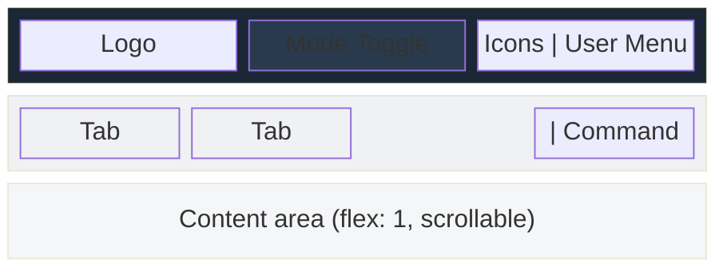

# Tela Design Language (TDL)

The Tela Design Language defines the visual language shared across all products in the Tela ecosystem: TelaVisor (desktop client), TelaBoard (demo application), and Awan Saya (portal). Any application built to showcase or integrate with Tela should follow TDL to present a cohesive, professional experience.

This document is the reference for implementers. It describes the design tokens, component patterns, and layout conventions that make a Tela application look and feel like part of the family.


## Design tokens

All colors, spacing, typography, and radii are defined as CSS custom properties on `:root`. Every Tela application uses the same set.

```css
:root {
  /* Backgrounds */
  --bg: #f5f6f8;               /* Page background */
  --surface: #ffffff;           /* Cards, panels, modals */
  --surface-alt: #f0f1f4;      /* Tab bars, column backgrounds, hover */

  /* Text */
  --text: #1a1a2e;             /* Primary text (blue-tinted dark) */
  --text-muted: #6b7280;       /* Secondary text, labels, placeholders */

  /* Brand */
  --accent: #2ecc71;           /* Primary action, connected state, links in dark contexts */
  --accent-hover: #27ae60;     /* Accent hover state */

  /* Chrome */
  --topbar-bg: #1b2636;        /* Top bar background (dark navy) */
  --topbar-text: #e0e0e0;      /* Top bar text */

  /* Borders */
  --border: #e2e5ea;           /* Default border (blue-tinted light gray) */

  /* Semantic */
  --danger: #e74c3c;           /* Destructive actions, errors */
  --danger-hover: #c0392b;
  --warn: #f39c12;             /* Warnings, in-progress states */

  /* Shape */
  --radius: 8px;               /* Default border radius for cards, panels, modals */

  /* Typography */
  --font: -apple-system, BlinkMacSystemFont, "Segoe UI", Roboto, sans-serif;
  --mono: "SF Mono", "Cascadia Code", "Consolas", monospace;
}
```

### Color usage rules

- **Accent green (#2ecc71)** is the brand color. It appears in logos, active states, primary buttons, connected indicators, and links within dark-background contexts.
- **Blue (#0f5cc0)** is used for text links in light-background contexts (web convention). Awan Saya uses this for body text links. TelaVisor and TelaBoard do not have body text links.
- **Danger red (#e74c3c)** is used for destructive buttons, error messages, and disconnect states. Never use red for non-destructive purposes.
- **Warning amber (#f39c12)** is used for in-progress states (connecting, disconnecting) and warning badges. Never use amber for success.
- **Text colors** are blue-tinted, not pure gray. `--text` is #1a1a2e (not #222). `--text-muted` is #6b7280 (not #666). This subtle tint ties the palette together.
- **Border color** is also blue-tinted (#e2e5ea, not #e0e0e0). Consistency with the text tint.

### Dark mode

TDL applications support three theme modes: light (default), dark, and system (follows OS preference). Dark mode overrides the CSS custom properties while keeping accent, danger, and warning colors unchanged.

```css
[data-theme="dark"] {
  --bg: #111827;
  --surface: #1f2937;
  --surface-alt: #1a2332;
  --text: #e5e7eb;
  --text-muted: #9ca3af;
  --border: #374151;
  --topbar-bg: #0f172a;
  --topbar-text: #e0e0e0;
}
```

The dark palette maintains the same blue tint as the light palette. All colors are derived from the same blue-gray family so that dark mode feels intentional, not inverted.

Theme is applied by setting `data-theme="dark"` or `data-theme="light"` on the `<html>` element. When the user selects "system," the application listens to the `prefers-color-scheme` media query and sets the attribute accordingly.

Settings (including theme preference) are stored in `localStorage` so they persist across sessions.


## Layout structure

Every TDL application follows the same vertical layout:



### Top bar

The top bar is 44px tall with `--topbar-bg` background. It uses a three-section flex layout:

- **Left**: Application logo. Text-based, with the product suffix in `--accent`. Examples: "Tela**Visor**", "Tela**Board**", "Awan**Saya**".
- **Center**: Mode toggle. Positioned with `position: absolute; left: 50%; transform: translateX(-50%)` so it stays centered regardless of left/right content width. The toggle is a group of buttons with shared borders (first child gets left radius, last child gets right radius, middle children have no radius).
- **Right**: Icon buttons and user menu. Icon buttons are 28px circles with 1px border. The user menu follows the Awan Saya dropdown pattern (avatar + name + chevron, dropdown with user info and sign out).

### Top bar icon buttons

```css
.topbar-icon-btn {
  background: none;
  border: 1px solid rgba(255,255,255,0.2);
  color: #94a3b8;
  width: 28px; height: 28px;
  border-radius: 50%;
  font-size: 14px; font-weight: 700;
  cursor: pointer;
  display: flex; align-items: center; justify-content: center;
}
.topbar-icon-btn:hover {
  color: #fff;
  border-color: rgba(255,255,255,0.4);
  background: rgba(255,255,255,0.1);
}
```

### Icon button with dropdown

When an icon button opens a dropdown menu (such as a theme selector), the button shows the current state icon in the upper portion and a small downward chevron at the bottom as a dropdown affordance. The button size matches the avatar circle (32px) for visual balance.

```css
.theme-btn {
  width: 32px !important;
  height: 32px !important;
  flex-direction: column;
  gap: 0;
  padding: 0;
}

.theme-btn-icon {
  font-size: 15px;
  line-height: 1;
}

.theme-btn-arrow {
  font-size: 10px;
  line-height: 1;
  opacity: 0.8;
  margin-top: 2px;
  margin-bottom: -4px;
}
```

The dropdown uses the same `nav-btn-dd` panel as the user menu. Dropdown items display an icon on the left and label text on the right. The active selection is highlighted in `--accent`.

### Mode toggle

```css
.mode-toggle { display: flex; gap: 0; }
.mode-btn {
  padding: 4px 14px; font-size: 12px; font-weight: 600;
  border: 1px solid rgba(255,255,255,0.2);
  background: none; color: #94a3b8;
}
.mode-btn:first-child { border-radius: 4px 0 0 4px; }
.mode-btn:last-child  { border-radius: 0 4px 4px 0; border-left: none; }
.mode-btn.active {
  background: rgba(255,255,255,0.15);
  color: #fff;
  border-color: rgba(255,255,255,0.3);
}
```

### Tab bar

The tab bar sits directly below the top bar. Background is `--surface-alt`, with a 1px `--border` bottom border. Tabs are text buttons with a 2px bottom border that turns `--accent` when active.

```css
.main-tab-bar {
  display: flex; align-items: center;
  background: var(--surface-alt);
  border-bottom: 1px solid var(--border);
  padding: 0 16px;
}
.main-tab {
  background: none; border: none;
  padding: 8px 16px; font-size: 13px; font-weight: 500;
  color: var(--text-muted);
  border-bottom: 2px solid transparent;
}
.main-tab.active {
  color: var(--text);
  border-bottom-color: var(--accent);
  font-weight: 600;
}
```

### Tab bar separators

Vertical separator bars divide groups of controls within a tab bar or toolbar. They visually separate tabs from commands, or group related commands together.

```css
.tb-sep {
  width: 1px;
  height: 20px;
  background: var(--border);
  margin: 0 2px;
}
```

Use a separator before command buttons that appear at the right end of a tab bar. This makes clear that the commands are not tabs.

### Tab bar command buttons

Small bordered buttons that appear in the tab bar, visually distinct from tabs:

```css
.tb-btn {
  background: none;
  border: 1px solid var(--border);
  padding: 3px 10px;
  border-radius: 4px;
  font-size: 12px;
  color: var(--text-muted);
}
.tb-btn:hover {
  background: var(--surface-alt);
  color: var(--text);
}
```


## Component patterns

### Cards

Cards are the primary container for content. White background, 1px border, 8px radius.

```css
.card {
  background: var(--surface);
  border: 1px solid var(--border);
  border-radius: var(--radius);
  padding: 22px;
}
```

### Buttons

Four button variants:

| Variant | Background | Text | Border | Use |
|---------|-----------|------|--------|-----|
| Primary | `--accent` | white | `--accent` | Main action (save, create, connect) |
| Secondary | `--surface` | `--text` | `--border` | Cancel, alternative actions |
| Danger | `--surface` | `--danger` | `--danger` | Delete, disconnect, destructive |
| Ghost | transparent | `--topbar-text` | transparent | Icon-like buttons in dark contexts |

Every button has a visible hover state (`background` or `border-color` change) and `cursor: pointer`. Anything that does not respond to clicks must not look like a button. In particular, status badges must never use a filled background that matches a button variant.

### Status badges

Status badges are inline labels that show a non-interactive state (online, offline, a version string). They are distinguished from buttons by using an outlined style (colored border and text, transparent background) and `cursor: default`.

```css
.badge-online {
  padding: 1px 8px; border-radius: 10px;
  font-size: 10px; font-weight: 600;
  text-transform: uppercase; letter-spacing: 0.05em;
  color: var(--accent); border: 1px solid var(--accent);
  background: none; cursor: default;
  -webkit-user-select: none; user-select: none;
}
.badge-offline {
  /* same shape; color: var(--text-muted); border: 1px solid var(--text-muted) */
}
```

Never use a filled green or red pill for a status badge. Filled backgrounds are reserved for buttons.

### Status indicators

Small colored circles (8-10px) indicate connection or health state:

| Color | Meaning |
|-------|---------|
| `--accent` (#2ecc71) | Connected, healthy, online |
| `--warn` (#f39c12) | Connecting, degraded, in progress |
| `--danger` (#e74c3c) | Disconnected, down, error |
| `--text-muted` (#6b7280) | Unknown, offline |

### Version status

Installed software versions use color and a symbol to indicate update status. Color alone is insufficient for users with red-green colorblindness (deuteranopia).

| State | Color | Symbol prefix | CSS class |
|-------|-------|---------------|-----------|
| Up to date | `--accent` | ✓ | `.tools-status-ok` |
| Update available | `--warn` | ↑ | `.tools-status-warn` |
| Not installed | default | none | (none) |

The symbol is applied via a CSS `::before` pseudo-element so it requires no markup change. The color reinforces the symbol for users with normal color vision; the symbol carries the meaning for users who cannot distinguish green from amber.

Apply the status class to the **installed** version value, not the available version. The available version is always rendered in the default text color.

### Modals

Modals use a semi-transparent overlay with a centered dialog:

```css
.modal-overlay {
  position: fixed; inset: 0;
  background: rgba(0,0,0,0.4);
  display: flex; align-items: center; justify-content: center;
  z-index: 1000;
}
.modal-dialog {
  background: var(--surface);
  border-radius: var(--radius);
  padding: 24px;
  width: 460px; max-width: 90vw;
  box-shadow: 0 8px 32px rgba(0,0,0,0.2);
}
```

Never use browser `alert()`, `confirm()`, or `prompt()`. Always use themed modals.

### User menu (Awan Saya pattern)

A dropdown triggered by a button in the top bar, containing user info and actions:

```css
.nav-btn-menu { position: relative; }
.nav-btn {
  display: flex; align-items: center; gap: 8px;
  background: transparent;
  border: 1px solid #445;
  border-radius: 4px;
  padding: 4px 10px;
  color: #ddd;
  font-size: 0.8rem; font-weight: 600;
}
.nav-btn:hover { border-color: var(--accent); color: #fff; }
```

The dropdown appears below the button with a card-like appearance (white background, border, shadow, 8px radius).

### Avatar

User avatars are accent-colored circles with the user's initial:

```css
.avatar {
  width: 28px; height: 28px;
  border-radius: 50%;
  background: var(--accent);
  color: var(--topbar-bg);
  display: flex; align-items: center; justify-content: center;
  font-weight: 700; font-size: 0.8rem;
}
```


## Logo conventions

Each product uses a text-based logo with the product name. The prefix is white (or dark text on light backgrounds). The suffix is `--accent` green:

| Product | Logo | Prefix color | Suffix color |
|---------|------|-------------|-------------|
| TelaVisor | Tela**Visor** | white | #2ecc71 |
| TelaBoard | Tela**Board** | white | #2ecc71 |
| Awan Saya | Awan**Saya** | white | #2ecc71 |

On light backgrounds (login pages, cards), the prefix uses `--text` instead of white.

The logo is rendered as HTML, not an image:

```html
<span class="app-brand">Tela<em>Board</em></span>
```

```css
.app-brand { font-weight: 700; font-size: 15px; color: #fff; }
.app-brand em { color: var(--accent); font-style: normal; }
```


## Typography

- Body font: `var(--font)` (system UI stack)
- Monospace: `var(--mono)` (used for code, logs, port numbers)
- Base font size: browser default (16px)
- Headings: font-weight 600-700, no text-transform except column headers (uppercase, 0.85rem, letter-spacing 0.04em)
- Labels: font-weight 600, 0.82rem, `--text-muted`
- Muted text: `--text-muted`, 0.82-0.85rem


## Writing style

- Do not use emdash or semicolons
- Do not use curly quotes. Use straight quotes (' or ").
- Write in a factual, technical style. Do not use marketing language.
- Print only actionable information in UI text. No reassurance messages.
- All dates and times in ISO 8601 UTC format. The client converts to local for display.


## Scrollbars

Custom scrollbars for WebKit browsers (used in TelaVisor's Wails WebView and all Chromium-based browsers):

```css
::-webkit-scrollbar { width: 6px; height: 6px; }
::-webkit-scrollbar-track { background: transparent; }
::-webkit-scrollbar-thumb { background: var(--border); border-radius: 3px; }
::-webkit-scrollbar-thumb:hover { background: var(--text-muted); }
```


## Dark contexts

The top bar and login pages use dark backgrounds. Within these contexts:

- Text is light (#e0e0e0 for body, #94a3b8 for muted, #fff for active)
- Borders use `rgba(255,255,255,0.2)` instead of `var(--border)`
- Hover states use `rgba(255,255,255,0.1)` background
- Links and accents remain `--accent` (green reads well on dark and light)


## Implementation checklist

When building a new Tela application or restyling an existing one:

1. Copy the `:root` CSS variables block exactly. Do not adjust colors.
2. Use the topbar layout (left/center/right) with the mode toggle in center.
3. Use the tab bar pattern for in-mode navigation.
4. Use separators between tab groups and command groups.
5. Use themed modals, never browser dialogs.
6. Use the user menu dropdown pattern from Awan Saya.
7. Use the text-based logo convention (prefix + accented suffix).
8. Apply the scrollbar styles.
9. Follow the writing style rules for all UI text.
