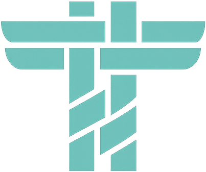
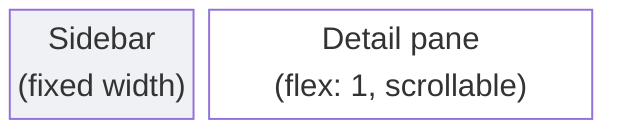
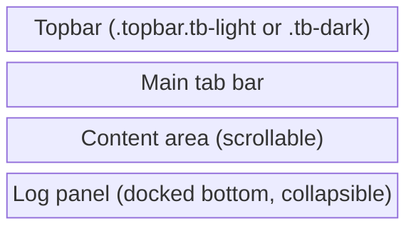

# Tela Design Language (TDL)

The Tela Design Language defines the visual language shared across every product
in the Tela ecosystem: TelaVisor (desktop client), TelaBoard (demo application),
Awan Saya (portal), and any future Tela application. TDL is a specification, not
a suggestion. Applications built on it look and behave like members of the same
family because they share the same primitives, the same interaction rules, and
the same visual contract.

This document is the reference for implementers. A live HTML reference of every
component in both light and dark themes lives at
[cmd/telagui/mockups/tdl-reference.html](cmd/telagui/mockups/tdl-reference.html).
Open it alongside this document to see the primitives in context.

## The four categories

Every interactive or state-bearing element in a TDL application falls into
exactly one of four categories. The categories never share a location, so
their visual styles never compete.

| Category | Where | Invariant signal |
|---|---|---|
| `.btn` | Content area | Elevation (border + drop shadow + fill). |
| `.status` | Content area | Flat inline text with a glyph prefix. |
| `.chrome-btn` | Topbar only | Persistent circular outline. |
| `.brand-link` | Topbar top-left | Cursor, subtle brightness hover, focus ring. |

**Rule of disjoint location.** A `.chrome-btn` in content would be ambiguous
(users could not tell it from a status badge). A `.btn` in the topbar would be
visually loud. A `.brand-link` is a one-of-a-kind element that exists only at
the top-left of the topbar. The four categories never mix locations, which is
what keeps them unambiguous.

**Rule of visible affordance.** Every interactive element must look interactive
without depending on hover. Touch devices cannot hover. Colorblind users cannot
rely on color alone. Elevation, persistent outline, and meaning-carrying glyphs
are the invariants that must carry the signal.

**Rule of no false affordance.** Anything that is not clickable must not look
clickable. No outlined boxes around static labels. No filled pills for
non-interactive state. No `cursor: pointer` on static elements.

## Design tokens

All colors, spacing, and typography are defined as CSS custom properties on
`:root`. Every TDL application copies this block exactly. The theme is applied
by setting `data-theme="light"` or `data-theme="dark"` on `<html>`.

```css
:root {
  /* Light theme — default */
  --bg: #f5f6f8;
  --surface: #ffffff;
  --surface-alt: #f0f1f4;
  --text: #1a1a2e;
  --text-muted: #6b7280;
  --border: #e2e5ea;

  /* Brand */
  --accent: #2ecc71;
  --accent-hover: #27ae60;

  /* Semantic */
  --warn: #f39c12;
  --danger: #e74c3c;
  --danger-hover: #c0392b;

  /* Button surfaces */
  --btn-bg: #ffffff;
  --btn-secondary-hover: #f0f1f4;
  --input-bg: #ffffff;

  /* Elevation */
  --shadow-btn:
    0 1px 0 rgba(0,0,0,0.04),
    0 1px 3px rgba(15,23,42,0.14),
    inset 0 1px 0 rgba(255,255,255,0.85);
  --shadow-btn-primary:
    0 1px 0 rgba(0,0,0,0.08),
    0 1px 3px rgba(39,174,96,0.35),
    inset 0 1px 0 rgba(255,255,255,0.35);
  --shadow-card: 0 1px 3px rgba(15,23,42,0.05);

  /* Shape */
  --radius: 8px;
  --radius-sm: 4px;

  /* Topbar (light variant) is set on the .topbar element itself via
     --tb-* custom properties, not on :root. See the Topbar section. */

  /* Typography */
  --font: -apple-system, BlinkMacSystemFont, "Segoe UI", Roboto, sans-serif;
  --mono: "SF Mono", "Cascadia Code", "Consolas", monospace;
}

[data-theme="dark"] {
  --bg: #111827;
  --surface: #1f2937;
  --surface-alt: #1a2332;
  --text: #e5e7eb;
  --text-muted: #9ca3af;
  --border: #4b5668;
  --btn-bg: #2a3545;
  --btn-secondary-hover: #3a465c;
  --input-bg: #1a2332;
  --shadow-btn:
    0 1px 0 rgba(0,0,0,0.4),
    0 2px 4px rgba(0,0,0,0.35),
    inset 0 1px 0 rgba(255,255,255,0.09);
  --shadow-btn-primary:
    0 1px 0 rgba(0,0,0,0.4),
    0 2px 4px rgba(0,0,0,0.35),
    inset 0 1px 0 rgba(255,255,255,0.25);
  --shadow-card: 0 1px 3px rgba(0,0,0,0.4);
}
```

### Color rules

- **Accent green** (`#2ecc71`) is the brand color. It appears in the logo
  suffix, active states, primary buttons, connected indicators, and the
  "current version" status marker. Accent is theme-invariant: the same green
  reads correctly on light and dark surfaces.
- **Warn amber** (`#f39c12`) is used for in-progress states and "update
  available" markers. Never use amber for success.
- **Danger red** (`#e74c3c`) is used for destructive actions, error messages,
  and the "disconnected" state. Never use red for non-destructive purposes.
- **Text colors** are blue-tinted, not pure gray. `--text` is `#1a1a2e` in
  light mode, `#e5e7eb` in dark. This subtle tint ties the palette together.
- **Borders** are also blue-tinted (`#e2e5ea` light, `#4b5668` dark).

### Theme selection

Applications support three theme modes: light, dark, and system. When the user
selects "system," the application listens to the `prefers-color-scheme` media
query and sets the `data-theme` attribute accordingly. The user's preference is
stored in `localStorage` (key: `theme`) so it persists across sessions.

## Typography

One family for body text (system UI stack), one family for monospace (for code,
version strings, paths, IDs, and terminal output). Font weights are restricted
to 400, 500, 600, and 700. Italic and underline are not used for emphasis.

| Role | Size | Weight | Notes |
|---|---|---|---|
| Page title | 28px | 700 | One per page, `letter-spacing: -0.01em`. |
| Section header | 20px | 700 | Major sections within a page. |
| Card title | 14-15px | 600-700 | Card and modal headers. |
| Group label | 13px | 600 | Uppercase, `letter-spacing: 0.06em`, `--text-muted`. |
| Body | 13px | 400 | Default size for all content. |
| Muted | 12px | 400 | Descriptions, hints. Color via `--text-muted`, never opacity. |
| Monospace | 12px | 400-600 | Version strings, paths, IDs, code, terminal. |

### Annotation text primitives

These classes carry the muted-and-subordinate look that explanatory
copy uses everywhere in TDL: descriptions under headings, loading
placeholders, hints next to controls, empty-state hints. Every one of
them MUST have a top-level CSS rule. A class that lives only as a
scoped descendant rule (`.some-pane .my-class { ... }`) inherits
default body styling outside its scope and renders inconsistently the
moment another pane uses it. Several painful regressions traced back
to exactly this gap; do not reintroduce it.

| Class | Use |
|---|---|
| `.section-desc` | Description paragraph immediately below an h1/h2 page heading. |
| `.hint` | Annotation that sits next to or below a form control. |
| `.empty-hint` | Empty-state message inside a list or sidebar. |
| `.loading` | Transient placeholder shown while a pane waits on data. |
| `.tools-service-label` | Small italic muted label paired with a tool name. |
| `.update-note` | One-paragraph contextual note inside the update overlay. |

The shorthand: if you add `class="something-desc"` or
`class="something-hint"` in markup, add a global CSS rule for it
before committing. Scoped descendant rules layered on top of the
global are fine; the global must exist first.

## Buttons

Every content-area button shares an **elevation invariant**: a 1px border, a
non-zero drop shadow, and a fill that contrasts with the card it sits on. The
elevation signals "raised = pressable" without depending on hover or color
perception.

```css
.btn {
  display: inline-flex;
  align-items: center;
  gap: 6px;
  padding: 6px 14px;
  border-radius: 6px;
  font-size: 13px;
  font-weight: 500;
  font-family: var(--font);
  color: var(--text);
  cursor: pointer;
  border: 1px solid var(--border);
  background: var(--btn-bg);
  box-shadow: var(--shadow-btn);
  transition: background 0.12s, box-shadow 0.08s, transform 0.05s;
  white-space: nowrap;
  -webkit-user-select: none;
  user-select: none;
}
.btn:hover { background: var(--btn-secondary-hover); }
.btn:active {
  transform: translateY(1px);
  box-shadow: inset 0 1px 2px rgba(0,0,0,0.25);
}
.btn:focus-visible { outline: 2px solid var(--accent); outline-offset: 2px; }
.btn:disabled { opacity: 0.4; cursor: not-allowed; transform: none; }

.btn-primary {
  background: var(--accent);
  color: #1f2937;
  border-color: var(--accent-hover);
  font-weight: 600;
  box-shadow: var(--shadow-btn-primary);
}
.btn-primary:hover { background: var(--accent-hover); color: #1f2937; }

.btn-danger {
  background: var(--btn-bg);
  color: var(--danger);
  border-color: var(--border);
}
.btn-danger::before,
.btn-destructive::before {
  content: '\26A0';  /* ⚠ */
  font-size: 13px;
  line-height: 1;
}
.btn-danger:hover { background: var(--danger); color: #fff; border-color: var(--danger); }

.btn-destructive {
  background: var(--danger);
  color: #fff;
  border-color: var(--danger-hover);
  font-weight: 600;
  box-shadow: var(--shadow-btn-primary);
}
.btn-destructive:hover {
  background: var(--danger-hover);
  border-color: var(--danger-hover);
}

.btn-sm { padding: 4px 10px; font-size: 12px; }
.btn-icon {
  padding: 4px 8px;
  font-size: 14px;
  line-height: 1;
  min-width: 28px;
  justify-content: center;
}
```

### Variants

| Class | Role | Where |
|---|---|---|
| `.btn.btn-primary` | Main commit action | Content area. Exactly one per form, modal, or settings card. |
| `.btn` | Default / secondary | Content area. Cancel, Refresh, Logs, Browse, Restart. |
| `.btn.btn-danger` | Initiates destructive action | Content area. Delete, Remove, Revoke. Carries an automatic ⚠ glyph prefix. |
| `.btn.btn-destructive` | Commits irreversible destructive action | Confirmation modals only. Filled red. Carries an automatic ⚠ glyph. |
| `.btn.btn-icon` | Square icon-only button | Content toolbars and list rows. Carries a `title` attribute. |
| `.btn.btn-sm` | Small modifier | Dense contexts: toolbars, row-level actions. |

### Rules

- **One primary per context.** A view, form, or modal has exactly one
  `.btn-primary`. If the design seems to need two, one of them is a secondary
  or a danger.
- **Destructive is confirmation-only.** `.btn-destructive` never appears outside
  a confirmation modal. Its sibling is always a `.btn` labeled "Cancel".
- **Danger is reversible or confirmable.** `.btn-danger` initiates destruction
  but does not commit it. Irreversible actions route through a confirmation
  modal containing a `.btn-destructive`.
- **Icon buttons are uniform size.** Every `.btn-icon` in the same strip has
  the same height so they read as a row of uniform controls. The class sets
  a fixed `min-width` and centered alignment.
- **Toolbars and tab bars use `.btn.btn-sm`.** There is no separate toolbar
  button class. A toolbar's tinted background is what makes it distinct, not
  a special button style.

## Links

Links are the one place in TDL where underline carries meaning. Any text the
user can click must be underlined. This rule is absolute: it applies to web
apps (Awan Saya), to desktop apps (TelaVisor, TelaBoard), to menus, to
modals, and to help text. It does not apply to the brand link, which is the
documented exception.

```css
.link {
  color: var(--accent);
  text-decoration: underline;
  text-decoration-thickness: 1px;
  text-underline-offset: 2px;
  cursor: pointer;
  background: none;
  border: none;
  padding: 0;
  font: inherit;
}
.link:hover {
  color: var(--accent-hover);
  text-decoration-thickness: 2px;
}
.link:focus-visible {
  outline: 2px solid var(--accent);
  outline-offset: 2px;
  border-radius: 2px;
}
.link:visited { color: var(--accent); }

/* Muted link: same underline rule, but with --text-muted color so the
   link is subordinate to surrounding body content. Used for footer
   links, secondary navigation, and metadata cross-references. */
.link-muted {
  color: var(--text-muted);
  text-decoration: underline;
  text-decoration-thickness: 1px;
  text-underline-offset: 2px;
  cursor: pointer;
}
.link-muted:hover {
  color: var(--text);
  text-decoration-thickness: 2px;
}
```

### Rules

- **Every link is underlined.** The underline is visible by default, not only
  on hover. Users must not have to hover to discover that text is clickable.
- **Color is accent or muted, never blue.** Blue hyperlinks are a web
  convention that predates TDL. TDL uses accent green for primary links and
  text-muted for secondary links. Both remain underlined.
- **Hover thickens the underline** from 1px to 2px. Color shifts from
  `--accent` to `--accent-hover`, or from `--text-muted` to `--text`.
- **Focus-visible outline is required.** Links are keyboard-reachable and
  must show a focus ring.
- **No visited color.** Links keep their color regardless of visited state.
  TDL applications do not track link history, and visited-style coloring
  adds visual noise without benefit.
- **Links are not buttons.** A link navigates or reveals. A button commits
  an action. If the element changes application state beyond showing a new
  view or loading new data, it must be a `.btn`, not a `.link`.
- **Brand link is the one exception.** `.brand-link` at the top-left of the
  topbar intentionally omits the underline to preserve the brand mark.
  Every other link on screen is underlined.

## Mode bar

A mode bar is a compact toggle group that switches between top-level
application modes. TelaVisor uses it to switch between "Clients" and
"Infrastructure". Awan Saya uses a similar pattern to switch between user
views and admin views.

Mode bars live in the topbar, not in content. They use an outlined container
(the affordance for "these are interactive options") with a full-width accent
bar flush along the bottom edge of the active segment (the existing TDL
vocabulary for "you are here", already used by the main tab bar's active
indicator). Because mode bars live in the topbar, they inherit the topbar's
chrome context and use topbar-scoped `--tb-*` custom properties.

The active segment is bold, uses `cursor: default`, and carries no button
chrome (no hover fill, no raised appearance). It is unambiguously "you are
here", not "click me". Inactive segments show a hover fill on mouseover to
confirm they are interactive.

```css
.mode-bar {
  display: inline-flex;
  align-items: stretch;
  border: 1px solid var(--tb-chrome-border);
  border-radius: 6px;
  background: var(--tb-chrome-bg);
  padding: 0;
  gap: 0;
  overflow: hidden;
  -webkit-user-select: none;
  user-select: none;
}
.mode-btn {
  position: relative;
  background: none;
  border: none;
  color: var(--tb-chrome-fg);
  font-family: var(--font);
  font-size: 12px;
  font-weight: 500;
  padding: 6px 16px;
  cursor: pointer;
  transition: background 0.12s, color 0.12s;
}
.mode-btn + .mode-btn {
  border-left: 1px solid var(--tb-chrome-border);
}
.mode-btn:hover:not(.active) {
  color: var(--tb-chrome-hover-fg);
  background: var(--tb-chrome-hover-bg);
}
.mode-btn.active {
  color: var(--tb-chrome-hover-fg);
  font-weight: 700;
  cursor: default;
}
.mode-btn.active::after {
  content: '';
  position: absolute;
  left: 0;
  right: 0;
  bottom: 0;
  height: 3px;
  background: var(--accent);
}
.mode-btn:focus-visible {
  outline: 2px solid var(--accent);
  outline-offset: -2px;
}
```

### Rules

- **Topbar-only.** Mode bars appear only in the topbar. Content-area
  navigation uses the main tab bar (`.tab`), not a mode bar.
- **Exactly one active mode.** A mode bar has at least two segments and
  exactly one `.active`. A mode bar with one segment should not exist.
- **Segments are short labels.** One or two words per segment. Icons
  without labels are not allowed because the mode switch is a navigational
  commit, not a compact tool.
- **Active is not a button.** The active segment has `cursor: default`,
  no hover state, no fill, and no button chrome. Only the bold label and
  the 3px accent bar at the bottom edge signal "you are here". This is
  deliberately the inverse of the naive "active = filled button" pattern,
  because a filled button would read as "click me" and confuse the user
  into thinking the mode bar is a toggle they must click repeatedly.
- **Inactive segments are hoverable.** Inactive segments show a subtle
  hover fill (via `--tb-chrome-hover-bg`) so the interactive affordance
  is visible before hover too (the container border alone).
- **No glyph prefixes.** Mode bars do not carry icons or dots. The text
  label alone is the signal.
- **Placement.** Centered in the topbar between the brand link and the
  chrome button strip. When the viewport is narrow, the mode bar may shift
  left-of-center but never wraps to a new line.

## Status badges

Status labels are flat, inline, non-interactive, and always prefixed by a glyph
(colored dot, checkmark, or arrow). The glyph is the primary signal so meaning
survives red-green colorblindness (WCAG 1.4.1). Status elements never have a
border, fill, or elevation.

```css
.status {
  display: inline-flex;
  align-items: center;
  gap: 5px;
  font-size: 11px;
  font-weight: 600;
  text-transform: uppercase;
  letter-spacing: 0.06em;
  background: none;
  border: none;
  padding: 0;
  cursor: default;
  -webkit-user-select: none;
  user-select: none;
}
.status-dot {
  display: inline-block;
  width: 7px; height: 7px;
  border-radius: 50%;
  background: currentColor;
  flex-shrink: 0;
}
.status-online   { color: var(--accent); }
.status-degraded { color: var(--warn); }
.status-error    { color: var(--danger); }
.status-offline  { color: var(--text-muted); }

/* Version status */
.status-current::before  { content: '\2713'; margin-right: 4px; }  /* ✓ */
.status-outdated::before { content: '\2191'; margin-right: 4px; }  /* ↑ */
.status-current  { color: var(--accent); font-family: var(--mono); font-size: 12px; text-transform: none; letter-spacing: 0; font-weight: 600; }
.status-outdated { color: var(--warn);   font-family: var(--mono); font-size: 12px; text-transform: none; letter-spacing: 0; font-weight: 600; }
```

### Version status rule

Apply `.status-current` or `.status-outdated` to the **installed** version only.
The **available** (latest) version is rendered in the default text color with
no status decoration. A user looking at a version pair always sees which side
is the installation and whether it needs updating.

### Chips

Chips are small flat filled pills for neutral metadata tags: counts, platform
labels, region or environment names. Chips explicitly do not convey state — use
`.status` for state.

```css
.chip {
  display: inline-flex;
  align-items: center;
  padding: 1px 7px;
  border-radius: 3px;
  font-size: 10px;
  font-weight: 600;
  color: var(--text-muted);
  background: var(--surface-alt);
  border: none;
  cursor: default;
  -webkit-user-select: none;
  user-select: none;
}
```

Chips have no border. Outlined boxes around text are a web convention for
interactive tags (GitHub labels, Stack Overflow tags); a border would be a
false affordance for non-interactive metadata.

### Status dots

The raw colored-dot primitive. Used when only a status indicator is needed
without a label, typically paired with a name instead.

```css
.dot {
  display: inline-block;
  width: 8px; height: 8px;
  border-radius: 50%;
  flex-shrink: 0;
}
.dot-online   { background: var(--accent); }
.dot-degraded { background: var(--warn); }
.dot-error    { background: var(--danger); }
.dot-offline  { background: var(--text-muted); }
```

When a `.dot` is used alone (without a label), pair it with a `title` attribute
so the meaning is reachable by screen readers.

## Form inputs

All inputs share a common grammar: a 1px border, subtle surface fill, accent
focus ring (3px low-opacity), and a consistent padding scale. Labels appear
above the control except for checkboxes and radios, where the label is to the
right of the control.

```css
.form-input,
.form-select,
.form-textarea {
  padding: 7px 11px;
  font-size: 13px;
  font-family: var(--font);
  background: var(--input-bg);
  color: var(--text);
  border: 1px solid var(--border);
  border-radius: var(--radius-sm);
  width: 100%;
}
.form-input:focus,
.form-select:focus,
.form-textarea:focus {
  border-color: var(--accent);
  outline: none;
  box-shadow: 0 0 0 3px rgba(46,204,113,0.15);
}
.form-input.mono { font-family: var(--mono); font-size: 12px; }
.form-input.invalid { border-color: var(--danger); }
.form-input:disabled { background: var(--surface-alt); color: var(--text-muted); cursor: not-allowed; }

.form-textarea { font-family: var(--mono); min-height: 80px; resize: vertical; }

.form-group {
  display: flex;
  flex-direction: column;
  gap: 5px;
  margin-bottom: 14px;
}
.form-label { font-size: 12px; font-weight: 600; color: var(--text); }
.form-hint  { font-size: 11px; color: var(--text-muted); margin-top: 4px; }
.form-error {
  display: flex;
  align-items: center;
  gap: 5px;
  font-size: 11px;
  color: var(--danger);
  margin-top: 4px;
}
.form-error::before { content: '\26A0'; font-size: 12px; }

.form-check {
  display: inline-flex;
  align-items: center;
  gap: 8px;
  font-size: 13px;
  color: var(--text);
  cursor: pointer;
}
.form-check input[type="checkbox"],
.form-check input[type="radio"] {
  width: 14px; height: 14px;
  accent-color: var(--accent);
  cursor: pointer;
}
```

### Rules

- **Labels above, not beside.** A `.form-label` is always on its own line
  above the control. The one exception is the `.form-check` wrapper for
  checkboxes and radios, where the label sits to the right of the control.
- **Mono for verbatim content.** Use `.form-input.mono` whenever the value
  is something the user copies verbatim: tokens, IDs, paths, version strings.
- **Validation is inline.** When an input fails validation, mark the control
  with `.invalid` and place a `.form-error` immediately below it. The error
  message carries an automatic ⚠ prefix.
- **Focus ring is always visible.** The 3px accent-colored focus ring appears
  on every input on `:focus` (not just `:focus-visible`) because inputs are
  keyboard targets in all contexts.

## Cards

Cards are the primary content container. Surface background, 1px border, 8px
radius, subtle shadow. Cards never nest inside other cards. For visual grouping
inside a card, use `.h3.sub` labels with spacing.

```css
.card {
  background: var(--surface);
  border: 1px solid var(--border);
  border-radius: var(--radius);
  padding: 20px 22px;
  box-shadow: var(--shadow-card);
}
.card-title { font-size: 14px; font-weight: 600; margin: 0; }
.card-desc  { font-size: 12px; color: var(--text-muted); margin: 0 0 14px; }
.card-body  { font-size: 13px; }
.card-footer {
  margin-top: 16px;
  padding-top: 12px;
  border-top: 1px solid var(--surface-alt);
  display: flex;
  justify-content: flex-end;
  gap: 8px;
}

.card-danger { border-color: var(--danger); }
.card-danger .card-title { color: var(--danger); }
.card-danger .card-title::before {
  content: '\26A0\00a0';
  font-size: 14px;
}
```

The `.card-danger` modifier is used for "Danger zone" sections that house
irreversible actions. The red border and ⚠ prefix on the title signal the
content's severity without requiring the user to read the copy first.

## Modals

Modals center on a semi-transparent overlay. The dialog has a header with
title and close button, a body, and an action footer on a tinted background.

```css
.modal-overlay {
  position: fixed;
  inset: 0;
  background: rgba(0,0,0,0.4);
  display: flex;
  align-items: center;
  justify-content: center;
  z-index: 1000;
}
.modal-dialog {
  background: var(--surface);
  border-radius: var(--radius);
  box-shadow: 0 10px 40px rgba(0,0,0,0.3), 0 0 0 1px var(--border);
  width: 440px;
  max-width: 90vw;
  overflow: hidden;
}
.modal-header {
  display: flex;
  align-items: center;
  justify-content: space-between;
  padding: 16px 20px;
  border-bottom: 1px solid var(--border);
}
.modal-header h3 {
  margin: 0;
  font-size: 15px;
  font-weight: 700;
}
.modal-close {
  background: none;
  border: none;
  font-size: 18px;
  color: var(--text-muted);
  cursor: pointer;
  padding: 0 4px;
}
.modal-close:hover { color: var(--text); }
.modal-body { padding: 20px; font-size: 13px; }
.modal-actions {
  display: flex;
  justify-content: flex-end;
  gap: 8px;
  padding: 14px 20px;
  background: var(--surface-alt);
  border-top: 1px solid var(--border);
}
```

### Rules

- **No browser dialogs.** `alert()`, `confirm()`, and `prompt()` are banned.
  Every dialog is a themed modal with the structure above.
- **Two buttons, predictable order.** A confirmation modal has exactly two
  buttons: Cancel on the left, commit action on the right. The commit is
  either `.btn-primary` or `.btn-destructive`, never both in the same modal.
- **Modals capture window chrome.** While any modal is open, native window
  controls (OS title-bar close, Cmd+Q, `beforeunload`) must route through the
  modal's cancel flow first. The application does not dismiss until the modal
  is handled, just like a native OS dialog. Implementations bind the window
  close event while a modal is active and either block the close or
  programmatically trigger the modal's Cancel handler.
- **Modals stack.** When a modal opens a child modal (for example, a "discard
  unsaved changes?" confirmation opened from inside a settings modal), the
  child must render above its parent. Implementations use a shared modal
  stack that assigns ascending z-index per push, or give each nested overlay
  a strictly higher z-index than its parent. A confirmation dialog hidden
  behind its parent is a serious bug: from the user's perspective, clicking
  Cancel appears to do nothing.

## Tables

Tables use uppercase-muted headers, muted row separators, and a hover highlight
on selectable rows. Numeric or identifier columns use the monospace font.

```css
.table {
  width: 100%;
  border-collapse: collapse;
  font-size: 13px;
}
.table th {
  text-align: left;
  font-size: 11px;
  font-weight: 600;
  color: var(--text-muted);
  text-transform: uppercase;
  letter-spacing: 0.06em;
  padding: 10px 12px;
  border-bottom: 1px solid var(--border);
}
.table td {
  padding: 10px 12px;
  border-bottom: 1px solid var(--surface-alt);
}
.table tr:last-child td { border-bottom: none; }
.table tr.selectable { cursor: pointer; }
.table tr.selectable:hover { background: var(--surface-alt); }
.table .mono-col { font-family: var(--mono); font-size: 12px; }
```

## Tabs and toolbars

Tab bars use text buttons with an accent bottom border on the active tab.
Toolbars are containers for content-area command buttons; the buttons
themselves are `.btn.btn-sm` — the same elevation invariant as every other
content button, just smaller.

```css
.tab-bar {
  display: flex;
  align-items: center;
  background: var(--surface-alt);
  border-bottom: 1px solid var(--border);
  padding: 0 16px;
}
.tab {
  background: none;
  border: none;
  padding: 10px 16px;
  font-size: 13px;
  font-weight: 500;
  color: var(--text-muted);
  border-bottom: 2px solid transparent;
  cursor: pointer;
  font-family: var(--font);
}
.tab:hover { color: var(--text); }
.tab.active {
  color: var(--text);
  border-bottom-color: var(--accent);
  font-weight: 600;
}
.tab-sep {
  width: 1px;
  height: 20px;
  background: var(--border);
  margin: 0 8px;
}

.toolbar {
  display: flex;
  align-items: center;
  gap: 6px;
  padding: 8px 12px;
  background: var(--surface-alt);
  border: 1px solid var(--border);
  border-radius: 6px;
}
```

### Rules

- **Tabs are for navigation, toolbars are for actions.** A tab switches the
  active view. A toolbar button operates on the current view's content.
- **Separate the two visually.** Use a `.tab-sep` between the tab group and any
  trailing command buttons so it is clear the commands are not tabs.
- **Toolbars carry `.btn.btn-sm`, not a custom class.** The tinted toolbar
  background differentiates the region; the buttons inside it are regular
  content buttons.

## Sidebar list items

Sidebar items are selectable rows with a left accent border on the active item.
They pair a name (and optional dot, chip, or version status) with a tight hit
area.

```css
.sidebar {
  width: 260px;
  background: var(--surface);
  border: 1px solid var(--border);
  border-radius: 6px;
  overflow: hidden;
}
.sidebar-header {
  padding: 10px 14px;
  font-size: 11px;
  font-weight: 600;
  color: var(--text-muted);
  text-transform: uppercase;
  letter-spacing: 0.08em;
  border-bottom: 1px solid var(--border);
  background: var(--surface-alt);
}
.sidebar-item {
  display: flex;
  align-items: center;
  gap: 8px;
  padding: 10px 14px;
  cursor: pointer;
  border-left: 3px solid transparent;
}
.sidebar-item + .sidebar-item { border-top: 1px solid var(--surface-alt); }
.sidebar-item:hover { background: var(--surface-alt); }
.sidebar-item.active {
  background: var(--surface-alt);
  border-left-color: var(--accent);
}
```

### Rules

- **Sort deterministically.** Lists in the sidebar must have a stable sort
  order, typically alphabetical by display name. A list that reorders on each
  refresh is a bug.
- **Meta on a second line.** Secondary information (version, hostname, tags)
  goes on a second line below the name, not beside it. The tight column makes
  side-by-side layouts hard to read.
- **Selection is a left border.** The active item carries a 3px accent left
  border and a surface-alt background. Never use a full background color for
  selection — it competes with content.

## Topbar

The topbar is the application chrome at the top of the window. It has a true
light variant and a true dark variant. Chrome buttons and the brand mark use
topbar-scoped custom properties (`--tb-*`) so the same markup adapts to either
context. The topbar is the only place where `.chrome-btn` and `.brand-link`
appear.

```css
.topbar {
  padding: 10px 16px;
  display: flex;
  align-items: center;
  justify-content: space-between;
  border: 1px solid var(--border);
  background: var(--tb-bg);
  border-color: var(--tb-border);
}
.topbar.tb-dark {
  --tb-bg: #0f172a;
  --tb-border: #1e293b;
  --tb-brand: #ffffff;
  --tb-chrome-fg: #cbd5e1;
  --tb-chrome-border: rgba(255,255,255,0.28);
  --tb-chrome-bg: rgba(255,255,255,0.04);
  --tb-chrome-hover-fg: #ffffff;
  --tb-chrome-hover-bg: rgba(255,255,255,0.12);
  --tb-chrome-hover-border: rgba(255,255,255,0.5);
}
.topbar.tb-light {
  --tb-bg: #ffffff;
  --tb-border: #d8dce4;
  --tb-brand: #1a1a2e;
  --tb-chrome-fg: #475569;
  --tb-chrome-border: #cbd5e1;
  --tb-chrome-bg: #ffffff;
  --tb-chrome-hover-fg: #0f172a;
  --tb-chrome-hover-bg: #eef0f4;
  --tb-chrome-hover-border: #94a3b8;
}
```

Applications select the topbar variant based on the active theme. In light
mode, use `.topbar.tb-light`; in dark mode, use `.topbar.tb-dark`.

### Brand link

The clickable brand mark in the top-left. This is the deliberate exception to
the "visible non-hover affordance" rule. Web convention has trained users that
a top-left logo goes home, so the click must work — but any button chrome
around the brand mark would destroy it.

```css
.brand {
  display: inline-block;
  font-size: 15px;
  font-weight: 700;
  color: var(--tb-brand);
  letter-spacing: 0.1px;
  white-space: nowrap;
}
.brand em { color: var(--accent); font-style: normal; }
.brand img.brand-logo {
  display: inline-block;
  width: 20px;
  height: 20px;
  vertical-align: -5px;
  margin-right: 8px;
}

.brand-link {
  display: inline-flex;
  align-items: center;
  cursor: pointer;
  text-decoration: none;
  background: none;
  border: none;
  padding: 0;
  font: inherit;
  color: inherit;
  transition: filter 0.15s;
}
.brand-link:hover { filter: brightness(1.15); }
.brand-link:focus-visible {
  outline: 2px solid var(--accent);
  outline-offset: 4px;
  border-radius: 3px;
}
```

The brand is two-tone. The prefix (Tela, Awan) uses `--tb-brand` (dark text on
light topbar, white on dark topbar). The suffix (`<em>Visor</em>`, `<em>Saya</em>`)
stays accent green in both themes.

Markup:

```html
<button class="brand-link" type="button" onclick="goHome()">
  <span class="brand">
    Tela<em>Visor</em>
  </span>
</button>
```

**Rules:**

- **One brand link per application, at the top-left of the topbar.** Never
  anywhere else.
- **No underline on hover.** The brand mark is sacred. Hover is a brightness
  bump only.
- **The click target is per-app.** TelaVisor: go to Status. Awan Saya: go
  home. TelaBoard: go to the demo landing page.
- **Focus outline is required.** The brand link is often the first Tab stop,
  so keyboard users must see a clear focus indicator.

### Chrome buttons

Circular icon-only buttons that live in the topbar. Persistent outlined border
is the affordance — no elevation, no hover dependency.

```css
.chrome-btn {
  width: 30px;
  height: 30px;
  border-radius: 50%;
  border: 1px solid var(--tb-chrome-border);
  background: var(--tb-chrome-bg);
  color: var(--tb-chrome-fg);
  font-size: 14px;
  line-height: 1;
  display: inline-flex;
  align-items: center;
  justify-content: center;
  cursor: pointer;
  transition: background 0.12s, border-color 0.12s, color 0.12s;
}
.chrome-btn:hover {
  background: var(--tb-chrome-hover-bg);
  border-color: var(--tb-chrome-hover-border);
  color: var(--tb-chrome-hover-fg);
}
.chrome-btn:focus-visible { outline: 2px solid var(--accent); outline-offset: 2px; }
.chrome-btn:disabled { opacity: 0.35; cursor: not-allowed; }
.chrome-btn svg { display: block; stroke: currentColor; }

.chrome-btn.chrome-accent {
  border-color: var(--accent);
  color: var(--accent);
}
.chrome-btn.chrome-accent:hover {
  background: rgba(46,204,113,0.15);
  color: var(--accent-hover);
  border-color: var(--accent-hover);
}
.chrome-btn.chrome-danger {
  border-color: var(--danger);
  color: var(--danger);
}
.chrome-btn.chrome-danger:hover {
  background: rgba(231,76,60,0.15);
  color: var(--danger-hover);
  border-color: var(--danger-hover);
}
```

### Rules

- **Topbar only.** A chrome button never appears in content. A content icon
  button never appears in the topbar. This disjointness is what keeps them
  distinguishable.
- **Use inline SVG for glyphs.** Some platforms render Unicode glyphs (⚙, ⚠, 📁)
  as colorful emoji, which breaks the monochrome chrome convention. Inline
  SVGs using `stroke="currentColor"` inherit the correct color in both light
  and dark topbars and render consistently across platforms.
- **Variants are semantic.** Use `.chrome-accent` for primary or active states
  (Connect, Mount folder). Use `.chrome-danger` for Quit. Neutral chrome
  buttons use the base class alone.

## Feedback

### Toasts

Transient notifications that appear briefly at the top of the window. Three
variants: error (default), success, warn. Each carries a glyph prefix.

```css
.toast {
  display: inline-flex;
  align-items: center;
  gap: 8px;
  padding: 10px 16px;
  border-radius: 6px;
  font-size: 13px;
  background: var(--danger);
  color: #fff;
  box-shadow: 0 4px 12px rgba(0,0,0,0.2);
}
.toast::before { content: '\26A0'; font-size: 14px; }
.toast.toast-success { background: var(--accent); color: #1f2937; }
.toast.toast-success::before { content: '\2713'; }
.toast.toast-warn { background: var(--warn); color: #2d1f00; }
```

Toasts auto-dismiss after 3-5 seconds for success and warn. Error toasts
require manual dismissal so the user has time to read and act on the error.

### Empty states

```css
.empty-state {
  padding: 32px 16px;
  text-align: center;
  color: var(--text-muted);
  font-size: 13px;
  background: var(--surface-alt);
  border: 1px dashed var(--border);
  border-radius: 6px;
}
```

An empty state explains what the user sees (or doesn't see) and includes a
pointer to the action the user should take next. An empty sidebar with the
text "No agents registered. Use Generate Agent Code to onboard one." is a
good empty state. An empty sidebar with no text is not.

## Progress and code

```css
.progress {
  background: var(--surface-alt);
  border-radius: 999px;
  height: 6px;
  overflow: hidden;
  width: 100%;
}
.progress-bar {
  background: var(--accent);
  height: 100%;
  transition: width 0.3s;
}

.code-block {
  font-family: var(--mono);
  font-size: 12px;
  background: var(--surface-alt);
  color: var(--text);
  padding: 12px 14px;
  border-radius: 6px;
  border: 1px solid var(--border);
  overflow-x: auto;
  line-height: 1.6;
}
```

Code blocks are for command examples, config snippets, and terminal output.
Simple token highlighting is available via `.tok-comment` (muted), `.tok-kw`
(accent), `.tok-str` (warn) spans.

## Log panel

The log panel is a dockable bottom-of-window container for multi-source log
output. It is TelaVisor-specific in its current implementation but generalizes
to "any docked panel with tabs and a collapse affordance". Tabs behave like
the main tab bar. Individual tabs may be closable. The panel itself collapses
to a single-row header with a label next to the expand chevron.

Every control in the log panel header uses the standard button classes:

- **Tabs** are `.log-panel-tab` (active accent underline, like `.tab`).
- **Attach-source button** (`+`) is `.btn.btn-sm.btn-icon`.
- **Action buttons** (Copy, Save, Clear) are `.btn.btn-sm`.
- **Verbose toggle** is a `.form-check` inline checkbox.
- **Collapse/expand chevron** is `.btn.btn-sm.btn-icon`.

There are no custom button classes inside the log panel. Every interactive
element carries the same elevation invariant as the rest of the application.

### Rules

- **Log timestamps are ISO 8601 UTC.** The client converts to local time
  for display in other views, but raw log output stays in UTC so logs from
  multiple machines line up when cross-referenced.
- **Label next to chevron when collapsed.** When the panel is collapsed to
  its single-row header, a short identifying label (e.g. "Logs") appears
  immediately to the left of the expand chevron.
- **Clearing inline height on collapse.** If the panel's height is ever
  set as an inline style (for example by a resize handle), implementations
  must clear that inline style on collapse so the CSS class rule can apply.

## Dropdown menus

Dropdowns are small floating panels anchored to a trigger button. Used for
user menus, theme pickers, attach-source popovers, and any short list of
options where a full modal would be overkill.

```css
.menu {
  background: var(--surface);
  border: 1px solid var(--border);
  border-radius: 6px;
  box-shadow: 0 8px 24px rgba(0,0,0,0.18), 0 0 0 1px var(--border);
  padding: 6px 0;
  min-width: 200px;
  font-size: 13px;
}
.menu-header {
  padding: 10px 14px 8px;
  border-bottom: 1px solid var(--surface-alt);
  margin-bottom: 4px;
}
.menu-item {
  display: flex;
  align-items: center;
  gap: 10px;
  padding: 7px 14px;
  color: var(--text);
  cursor: pointer;
}
.menu-item:hover { background: var(--surface-alt); }
.menu-item-icon {
  width: 16px;
  display: inline-flex;
  justify-content: center;
  color: var(--text-muted);
  font-size: 13px;
}
.menu-item.active { color: var(--accent); font-weight: 600; }
.menu-item.active .menu-item-icon { color: var(--accent); }
.menu-item.danger { color: var(--danger); }
.menu-item.danger .menu-item-icon { color: var(--danger); }
.menu-sep {
  height: 1px;
  background: var(--surface-alt);
  margin: 4px 0;
}
```

### Rules

- **Menu, not modal, for short choice lists.** Theme picker, sign out, attach
  source. If the interaction collects more than one field or requires
  confirmation, use a modal.
- **Icon column aligns across items.** The 16px `.menu-item-icon` column is
  reserved even on items without icons, so everything lines up.
- **Dismissal is standard.** A menu dismisses on: click outside, Escape key,
  trigger re-click, or selection of an item. The trigger button toggles
  `aria-expanded` for screen readers.
- **Danger items go last.** A destructive menu item (Sign out, Delete account)
  is always the last item in the menu, separated from safe items by a
  `.menu-sep`.

## Layout primitives

### Sidebar + detail

The canonical layout for any view with a selectable list and its detail pane.
The sidebar is a fixed width; the detail pane fills remaining space and
scrolls independently.



### Page structure



The log panel is optional. Applications without log output (Awan Saya, web
pages) omit it entirely.

## Writing style

- Do not use emdash or semicolons.
- Do not use curly quotes. Use straight quotes (`'` or `"`) only.
- Write in a factual, technical style. Do not use marketing language.
- Print only actionable information in UI text. Do not include reassurance
  messages ("Settings saved successfully") or explanations of internal
  mechanics.
- All dates and times in data, logs, and configs are ISO 8601 UTC. The client
  converts to local time for display.

## Scrollbars

Custom scrollbars for WebKit browsers (used in TelaVisor's Wails WebView and
all Chromium-based browsers):

```css
::-webkit-scrollbar { width: 6px; height: 6px; }
::-webkit-scrollbar-track { background: transparent; }
::-webkit-scrollbar-thumb { background: var(--border); border-radius: 3px; }
::-webkit-scrollbar-thumb:hover { background: var(--text-muted); }
```

## Invariant rules

These rules are the soul of TDL. Violations are bugs, not style preferences.

1. **Category separation.** Every interactive or state-bearing element is
   exactly one of: `.btn`, `.status`, `.chrome-btn`, `.brand-link`. Categories
   never share a location.

2. **Color plus glyph redundancy.** Any state information that matters is
   conveyed by both color and shape. Destructive actions carry a ⚠ glyph.
   Current versions carry a ✓. Outdated versions carry a ↑. Status badges
   carry a colored dot. Color alone fails WCAG 1.4.1.

3. **No false affordances.** An element that is not clickable must not look
   clickable. No outlined boxes around static labels, no filled pills for
   non-interactive state, no `cursor: pointer` on non-buttons.

4. **One primary per context.** A view, form, or modal has exactly one
   `.btn-primary`. Confirmation modals have exactly one `.btn-destructive`
   sibling to a Cancel.

5. **ISO UTC everywhere.** All timestamps in data, logs, and configs are
   ISO 8601 UTC. Never store or transmit local time.

6. **No emoji in chrome.** Platforms render Unicode glyphs as colorful emoji.
   Prefer inline SVG for any icon that must render consistently.

7. **Modals capture window chrome.** Native window controls (title-bar close,
   Cmd+Q, `beforeunload`) must route through the active modal's cancel flow
   first.

8. **Modals stack correctly.** Child modals render above their parents.
   A confirmation dialog hidden behind its parent is a serious bug.

9. **Deterministic list order.** Sidebar and list views have a stable sort
   order (typically alphabetical). A list that reorders on each refresh is
   a bug.

10. **No browser dialogs.** `alert()`, `confirm()`, and `prompt()` are banned.
    Every dialog is a themed modal.

11. **Every link is underlined.** Any clickable text must be underlined by
    default, not only on hover. The underline is the universal affordance
    for text links. The brand link is the one exception.

12. **Mode bars live in the topbar only.** Content-area navigation uses the
    main tab bar, never a segmented mode bar.

## Implementation checklist

When building a new TDL application or restyling an existing one:

1. Copy the `:root` and `[data-theme="dark"]` CSS variable blocks exactly.
2. Pick a topbar variant (`.tb-light` or `.tb-dark`) and wire it to the
   active theme.
3. Use `.brand-link` for the top-left logo, with per-app click target.
4. Use `.mode-bar` + `.mode-btn` for top-level mode switching in the topbar.
5. Use `.chrome-btn` for every topbar icon button; use inline SVG glyphs.
6. Use `.btn` family for every content-area button.
7. Use `.link` / `.link-muted` for every clickable text outside the topbar,
   always underlined.
8. Use `.status` family for every state indicator.
9. Use `.chip` for neutral metadata tags (flat filled pills, no border).
10. Use `.form-input`, `.form-select`, `.form-textarea`, and `.form-check`
    for inputs. Wrap in `.form-group` with a label above.
11. Use `.card` for content containers. Use `.card-danger` for danger zones.
12. Use `.modal-overlay` + `.modal-dialog`, never browser dialogs.
13. Implement the modal stack so child modals render above parents.
14. Implement window-close capture so quit is blocked while a modal is open.
15. Apply the scrollbar styles.
16. Follow the writing style rules for all UI text.
17. Open [cmd/telagui/mockups/tdl-reference.html](cmd/telagui/mockups/tdl-reference.html)
    in a browser and verify your implementation matches the reference in
    both light and dark themes.

---

# TDL for the command line

TDL extends beyond graphical interfaces. Tela ships three command-line
binaries (`tela`, `telad`, `telahubd`) that are as much a part of the product
as TelaVisor and Awan Saya. Operators spend as much time in terminals as in
windowed UIs, so the CLI must present the same coherent personality: clear
structure, predictable output, and the same "actionable information only,
no reassurance" voice that governs the GUI.

The rules in this section apply to every Tela CLI binary. New subcommands,
new output, and new flags must conform. Where existing binaries diverge from
these rules, the divergence is a bug to be fixed, not a precedent to preserve.

## Command grammar

Tela CLIs use a two-level grammar: `<binary> <verb> [<subject>] [flags] [args]`.

```
tela connect -profile home
tela admin access grant alice workstation connect
telad service install -config /etc/tela/agent.yaml
telahubd user show-owner -config /etc/tela/hub.yaml
```

### Rules

- **Verbs are lowercase, hyphenated for multi-word.** `show-owner`, not
  `showOwner` or `show_owner`. One word is preferred; `list`, `add`, `remove`,
  `get`, `set`, `update`, `pair`, `connect`, `status`, `login`, `logout`.
- **Subject nesting is allowed when the verb operates on a resource.**
  `tela admin access grant ...` is grammatically `admin` (namespace) +
  `access` (resource) + `grant` (action). Nested grammar is used only when
  the namespace groups multiple related resources. If there is only one
  resource, flatten: `telad update`, not `telad self update`.
- **Flags follow the verb.** Global flags before the verb are not supported.
  Every flag belongs to a specific subcommand's `flag.FlagSet`.
- **Flags may appear after positional arguments.** Implementations must use
  the shared `permuteArgs` helper so that
  `tela admin access grant alice workstation -expires 30d` parses the same
  as `tela admin access grant -expires 30d alice workstation`. The helper
  lives in `internal/cliutil`.
- **Boolean flags are single-form.** `-v` enables verbose. `-dry-run`
  enables dry run. There is no `--no-v` or `-v=false`. If the inverse
  matters, use a second named flag.
- **Short and long forms are not provided.** There is only one form per
  flag. `-v` is the only verbose flag; there is no `--verbose`. This keeps
  help text shorter and tab completion unambiguous.
- **Env vars mirror flags for non-secret values.** Every flag that controls
  connection target, profile, or configuration has an equivalent
  `TELA_*` / `TELAD_*` / `TELAHUBD_*` environment variable. Flag takes
  precedence over env; env takes precedence over built-in default.

### Verb vocabulary

These verbs have fixed meanings across all three binaries. Do not repurpose.

| Verb | Meaning |
|---|---|
| `status` | Print current state, read-only. |
| `list` | List items of a kind, read-only, table output. |
| `get` | Retrieve a single item by identifier, read-only. |
| `add` | Create a new item. |
| `remove` | Delete an item. Paired with confirmation or `-force`. |
| `set` | Update a property on an existing item. |
| `update` | Self-update the binary from its release channel. |
| `pair` | Interactive first-time registration of a machine or hub. |
| `login` | Store credentials in the local credstore. |
| `logout` | Remove credentials from the local credstore. |
| `connect` | Establish a session. |
| `service` | Install or manage the binary as an OS service. |
| `version` | Print the binary's version string. |
| `help` | Print help text. |

## Help text

Help is the CLI's own documentation. It must be complete enough that a user
never has to leave the terminal to understand what a command does.

### Invocation

Every binary responds to:

- `<binary>` alone (no arguments) — print top-level help and exit 0.
- `<binary> help` — same as above.
- `<binary> -h` or `<binary> --help` — same as above.
- `<binary> <verb> -h` or `<binary> <verb> --help` — print that verb's help
  and exit 0.

`-h` on a subcommand is a recognized flag, not a parse error. Implementations
must call `fs.BoolVar(&showHelp, "h", false, ...)` on every FlagSet or use the
shared help wiring in `internal/cliutil`.

### Format

```
<binary> <verb> — one-line description

USAGE
  <binary> <verb> [<subject>] [flags] [args]

DESCRIPTION
  Paragraph form. Explain what the command does, what it reads from, what
  it writes to, and any precondition. No more than 5-6 lines.

FLAGS
  -flag-name <type>   Description. Default: <default>.
  -another-flag       Description.

EXAMPLES
  <binary> <verb> simple-case
  <binary> <verb> -flag-name value complex-case

SEE ALSO
  <binary> <related-verb>, <binary> <related-verb-2>
```

### Rules

- **One-line summary first.** The top line is the verb name plus a single
  sentence description. This is what top-level `<binary> help` lists.
- **Sections are in fixed order.** USAGE, DESCRIPTION, FLAGS, EXAMPLES,
  SEE ALSO. Omit sections that do not apply. Do not invent new sections.
- **Examples are concrete and runnable.** Not `tela connect -hub <url>`.
  Yes `tela connect -hub owlsnest.parkscomputing.com -machine dev-vm`.
- **Flag column is aligned.** Use `text/tabwriter` or equivalent so all
  flag descriptions start at the same column.
- **No marketing language.** Do not write "easily connect to your hub".
  Write "Connect to a hub and open a session."
- **Help goes to stdout on success, stderr on error.** `tela help` exits 0
  and prints to stdout. `tela unknown-verb` exits 1 and prints the
  top-level help to stderr with an error line on top.

### Shared helper

A shared help renderer lives in `internal/cliutil`. Subcommands declare their
help as a struct literal:

```go
var connectHelp = cliutil.Help{
    Summary:     "Connect to a hub and open a session.",
    Usage:       "tela connect [flags]",
    Description: `Opens a WireGuard tunnel to the specified machine and binds local ports to the services exposed by the agent.`,
    Examples: []string{
        "tela connect -hub owlsnest.parkscomputing.com -machine dev-vm",
        "tela connect -profile home",
    },
    SeeAlso: []string{"tela status", "tela machines", "tela services"},
}
```

The helper formats sections, aligns flags, and handles both `-h` and the
`help <verb>` form uniformly.

## Output

The CLI has three output streams: stdout for data the user requested, stderr
for diagnostic logs, and stderr for errors. They are never interleaved on
the same stream.

### Stream discipline

- **stdout** — the result of the command. A list of machines, a status
  report, a created token, a JSON document. Must be pipeable and parseable.
- **stderr (diagnostic)** — `log.Printf` output with ISO 8601 UTC timestamps
  and component prefixes. Routed through `internal/telelog`. Used for
  async operations, reconnect attempts, state changes.
- **stderr (error)** — the final `Error: <message>` line printed just
  before exit. Exit code is non-zero.

A command that prints nothing to stdout and exits 0 has succeeded silently.
Do not print "Done." or "Success." Silence is the success signal.

### Success output

- **No reassurance messages.** `Credentials stored for owlsnest` is wrong.
  The command succeeded; the exit code says so. If the user wants
  confirmation, they can run `tela status`.
- **Tables use `text/tabwriter`.** Column headers are uppercase, separated
  by tabs, with two-space padding. Alignment is left for identifiers and
  strings, right for numeric counts.
  ```
  MACHINE        STATUS     SERVICES             SESSION
  dev-vm         online     ssh, rdp             abc123
  work-laptop    online     rdp, git             def456
  ```
- **Table headers use the same uppercase-muted convention as GUI tables.**
  Identifiers, versions, paths, and token strings use the monospace
  convention visually when terminals support it (they always do; monospace
  is the default).
- **Timestamps are ISO 8601 UTC.** Same rule as GUI logs. Never print
  local time, never print relative time ("3 minutes ago") as the only
  form. Relative time may be added as a trailing parenthetical hint but
  the UTC stamp is always the authoritative value.
- **Structured output is opt-in via `-json`.** Every command that produces
  tabular output also supports `-json` for a machine-readable shape.
  The JSON shape is stable; the table layout is for humans only and may
  change.

### Error output

- **Format:** `Error: <short description>` to stderr, one line, no trailing
  period. Unwrap the error chain and print only the outermost message
  unless `-v` is set (then print the full chain).
- **Exit codes:**
  - **0** — success.
  - **1** — runtime error (network, permission, not found, etc.).
  - **2** — usage error (unknown flag, missing required argument,
    invalid argument format). Pair with help text printed to stderr.
  - **3** — configuration error (config file missing, credential store
    inaccessible, schema mismatch).
  - Other codes are reserved; do not invent new ones.
- **Error messages are actionable.** `Error: hub not found` is insufficient.
  `Error: hub "owlsnest" not found in credential store — run "tela login"` is
  actionable.
- **No stack traces by default.** Stack traces are for panics, not user
  errors. A panic is a bug report; a handled error is a message.
- **Suggestions on unknown verbs.** When a verb is misspelled, suggest the
  nearest match using Levenshtein distance:
  ```
  Error: unknown command "conect"
  Did you mean: connect?
  ```

### Color and glyphs

Tela CLI output is monochrome by default. The design does not use color for
state signaling because terminals vary wildly in palette, background, and
colorblind-friendliness, and pipes to `grep` and `awk` strip color anyway.

- **Glyph redundancy over color.** The same `✓` / `↑` / `⚠` glyphs used in
  the GUI also appear in CLI output for version status, update status, and
  warnings:
  ```
  tela       ✓ v0.7.0-dev.20
  telad      ↑ v0.7.0-dev.18  (update available: v0.7.0-dev.20)
  telahubd     not installed
  ```
  The glyph is the primary signal; if the terminal supports color, color
  is added as a reinforcement.
- **Color is opt-in.** Add color only when `stdout` is a TTY (`isatty`) and
  the environment variable `NO_COLOR` is not set (per the
  [no-color.org](https://no-color.org) convention).
- **Use at most three colors.** Accent (green, `\033[32m`) for "good" or
  "current". Warn (yellow, `\033[33m`) for "update" or "degraded". Danger
  (red, `\033[31m`) for errors. No background colors. No bold. Reset after
  every colored token.
- **A `-no-color` flag overrides both TTY detection and `NO_COLOR`.** It is
  the escape hatch for scripts that want predictable output regardless of
  environment.

### Progress indication

- **No spinners.** Spinners do not pipe cleanly and are unreadable in logs.
  For operations that take more than two seconds, print progress lines to
  stderr with ISO timestamps:
  ```
  2026-04-11T03:22:01Z connecting to owlsnest.parkscomputing.com...
  2026-04-11T03:22:03Z wireguard handshake complete
  2026-04-11T03:22:03Z local port 10022 -> dev-vm:22
  ```
- **Long operations print start, key milestones, and end.** Not every
  packet, not every retry, not every heartbeat. Verbose output is behind `-v`.

## Logging vs output

The CLI follows the same split as the rest of Tela:

- **`log.Printf` → telelog → stderr** for operational diagnostics. ISO UTC
  timestamps, bracketed component prefix, machine-readable by `grep` and
  log aggregators.
- **`fmt.Printf` → stdout** for command results. No timestamps, no
  component prefix, formatted for humans.

The two never mix. A command that needs to tell the user "I am connecting"
uses `log.Printf`, not `fmt.Printf`. A command that returns data the user
requested uses `fmt.Printf`, not `log.Printf`. Piping `tela machines | awk ...`
must never include diagnostic noise on stdout.

### Verbose and quiet

- **`-v`** enables verbose diagnostic logging to stderr. Idempotent;
  passing it twice does not enable debug.
- **There is no `-q` / `--quiet`.** The default is already quiet. Commands
  do not print chatter unless asked.
- **No log levels.** Diagnostic logging is binary: on or off. If a message
  is worth printing, it is worth printing whenever `-v` is set.

## Configuration and credentials

- **Config file discovery order:** `-config` flag > binary-specific env var
  (`TELA_CONFIG`, `TELAD_CONFIG`, `TELAHUBD_CONFIG`) > auto-detect in
  the binary's standard path > built-in defaults.
- **Credentials:** looked up from the local credstore (user-level for
  `tela`, system-level for `telad` and `telahubd`) by hub URL. Flag
  `-token` and env `TELA_TOKEN` override lookup.
- **Never print credentials to stdout.** Even on success. `tela login`
  echoes nothing. `tela token show` (if it exists) prints the token only
  when `-reveal` is passed explicitly.

## Interactive prompts

- **Use sparingly.** A well-designed CLI accepts its input via flags,
  env vars, or files. Prompts are a fallback for interactive setup.
- **Only `pair` and `login` prompt.** `tela pair` prompts for the
  verification code. `tela login` prompts for the token when
  `-token` is not given and stdin is a TTY.
- **Password / token input is masked.** Use `golang.org/x/term.ReadPassword`
  (which already lives in the Go standard library's extended module). Never
  echo the token as the user types it.
- **Confirmation prompts use `y/N` (capital default).** Destructive
  commands without `-force` prompt:
  ```
  This will permanently delete token tk_01K8ABYZ. Continue? [y/N]:
  ```
  The default is No. An empty response is treated as No. `-force` skips
  the prompt entirely.
- **No prompts when stdin is not a TTY.** A command that requires input but
  is run in a script must fail with a usage error, not hang waiting for
  input that will never come.

## Harmonization across binaries

The three binaries must present the same personality. Current divergences
that violate this rule are:

1. **Help text length.** `tela` help is 80+ lines, `telahubd` help is 44.
   Target: all three produce help of comparable depth for comparable
   complexity.
2. **Subcommand nesting.** `tela admin` uses two-level nesting; `telahubd
   user` and `telahubd portal` are top-level with action suffixes. Pick
   one pattern per binary and apply it consistently.
3. **`-config` handling.** `telahubd` infers from a default path,
   `telad` requires the flag, `tela` does not use the flag at all. The
   service binaries (`telad`, `telahubd`) should both default to their
   standard path and accept `-config` as an override.
4. **`-h` support.** Currently relies on `flag.ExitOnError` default
   behavior. Every binary should explicitly bind `-h` on every FlagSet
   via `internal/cliutil`.
5. **Exit codes.** All errors currently exit 1. Introduce the 1/2/3 split
   (runtime / usage / config) across all three.

These are tracked as harmonization work items, not design questions. The
spec above is the target; the current binaries are being brought into line
with it.

## Implementation checklist for a new CLI command

1. Create a `FlagSet` via `cliutil.NewFlagSet("<binary> <verb>")` so `-h`
   is wired and help rendering is shared.
2. Declare a `cliutil.Help{}` struct with summary, usage, description,
   examples, and see-also.
3. Call `cliutil.PermuteArgs(args)` before parsing so flags can appear
   after positional arguments.
4. Parse flags with `fs.Parse(permuted)`. Handle `-h` by printing help
   and returning nil.
5. Validate arguments before any side effects. Missing or malformed
   arguments return a usage error (exit code 2).
6. Emit diagnostic progress via `log.Printf` on stderr. Emit the result
   via `fmt.Printf` on stdout.
7. Support `-json` if the output is tabular.
8. Support `-v` if the operation is long or has interesting intermediate
   state.
9. On error, print `Error: <message>` to stderr and return the
   appropriate exit code.
10. Add the verb to the binary's top-level help one-line list.

