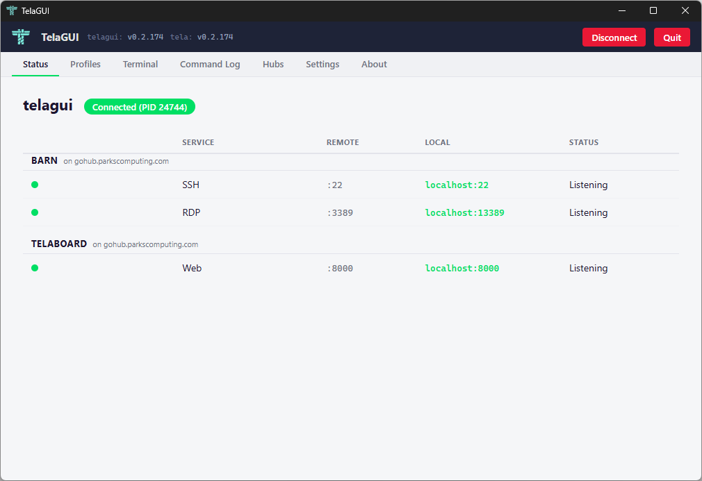
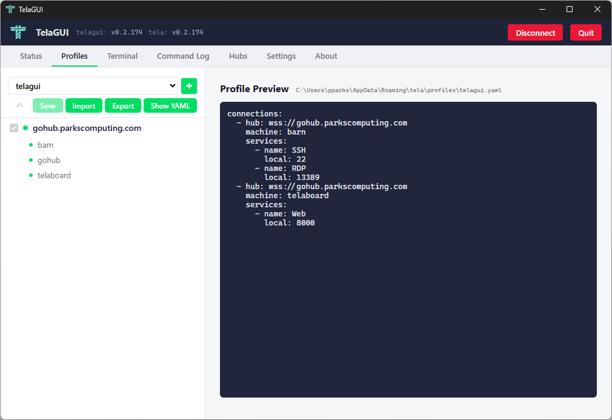
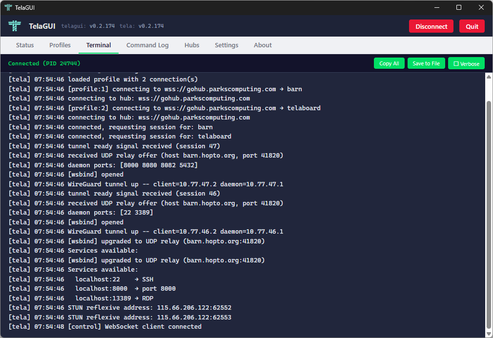
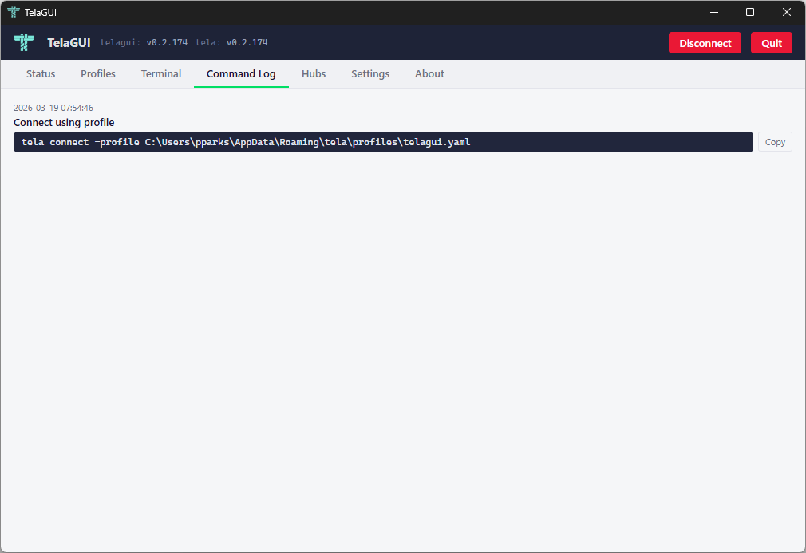
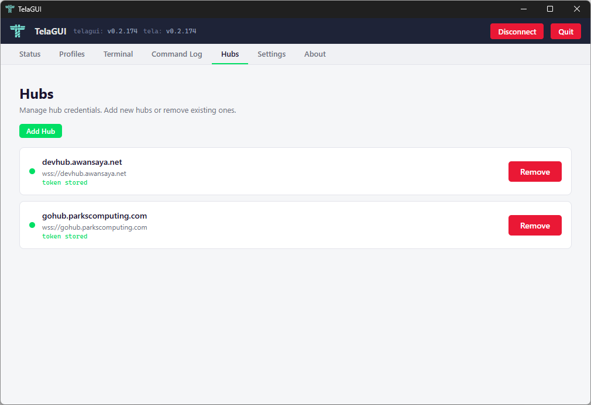
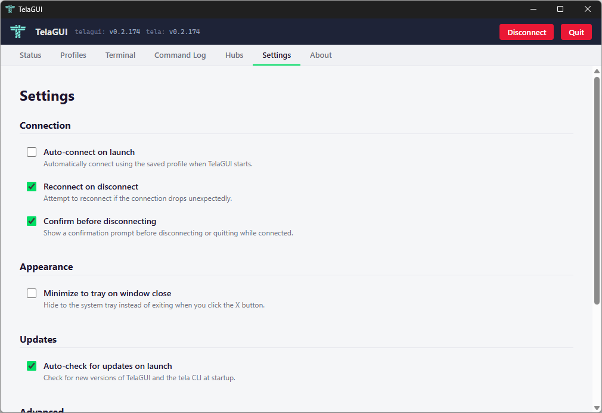

# TelaGUI

TelaGUI is a desktop client for Tela. It wraps the `tela` command-line tool in a graphical interface, handling connection profiles, hub credentials, and real-time tunnel status without requiring terminal access.

TelaGUI runs on Windows, Linux, and macOS. It is built with [Wails v2](https://wails.io/), using Go for the backend and plain JavaScript for the frontend.

## What TelaGUI does

TelaGUI manages the full lifecycle of connecting to remote services through Tela hubs:

1. **Store hub credentials.** Add hubs by URL and token, or use a one-time pairing code. Credentials are stored in the same credential store that `tela login` uses.
2. **Select services.** Browse machines registered on each hub, see which are online, and check the services you want to connect to.
3. **Connect with one click.** TelaGUI saves your selections as a connection profile, launches `tela connect -profile`, and monitors the process.
4. **Monitor tunnel status.** The Status tab shows each selected service with its remote port, local port, and current state (Not connected, Listening, or Active with connection count). Status updates arrive in real time over tela's WebSocket control API.
5. **Manage multiple profiles.** Create, rename, delete, import, and export profiles. Each profile is a standalone YAML file compatible with `tela connect -profile`.

## Tabs

### Status



Displays the current connection state and a table of all selected services grouped by machine. Each row shows:

- **Service** -- the service name (e.g., SSH, RDP, Web)
- **Remote** -- the port on the remote machine (e.g., :22)
- **Local** -- the localhost address bound by tela (e.g., localhost:22)
- **Status** -- Not connected, Listening (port bound, no active tunnels), or Active (with a count of open connections)

Status indicators update in real time via tela's WebSocket control API. When you connect to a service (e.g., `ssh localhost -p 50022`), the status changes from Listening to Active. When you disconnect, it returns to Listening.

The top bar shows the profile name, connection state (Disconnected or Connected with PID), and action buttons (Connect/Disconnect, Quit). Version numbers for both TelaGUI and the tela CLI are displayed in the header.

### Profiles



The Profiles tab is where you configure what to connect to.

The left sidebar lists hubs and their machines. Hub-level checkboxes control whether a hub's machines are included in the profile. When a hub is unchecked, its machines are hidden and excluded from the profile. Selecting a machine in the sidebar shows its available services in the detail pane with checkboxes.

When no machine is selected, the detail pane shows a live YAML preview of the profile that will be saved. The preview includes the profile's file path and updates as you make changes.

**Toolbar buttons:**

- **Undo** (arrow icon) -- reverts all unsaved changes back to the last saved state
- **Save** -- saves the current selections to the profile YAML file. Disabled when there are no unsaved changes. Enables when you check or uncheck a service or hub.
- **Import** -- import a profile YAML file
- **Export** -- export the current profile to a file
- **Show YAML** -- toggle the YAML preview in the detail pane

**Profile management:**

- The dropdown at top selects the active profile
- The **+** button creates a new profile
- Right-click a profile in the dropdown to rename or delete it

When tela is connected, hub and machine checkboxes are disabled to prevent profile changes during an active session.

### Terminal



Live output from the `tela` process. This is the same output you would see running `tela connect -profile` in a terminal.

**Toolbar buttons:**

- **Copy All** -- copy the entire terminal output to the clipboard
- **Save to File** -- save the terminal output to a text file
- **Verbose** -- toggle verbose logging. When enabled, tela outputs additional detail about tunnel negotiation, transport upgrades, and WebSocket activity.

The terminal header shows the connection state (Disconnected or Connected with PID).

### Command Log



Records the CLI commands that TelaGUI executes. Each entry shows a timestamp, a description, and the exact command. Use the Copy button to reproduce any operation in a terminal.

### Hubs



Add and remove hub credentials. Each hub card shows:

- Hub display name (derived from the URL)
- Full WebSocket URL (e.g., `wss://gohub.parkscomputing.com`)
- Online status (green dot when reachable)
- Whether a token is stored

Click **Add Hub** to enter a hub URL and token manually, paste a one-time pairing code, or extract a token from a local Docker container running telahubd.

Click **Remove** to delete a hub's stored credentials. This does not affect the hub itself, only the local credential store.

### Settings



Settings are organized into sections:

**Connection:**

- **Auto-connect on launch** -- automatically connect using the saved profile when TelaGUI starts
- **Reconnect on disconnect** -- attempt to reconnect if the connection drops unexpectedly
- **Confirm before disconnecting** -- show a confirmation prompt before disconnecting or quitting while connected

**Appearance:**

- **Minimize to tray on window close** -- hide to the system tray instead of exiting when you click the X button

**Updates:**

- **Auto-check for updates on launch** -- check for new versions of TelaGUI and the tela CLI at startup

**Advanced:**

- **Verbose logging by default** -- enable verbose output whenever tela connects
- **CLI path** -- shows where the tela binary is located

Settings take effect immediately and persist across restarts.

### About

Version information, project links, license, and dependency credits.

## System tray

When minimizing to the system tray is enabled, closing the window hides TelaGUI to the notification area instead of quitting. Left-click or double-click the tray icon to show the window. Right-click for a menu with Show and Quit options.

## Automatic updates

TelaGUI checks GitHub releases for new versions. If an update is available, a button appears in the top bar (e.g., "Restart to Update (v0.2.174)"). Clicking it downloads the update and restarts TelaGUI with the new version. The tela CLI binary is updated independently and stored in the platform's local application directory.

If TelaGUI was installed via a package manager (winget, Chocolatey, apt, brew), the self-update button is hidden. Use the package manager to update instead.

## Building from source

TelaGUI requires [Wails v2](https://wails.io/docs/gettingstarted/installation) and its prerequisites (Go 1.24+, Node.js, platform WebView2/webkit2gtk).

```bash
cd cmd/telagui
wails build
```

The output binary is in `cmd/telagui/build/bin/`.

For development with live reload:

```bash
cd cmd/telagui
wails dev
```

## How TelaGUI works with tela

TelaGUI does not implement tunneling itself. It manages connection profiles and launches the `tela` CLI as a subprocess. The relationship:

1. TelaGUI writes a profile YAML file with your selected hubs, machines, services, and local port assignments.
2. TelaGUI runs `tela connect -profile <path>` as a child process.
3. tela opens a local control API (HTTP + WebSocket on a random localhost port with a random token).
4. TelaGUI connects to tela's control WebSocket to receive real-time events (`service_bound`, `tunnel_activity`, `connection_state`).
5. When you click Disconnect, TelaGUI signals the tela process to shut down gracefully.

The profile YAML that TelaGUI writes is the same format documented in [REFERENCE.md](REFERENCE.md). You can use it interchangeably with the CLI.

## Profile storage

Profiles are stored in the user's application data directory:

| Platform | Path |
|----------|------|
| Windows | `%APPDATA%\tela\profiles\` |
| Linux | `~/.tela/profiles/` |
| macOS | `~/.tela/profiles/` |

Each profile is a YAML file (e.g., `telagui.yaml`). The default profile is named `telagui`.

## Configuration

Settings are stored in `telagui-settings.yaml` alongside the profiles directory. Settings take effect immediately and persist across restarts.
