# TelaVisor

TelaVisor is a desktop client for Tela. It wraps the `tela` command-line tool in a graphical interface for managing connections, hubs, agents, and credentials without requiring terminal access.

TelaVisor runs on Windows, Linux, and macOS. It is built with [Wails v2](https://wails.io/), using Go for the backend and plain JavaScript for the frontend.

TelaVisor establishes the [Tela Design Language (TDL)](TELA-DESIGN-LANGUAGE.md), the visual language shared across all Tela products. The top bar, mode toggle, tab bar, toolbar separators, icon buttons, modals, and color system defined in TelaVisor are the reference implementation for TDL.

## What TelaVisor does

TelaVisor manages the full lifecycle of connecting to remote services through Tela hubs:

1. **Store hub credentials.** Add hubs by URL and token, or use a one-time pairing code. Credentials are stored in the same credential store that `tela login` uses.
2. **Select services.** Browse machines registered on each hub, see which are online, and check the services you want to connect to.
3. **Connect with one click.** TelaVisor saves your selections as a connection profile, launches `tela connect -profile`, and monitors the process.
4. **Monitor tunnel status.** The Status view shows each selected service with its remote port, local port, and current state. Status updates arrive in real time over tela's WebSocket control API.
5. **Manage hubs.** View hub settings, manage tokens, configure per-machine access, view connection history, generate pairing codes, view remote logs, and update or restart hub binaries from Infrastructure mode.
6. **Manage agents.** View agent details, services, file share configuration, push config changes through the hub-mediated management protocol, view remote logs, and update or restart agent binaries from the Agents tab.
7. **Manage multiple profiles.** Create, rename, delete, import, and export profiles. Each profile is a standalone YAML file compatible with `tela connect -profile`.
8. **Browse remote files.** The built-in file browser provides Explorer-style access to file shares on connected machines through the encrypted tunnel.

## Layout

TelaVisor uses a two-mode layout:

- **Clients** -- for connecting to remote services (Status, Profiles, Files, Client Settings)
- **Infrastructure** -- for administering hubs, agents, remotes, and credentials (Hubs, Agents, Remotes, Credentials)

You switch between modes using the toggle in the center of the title bar. Each mode has its own tab bar. A persistent, collapsible log panel at the bottom of the window displays output from all sources.

The title bar also contains a connection status icon, a file manager button, an information button, an update indicator, a settings button, and a quit button.

TelaVisor supports light and dark themes. The theme can be set to Light, Dark, or System (follows OS preference) in Application Settings.

## Clients mode

### Status

The Status tab shows the current connection state and lists all selected services grouped by machine. When disconnected, the service indicators are grey and status reads "Not connected." When connected, each service shows whether it is listening for connections or actively tunneling traffic.

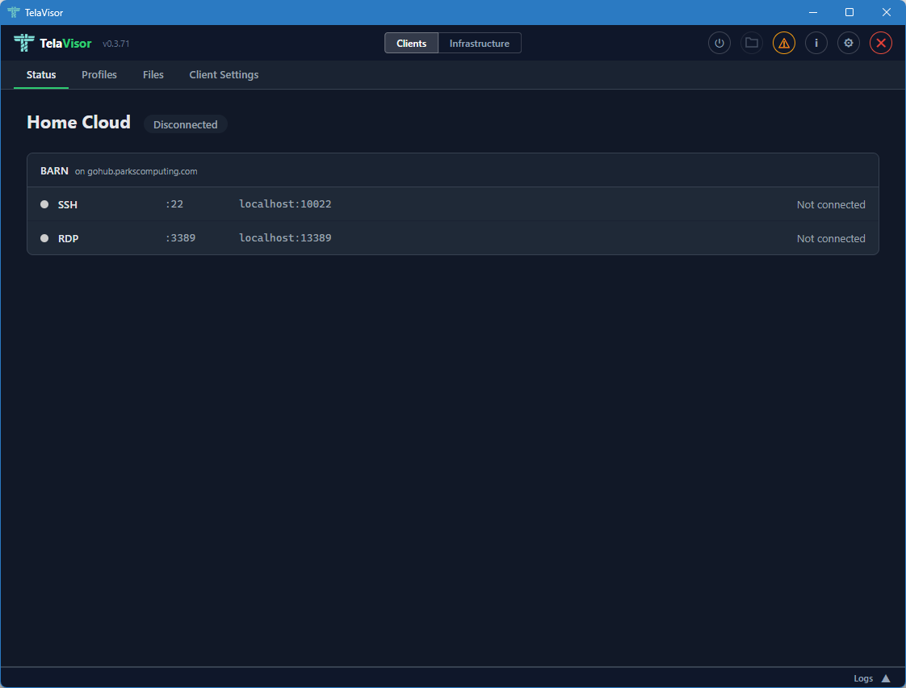

Each service card shows:

- A status indicator dot (grey when disconnected, green when listening or active)
- The service name (e.g., SSH, RDP)
- The remote port on the target machine (e.g., :22)
- The local address bound by tela (e.g., localhost:10022)
- The connection status (Not connected, Listening, or Active with a connection count)

Status indicators update in real time via tela's WebSocket control API. When you connect to a service (for example, `ssh localhost -p 10022`), the status changes from Listening to Active. When the session ends, it returns to Listening.

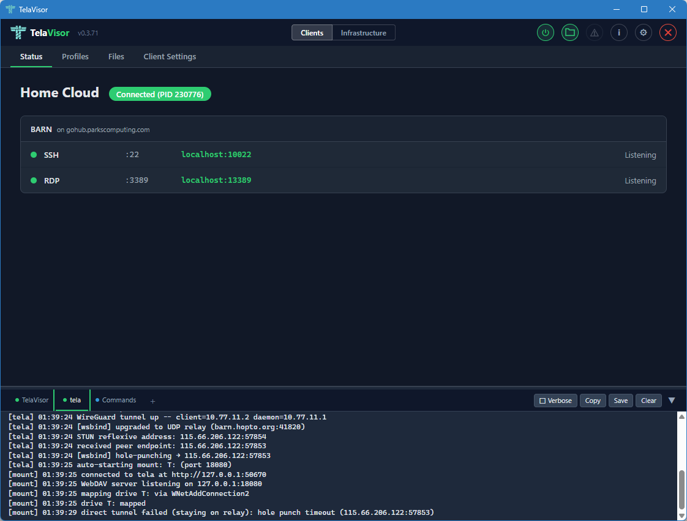

The profile name and connection state (Disconnected or Connected with PID) appear at the top of the page.

### Profiles

The Profiles tab is where you configure which hubs, machines, and services to include in a connection profile. A toolbar below the tab bar provides all profile management controls in one consistent row.

The toolbar contains:

- **Profile dropdown** -- selects the active profile
- **Undo** -- reverts unsaved changes to the last saved state
- **Save** -- saves the current selections to the profile YAML file. The button is disabled when there are no changes.
- **New** -- creates a new profile
- **Delete** -- deletes the current profile (with confirmation)
- **Import** -- imports a profile YAML file from disk
- **Export** -- exports the current profile to a file

The left sidebar lists hubs and their machines. Hub-level checkboxes control whether a hub's machines are included in the profile. The sidebar also provides a Profile Settings entry and a Preview entry.

**Profile Settings** shows profile-level configuration: the profile name, mount settings (drive letter, port, auto-mount on connect), and MTU override.

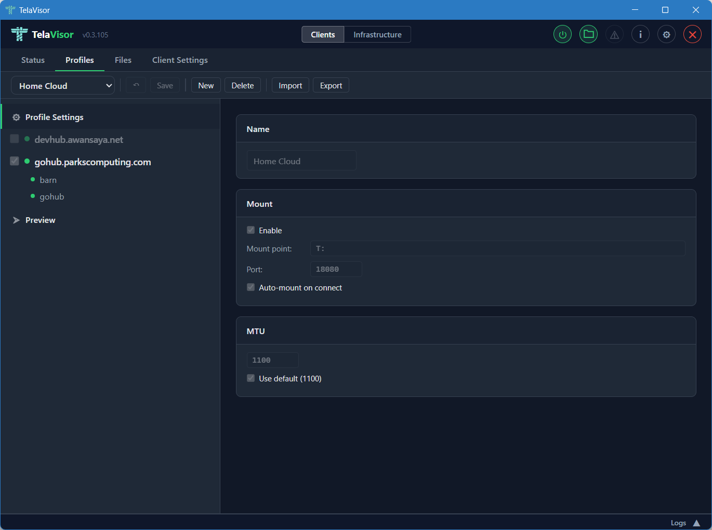

Clicking a hub in the sidebar shows a summary card with machine counts, online status, and selected service counts. Clicking a machine shows its available services with checkboxes and local port assignments. Selected services are included in the connection profile.

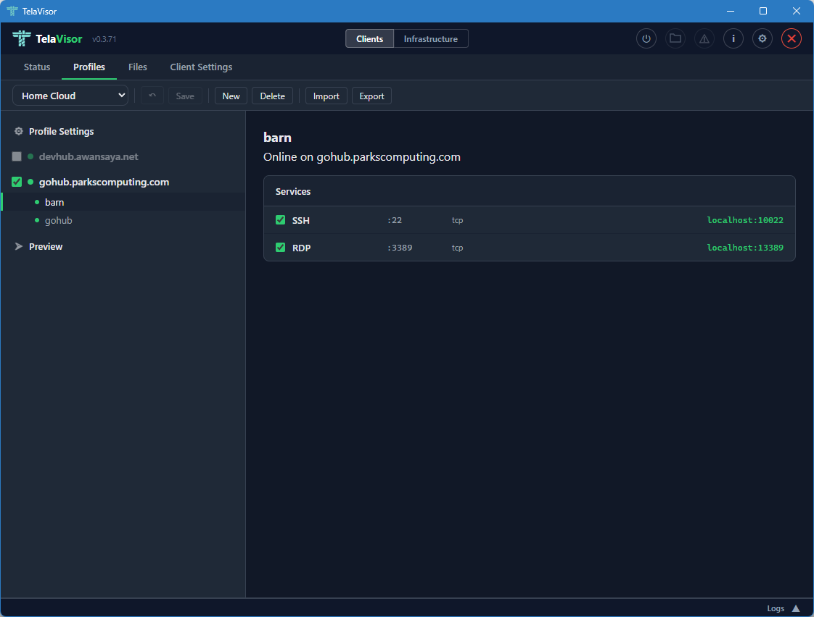

Clicking Preview shows a live YAML preview of the profile with the file path displayed in the header. The YAML preview fills the available vertical space and scrolls independently.

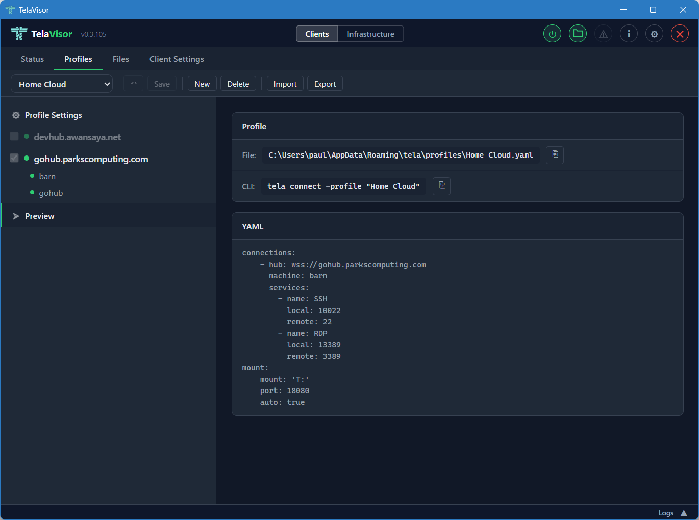

When tela is connected, hub and machine checkboxes are disabled to prevent profile changes during an active session.

### Files

The Files tab provides a built-in file browser for machines with file sharing enabled. It operates through the encrypted WireGuard tunnel. No SSH or SFTP is required on the remote machine.

When you open the Files tab while connected, it shows a list of connected machines with their file sharing status (writable, delete-allowed, max file size, and blocked file types).

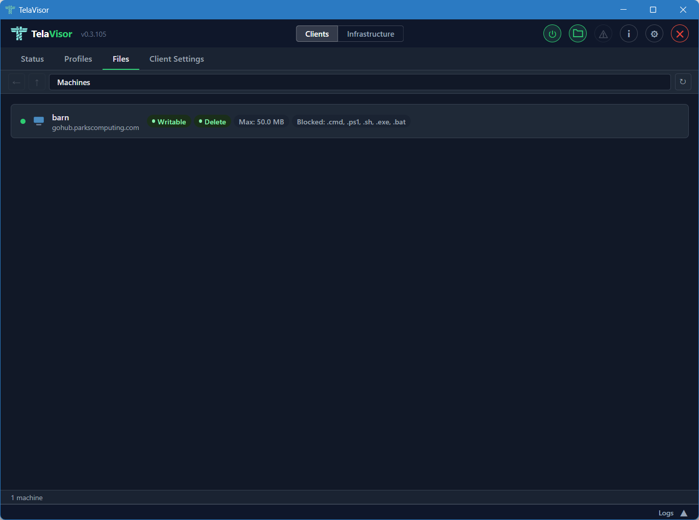

Click a machine to browse its shared directory. The file browser uses an Explorer-style layout:

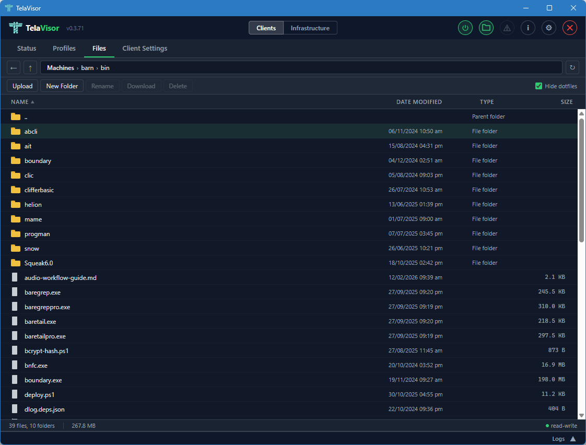

- **Address bar** with back and up navigation buttons, and a clickable breadcrumb path. Each segment is clickable.
- **Action bar** with Upload, New Folder, Rename, Download, and Delete buttons. Buttons are disabled based on selection state and read-only status. A "Hide dotfiles" toggle controls visibility of dot-prefixed files and directories.
- **File list** with Name, Date Modified, Type, and Size columns. Folders appear first, sorted alphabetically. Columns are sortable.
- **Status bar** showing file and folder counts, total size, and read-write or read-only mode.

Selection follows standard conventions:

- Click to select a single item
- Ctrl+click to toggle individual items (multi-select)
- Shift+click for range selection
- Double-click a file to download it
- Double-click a folder to open it

Drag and drop is supported on writable shares. Drag files or folders onto a folder to move them. If the dragged item is part of a multi-selection, all selected items move together. The drop target folder highlights with a dashed outline.

The file list updates in real time. When files are created, modified, deleted, or renamed on the remote machine (by any process, not just TelaVisor), the changes appear automatically.

### Client Settings

The Client Settings tab provides configuration for how tela runs on the local machine. A toolbar at the top provides Undo and Save buttons that are enabled when changes are pending.

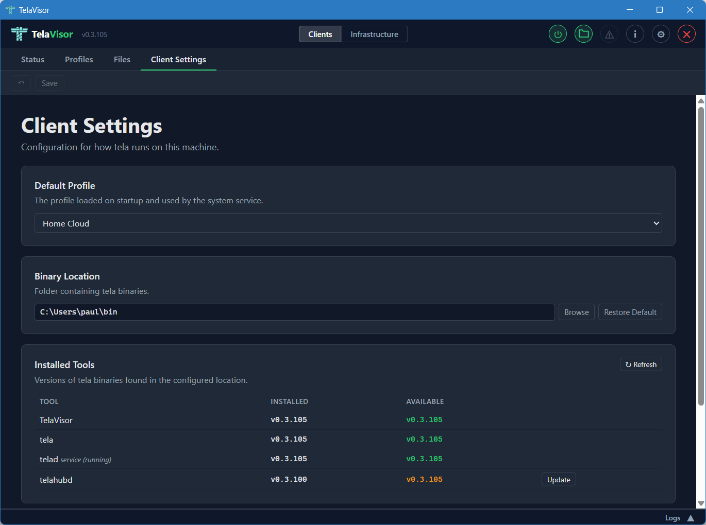

The tab contains the following sections:

**Default Profile** -- selects which profile loads at startup and is used by the system service.

**Binary Location** -- controls where TelaVisor looks for managed binaries (tela, telad, telahubd). The default is the platform's local application directory. You can use Browse to select a different folder, or Restore Default to reset.

**Installed Tools** -- shows the version of each binary (TelaVisor, tela, telad, telahubd) alongside the version available on the client's configured release channel. Binaries that are out of date show an Update button; missing binaries show an Install button. The "Available" column reflects whichever channel TelaVisor itself is configured to follow (set in Application Settings → Updates → Release channel), so a TelaVisor on dev compares against `dev.json` and a TelaVisor on stable compares against `stable.json`. Every download is verified against the channel manifest's SHA-256 before being written to disk. A Refresh button re-checks all versions.

When telad or telahubd is installed as a managed OS service, the Installed Tools row shows `service (running)` or `service (stopped)` next to the binary name and the Update button delegates to the elevated service process to perform the swap (TelaVisor itself does not need to be elevated). After the service restarts against the new binary, the table polls the on-disk version until it changes, so the Installed column reflects the actual installed version with no guesswork.

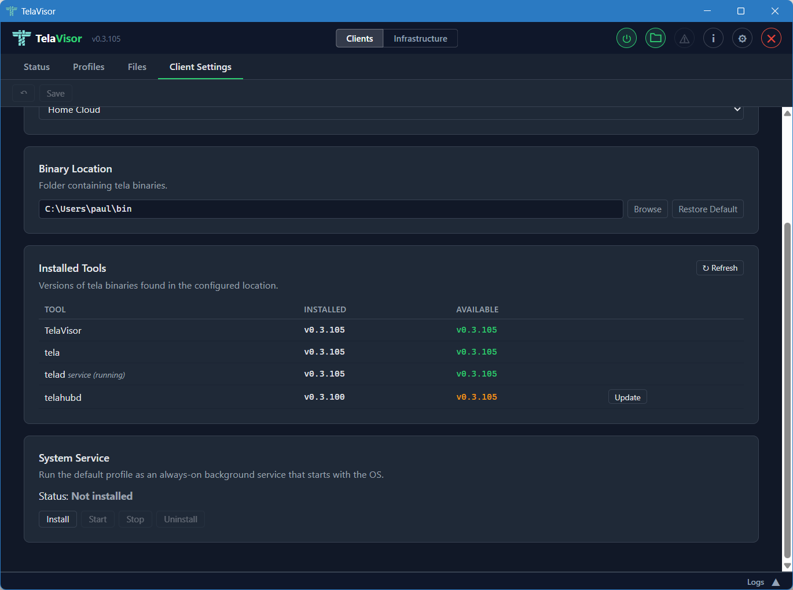

**System Service** -- allows installing and managing the tela system service, which runs the default profile as an always-on background service that starts with the OS. Buttons for Install, Start, Stop, and Uninstall are enabled based on the current service state.

## Infrastructure mode

Infrastructure mode provides administration for hubs, agents, remotes, and credentials.

### Hubs

The Hubs tab provides full administration for any hub where you have owner or admin credentials. Select a hub from the dropdown in the sidebar, then navigate between views using the sidebar navigation: Hub Settings, Machines, Access, Tokens, and History.

#### Hub Settings

The Hub Settings view shows connection details, hub metadata, portal registrations, lifecycle controls, and destructive actions for the selected hub.

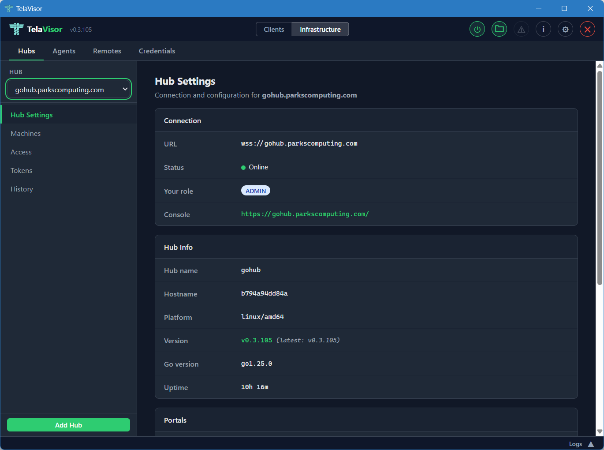

The Connection section shows the hub URL, online status, your role, and a link to the hub's web console. The Hub Info section displays the hub name, hostname, platform, version, Go version, and uptime, all retrieved from the hub's `/api/status` endpoint.

The Version row shows a live indicator: green with `(latest: vX.Y.Z)` when the hub is current, amber with `update available: vX.Y.Z` when behind. The "available" version comes from the hub's own release channel manifest, so a hub running on the dev channel is compared against `dev.json`, a hub on stable against `stable.json`, and so on.

The Portals section lists registered portal associations. The Management section provides hub lifecycle controls (visible to owners and admins):

- **Log output** -- View Logs opens a new log panel tab streaming the hub's recent log buffer
- **Release channel** -- a dropdown showing the hub's currently configured channel (`dev`, `beta`, or `stable`) with a status string showing the current and latest versions on that channel. Changing the dropdown opens a confirmation dialog and, on confirm, sends `PATCH /api/admin/update` to the hub to switch its channel persistently. The Software button below updates immediately to reflect the new channel's HEAD. If the hub is too old to support channels (returns HTTP 405 for the new endpoint), the row hides itself and the Software button shows `pre-channel build (update first via legacy path)`.
- **Software** -- shows whether the hub is up to date or behind the channel's HEAD; the button label reads either `Up to date` (disabled) or `Update to vX.Y.Z` (active). Clicking it asks the hub to download the new release, verify it against the channel manifest's SHA-256, replace its binary, and restart. Progress is shown inline (`Hub is downloading update and restarting...`, `Waiting for hub to restart... (1)`, `Updated to vX.Y.Z`) and the page re-renders when the hub comes back online. The label and disabled state are derived from the channel manifest, not from the GitHub `/releases/latest` API, so a hub on dev cannot be told to "update to v0.5.0" (the stable HEAD).
- **Restart** -- requests an immediate graceful restart of the hub process

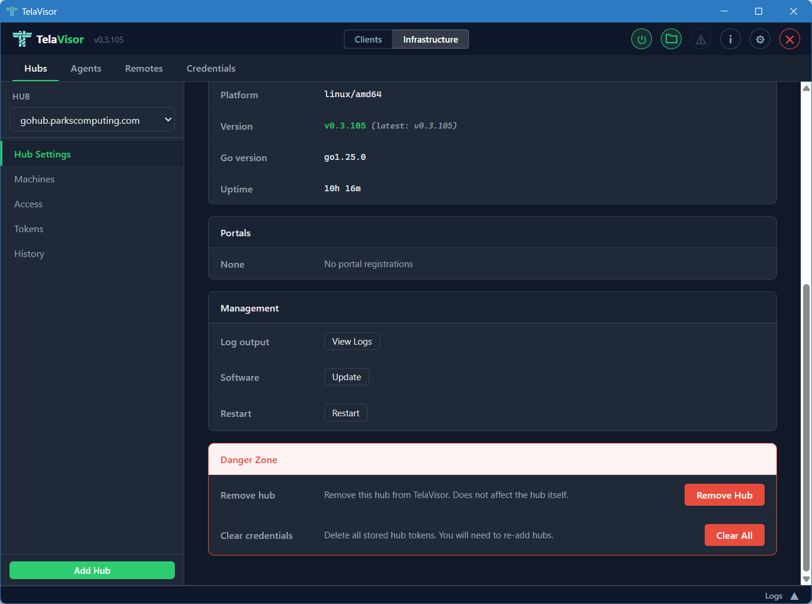

The Danger Zone at the bottom provides destructive actions: removing the hub from TelaVisor (which does not affect the hub itself) and clearing all stored hub tokens from the local credential store.

Hub Settings views for hubs running newer or older release versions look identical -- only the version badge color and the Software button label change to reflect the running version.

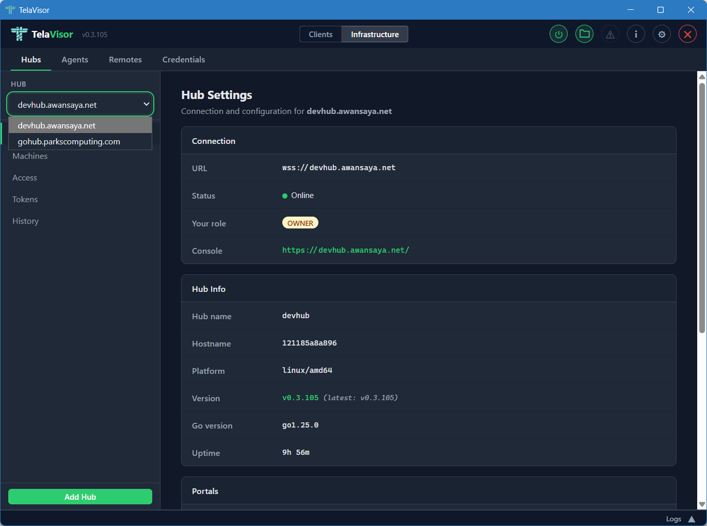

You can add a new hub by clicking the Add Hub button in the sidebar footer.

#### Machines

The Machines view lists all machines registered on the selected hub with their online status, last-seen timestamp, advertised services, and active session count.

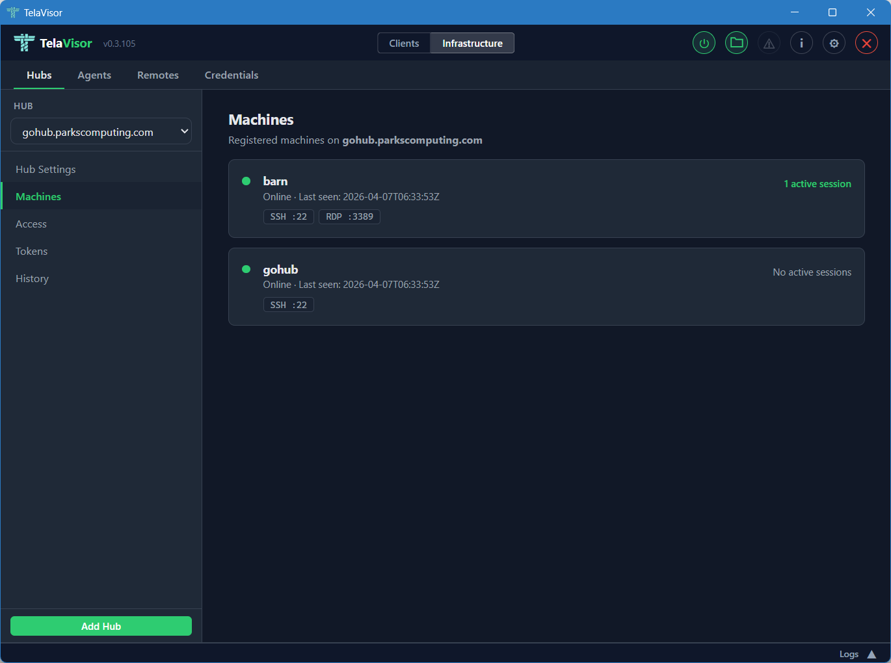

#### Access

The Access view (formerly ACLs) shows the unified per-identity, per-machine permission model. Each identity is a card showing its role pill (owner, admin, user, viewer), token preview, and the machines it has permissions on. Owner and admin roles have implicit access to all machines.

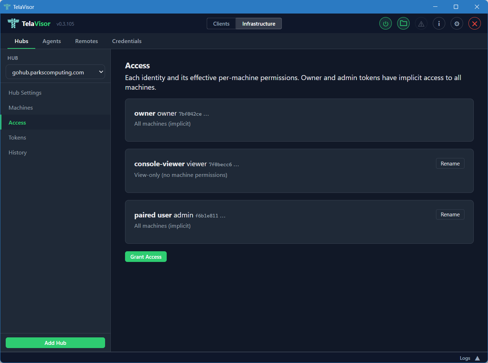

The Grant Access button at the bottom opens a dialog that lets you grant Connect, Register, or Manage permissions to any identity on any machine. A wildcard ACL (`*`) applies to all machines when present. Register access is single-assignment: only one identity can register a given machine. Manage access controls who can view and edit agent configuration, view logs, and restart or update agents remotely.

#### Tokens

The Tokens view lets you manage authentication tokens for the selected hub. You can create new identities, rotate tokens, delete identities, and generate one-time pairing codes.

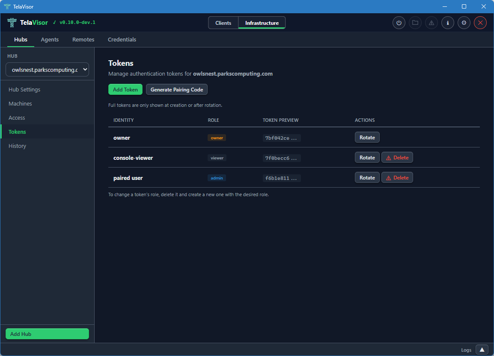

Token previews show the first 8 characters. Full tokens are only visible at creation time or immediately after rotation. To change a token's role, delete the identity and create a new one with the desired role.

The Add Token dialog lets you create a new identity with a chosen role (owner, admin, user, viewer):

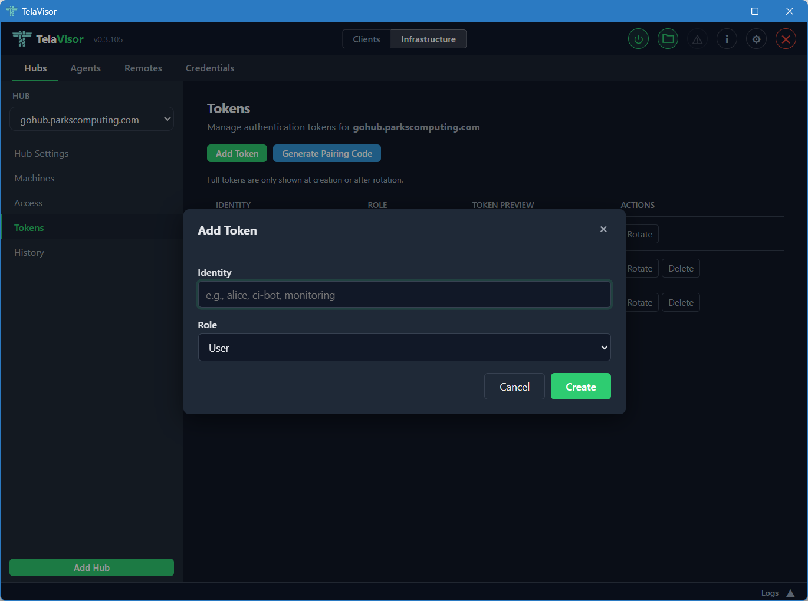

The Generate Pairing Code dialog issues a short-lived, single-use code (e.g., `ABCD-1234`) that can be exchanged for a permanent token by running `tela pair` or by pasting it into TelaVisor's pairing flow. Codes are configurable for role and expiration window (10 minutes to 7 days).

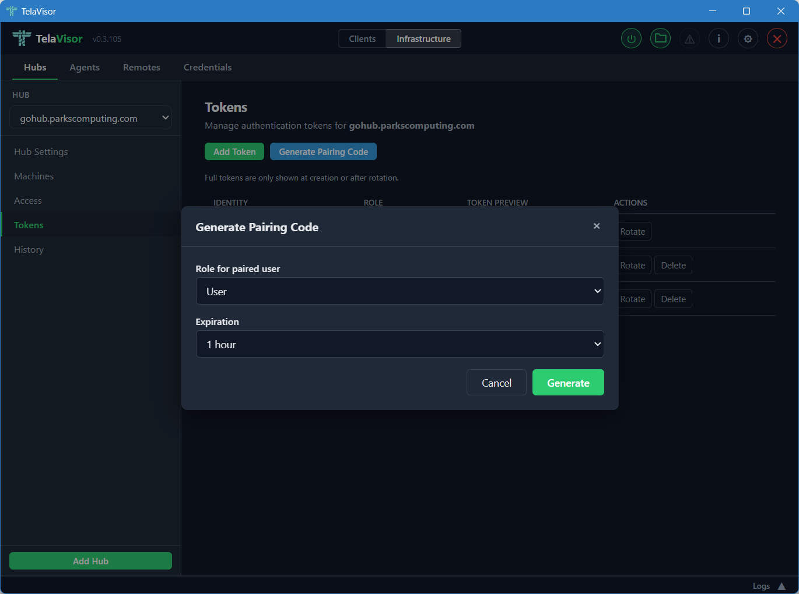

#### History

The History view shows recent session events on the selected hub (agent registrations, client connections, disconnections).

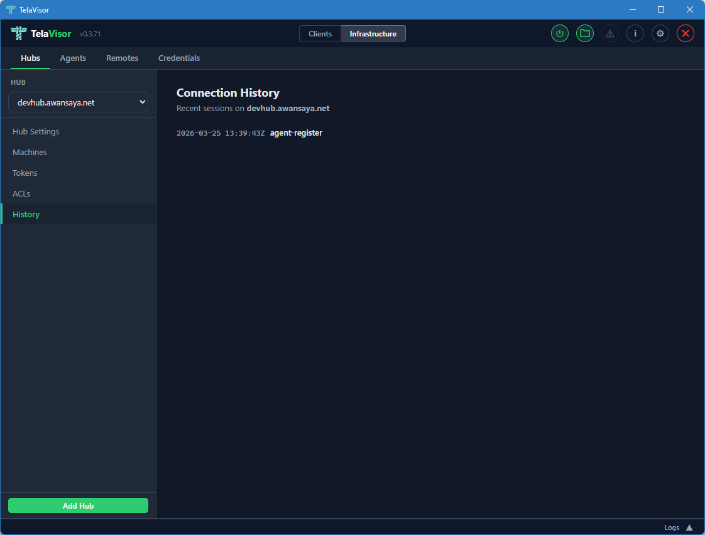

### Agents

The Agents tab lists all agents (telad instances) visible across your configured hubs without requiring an active tunnel connection. The sidebar shows each agent with its online status, version, and the hub it is registered with. Selecting an agent displays its details. A toolbar above the detail provides Undo, Save, Restart, and Logs buttons.

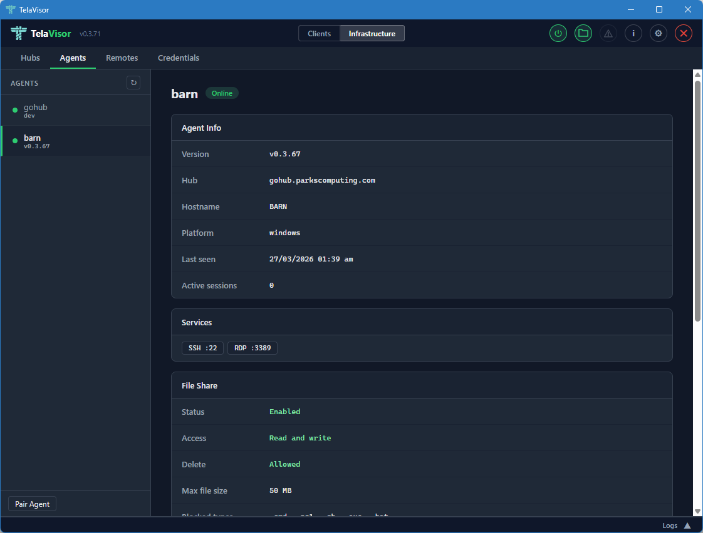

The agent detail view shows several setting cards:

- **Agent Info** -- read-only metadata reported by the agent at registration: version (with up-to-date badge), hub, hostname, platform, last seen time, and active session count
- **Display Name** -- editable: human-readable name shown in dashboards
- **Tags** -- editable: comma-separated metadata tags for filtering
- **Location** -- editable: physical or logical location
- **Services** -- the ports and protocols the agent exposes (e.g., SSH :22, RDP :3389)
- **File Share** -- editable: enable/disable, writable, allow delete, max file size, blocked extensions

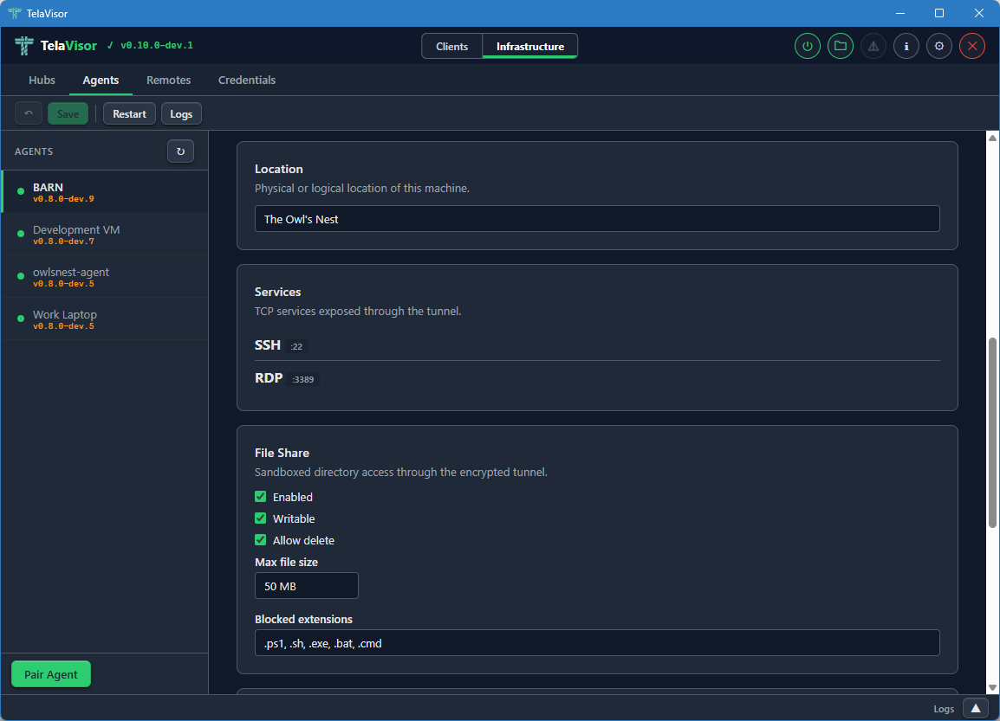

- **Management** -- the lifecycle controls section, available when you have manage permission on the machine
- **Danger Zone** -- force-disconnect the agent or remove the machine from the hub

The Management card mirrors the hub Management card layout:

- **Configuration** -- View Config opens the agent's running configuration in a dialog
- **Log output** -- View Logs opens a new log panel tab and fetches the agent's recent log buffer through the hub's mediated management protocol
- **Release channel** -- a dropdown showing the agent's currently configured channel (`dev`, `beta`, or `stable`) with a status string showing the current and latest versions on that channel. Changing the dropdown opens a confirmation dialog; on confirm, TelaVisor sends the `update-channel` mgmt action through the hub-mediated proxy to switch the agent's channel persistently. Pre-channel agents (telad versions that don't recognize the action) hide the row and show `pre-channel build (update first via legacy path)` next to the Software button.
- **Software** -- shows whether the agent is up to date or behind the channel's HEAD. Label, title, and disabled state are derived from the channel manifest (via the agent's `update-status` mgmt action), so an agent on dev never gets offered a stable build. Clicking Update sends the existing `update` mgmt action to the agent, which downloads the new release, verifies it against the channel manifest's SHA-256, atomically swaps its binary, and either exits (under a service manager) or relaunches itself (when running standalone).
- **Restart** -- requests a graceful agent restart

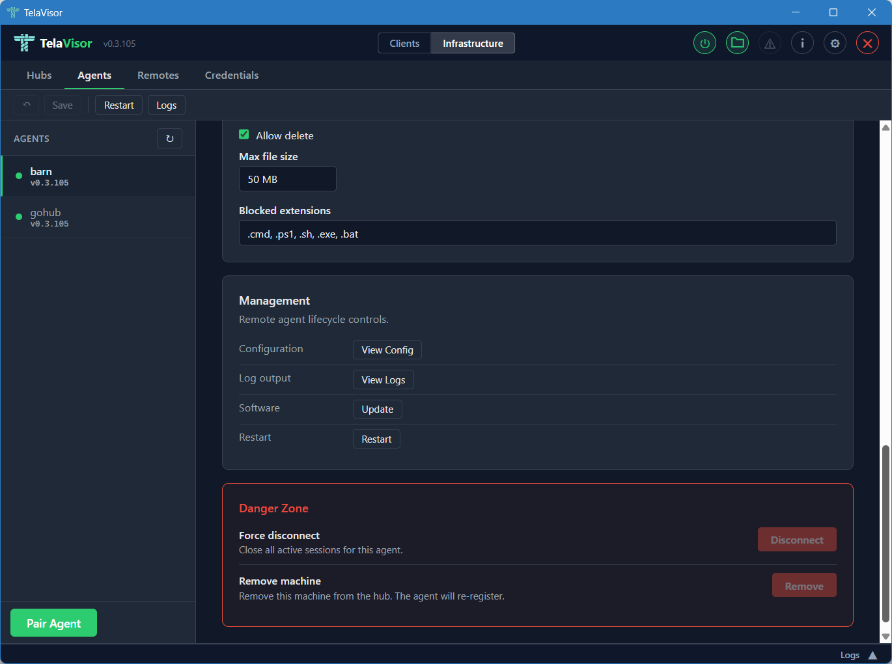

Editable fields are pushed to the agent through the hub-mediated management protocol when you click Save. The agent validates and persists changes to its config file. Manage permission is required (owner/admin roles have it by default; user-role tokens need an explicit manage grant via the Access view).

When telad runs as an OS service (Windows SCM, systemd, launchd) the same Update and Restart actions work because telad detects that it is running under a process manager and exits cleanly, letting the manager restart the binary. This avoids leaving orphan processes from a self-spawned restart.

### Remotes

The Remotes tab manages hub directory endpoints for short name resolution. This is equivalent to the `tela remote` CLI command. Each remote maps a name to a portal URL that provides hub discovery.

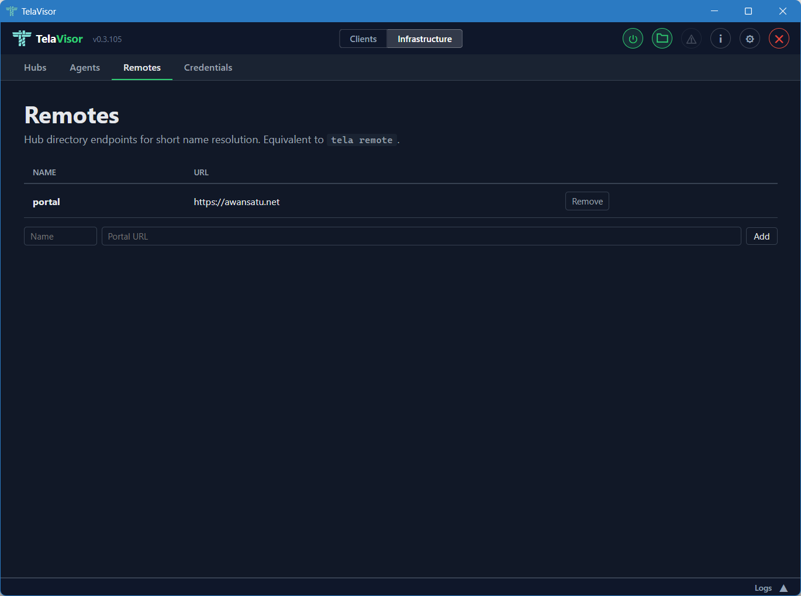

### Credentials

The Credentials tab shows all hub tokens stored in the local credential file. This is equivalent to `tela login` / `tela logout`. Each entry shows the hub URL and identity name, with a Remove button to delete individual credentials and a Clear All button to remove everything.

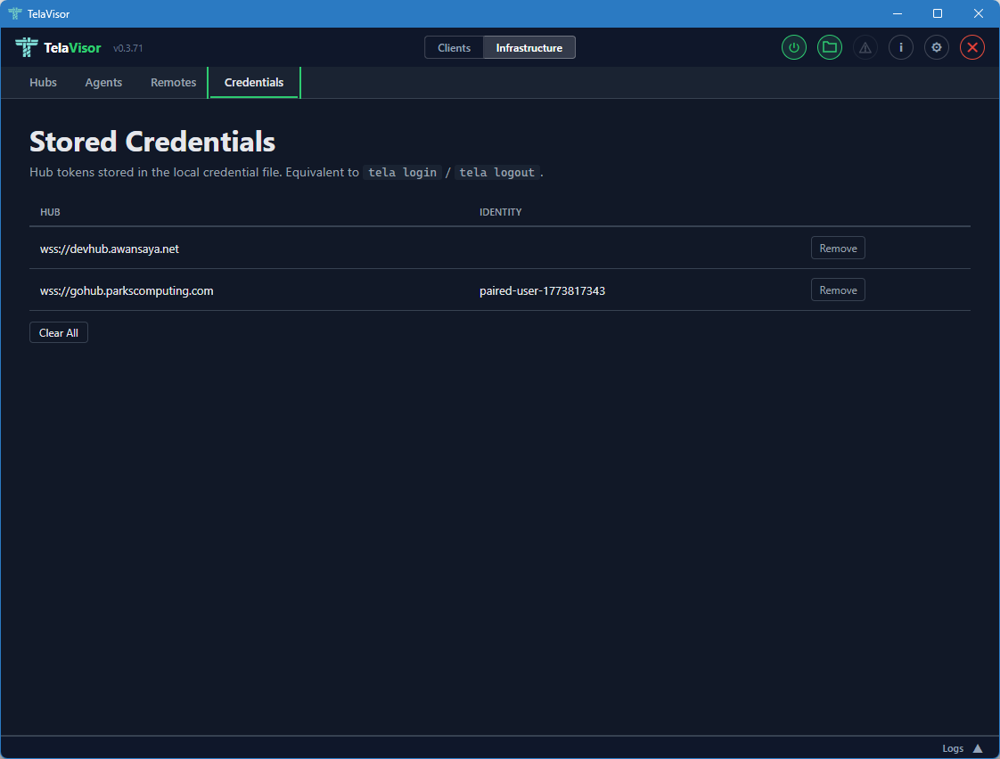

## Log panel

The log panel is a persistent area at the bottom of the window that provides tabbed log output visible across all modes. You can resize it by dragging its top edge, or collapse it to a slim bar showing only a "Logs" label and expand chevron.

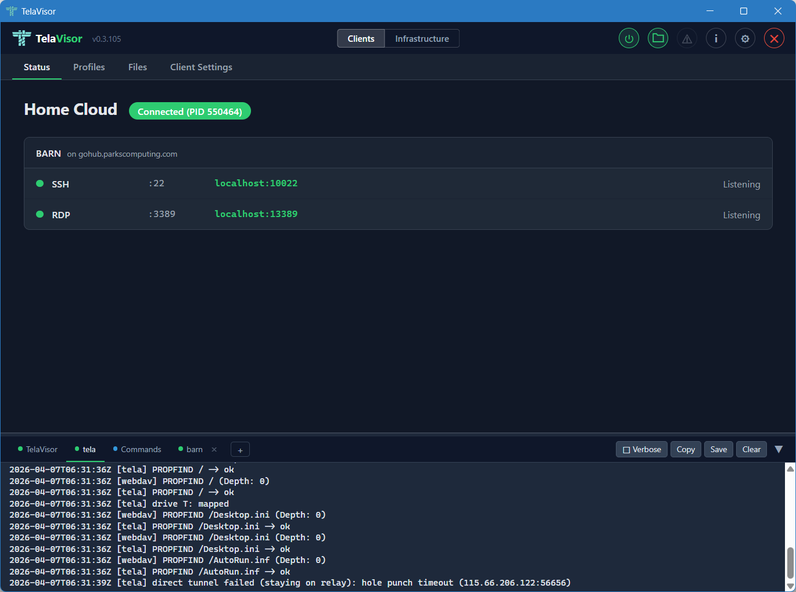

The log panel auto-scrolls to the bottom as new lines arrive. If you scroll up to read history, auto-scroll pauses until you scroll back to the bottom. Each pane is limited to a configurable maximum number of lines (default 5000, configurable in Application Settings).

The log panel remembers which dynamic log tabs were open between sessions. Tabs you open via View Logs (in the Hubs or Agents tab) or via the attach popover are saved to the TelaVisor settings file and restored on next launch.

### Attaching log sources

The `+` button at the right end of the tab strip opens the attach popover. It lists all hubs you have credentials for and all agents visible across those hubs. Clicking a hub opens a tab streaming `GET /api/admin/logs` from that hub; clicking an agent opens a tab fetching the agent's log ring through the hub's mediated management protocol.

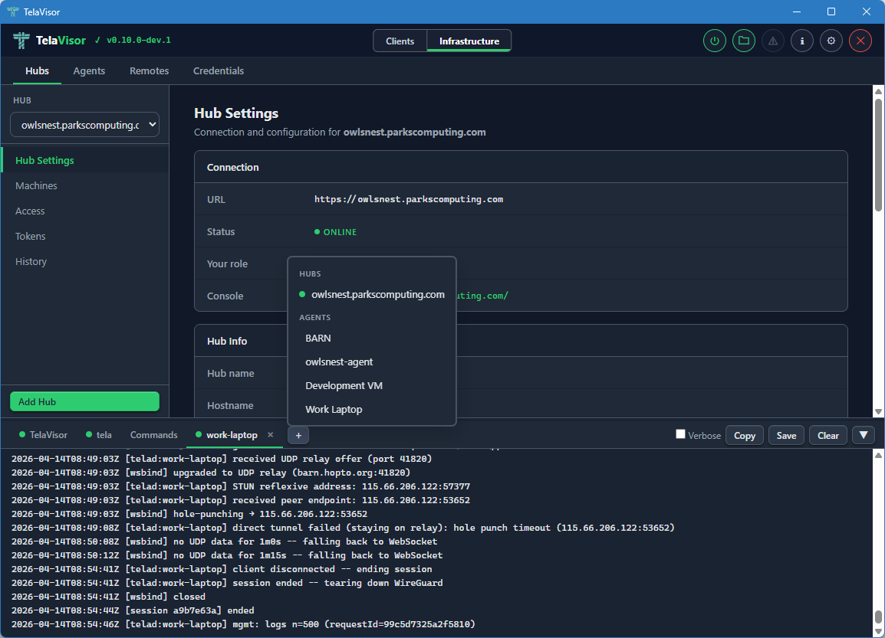

The popover renders next to the `+` button using fixed positioning so it is not clipped by the scrollable tab strip. Click outside to dismiss.

Dynamic log tabs use the same close-button pattern as the built-in tabs and can be torn off by closing them with their close button. Each agent or hub log tab shows a colored status dot:

- **Green** -- the log fetched successfully and the source is reporting fresh lines
- **Amber** -- the log is being fetched (in flight)
- **Grey** -- idle or the source is offline

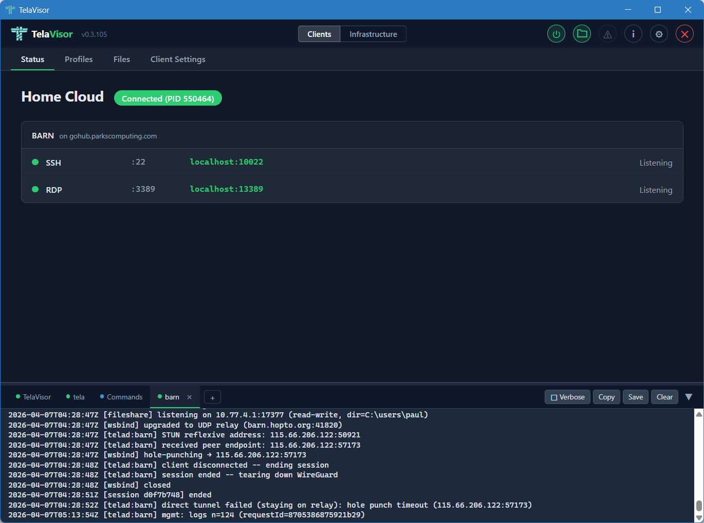

The Commands tab is a built-in pane that shows every API call and CLI command TelaVisor issues, with method badges (GET, POST, DEL, CLI), filter chips, and a copy-to-clipboard action on each entry. This is useful for learning the underlying CLI behind a UI action, troubleshooting, or scripting equivalent commands.

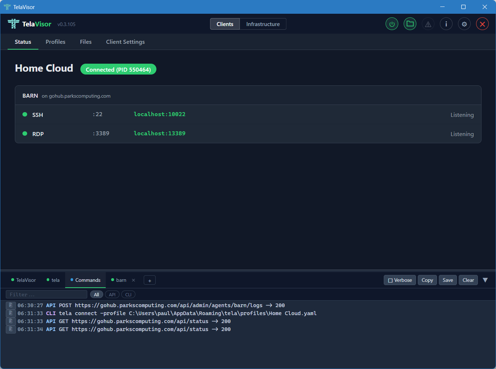

The following toolbar buttons are available at the top of the log panel:

- **Verbose** -- toggles verbose logging for the tela process
- **Copy** -- copies the active log tab's content to the clipboard
- **Save** -- saves the active log tab's content to a file
- **Clear** -- clears the active log tab

The panel has three built-in tabs:

- **TelaVisor** -- application events such as startup, profile loading, connection state changes, and errors
- **tela** -- live output from the `tela` process, the same output you would see running `tela connect -profile` in a terminal
- **Commands** -- a filterable log of all API calls and CLI commands that TelaVisor executes, with copy-to-clipboard support

The Commands tab shows each operation as a compact line with a method badge (GET, POST, DEL, CLI). Click a line to expand the full command, or click the copy icon to copy the command to the clipboard. The filter bar and method chips at the top of the Commands tab let you narrow the view by text search or HTTP method.

## Application Settings

You can open the Application Settings dialog from the gear icon in the title bar. A toolbar at the top of the dialog provides Apply, Apply & Close, and Cancel buttons. Apply and Apply & Close are disabled until a setting changes.

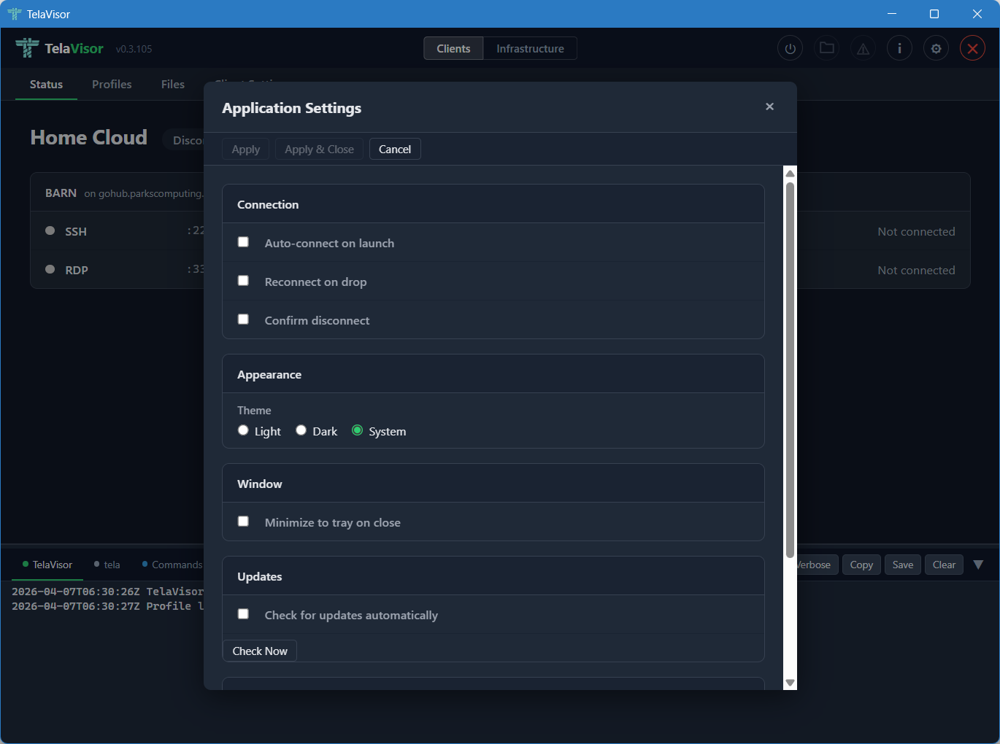

The settings are organized into sections:

**Connection:**

- **Auto-connect on launch** -- automatically connects using the default profile when TelaVisor starts
- **Reconnect on drop** -- attempts to reconnect if the connection drops unexpectedly
- **Confirm disconnect** -- shows a confirmation prompt before disconnecting or quitting while connected

**Appearance:**

- **Theme** -- Light, Dark, or System (follows OS preference)

**Window:**

- **Minimize to tray on close** -- hides TelaVisor to the system tray instead of exiting when you close the window

**Updates:**

- **Check for updates automatically** -- checks for new versions at startup
- **Release channel** -- a dropdown that selects which release channel TelaVisor (and the tela CLI) follows for self-update: `dev`, `beta`, or `stable`. The preference is stored in the user credential store (`~/.tela/credentials.yaml` on Unix, `%APPDATA%\tela\credentials.yaml` on Windows) and shared with the tela CLI; running `tela channel set <name>` from a shell and changing the dropdown here are equivalent. Hubs and agents have their own channels, configured separately in their YAML files or through the Hub Settings / Agent Settings dropdowns.

**Logging:**

- **Verbose by default** -- enables verbose output whenever tela connects
- **Max log lines per pane** -- limits the number of lines kept in each log tab (default 5000)

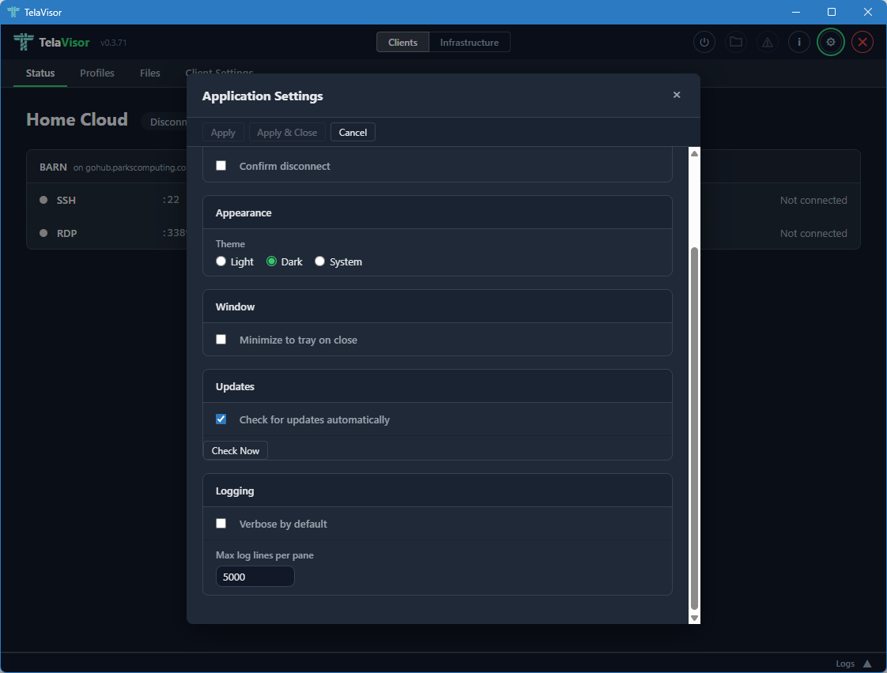

## About

You can open the About dialog by clicking the Tela**Visor** title in the top-left corner of the title bar, or by clicking the information icon. It shows version numbers for both TelaVisor and the tela CLI, project links, license information, dependency credits, and the CLI binary path.

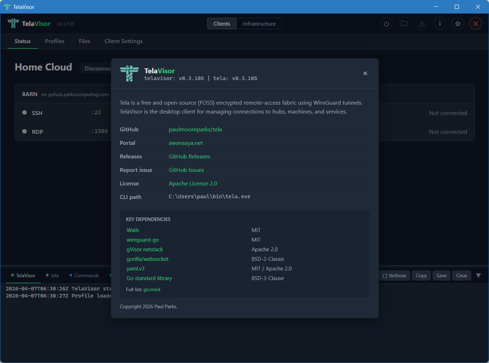

## Update indicator

When an update is available, an orange warning icon appears in the title bar. Clicking it opens a dialog that shows current and latest versions for each binary with per-binary Update and Install buttons.

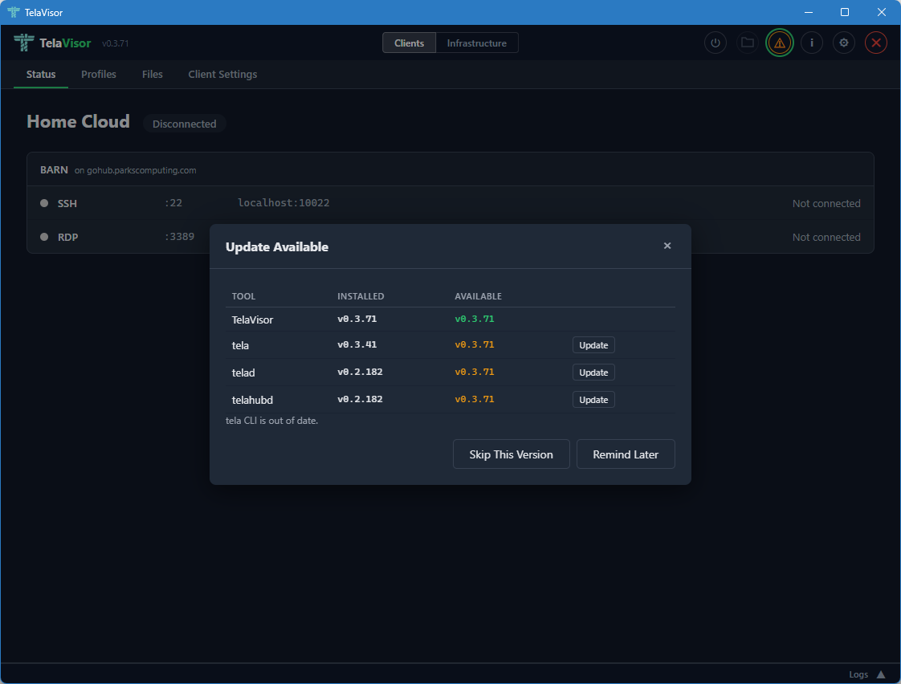

From the dialog you can:

- Update or install individual binaries using the per-binary buttons
- **Remind Later** -- hides the indicator until the next restart
- **Skip This Version** -- hides the indicator until a newer version is released

If TelaVisor was installed via a package manager (winget, Chocolatey, apt, brew), the self-update mechanism is disabled. Use the package manager to update instead.

## Connection status icon

The chain-link icon in the title bar indicates the current connection state:

- **Grey broken links** -- disconnected
- **Orange linked, pulsing** -- connecting
- **Green linked** -- connected
- **Amber broken, pulsing** -- disconnecting

You can click the icon at any time to navigate to the Status tab in Clients mode.

## System tray

When minimizing to the system tray is enabled in Application Settings, closing the window hides TelaVisor to the notification area instead of quitting. You can left-click or double-click the tray icon to show the window. Right-clicking the tray icon opens a menu with Show and Quit options.

## Building from source

TelaVisor requires [Wails v2](https://wails.io/docs/gettingstarted/installation) and its prerequisites (Go 1.25+, Node.js, platform WebView2/webkit2gtk).

```bash
cd cmd/telagui
wails build
```

The output binary is in `cmd/telagui/build/bin/`.

For development with live reload:

```bash
cd cmd/telagui
wails dev
```

## How TelaVisor works with tela

TelaVisor does not implement tunneling itself. It manages connection profiles and launches the `tela` CLI as a subprocess:

1. TelaVisor writes a profile YAML file with your selected hubs, machines, services, and local port assignments.
2. TelaVisor runs `tela connect -profile <path>` as a child process.
3. The tela process opens a local control API (HTTP + WebSocket on a random localhost port with a random token).
4. TelaVisor connects to tela's control WebSocket to receive real-time events (`service_bound`, `tunnel_activity`, `connection_state`).
5. The tela process output streams to the tela tab in the log panel.
6. When you click Disconnect, TelaVisor signals the tela process to shut down gracefully.

The profile YAML that TelaVisor writes is the same format documented in [REFERENCE.md](REFERENCE.md). You can use profiles interchangeably between TelaVisor and the CLI.

## Profile storage

Profiles are stored in the user's application data directory:

| Platform | Path |
|----------|------|
| Windows | `%APPDATA%\tela\profiles\` |
| Linux | `~/.tela/profiles/` |
| macOS | `~/.tela/profiles/` |

Each profile is a YAML file. You can configure which profile loads at startup in Client Settings.

## Configuration

Settings are stored in `telavisor-settings.yaml` in the tela configuration directory. Window position and size are saved automatically on close and restored on next launch. All other changes take effect when you click Apply or Apply & Close in the Application Settings dialog and persist across restarts.
