# TelaVisor

TelaVisor is a desktop client for Tela. It wraps the `tela` command-line tool in a graphical interface for managing connections, hubs, and (in a future release) agents, without requiring terminal access.

TelaVisor runs on Windows, Linux, and macOS. It is built with [Wails v2](https://wails.io/), using Go for the backend and plain JavaScript for the frontend.

TelaVisor establishes the [Tela Design Language (TDL)](TELA-DESIGN-LANGUAGE.md), the visual language shared across all Tela products. The top bar, mode toggle, tab bar, toolbar separators, icon buttons, modals, and color system defined in TelaVisor are the reference implementation for TDL.

## What TelaVisor does

TelaVisor manages the full lifecycle of connecting to remote services through Tela hubs:

1. **Store hub credentials.** You can add hubs by URL and token, or use a one-time pairing code. Credentials are stored in the same credential store that `tela login` uses.
2. **Select services.** You can browse machines registered on each hub, see which are online, and check the services you want to connect to.
3. **Connect with one click.** TelaVisor saves your selections as a connection profile, launches `tela connect -profile`, and monitors the process.
4. **Monitor tunnel status.** The Status view shows each selected service with its remote port, local port, and current state. Status updates arrive in real time over tela's WebSocket control API.
5. **Manage hubs.** You can view hub settings, manage tokens, configure access control lists (ACLs), and generate pairing codes from the Hubs mode.
6. **Manage multiple profiles.** You can create, rename, delete, import, and export profiles. Each profile is a standalone YAML file compatible with `tela connect -profile`.

## Layout

TelaVisor uses a three-mode layout that mirrors the three Tela binaries:

- **Clients** (tela) -- for connecting to remote services
- **Agents** (telad) -- for managing machines running the tela agent (coming soon)
- **Hubs** (telahubd) -- for administering hubs

You can switch between modes using the toggle in the center of the title bar. Each mode has its own tab bar. A persistent log panel at the bottom of the window displays output from all sources.

The title bar also contains a connection status icon (chain links), an information button, a settings button, and a quit button.

## Clients mode

### Status

The Status tab shows the current connection state and lists all selected services grouped by machine. When disconnected, the service indicators are grey and status reads "Not connected." When connected, each service shows whether it is listening for connections or actively tunneling traffic.

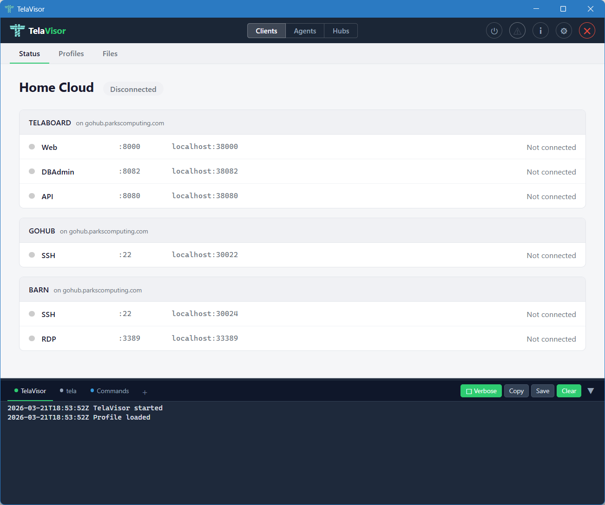

Each service card shows:

- A status indicator dot (grey when disconnected, green when listening or active)
- The service name (e.g., SSH, RDP, Web)
- The remote port on the target machine (e.g., :22)
- The local address bound by tela (e.g., localhost:50022)
- The connection status (Not connected, Listening, or Active with a connection count)

Status indicators update in real time via tela's WebSocket control API. When you connect to a service (for example, `ssh localhost -p 50022`), the status changes from Listening to Active. When the session ends, it returns to Listening.

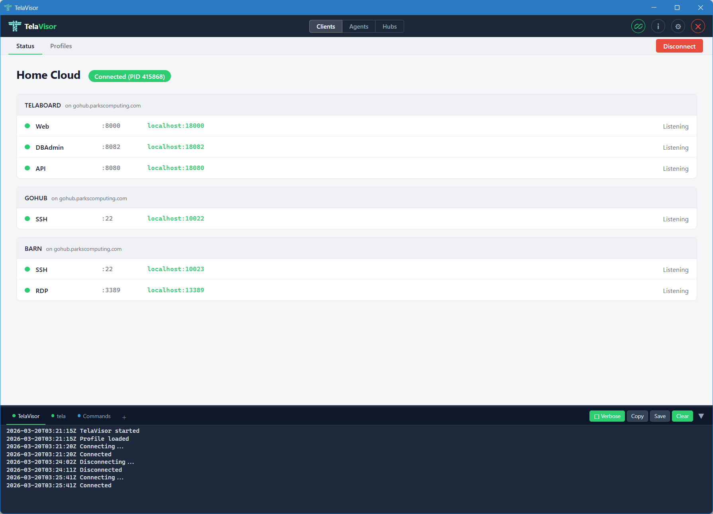

The profile name and connection state (Disconnected or Connected with PID) appear at the top of the page. A Connect or Disconnect button sits in the top-right corner of the tab bar.

### Profiles

The Profiles tab is where you configure which hubs, machines, and services to include in a connection profile. A toolbar below the tab bar provides all profile management controls in one consistent row.

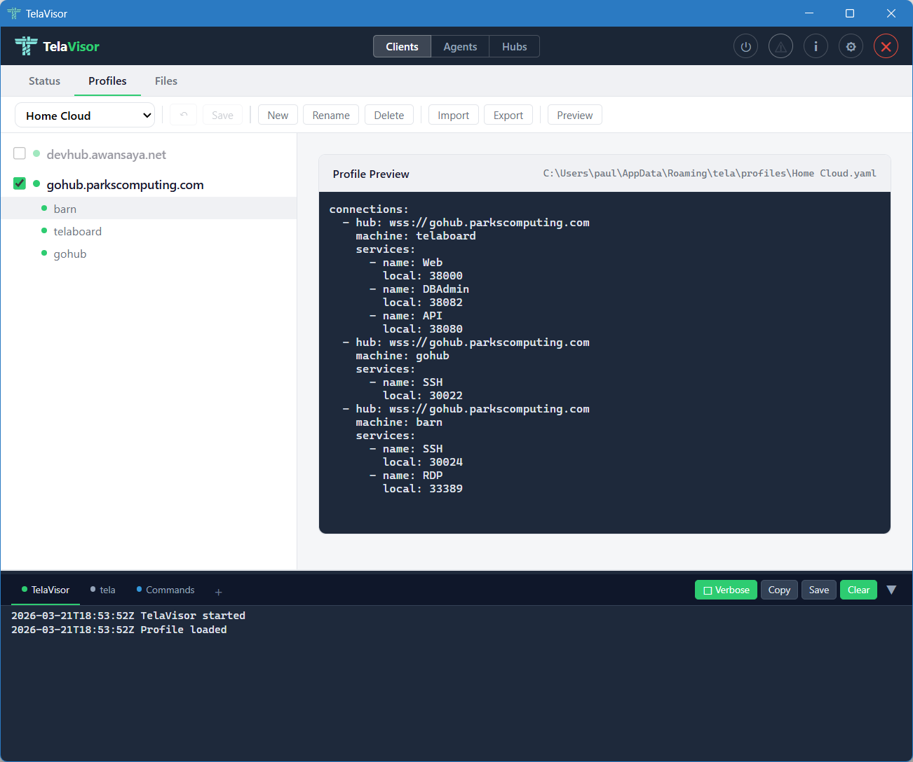

The toolbar contains:

- **Profile dropdown** -- selects the active profile
- **Undo** -- reverts unsaved changes to the last saved state
- **Save** -- saves the current selections to the profile YAML file. The button is disabled when there are no changes and turns green when the profile has unsaved edits.
- **New** -- creates a new profile
- **Rename** -- renames the current profile
- **Delete** -- deletes the current profile (with confirmation)
- **Import** -- imports a profile YAML file from disk
- **Export** -- exports the current profile to a file
- **Preview** -- shows a live YAML preview of the profile in the main area

The left sidebar lists hubs and their machines. Hub-level checkboxes control whether a hub's machines are included in the profile. When you select a machine in the sidebar, the main area shows its available services with checkboxes and local port assignments.

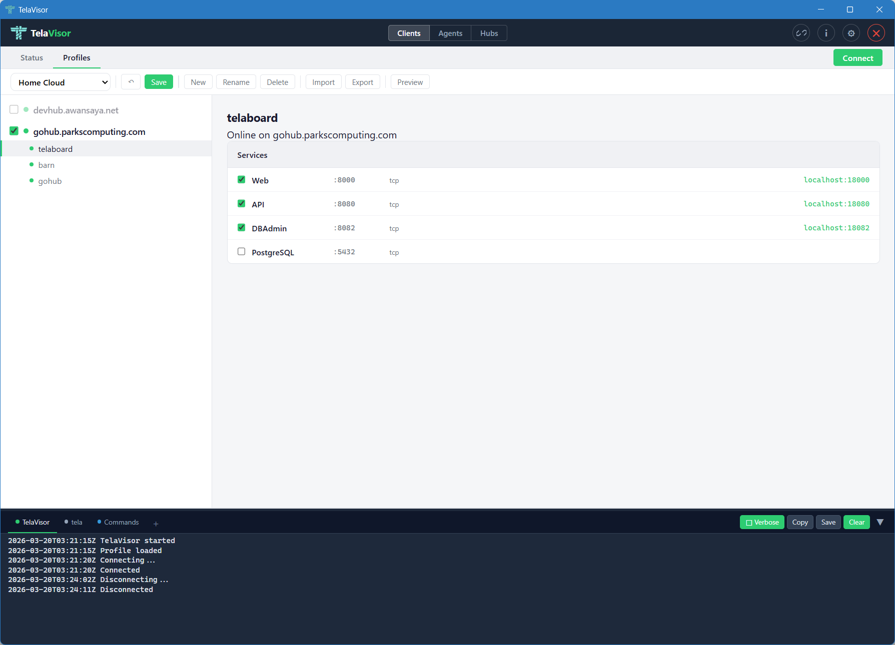

When no machine is selected (or when you click Preview), the main area shows a live YAML preview of the profile with the file path displayed in the header. The YAML preview fills the available vertical space and scrolls independently.

When tela is connected, hub and machine checkboxes are disabled to prevent profile changes during an active session.

### Files

The Files tab provides a built-in file browser for machines with file sharing enabled. It operates through the encrypted WireGuard tunnel. No SSH or SFTP is required on the remote machine.

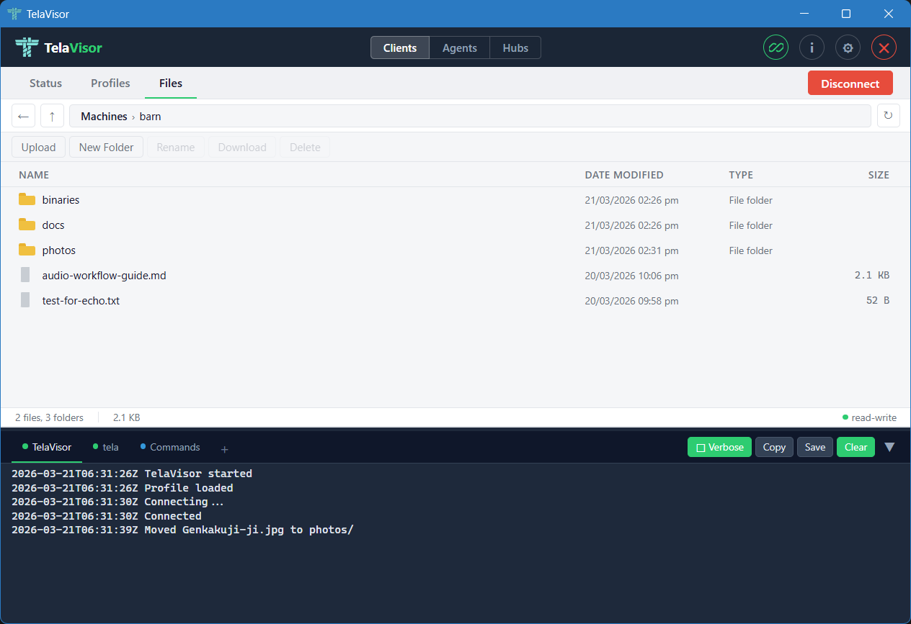

When you open the Files tab, it shows a list of connected machines with their file sharing status (read-write, read-only, or not configured). Click a machine to browse its shared directory.

The file browser uses an Explorer-style layout:

- **Address bar** with back and up navigation buttons, and a clickable breadcrumb path showing `Machines > barn > stuff > logs`. Each segment is clickable.
- **Action bar** with Upload, New Folder, Rename, Download, and Delete buttons. Buttons are disabled based on selection state and read-only status.
- **File list** with Name, Date Modified, Type, and Size columns. Folders appear first, sorted alphabetically.
- **Status bar** showing file and folder counts, total size, and read-write or read-only mode.

Selection follows standard conventions:

- Click to select a single item
- Ctrl+click to toggle individual items (multi-select)
- Shift+click for range selection
- Double-click a file to download it
- Double-click a folder to open it

Drag and drop is supported on writable shares. Drag files or folders onto a folder to move them. If the dragged item is part of a multi-selection, all selected items move together. The drop target folder highlights with a dashed outline.

The file list updates in real time. When files are created, modified, deleted, or renamed on the remote machine (by any process, not just TelaVisor), the changes appear automatically.

## Hubs mode

Hubs mode provides full administration for any hub where you have owner or admin credentials. You select a hub from the dropdown in the sidebar, then navigate between four views using the sidebar navigation.

### Hub Settings

The Hub Settings view shows connection details, hub metadata, and portal registrations for the selected hub.

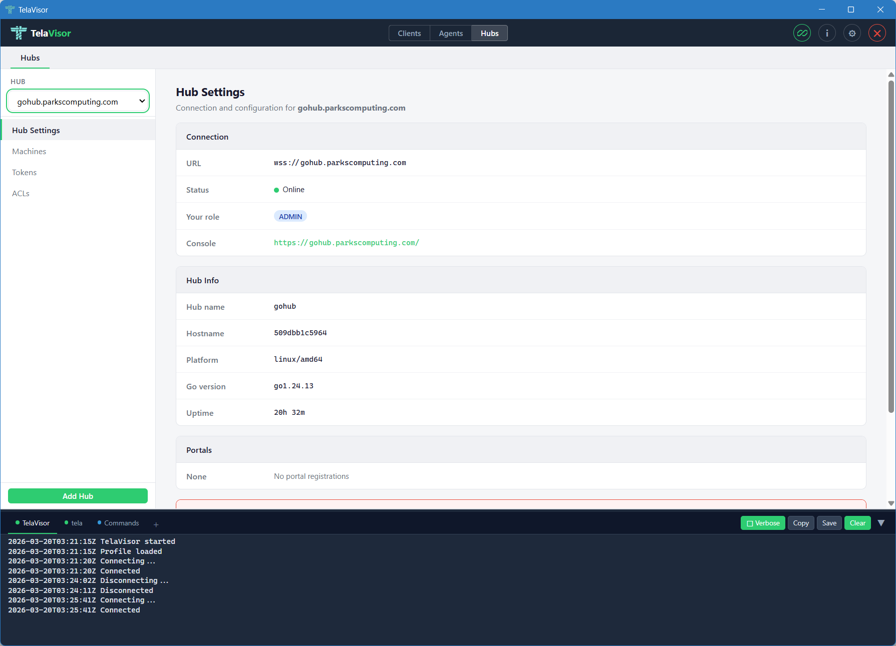

The Connection section shows the hub URL, online status, your role, and a link to the hub's web console. The Hub Info section displays the hub name, hostname, platform, Go version, and uptime, all retrieved from the hub's `/api/status` endpoint. The Portals section lists registered portal associations from `/api/admin/portals`.

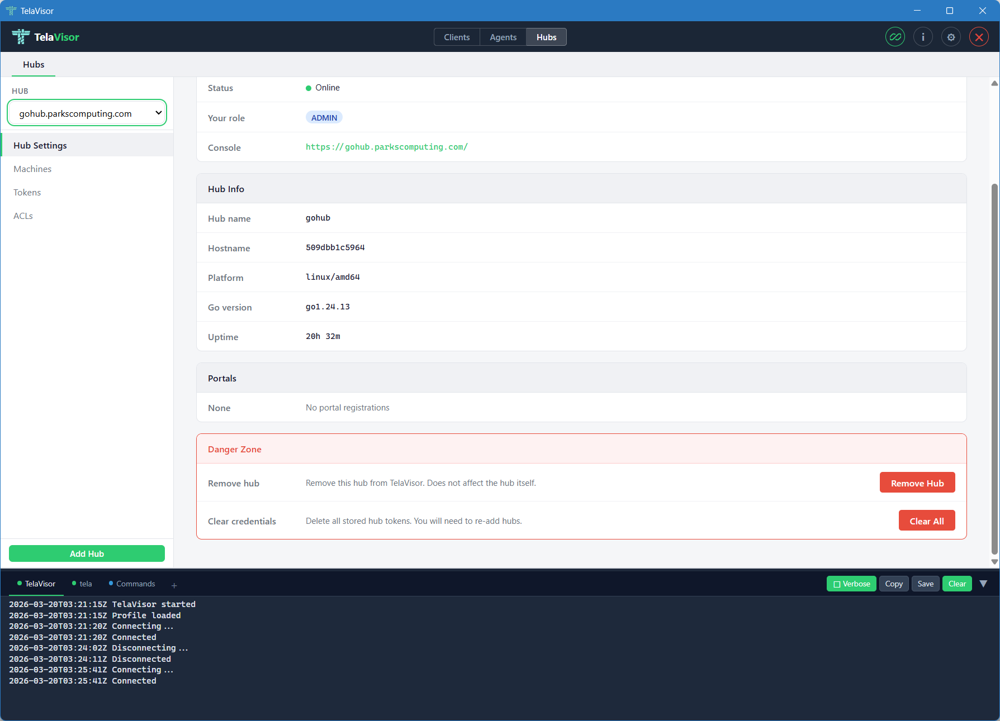

The Danger Zone at the bottom of the page provides destructive actions. You can remove the hub from TelaVisor (which does not affect the hub itself) or clear all stored hub tokens from the local credential store.

### Add Hub

You can add a new hub by clicking the Add Hub button in the sidebar footer. The Manual tab accepts a hub URL and a token or pairing code.

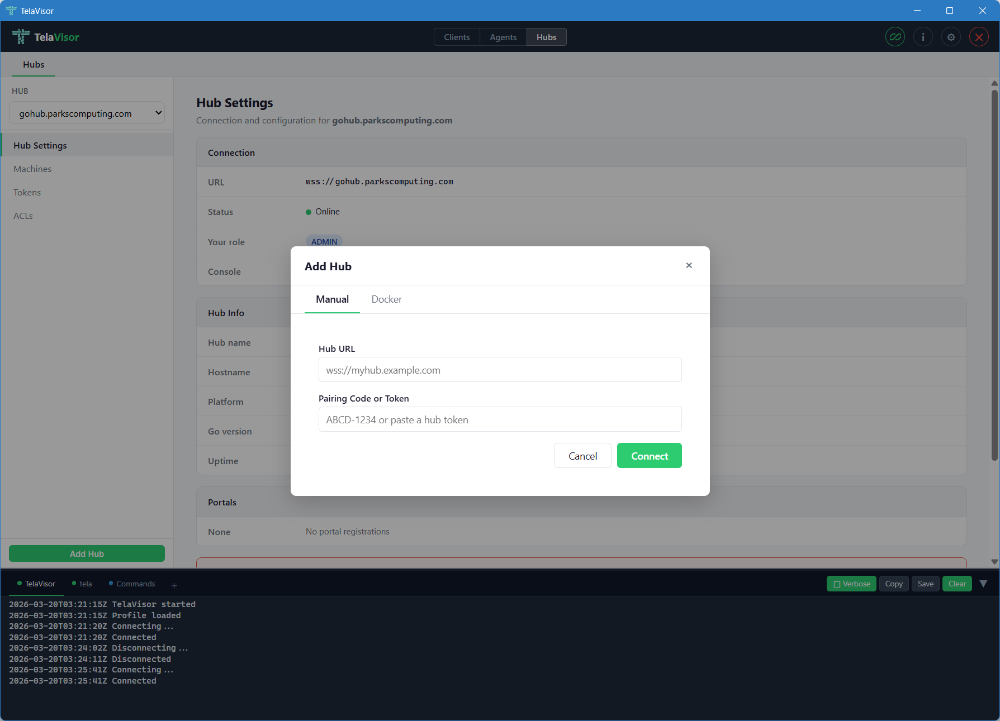

The Docker tab can extract owner or viewer tokens directly from a running telahubd container, which is useful during local development or staging.

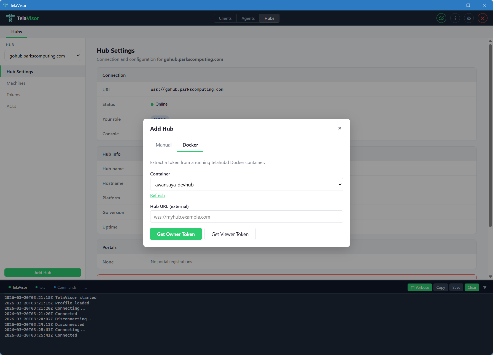

### Machines

The Machines view lists all machines registered on the selected hub. Each machine card shows its online status, the time it was last seen, and the services it exposes.

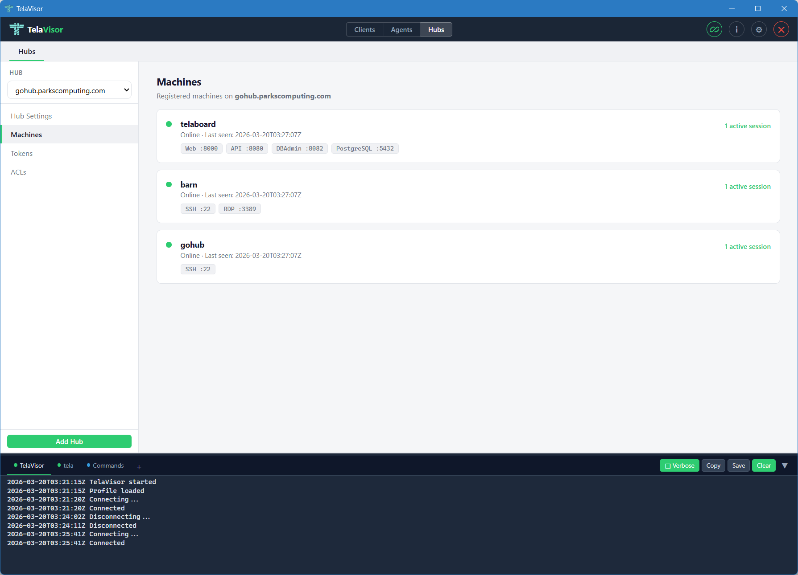

### Tokens

The Tokens view lets you manage authentication tokens for the selected hub. You can create new identities, rotate tokens, delete identities, and generate one-time pairing codes.

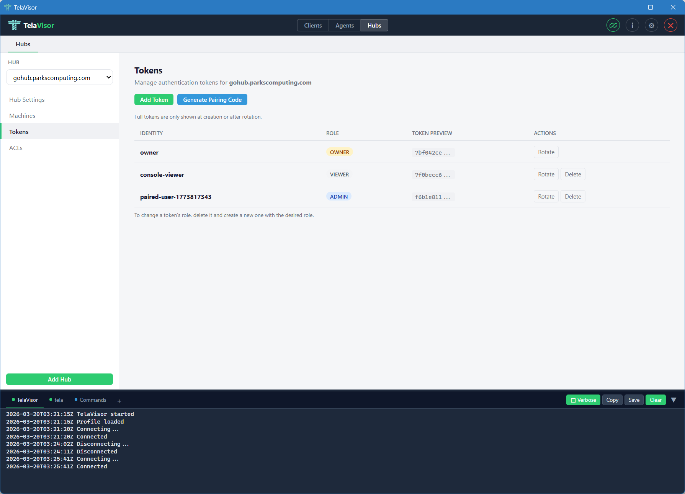

Token previews show the first 8 characters. Full tokens are only visible at creation time or immediately after rotation. To change a token's role, you must delete the identity and create a new one with the desired role.

### ACLs

The ACLs view lets you manage per-machine connect and register permissions. ACL rules are displayed as cards grouped by machine. Each card shows which identities have register or connect access, with Revoke buttons for each entry.

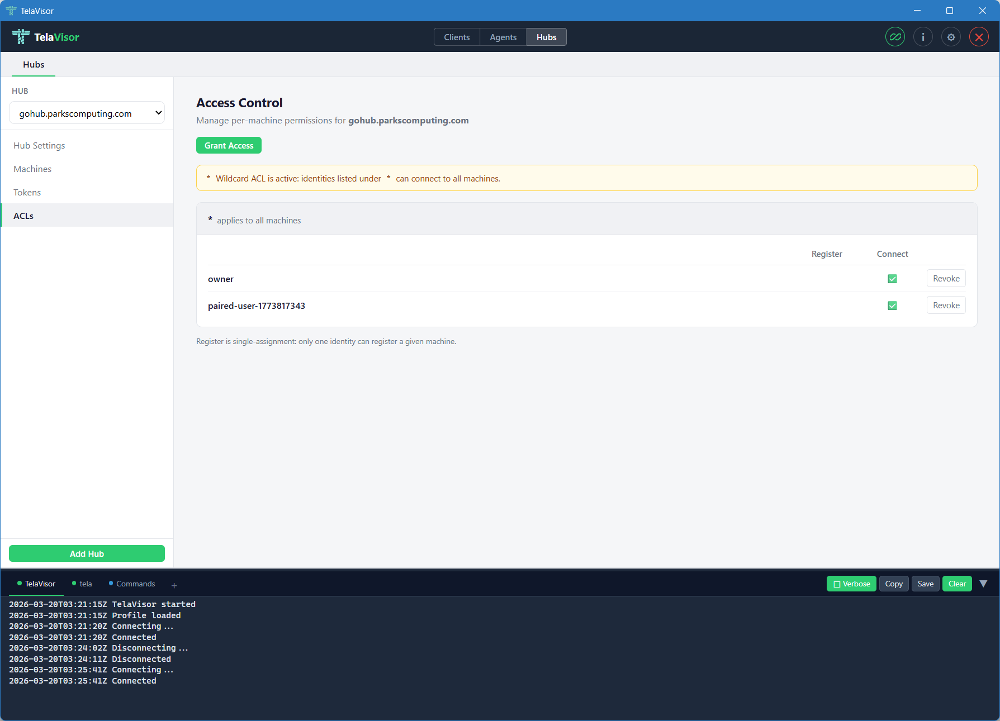

A wildcard ACL (`*`) applies to all machines when present. Register access is single-assignment: only one identity can register a given machine. Granting register to a new identity replaces the previous one.

## Log panel

The log panel is a persistent area at the bottom of the window that provides tabbed log output visible across all modes. You can resize it by dragging its top edge, or collapse it to just its header bar using the arrow button.

When you click into any log tab, scrolling freezes so you can read and select text. Selected text is automatically copied to the clipboard. Scrolling resumes after a short delay.

The following toolbar buttons are available at the top of the log panel:

- **Verbose** -- toggles verbose logging for the tela process
- **Copy** -- copies the active log tab's content to the clipboard
- **Save** -- saves the active log tab's content to a file
- **Clear** -- clears the active log tab

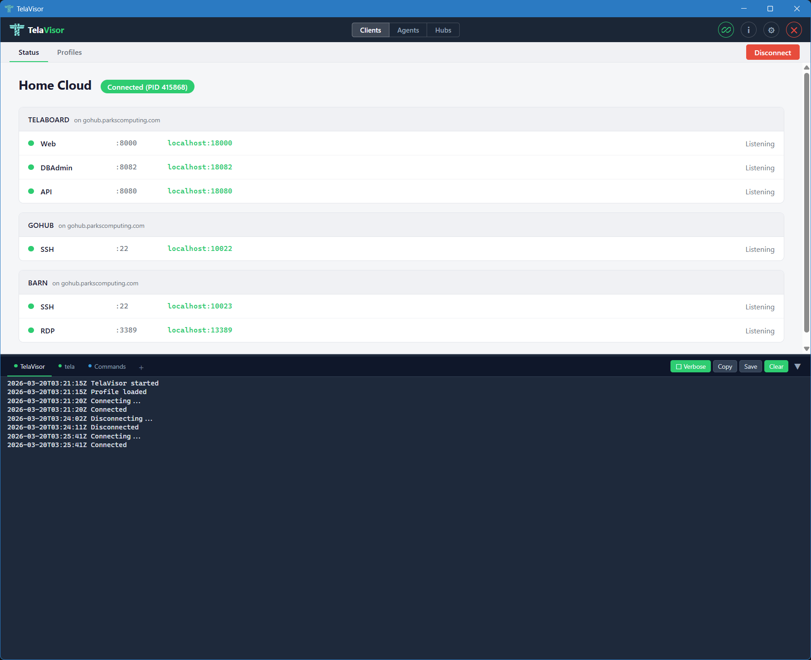

The panel has three built-in tabs:

- **TelaVisor** -- application events such as startup, profile loading, connection state changes, and errors
- **tela** -- live output from the `tela` process, which is the same output you would see running `tela connect -profile` in a terminal
- **Commands** -- a filterable log of all API calls and CLI commands that TelaVisor executes, with copy-to-clipboard support

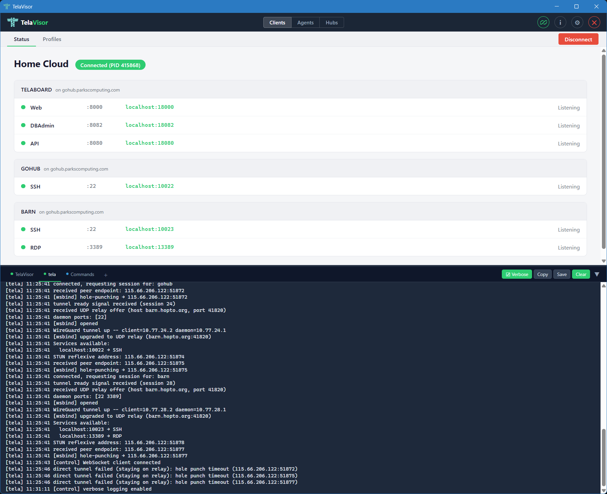

The Commands tab shows each operation as a compact line with a method badge (GET, POST, DEL, CLI). You can click a line to expand the full command, or click the copy icon to copy the command to the clipboard. The filter bar and method chips at the top of the Commands tab let you narrow the view by text search or HTTP method.

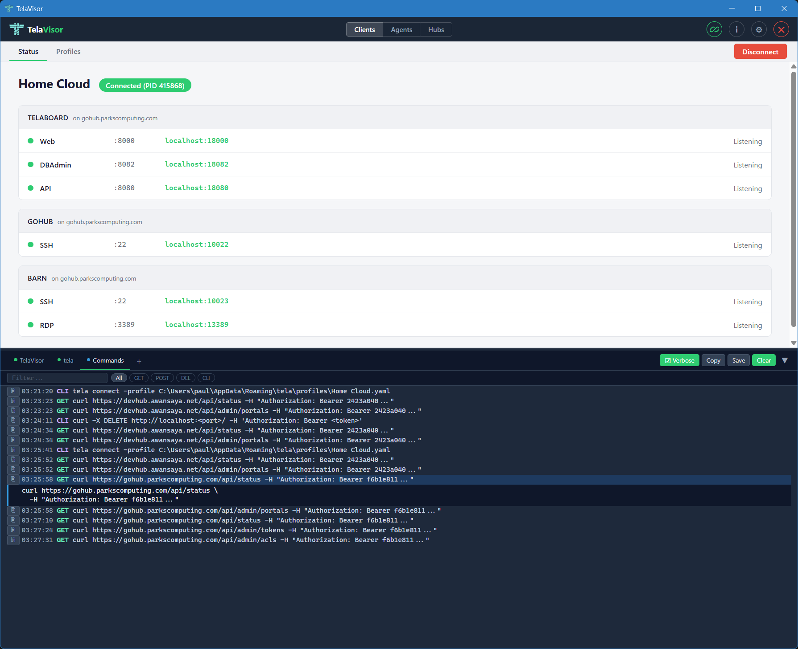

## Settings

You can open the Settings dialog from the gear icon in the title bar. A toolbar at the top of the dialog provides Save and Close buttons that remain visible as you scroll through the settings sections.

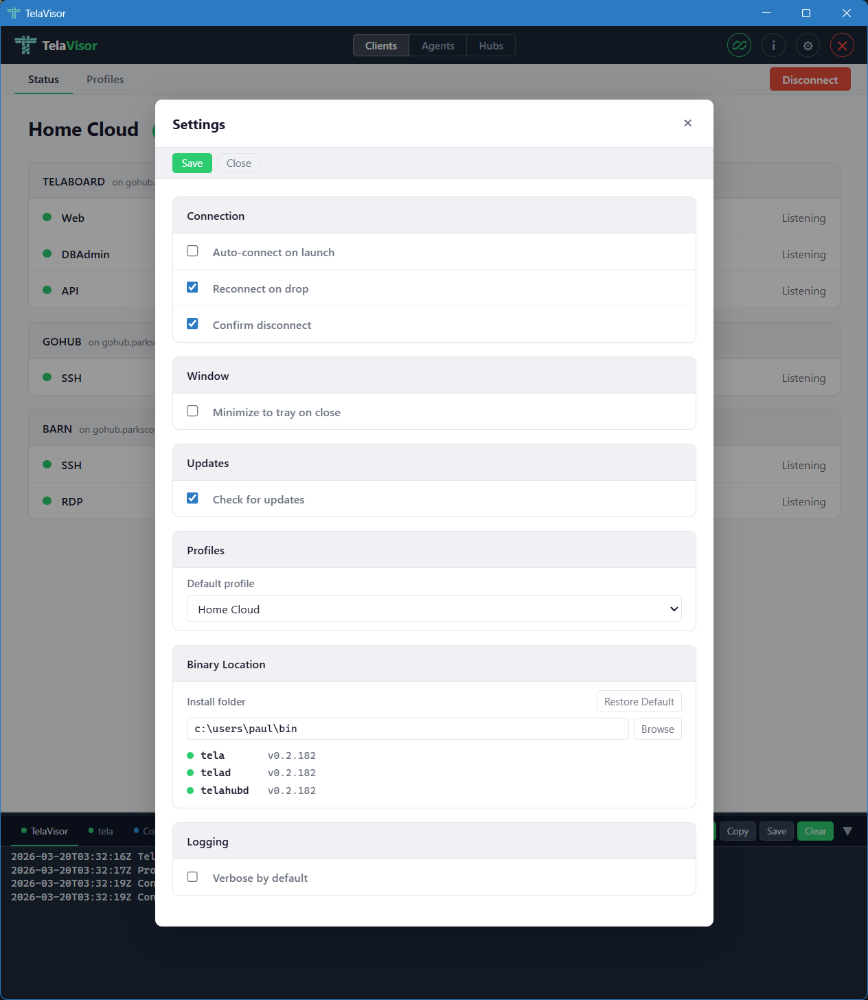

The settings are organized into sections:

**Connection:**

- **Auto-connect on launch** -- automatically connects using the default profile when TelaVisor starts
- **Reconnect on drop** -- attempts to reconnect if the connection drops unexpectedly
- **Confirm disconnect** -- shows a confirmation prompt before disconnecting or quitting while connected

**Window:**

- **Minimize to tray on close** -- hides TelaVisor to the system tray instead of exiting when you close the window

**Updates:**

- **Check for updates** -- checks for new versions of TelaVisor and the tela CLI at startup

**Profiles:**

- **Default profile** -- selects which profile loads at startup

**Binary Location:**

The Binary Location section controls where TelaVisor looks for managed binaries (tela, telad, telahubd). The default is the platform's local application directory. You can use the Browse button to select a different folder, or click Restore Default to reset to the platform default.


Below the path, TelaVisor shows the status of each binary: a green dot with the version number when the binary is up to date, an amber dot with an Update button when a newer version is available, or a red dot with an Install button when the binary is not found. You can install or update binaries directly from this section.

**Logging:**

- **Verbose by default** -- enables verbose output whenever tela connects

Changes require clicking Save in the Settings toolbar. If you close the dialog with unsaved changes, TelaVisor prompts you to discard them.

## About

You can open the About dialog by clicking the Tela**Visor** title in the top-left corner of the title bar, or by clicking the information icon. It shows version numbers for both TelaVisor and the tela CLI, project links, license information, dependency credits, and the CLI binary path.

## Connection status icon

The chain-link icon in the title bar indicates the current connection state:

- **Grey broken links** -- disconnected
- **Orange linked, pulsing** -- connecting
- **Green linked** -- connected
- **Amber broken, pulsing** -- disconnecting

You can click the icon at any time to navigate to the Status tab in Clients mode.

## System tray

When minimizing to the system tray is enabled in Settings, closing the window hides TelaVisor to the notification area instead of quitting. You can left-click or double-click the tray icon to show the window. Right-clicking the tray icon opens a menu with Show and Quit options.

## Automatic updates

When an update is available, an orange warning icon appears in the title bar. Clicking it opens an dialog that shows current and latest versions for both TelaVisor and the tela CLI. From there you can choose:

- **Update Now** -- downloads and applies the update
- **Remind Later** -- hides the warning until the next restart
- **Skip This Version** -- hides the warning until a newer version is released

If TelaVisor was installed via a package manager (winget, Chocolatey, apt, brew), the self-update mechanism is disabled. You should use the package manager to update instead.

## Building from source

TelaVisor requires [Wails v2](https://wails.io/docs/gettingstarted/installation) and its prerequisites (Go 1.24+, Node.js, platform WebView2/webkit2gtk).

```bash
cd cmd/telagui
wails build
```

The output binary is in `cmd/telagui/build/bin/`.

For development with live reload:

```bash
cd cmd/telagui
wails dev
```

## How TelaVisor works with tela

TelaVisor does not implement tunneling itself. It manages connection profiles and launches the `tela` CLI as a subprocess:

1. TelaVisor writes a profile YAML file with your selected hubs, machines, services, and local port assignments.
2. TelaVisor runs `tela connect -profile <path>` as a child process.
3. The tela process opens a local control API (HTTP + WebSocket on a random localhost port with a random token).
4. TelaVisor connects to tela's control WebSocket to receive real-time events (`service_bound`, `tunnel_activity`, `connection_state`).
5. The tela process output streams to the tela tab in the log panel.
6. When you click Disconnect, TelaVisor signals the tela process to shut down gracefully.

The profile YAML that TelaVisor writes is the same format documented in [REFERENCE.md](REFERENCE.md). You can use profiles interchangeably between TelaVisor and the CLI.

## Profile storage

Profiles are stored in the user's application data directory:

| Platform | Path |
|----------|------|
| Windows | `%APPDATA%\tela\profiles\` |
| Linux | `~/.tela/profiles/` |
| macOS | `~/.tela/profiles/` |

Each profile is a YAML file. You can configure which profile loads at startup in Settings under Profiles.

## Configuration

Settings are stored in `telavisor-settings.yaml` in the tela configuration directory. Changes take effect when you click Save in the Settings toolbar and persist across restarts.

## Agents mode (coming soon)

The Agents tab is a placeholder for future telad management features. Planned capabilities include deploying, configuring, monitoring, and controlling telad instances on remote machines.
