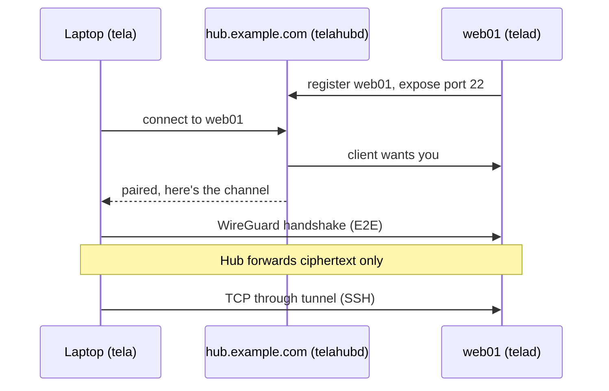

# First Connection

This walkthrough takes a minimal three-machine setup, one hub, one agent,
one client, from nothing to a working SSH connection. Install `tela`,
`telad`, and `telahubd` before starting (see [Installation](installation.md)).

For the full CLI reference including all flags and configuration options,
see [Appendix A: CLI Reference](../guide/reference.md).

## The Scenario

Picture two machines that cannot reach each other directly:

- **`web01`** is a Linux server sitting on a private network: a home lab, a
  cloud VM behind NAT, a machine at a co-location facility, anything that
  has no publicly accessible inbound port. The name `web01` is just a label
  we give the machine inside Tela; it can be any string you choose. This is
  the machine you want to reach. It runs `telad`, the agent daemon.
- **Your laptop** is wherever you are. It runs `tela`, the client. It also
  cannot accept inbound connections; it is behind a home router or a
  corporate firewall.

Because neither machine accepts inbound connections, they cannot talk to
each other directly. The hub solves this.

- **`hub.example.com`** is a small server with a public IP address. It does
  not need to be powerful, because it only brokers connections and never
  decrypts tunnel traffic. It runs `telahubd`.

Both `web01` and your laptop connect *outbound* to the hub. The hub pairs
them together and starts relaying WireGuard packets between them. Once the
WireGuard tunnel is up, your laptop can reach the exposed ports on `web01`
as if the two machines were on the same network.

When the walkthrough is done, your laptop will have a local port that
reaches `web01`:

```
Services available:
  localhost:22    → SSH
```

The client binds each service on `127.0.0.1` at the service's own port when
that port is free locally. If it is taken, the client picks a fallback port
(the service port plus 10000, then plus 10001, and so on) and shows the
port it actually bound. Whatever the output shows is the port to use.

## The Three Binaries, One on Each Machine

- `telahubd` on `hub.example.com`: the broker. Needs a public IP. Nothing
  sensitive passes through it in plaintext.
- `telad` on `web01`: the agent. Registers the machine with the hub and
  exposes its ports through the tunnel.
- `tela` on your laptop: the client. Connects to the hub, sets up the
  tunnel to `web01`, and binds local addresses for each exposed port.

Nothing has to be open inbound on `web01` or your laptop.

## Step 1: Start the Hub

On `hub.example.com`:

```bash
telahubd -port 8080
```

`telahubd` listens on port 8080 (HTTP and WebSocket) and 41820 (UDP relay)
in this example. The default is port 80, which requires elevated privileges
on Linux; using a non-privileged port avoids that. Use a real config file
with TLS for anything past a quick test. See
[Run a Hub on the Public Internet](../howto/hub.md) for the production
walkthrough.

On first start the hub auto-generates an **owner token** and prints it.
Save it somewhere; you will need it for everything below.

The owner token is the highest-privilege credential on the hub. Treat it
like a root password. This walkthrough uses it directly for both the agent
and the client for simplicity. In a real deployment you would create
separate lower-privilege tokens for each: one for the agent (register
permission) and one per user (connect permission). See
[Run a Hub on the Public Internet](../howto/hub.md) for the production
pattern.

## Step 2: Start the Agent on web01

On `web01`:

```bash
telad -hub wss://hub.example.com:8080 -machine web01 -token <owner-token> -ports 22
```

This registers `web01` with the hub and tells the hub that the agent will
expose TCP port 22. After a moment, the hub's `/api/status` endpoint should
list `web01` as a registered machine.

## Step 3: Connect from Your Laptop

On your laptop:

```bash
tela connect -hub wss://hub.example.com:8080 -machine web01 -token <owner-token>
```

The client opens a WireGuard tunnel through the hub to `web01` and binds
SSH on a local port. The output shows the address:

```
Services available:
  localhost:22    → SSH
```

Leave it running.

## Step 4: SSH

In another terminal, use the port from the output:

```bash
ssh -p 22 user@localhost
```

You are now logged into `web01` through an end-to-end encrypted WireGuard
tunnel that the hub never decrypted. If your laptop already runs its own
SSH server on port 22, the output in step 3 will have shown a fallback
port such as `localhost:10022`; use that instead.

## What Just Happened



The hub paired the two sides and started forwarding WireGuard packets. It
cannot read those packets. WireGuard's encryption is between the laptop
and `web01`, with keys neither side ever sent to the hub.

## Where to Go Next

- [Run a Hub on the Public Internet](../howto/hub.md) for the real
  production setup with TLS, auth, and a service manager
- [Run an Agent](../howto/telad.md) for the agent's full deployment story
- [Run Tela as an OS Service](../howto/services.md) to survive reboots
  without manual restarts
- [Self-Update and Release Channels](../howto/channels.md) once you have
  more than one box
- [TelaVisor Desktop App](../guide/telavisor.md) for a GUI alternative
