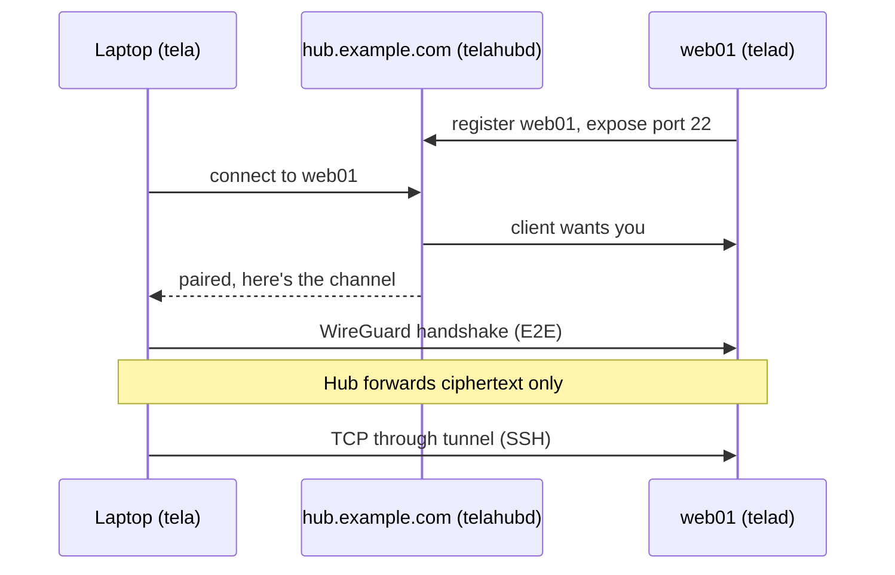

# First connection: hello, hub

Install `tela`, `telad`, and `telahubd` before starting (see [Installation](installation.md)). The steps below walk through a minimal three-machine setup: one hub, one agent, one client, ending at a working SSH connection.

For the full CLI reference including all flags and configuration options, see [Appendix A: CLI reference](../guide/reference.md).

## The shape of a Tela connection

You will run three binaries, one on each of three machines:

- `telahubd` on a machine that has a public IP and is reachable from both
  endpoints. We'll call this `hub.example.com`.
- `telad` on the machine you want to reach. We'll call this `web01`.
- `tela` on your laptop, where you actually want to type `ssh`.

Both `telad` and `tela` connect outbound to `telahubd`. Nothing has to be open
inbound on either of them.

## Step 1: Start the hub

On `hub.example.com`:

```bash
telahubd -port 8080
```

`telahubd` listens on port 8080 (HTTP+WebSocket) and 41820 (UDP relay) in this
example. The default is port 80, which requires elevated privileges on Linux;
using a non-privileged port avoids that. Use a real config file with TLS for
anything past a quick test. See
[Run a hub on the public internet](../howto/hub.md) for the production
walkthrough.

On first start the hub auto-generates an **owner token** and prints it. Save it
somewhere; you will need it for everything below.

The owner token is the highest-privilege credential on the hub -- treat it like
a root password. This walkthrough uses it directly for both the agent and the
client for simplicity. In a real deployment you would create separate
lower-privilege tokens for each: one for the agent (register permission) and one
per user (connect permission). See [Run a hub on the public
internet](../howto/hub.md) for the production pattern.

## Step 2: Start the agent on web01

On `web01`:

```bash
telad -hub wss://hub.example.com:8080 -machine web01 -token <owner-token> -ports 22
```

This registers `web01` with the hub and tells the hub that the agent will
expose TCP port 22. After a moment, the hub's `/api/status` endpoint should
list `web01` as a registered machine.

## Step 3: Connect from your laptop

On your laptop:

```bash
tela connect -hub wss://hub.example.com:8080 -machine web01 -token <owner-token>
```

The client opens a WireGuard tunnel through the hub to `web01` and binds
SSH on a deterministic loopback address. The output shows the address:

```
Services available:
  127.88.x.x:22    → SSH
```

Leave it running.

## Step 4: SSH

In another terminal, use the address from the output:

```bash
ssh user@127.88.x.x
```

You're now SSH'd into `web01` through an end-to-end encrypted WireGuard
tunnel that the hub never decrypted.

## What just happened



The hub paired the two sides and started forwarding WireGuard packets. It
cannot read those packets -- WireGuard's encryption is between the laptop
and `web01`, with keys neither side ever sent to the hub.

## Where to go next

- [Run a hub on the public internet](../howto/hub.md) for the real
  production setup with TLS, auth, and a service manager
- [Run an agent](../howto/telad.md) for the agent's full deployment story
- [Run Tela as an OS service](../howto/services.md) to survive reboots without manual restarts
- [Self-update and release channels](../howto/channels.md) once you have
  more than one box
- [TelaVisor desktop app](../guide/telavisor.md) for a GUI alternative
