# TelaVisor

TelaVisor is the desktop graphical interface for Tela. It wraps the `tela`
command-line tool in a window with menus, dialogs, panels, and a file
browser, so you can manage connections, hubs, agents, profiles, files, and
credentials without ever opening a terminal. It runs on Windows, Linux, and
macOS.

## What TelaVisor is, and what it is not

TelaVisor manages the full life cycle of connecting to remote services
through Tela hubs:

1. **Storing hub credentials.** Add hubs by Uniform Resource Locator (URL)
   and token, or use a one-time pairing code. Credentials are stored in
   the same credential store that `tela login` uses, so the desktop client
   and the command line share the same set of authenticated hubs.
2. **Selecting services.** Browse machines registered on each hub, see
   which are online, and check the services you want to connect to.
3. **Connecting with one click.** TelaVisor saves your selections as a
   connection profile, launches `tela connect -profile`, and monitors the
   process.
4. **Monitoring tunnel status.** The Status view shows each selected
   service with its remote port, local address, and current state. Status
   updates arrive in real time over tela's WebSocket control application
   programming interface (API).
5. **Managing hubs.** View hub settings, manage tokens, configure
   per-machine access, view connection history, generate pairing codes,
   view remote logs, and update or restart hub binaries from
   Infrastructure mode.
6. **Managing agents.** View agent details, services, file share
   configuration, push configuration changes through the hub-mediated
   management protocol, view remote logs, and update or restart agent
   binaries from the Agents tab.
7. **Managing multiple profiles.** Create, rename, delete, import, and
   export profiles. Each profile is a standalone YAML file compatible
   with `tela connect -profile`.
8. **Browsing remote files.** The built-in file browser provides
   Explorer-style access to file shares on connected machines through the
   encrypted tunnel.

TelaVisor does **not** implement tunneling itself. The encrypted WireGuard
tunnel is built by the `tela` command-line process. TelaVisor is a control
surface around that process: it writes profile files, launches the binary,
talks to its local control API, and renders state. The
[How TelaVisor works with tela](#how-telavisor-works-with-tela) section at
the end of this chapter explains the architecture.

TelaVisor is also the reference implementation of the
[Tela Design Language](../architecture/tdl.md), the visual language shared
across all Tela products. The top bar, the mode toggle, the tab bar, the
toolbar separators, the icon buttons, the modals, and the color system
that you see in TelaVisor are the canonical examples of TDL.

## Installing and launching

TelaVisor ships as a single-file native application for each supported
platform. Download the appropriate build from your configured release
channel and run it. There is no installer to navigate, no kernel driver to
sign, no service to register unless you choose to install one. The
application starts with a default profile pre-populated and the Status tab
visible.

On first launch, TelaVisor's title bar shows the application name and
version, the mode toggle in the center, and several icon buttons on the
right side: a power button (the connection toggle), a file manager
shortcut, an information button, an update warning indicator (only when an
update is available), a settings gear, and a quit button. The window is
resizable. Window position and size are saved on close and restored on the
next launch.

The application supports light and dark themes. The default is the system
preference, which you can override in
[Application Settings](#application-settings).

## The two-mode layout

TelaVisor uses a two-mode layout. The mode toggle in the center of the
title bar switches between **Clients** mode and **Infrastructure** mode.
Each mode has its own tab bar and its own set of features.

- **Clients mode** is for *connecting to remote services*. Its tabs are
  Status, Profiles, Files, and Client Settings. Read this mode as
  *everything a user does to use a tunnel*.
- **Infrastructure mode** is for *administering the system that the
  tunnels run on*. Its tabs are Hubs, Agents, Remotes, and Credentials.
  Read this mode as *everything an operator does to keep tunnels working*.

A persistent log panel sits at the bottom of the window across both modes.
You can drag its top edge to resize it, or click the chevron to collapse
it to a slim status bar. The
[Log panel](#log-panel) section covers it in detail.

The two modes have different audiences but the same window. A user who
only ever needs to make connections can stay in Clients mode and never
visit Infrastructure mode. An operator who runs hubs and agents on behalf
of others spends most of their time in Infrastructure mode. A power user
moves between both freely.

## Clients mode

### Status

The Status tab is the page TelaVisor opens to. It is the page that
answers the question *am I connected, and to what?*

When TelaVisor is not connected, the Status page shows the active profile
name, a "Disconnected" badge, and a list of services that the profile is
configured to expose. Each service line shows a grey indicator dot, the
service name, the remote port on the target machine, the local address
that `tela` would bind to, and a status reading "Not connected."

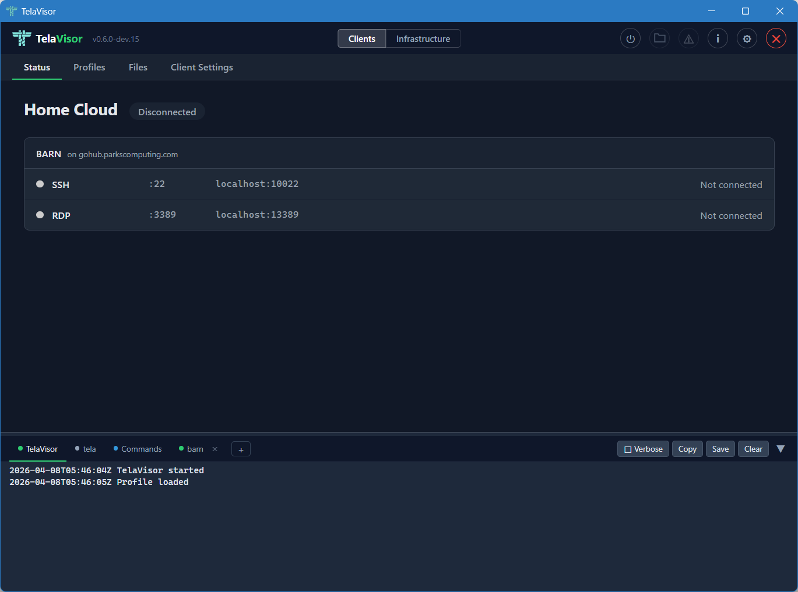

The power button in the title bar is grey when disconnected.
Clicking it starts the connection.
The button turns amber and pulses while the tunnel is being established,
then turns solid green when the tunnel is up.

When the tunnel is up, the Status page changes shape. The "Disconnected"
badge becomes a green "Connected" badge with the process identifier (PID)
of the tela child process in parentheses, the power button turns
green, and each service line updates to show its current state. A service
that is bound and waiting for traffic reads "Listening." A service with
an active session reads "Active" with the number of current connections.
A service that failed to bind reads the bind error in red.


Each service indicator dot is grey when disconnected, green when listening
or active. The transitions between Listening and Active happen in real
time as you start and stop sessions against the local addresses from
outside TelaVisor. Open `ssh user@localhost -p PORT` (using the port shown
in the Status tab) against a Listening SSH service and the dot stays green;
the count next to "Active" goes up by one for the duration of the session
and back to "Listening" when the session ends.

The status updates arrive over a local WebSocket that the `tela` process
opens for TelaVisor to subscribe to. There is no polling. The values you
see on the Status page are pushed by `tela` the moment they change in the
tunnel.

To disconnect, click the power button in the title bar again, or quit
TelaVisor. If you have *Confirm disconnect* enabled in
[Application Settings](#application-settings), TelaVisor asks for
confirmation before tearing the tunnel down.

### Profiles

The Profiles tab is where you build connection profiles. A connection
profile is a YAML file that names one or more hubs, the machines on those
hubs you want to reach, and the services on those machines you want to
expose locally. The same YAML file format is consumed by `tela connect
-profile` from the command line; the desktop application and the command
line use profiles interchangeably.

The Profiles tab has a toolbar across the top with the controls for
managing the profile collection. From left to right, the toolbar contains:

- **Profile dropdown.** Selects the active profile. Clicking the dropdown
  opens a list of every profile in your profile directory. Selecting one
  loads it into the editor below and makes it the active profile for the
  Status, Files, and Client Settings tabs as well.
- **Undo.** Reverts unsaved changes to the most recently saved state of
  the profile.
- **Save.** Writes the current selections to the profile YAML file. The
  button is enabled only when there are unsaved changes.
- **New.** Creates a new empty profile. Prompts for the profile name and
  creates an empty YAML file in the profile directory.
- **Delete.** Deletes the active profile, with confirmation.
- **Import.** Imports a profile YAML file from a path on disk. Useful for
  receiving a profile from another machine or another user.
- **Export.** Saves the active profile to a chosen path on disk. Useful
  for sharing a profile or backing it up.

Below the toolbar, the page is split into a left sidebar and a right
panel. The left sidebar lists three things: a *Profile Settings* entry,
the hubs you have credentials for, and a *Preview* entry. Each hub has a
checkbox that toggles whether the hub is included in the profile. Hubs
that are checked expand to show the machines registered with them. Each
machine has a coloured dot indicating its current online state.

The right panel changes based on what you have selected in the sidebar.

#### Profile Settings

Selecting the *Profile Settings* row in the sidebar shows the
profile-level configuration. This is the configuration that applies to
the profile as a whole, not to any one machine.

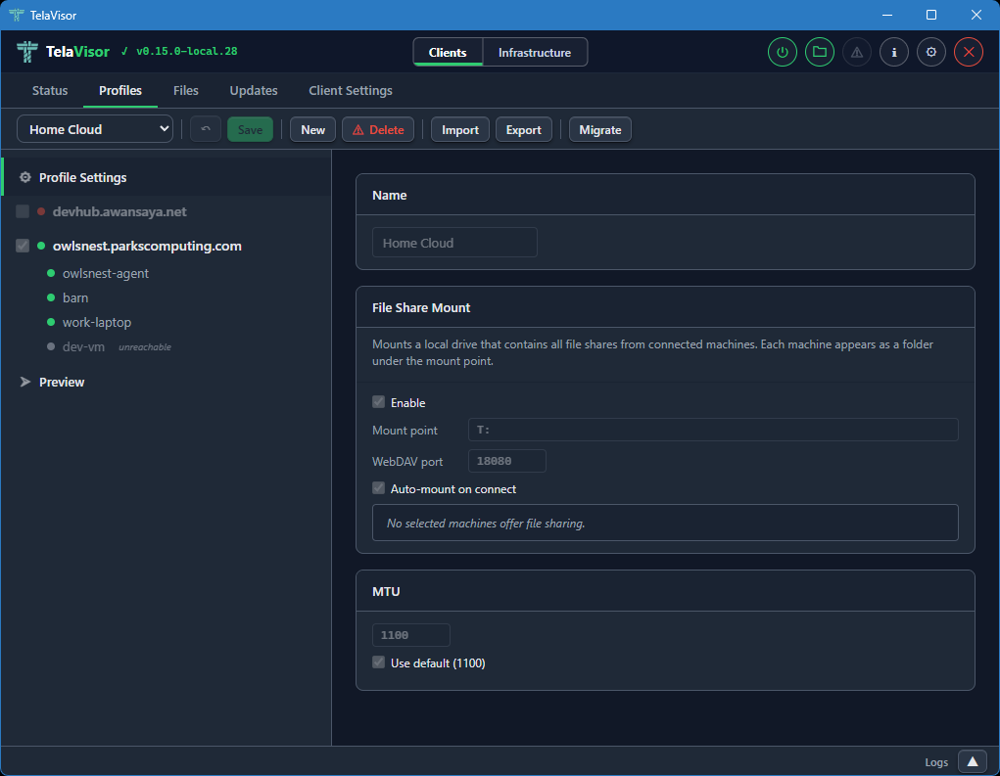

The Profile Settings panel contains:

- **Name.** The display name of the profile. The name is the file name
  of the YAML file (minus the extension) and is what appears in the
  profile dropdown.
- **File Share Mount.** The Web Distributed Authoring and Versioning
  (WebDAV) mount configuration. An *Enable* checkbox turns the mount
  on or off. The *Mount point* field sets the local path or drive letter
  to mount onto. The *Port* field sets the local TCP port the WebDAV
  server listens on. The *Auto-mount on connect* checkbox mounts the
  share automatically when the profile connects. Below these controls,
  a live preview lists every machine in the profile that has file
  sharing enabled. Each listed machine will appear as a folder under
  the mount point when the tunnel is connected. The mount feature is
  the desktop equivalent of `tela mount` from the command line.
- **MTU.** The Maximum Transmission Unit override for the WireGuard
  interface. The default is 1100, which works on every network the
  project has tested against. The override is useful when a specific
  link path requires a smaller MTU to avoid fragmentation. The *Use
  default* checkbox uses the default value and disables the input box.

The Profile Settings panel is where you set up things that apply to the
profile regardless of which machine you are connecting to.

#### Switching profiles

The profile dropdown in the toolbar shows every profile in your profile
directory. Click the dropdown to open the list and select a profile to
switch to.

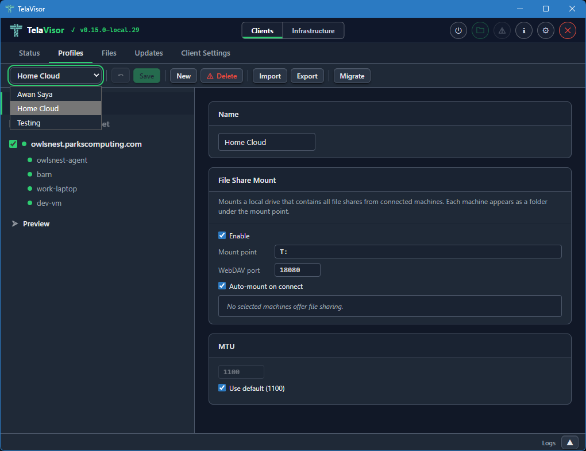

Switching profiles loads the selected profile into the editor and makes
it the active profile across the rest of the application. The Status
tab, the Files tab, the Client Settings tab, and the connection state
all follow the active profile. If you switch profiles while connected,
TelaVisor disconnects the current profile first (asking for confirmation
if confirm-disconnect is enabled), then loads the new profile without
automatically reconnecting. Click the power button in the title bar to
connect with the new profile.

#### Hub view

Clicking a hub in the sidebar shows a summary card for that hub in the
right panel.

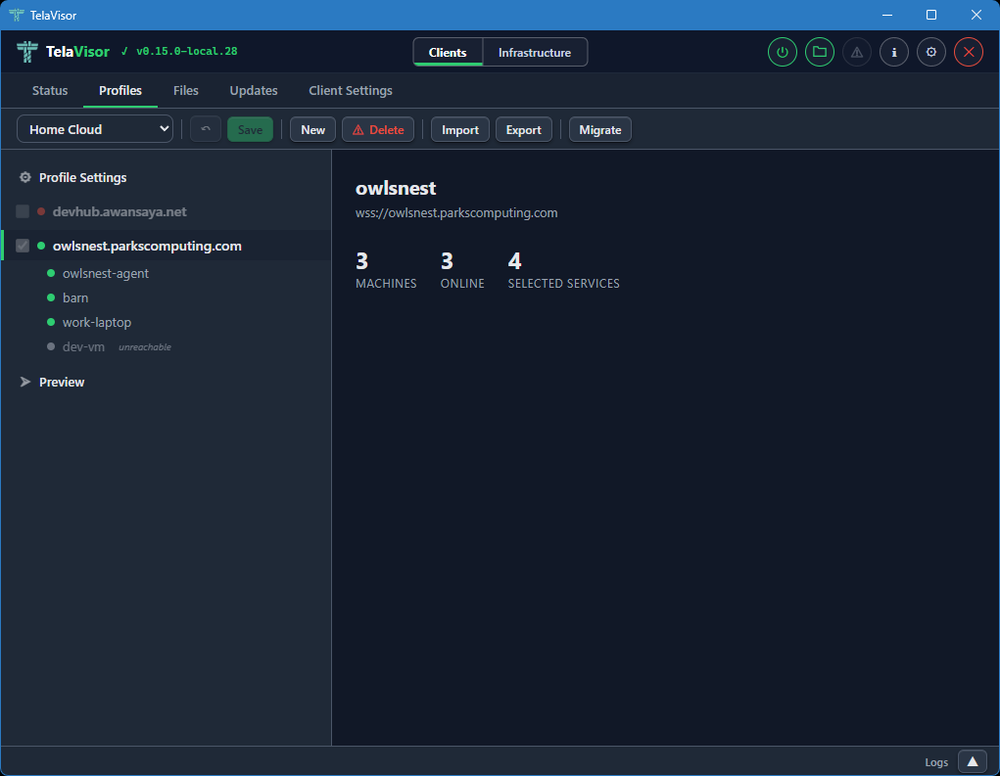

The hub summary shows the hub name, the hub URL, and three statistics:

- **Machines.** The total number of machines registered with this hub.
- **Online.** The number of those machines that are currently online.
- **Selected services.** The number of services on this hub that are
  currently included in the profile.

The hub view is the place to get a quick read on whether the hub has the
machines you expect. From here you can drill into a specific machine by
clicking it in the sidebar.

#### Machine view

Clicking a machine in the sidebar shows the services that machine
exposes through the hub.

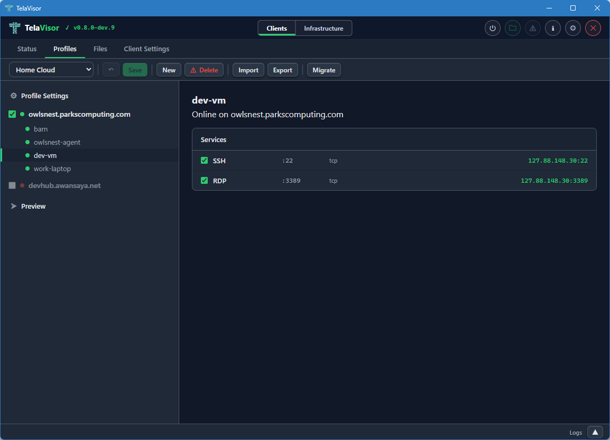

The machine view shows the machine name, the hub it is registered with,
the machine's online status, and a list of every service the machine
exposes. Each service has a checkbox that toggles whether the service is
included in the profile. The columns show:

- **Service name.** Either the name the agent advertised (for example,
  `SSH`, `RDP`, `postgres`) or, if the agent did not advertise a name,
  the port number.
- **Remote port.** The port the service listens on inside the
  encrypted tunnel, on the agent side.
- **Protocol.** The transport protocol of the service (almost always
  `tcp` because Tela is a TCP fabric).
- **Local address.** The address and port the `tela` process binds on
  `127.0.0.1` when the profile is connected. The first choice is the
  service's real port (for example, `localhost:22` for SSH). If that port
  is already in use, the client tries `port+10000` (`localhost:10022`),
  then `port+10001`, and so on until a free port is found. The actual bound
  address and port are shown here once the profile is connected.

When the tunnel is connected, the hub and machine checkboxes are
disabled. This prevents accidental profile changes during an active
session. To edit the profile, disconnect first.

#### Preview

Clicking the *Preview* row in the sidebar shows the live YAML preview of
the profile.

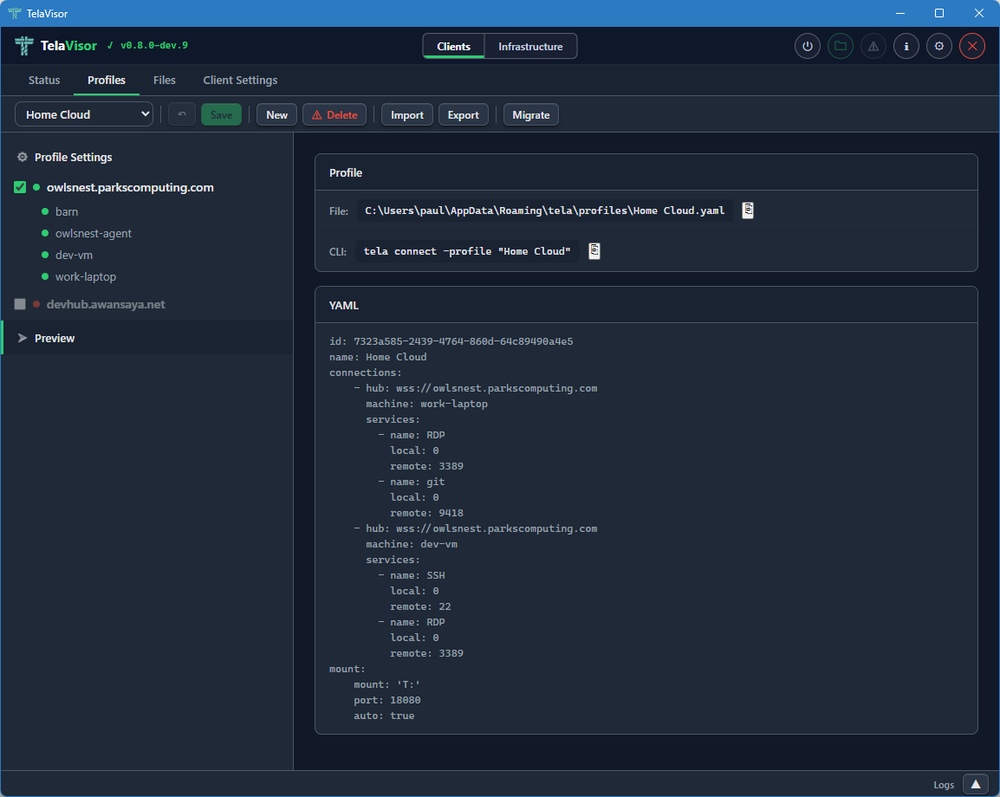

The preview displays the exact YAML that TelaVisor will write to the
profile file when you click Save. The file path of the profile is shown
in the header of the preview panel. The YAML preview is read-only inside
TelaVisor; if you want to edit the profile by hand, open the file in a
text editor and the changes will be reflected the next time TelaVisor
loads it.

The preview is also the canonical answer to the question *what command
line equivalent does this profile correspond to?* The same YAML file
works with `tela connect -profile <path>` from a shell, so the preview
shows you exactly what is happening under the hood when you click
Connect.

### Files

The Files tab is the built-in file browser. It uses the agent's file
share protocol over the encrypted tunnel to list, upload, download,
rename, move, and delete files on machines that have file sharing
enabled. There is no Secure Shell (SSH), no Server Message Block (SMB),
and no Web Distributed Authoring and Versioning (WebDAV) mount required;
the file browser talks the file share protocol directly.

#### When the tunnel is down

When the tunnel is not connected, opening the Files tab shows the list
of machines in the active profile, but the only state you can see is
"disconnected."

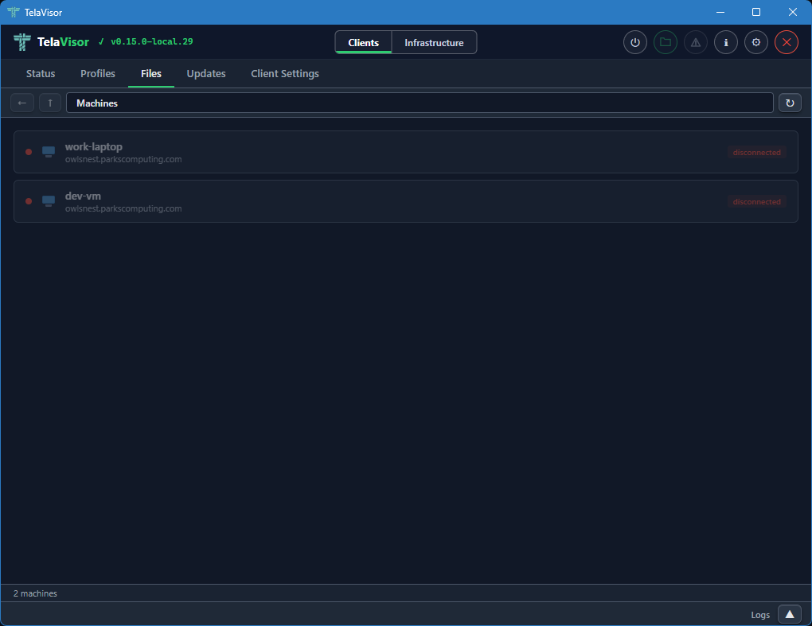

You cannot browse files until you connect the profile. The Files tab in
this state is mostly informational: it tells you which machines are part
of the active profile and that none of them are reachable yet.

#### When the tunnel is up

When the tunnel is connected, the Files tab shows each machine with its
file share status: a coloured indicator dot, the machine name, the hub
it is registered with, and badges describing the file share's policies.

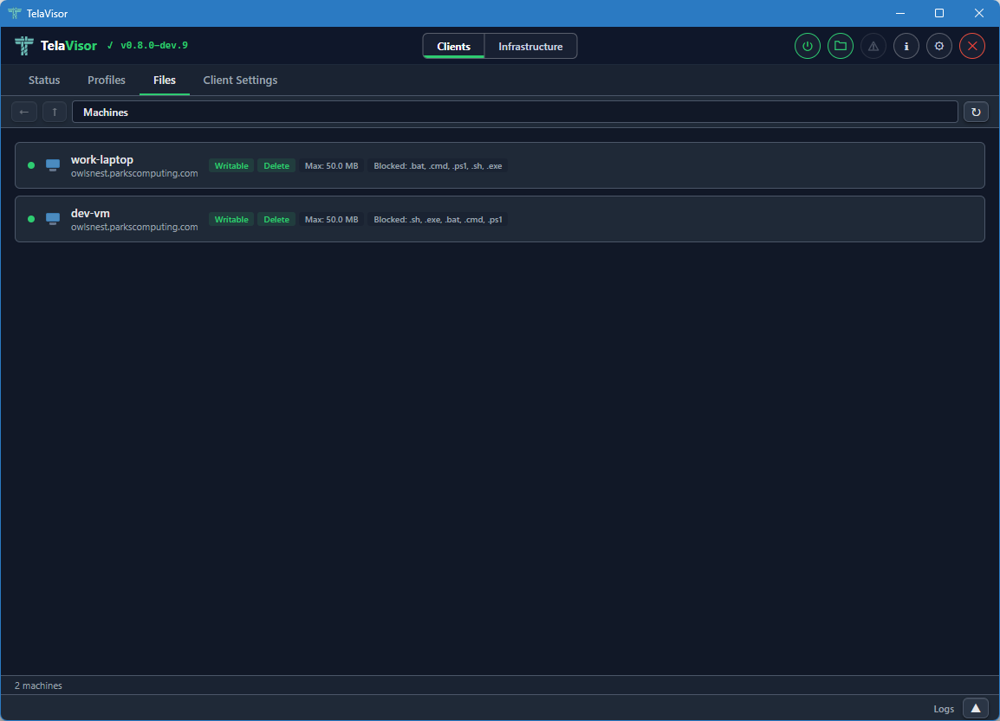

The badges include:

- **Writable.** The agent allows uploads and modifications.
- **Delete.** The agent allows file deletion.
- **Max:** the maximum file size the agent will accept on upload.
- **Blocked:** the file extensions the agent refuses to accept on
  upload.

These badges come from the agent's file share configuration and are
read-only in this view. Editing them is done from the
[Agents tab](#agents) in Infrastructure mode, on a machine where you
have the manage permission.

#### Browsing files

Clicking a machine opens its file share in an Explorer-style browser.


The browser layout has four parts:

- **Address bar.** Back, up, and a path display showing the current
  directory. Each segment of the path is clickable to navigate to that
  ancestor directory.
- **Action bar.** Buttons for *Upload*, *New Folder*, *Rename*,
  *Download*, and *Delete*, plus a *Hide dotfiles* toggle on the right.
  Each action button is enabled or disabled based on the current
  selection and the file share's permissions. Upload and New Folder
  require the share to be writable. Delete requires the share to allow
  deletion.
- **File list.** A sortable table with columns for *Name*, *Date
  modified*, *Type*, and *Size*. Folders are listed first, then files,
  each group sorted alphabetically by default. Click a column header to
  sort by that column.
- **Status bar.** Shows the file count, folder count, total size of the
  current directory, and a read-write or read-only indicator for the
  share.

Selection follows standard desktop conventions:

- **Click** to select a single item.
- **Ctrl+click** to toggle individual items in a multi-selection.
- **Shift+click** to extend a range selection.
- **Double-click a file** to download it.
- **Double-click a folder** to enter it.

Drag and drop is supported on writable shares. Drag a file or folder
onto a target folder to move it. If the dragged item is part of a
multi-selection, all selected items move together. The target folder
highlights with a dashed outline while the drag is over it.

The file list updates in real time. When files are created, modified,
deleted, or renamed on the remote machine by any process, the changes
appear in the file list automatically. This works because the agent
watches the file share directory using the operating system's native
file change notifications and pushes change events back through the
tunnel to TelaVisor.

### Client Settings

The Client Settings tab is where you configure how the `tela` process
runs on the local machine. It has its own toolbar at the top with *Undo*
and *Save* buttons. Both are enabled when there are pending changes.

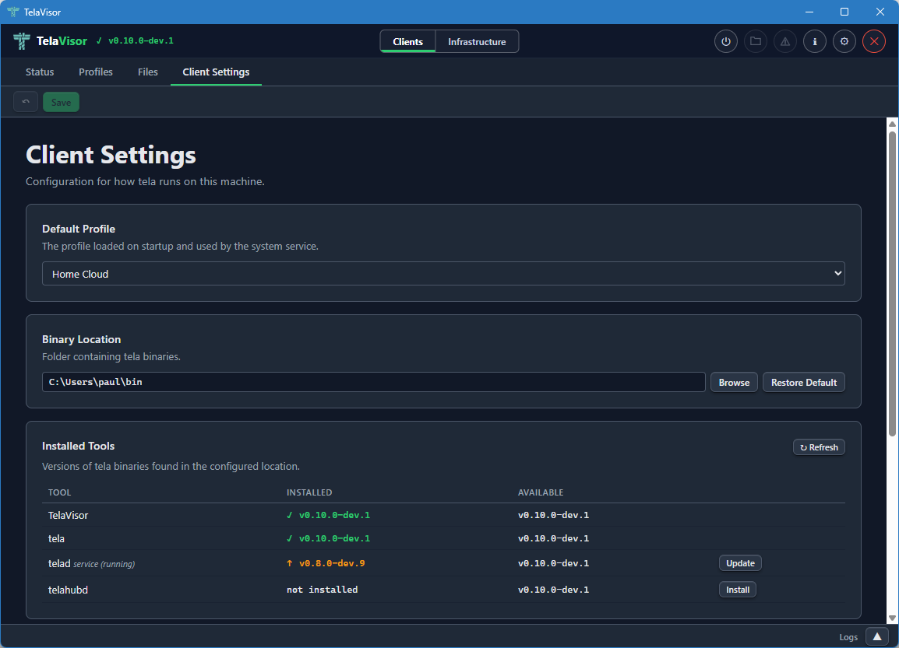

The tab contains four sections.

#### Default Profile

A dropdown that selects which profile loads when TelaVisor starts and is
used by the system service when one is installed. The dropdown lists every
profile in your profile directory.

#### Binary Location

The folder where TelaVisor looks for the managed binaries: `tela`,
`telad`, and `telahubd`. The default is the platform's standard local
application directory:

| Platform | Default location |
|----------|------------------|
| Windows | `%LOCALAPPDATA%\tela` |
| Linux | `~/.local/share/tela` |
| macOS | `~/Library/Application Support/tela` |

Use the *Browse* button to choose a different folder, or *Restore Default*
to reset.

The Binary Location is the directory where TelaVisor will install or
update tools through the *Installed Tools* table below. It is also the
directory the system service is configured against, so all four roles
(TelaVisor, the `tela` CLI, `telad`, `telahubd`) read and write the same
binaries from the same place.

#### Installed Tools

A table showing every Tela binary that TelaVisor manages. Each row has
four columns:

- **Tool.** The binary name (TelaVisor, tela, telad, telahubd).
- **Installed.** The version currently on disk in the configured Binary
  Location, or *not installed*.
- **Available.** The latest version on the release channel TelaVisor
  itself is following.
- **Action.** A button that depends on the row's state. *Update* if the
  installed version is older than the available version. *Install* if
  the binary is missing. *Up to date* (disabled) if the installed
  version matches the available version.

The available version comes from the release channel manifest, not from
GitHub `releases/latest`. So a TelaVisor configured to follow the `dev`
channel compares against `dev.json`, a TelaVisor on `beta` against
`beta.json`, a TelaVisor on `stable` against `stable.json`. Changing the
channel in [Application Settings](#application-settings) immediately
changes which manifest the table compares against, and the buttons in
this table re-evaluate. Every download is verified against the channel
manifest's SHA-256 hash before being written to disk.

When `telad` or `telahubd` is installed as a managed operating system
service, the Installed Tools row shows `service (running)` or `service
(stopped)` next to the binary name. The Update button in this state
delegates the swap to the elevated service process; TelaVisor itself
does not need to be elevated. After the service restarts against the
new binary, the Installed column polls the on-disk version until it
changes, so the displayed version always reflects what is actually
running.

The *Refresh* button at the top right of the table re-checks every row
against the channel manifest. Use it after changing channels or after
publishing a new release.

#### System Service

Controls for installing the `tela` client as a system service. The
service runs the default profile as an always-on background tunnel that
starts with the operating system, so the tunnel is up before any user
logs in. This is useful for production deployments where the tunnel
needs to survive logouts and reboots.

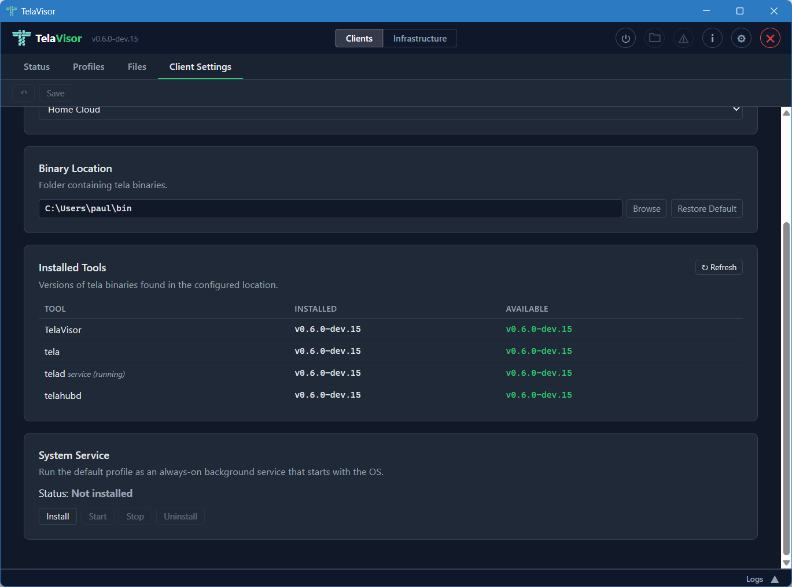

The Status field shows whether the service is currently *Installed* or
*Not installed*. Four buttons control the service: *Install*, *Start*,
*Stop*, and *Uninstall*. The buttons are enabled or disabled based on
the current state. *Install* asks for elevation (User Account Control on
Windows, `sudo` on Linux, an authentication prompt on macOS). The
service uses the platform-native service manager: Windows Service
Control Manager (SCM) on Windows, systemd on Linux, launchd on macOS.

#### User Autostart

Controls for running the `tela` client as a user-level autostart task
that launches when you log in, without requiring administrator
privileges. Unlike the System Service, User Autostart runs in your
login session, which means it starts only after you log in and stops
when you log out. It is suited to personal machines where you want
the tunnel up for your own use but do not need it active before login
or for other users.

The Status field shows whether autostart is currently *Installed* or
*Not installed*. Three buttons control it: *Install*, *Start*, and
*Stop*. *Install* does not require elevation. On Windows, TelaVisor
registers a Scheduled Task that triggers at login. On Linux, it writes
a systemd user unit. On macOS, it installs a LaunchAgent.

## Infrastructure mode

Switching the mode toggle in the title bar to *Infrastructure* changes
the tab bar to the four administration tabs: Hubs, Agents, Remotes, and
Credentials. Infrastructure mode is for operators. None of the features
in this mode are required for a user who only wants to make a connection.
All of them become important the moment you start running hubs or agents
on behalf of yourself or others.

### Hubs

The Hubs tab is the centre of operator workflows. It is where you
administer any hub you have credentials for: viewing settings, managing
machines, granting and revoking access, issuing tokens, viewing
connection history, and updating or restarting the hub binary.

The tab is laid out with a sidebar on the left containing a hub picker
dropdown, a navigation list of views, and an *Add Hub* button at the
bottom. The right panel shows the currently selected view for the
currently selected hub.

#### Hub picker

The hub picker at the top of the sidebar lists every hub you have
credentials for. Clicking it opens a dropdown of hub URLs.

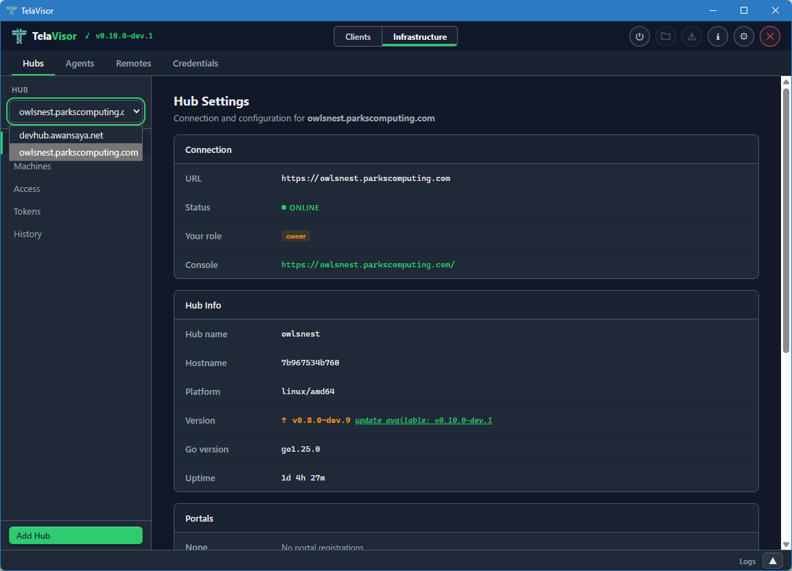

Selecting a hub from the dropdown loads its data into the views below.
All five views (Hub Settings, Machines, Access, Tokens, History) are
scoped to the currently selected hub.

If you do not have credentials for any hub yet, the dropdown is empty
and the *Add Hub* button at the bottom of the sidebar is the only way
forward. *Add Hub* opens a dialog where you can paste a hub URL and
either a token or a one-time pairing code.

#### Hub Settings

The Hub Settings view shows everything about the hub itself: connection
details, hub metadata, portal registrations, lifecycle controls, and
destructive actions.

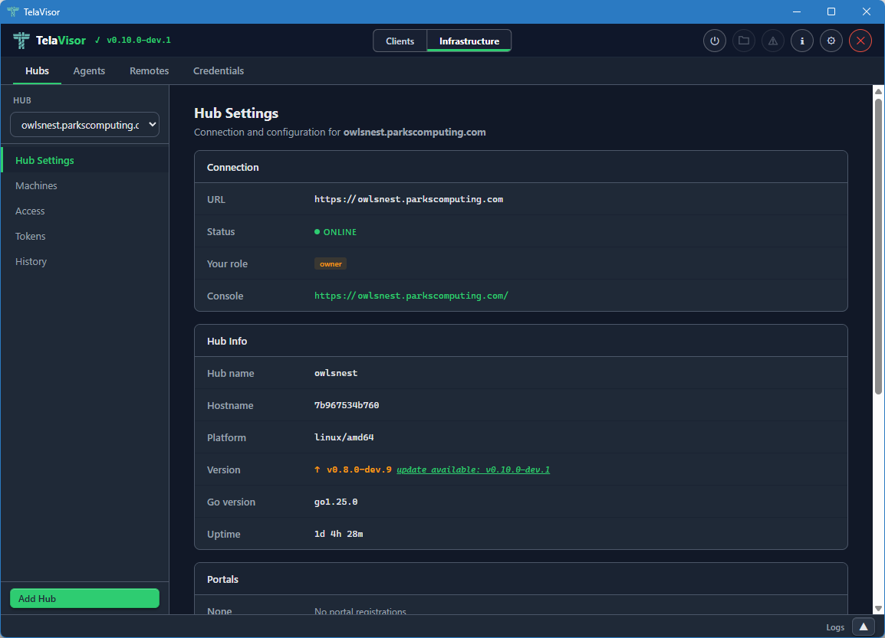

The Connection section at the top shows:

- **URL.** The hub's connection URL, beginning with `wss://` for
  WebSocket Secure or `ws://` for plain WebSocket.
- **Status.** The hub's online state.
- **Your role.** The role of the token you authenticated with: owner,
  admin, user, or viewer. This determines which actions in the rest of
  the page you are allowed to take.
- **Console.** A clickable link to the hub's web console (the
  browser-based admin interface that the hub serves on its own URL).

Below Connection, the Hub Info section shows metadata reported by the
hub at `/api/status`:

- **Hub name.** The hub's configured name.
- **Hostname.** The hostname of the machine the hub is running on.
- **Platform.** The operating system and architecture (`linux/amd64`,
  `windows/amd64`, etc.).
- **Version.** The release version of the hub binary, with a coloured
  badge showing whether it is current or behind the channel manifest.
  Green with `(latest: vX.Y.Z)` when current, amber with `update
  available: vX.Y.Z` when behind. The "available" version comes from
  the hub's own release channel manifest, so a hub running on the `dev`
  channel is compared against `dev.json`, a hub on `stable` against
  `stable.json`.
- **Go version.** The Go runtime version the hub binary was compiled
  with.
- **Uptime.** How long the hub process has been running since its last
  start.

Below Hub Info, the Portals section lists hub directories the hub is
registered with. Each entry shows the directory name and the directory
URL. Adding a portal here is the equivalent of running `telahubd portal
add` from the command line.

The Management section provides hub lifecycle controls. These are only
visible to owners and admins:

- **Log output.** A *View Logs* button that opens a new tab in the log
  panel streaming the hub's recent log buffer through the
  `/api/admin/logs` endpoint.
- **Release channel.** A dropdown showing the hub's currently
  configured release channel (`dev`, `beta`, or `stable`) with a status
  string showing the current and latest versions on that channel.
  Changing the dropdown opens a confirmation dialog and, on confirm,
  sends `PATCH /api/admin/update` to the hub to switch its channel
  persistently. The Software button below updates immediately to
  reflect the new channel's HEAD. If the hub is too old to support
  channels (returns HTTP 405 for the new endpoint), the row hides
  itself and the Software button shows `pre-channel build (update first
  via legacy path)`.
- **Software.** Shows whether the hub is up to date or behind the
  channel's HEAD. The button label reads either `Up to date` (disabled)
  or `Update to vX.Y.Z` (active). Clicking the active button asks the
  hub to download the new release, verify it against the channel
  manifest's SHA-256 hash, replace its binary, and restart. Progress is
  shown inline (`Hub is downloading update and restarting...`,
  `Waiting for hub to restart... (1)`, `Updated to vX.Y.Z`) and the
  page re-renders when the hub comes back online. The label and
  disabled state are derived from the channel manifest, not from the
  GitHub `/releases/latest` API, so a hub on `dev` cannot be told to
  "update to v0.5.0" (the `stable` HEAD).
- **Restart.** Requests an immediate graceful restart of the hub
  process.

The Danger Zone at the bottom of the page provides destructive actions:
removing the hub from TelaVisor's local list (which does not affect the
hub itself, only your local credentials and view) and clearing all
stored hub tokens from the local credential file.

The Hub Settings view is the same shape regardless of which hub you have
selected. The values change with the hub; the layout does not. A second
hub on a different release version would show the same panels with
different version badges.

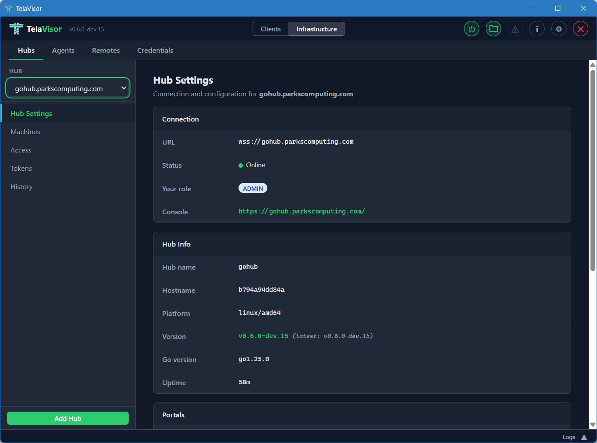

#### Machines

The Machines view lists all machines registered on the selected hub
with their online status, last-seen timestamp, advertised services, and
active session count.

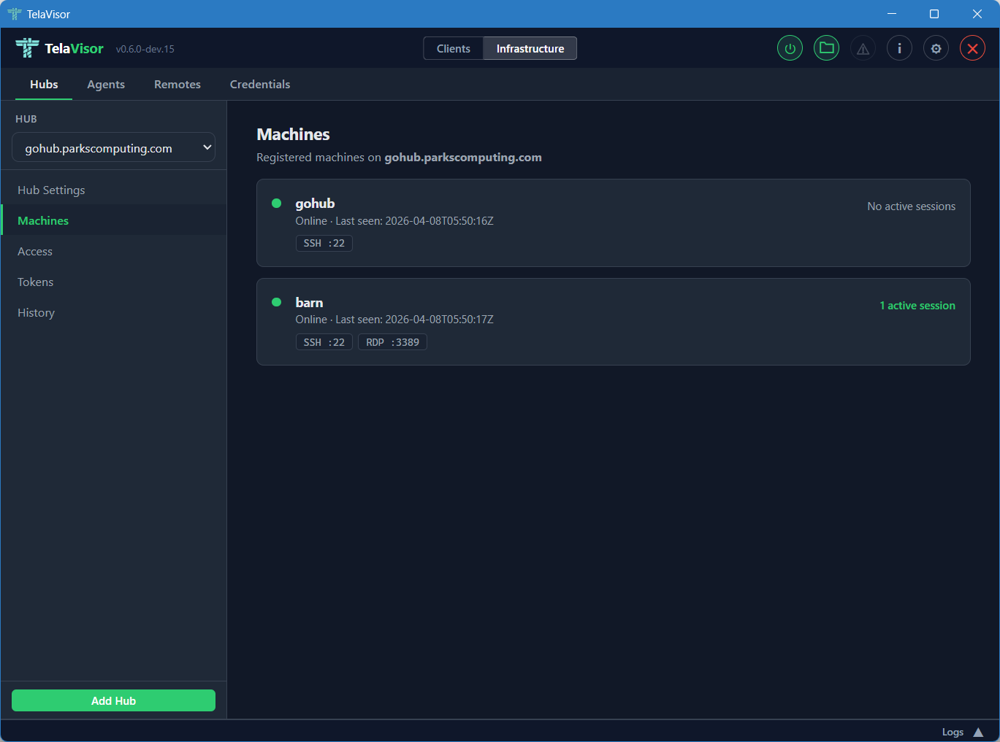

Each machine row shows:

- **Online indicator.** A coloured dot, green for online, grey for
  offline.
- **Machine name.** The name the agent registered with.
- **Last seen timestamp.** Either the most recent contact time for an
  online machine, or the last time the machine was seen for an offline
  machine, in ISO 8601 Coordinated Universal Time (UTC) format.
- **Service badges.** A pill for each service the machine advertises,
  showing the service name and the remote port (for example, `SSH :22`,
  `RDP :3389`).
- **Active session count.** The number of active client sessions on
  this machine, on the right side of the row.

The Machines view is read-only. To edit a machine's configuration, find
the agent in the [Agents tab](#agents) and use the agent detail panel.
To remove a machine from a hub, use the Danger Zone in the agent
detail.

#### Access

The Access view shows the unified per-identity, per-machine permission
model. Each identity is a card showing its role pill, token preview, and the
machines it has permissions on.

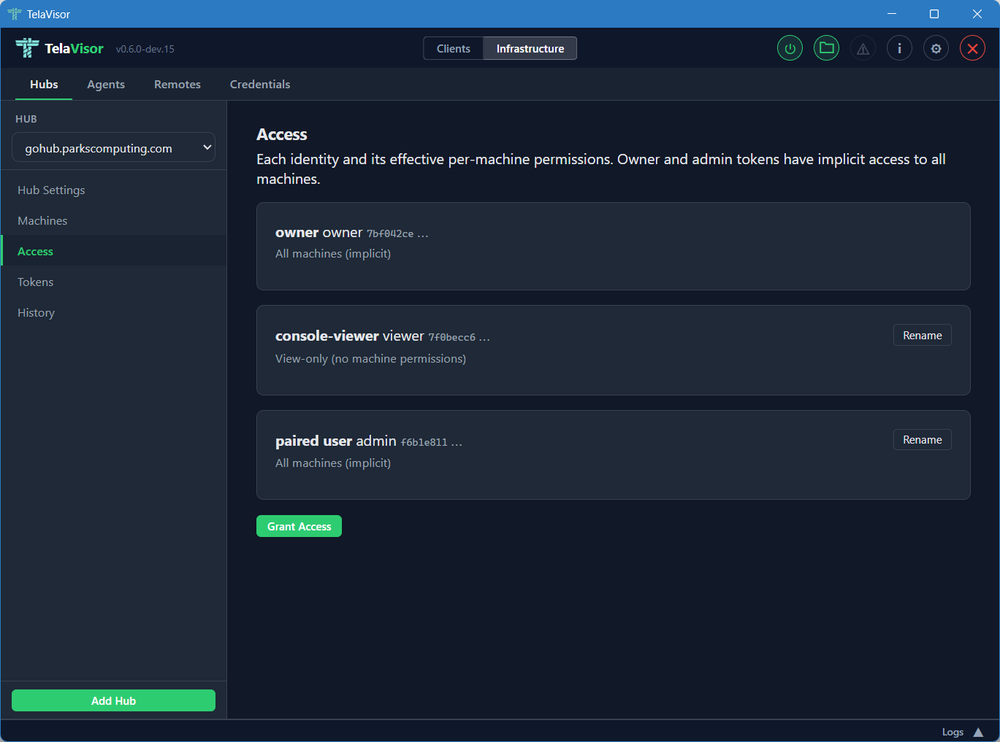

For each identity card you see:

- **Identity name.** The name the token was issued under.
- **Role pill.** Owner, admin, user, or viewer. Owner and admin roles
  have implicit access to all machines, so their cards do not list
  per-machine permissions; the absence of a list is the
  whole-permission grant.
- **Token preview.** The first 8 characters of the token, followed by
  an ellipsis. Full tokens are only visible at creation time.
- **Per-machine permissions.** A list of machines this identity has
  explicit permissions on, each with a comma-separated list of the
  granted permissions (`register`, `connect`, `manage`).
- **Rename button.** Renames the identity. Tokens are not affected by
  the rename.

The *Grant Access* button at the bottom of the page opens a dialog that
lets you grant permissions to any identity on any machine. The dialog
asks you to choose an identity, choose a machine (or the wildcard `*`
which applies to all machines), and choose which of the three
permissions to grant: *Connect* lets the identity open a tunnel to the
machine; *Register* lets the identity register the machine (single
assignment, only one identity can be the registrant); *Manage* lets the
identity view and edit the agent's configuration, view its logs, and
restart or update it remotely.

The Access view is the canonical place to answer the question *who can
do what to which machine on this hub*. It is the visual equivalent of
the unified `/api/admin/access` API endpoint.

#### Tokens

The Tokens view manages authentication tokens for the selected hub. You
can create new identities, rotate tokens, delete identities, and
generate one-time pairing codes.


The token table shows every identity on the hub, with columns for:

- **Identity.** The identity name.
- **Role.** A coloured role pill.
- **Token preview.** The first 8 characters of the token. Full tokens
  are only visible immediately after creation or rotation, never again.
- **Actions.** *Rotate* (issues a new token for the identity, showing
  the new token in a one-time dialog) and *Delete* (removes the
  identity, with confirmation).

The *Add Token* button at the top creates a new identity. The dialog
asks for an identity name and a role (owner, admin, user, or viewer)
and shows the new token in a one-time display after creation. Save the
token immediately; you will not see it again.

The *Generate Pairing Code* button issues a short-lived, single-use
code (for example, `ABCD-1234`) that can be exchanged for a permanent
token by running `tela pair` from the command line or by pasting the
code into TelaVisor's pairing flow on another machine. The dialog lets
you choose the role of the resulting token and the expiration window
(10 minutes to 7 days). Pairing codes are the recommended way to
onboard a user or an agent, because they avoid copying 64-character
hex tokens by hand.

To change a token's role, delete the identity and create a new one with
the desired role. Roles are immutable on existing tokens by design;
changing the role would invalidate the principle that the token at a
given hash always confers a known set of permissions.

#### History

The History view shows recent session events on the selected hub:
agent registrations, client connections, client disconnections, agent
disconnections.

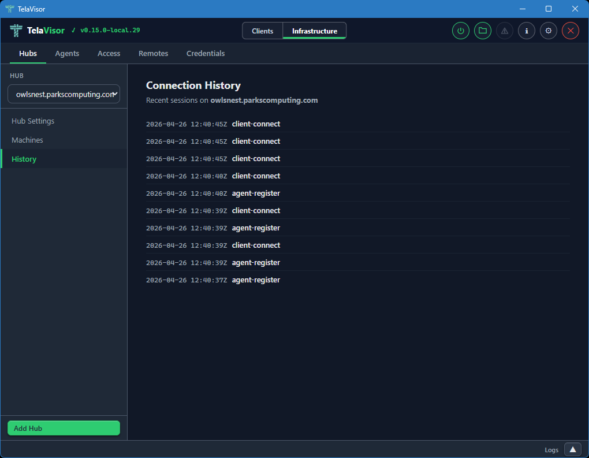

Each row shows:

- **Timestamp.** The event time in ISO 8601 UTC.
- **Event type.** `agent-register`, `agent-disconnect`,
  `client-connect`, `client-disconnect`.
- **Identity.** The identity that triggered the event, when known.
- **Machine.** The machine the event applies to, when relevant.

The history is held in a fixed-size ring buffer in the hub. Older
events are evicted as new ones arrive. The buffer survives within a
single hub process and is reset when the hub restarts. Persistent audit
log shipping is planned under the *Audit log retention* item in
[ROADMAP-1.0.md](https://github.com/paulmooreparks/tela/blob/main/ROADMAP-1.0.md).

### Agents

The Agents tab manages every agent (`telad` instance) visible across all
the hubs you have credentials for, *without requiring an active tunnel
connection*. The agents are listed by querying each hub's machines
endpoint and merging the results into a single fleet view. You can
manage an agent on a hub on the other side of the world without first
opening a tunnel to one of its services.

The tab is laid out with a sidebar on the left listing every visible
agent and a detail panel on the right. A toolbar above the detail panel
contains *Undo*, *Save*, *Restart*, and *Logs* buttons that act on the
currently selected agent. *Undo* and *Save* are enabled when there are
unsaved changes. *Restart* and *Logs* are always enabled when an agent
is selected.

#### Agent list

When no agent is selected, the right panel is empty with a prompt to
select one.

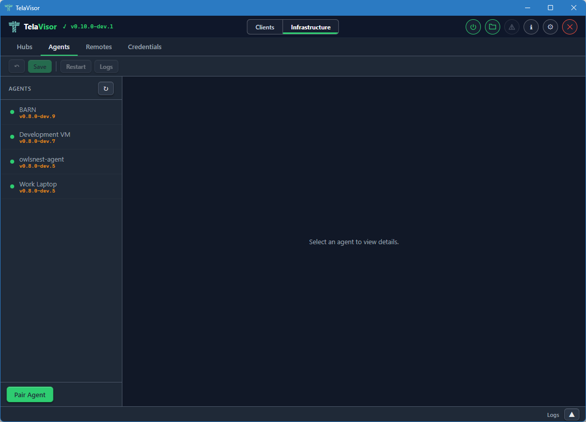

Each entry in the agent sidebar shows:

- **Online indicator.** A coloured dot.
- **Agent name.** The name the agent registered as.
- **Agent version.** The release version of the agent binary, displayed
  as a small caption.

A *Pair Agent* button at the bottom of the sidebar opens the same
pairing flow used for users: it asks for a pairing code generated by
the [Tokens view](#tokens) and exchanges it for a permanent agent
token, then registers the agent with the hub the code was issued from.

#### Agent detail

Selecting an agent in the sidebar shows the agent detail panel on the
right.


The detail panel is divided into cards, each covering one aspect of
the agent.

**Agent Info** is a read-only card showing metadata reported by the
agent at registration:

- **Version.** The release version with an up-to-date badge.
- **Hub.** The hub the agent is registered with.
- **Hostname.** The hostname of the machine the agent is running on.
- **Platform.** The operating system and architecture.
- **Last seen.** The last contact timestamp.
- **Active sessions.** The number of active client sessions on this
  machine right now.

**Display Name** is an editable field for a human-readable name shown
in dashboards and portals. Defaults to the registered machine name.

**Tags** is an editable field for comma-separated metadata tags. Useful
for filtering large fleets by environment, region, customer, or any
other dimension that matters to your operation.

#### Location, Services, and File Share

Scrolling further down the agent detail panel reveals the operational
configuration cards.

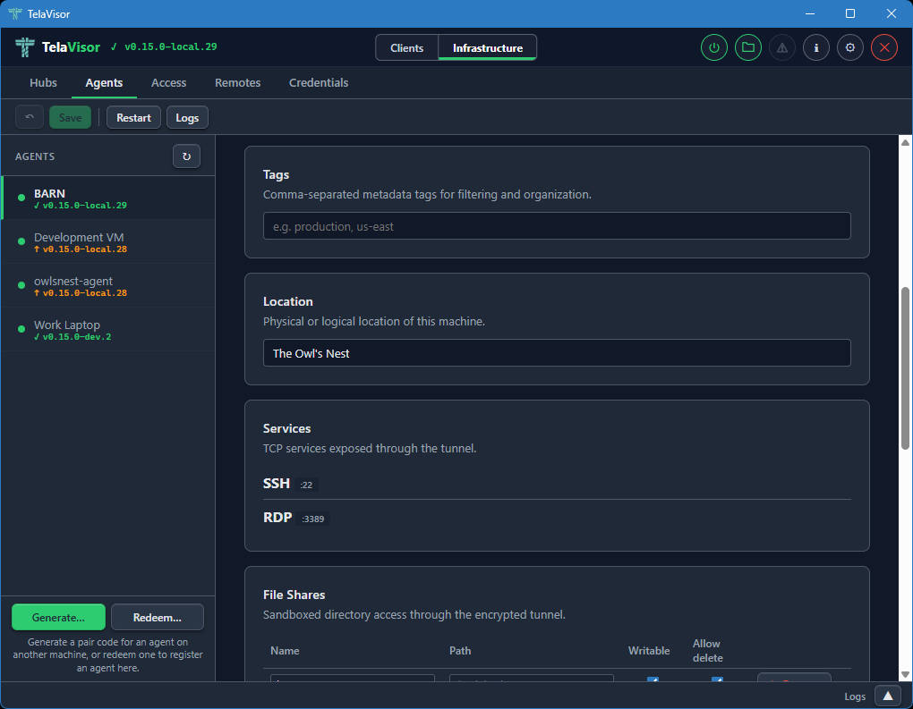

**Location** is an editable free-text field describing the physical or
logical location of the machine. Used for documentation and dashboard
display. Tela does not interpret it.

**Services** lists the ports and protocols the agent exposes through
the tunnel. Each row shows the service name, the remote port, and the
protocol. The list is read-only here because changing the advertised
services requires editing the agent's `telad.yaml` file directly. To
add or remove a service, use the agent's local configuration file or
push a new configuration through the management protocol.

**File Share** is the editable agent file share configuration. The card
contains:

- **Enabled.** A checkbox that turns the file share on or off.
- **Writable.** A checkbox that controls whether uploads are allowed.
- **Allow delete.** A checkbox that controls whether deletion is
  allowed.
- **Max file size.** A field that sets the largest file the agent will
  accept on upload, in megabytes.
- **Blocked extensions.** A comma-separated list of file extensions
  the agent will refuse to accept on upload, regardless of the
  writable setting. Useful for blocking executables and scripts.

Editable fields in any card are pushed to the agent through the
hub-mediated management protocol when you click *Save*. The agent
validates the new configuration and persists it to its `telad.yaml`
file. Changes that pass validation take effect immediately. Changes
that fail validation are rejected with an error message.

The manage permission is required to edit any of these fields. Owner
and admin roles have it implicitly. User-role tokens need an explicit
manage grant on the relevant machine, issued through the
[Access view](#access).

#### Management and Danger Zone

Scrolling to the bottom of the agent detail panel reveals the
Management card and the Danger Zone.

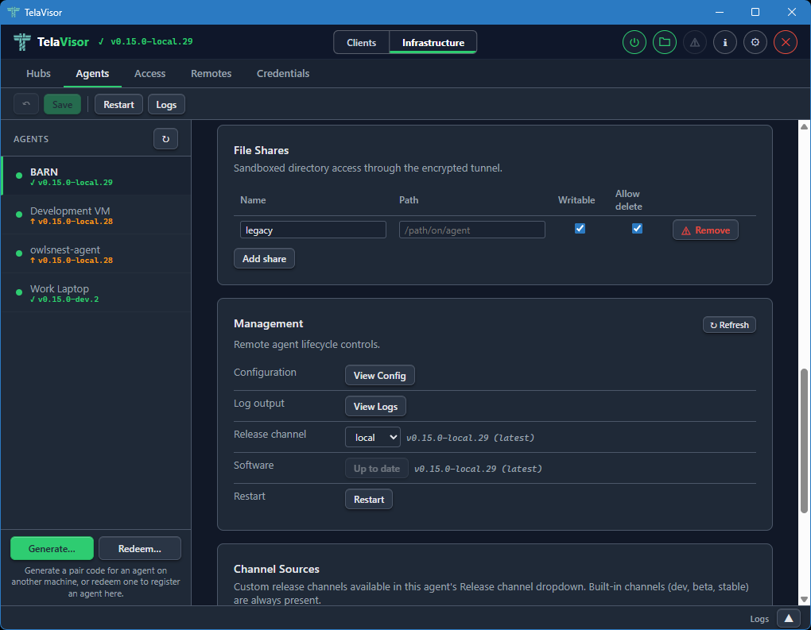

The Management card mirrors the layout of the hub Management card from
[Hub Settings](#hub-settings):

- **Configuration.** A *View Config* button that opens the agent's
  running configuration in a dialog. The configuration is fetched live
  through the management protocol so it reflects what the agent is
  actually using right now, not what is on disk in
  `telad.yaml`.
- **Log output.** A *View Logs* button that opens a new tab in the log
  panel and fetches the agent's recent log buffer through the
  `update-status` mgmt action via the hub's mediated management proxy.
- **Release channel.** A dropdown showing the agent's currently
  configured release channel with a status string showing current and
  latest versions on that channel. Changing the dropdown opens a
  confirmation dialog and, on confirm, sends the `update-channel` mgmt
  action through the hub-mediated proxy to switch the agent's channel
  persistently. Pre-channel agents (older `telad` versions that do not
  recognize the action) hide the row and show `pre-channel build
  (update first via legacy path)` next to the Software button.
- **Software.** Shows whether the agent is up to date or behind the
  channel's HEAD. The label, title, and disabled state are derived
  from the channel manifest via the agent's `update-status` mgmt
  action, so an agent on `dev` is never offered a `stable` build.
  Clicking *Update* opens a confirmation dialog before proceeding.

  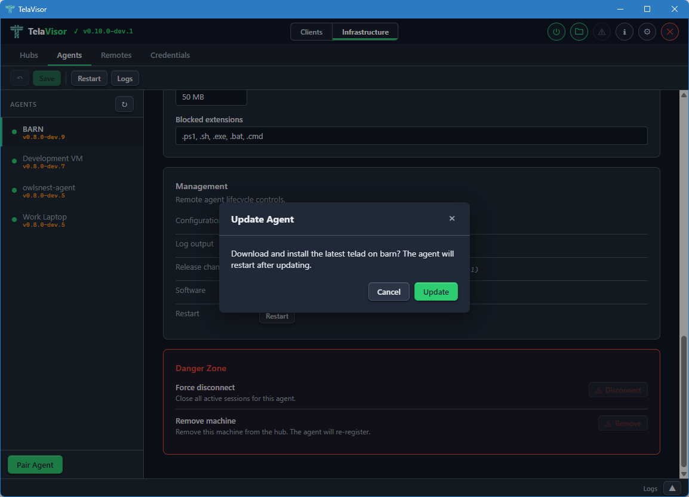

  The dialog names the machine and confirms that the agent will restart
  after the update. Clicking *Update* in the dialog sends the `update`
  mgmt action through the hub-mediated proxy. The agent downloads the
  new release, verifies it against the channel manifest's SHA-256, and
  atomically swaps its binary.

  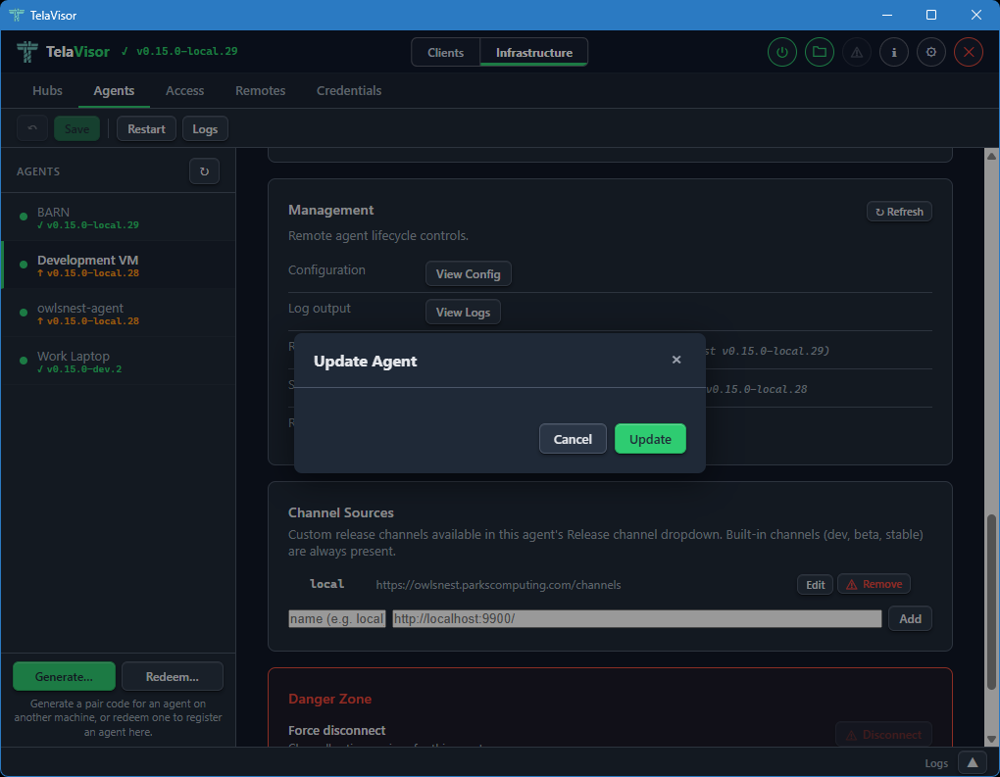

  While the update is in progress the Software row shows a progress
  indicator. The rest of the management panel remains visible. If the
  agent is running under a service manager (Windows SCM, systemd,
  launchd) it exits cleanly and the manager restarts it against the
  new binary. If the agent is running standalone it relaunches itself.

  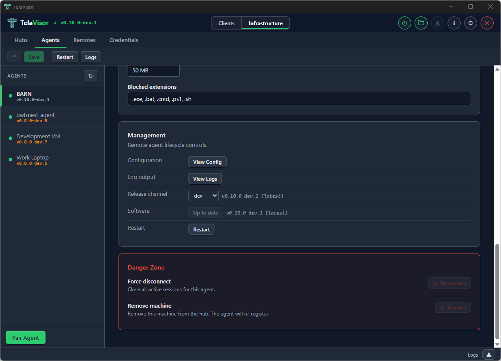

  Once the agent reconnects, the Software row reflects the new version.
  The channel and version information updates automatically as the
  agent re-reports its state through the management protocol.

- **Restart.** Requests a graceful restart of the agent process.

The Danger Zone at the bottom of the agent detail panel provides two
destructive actions:

- **Force Disconnect.** Drops the agent's current connection to the
  hub. The agent's reconnect logic will attempt to re-establish the
  connection within seconds. Useful for forcing the agent to pick up a
  new configuration that requires a reconnection.
- **Remove Machine.** Removes the machine from the hub entirely,
  invalidating its registration. The agent will need to re-register on
  its next connection. This is the action to take when retiring a
  machine.

When `telad` runs as an operating system service (Windows SCM, systemd,
launchd) the same Update and Restart actions work because `telad`
detects that it is running under a process manager and exits cleanly,
letting the manager restart the binary. This avoids leaving orphan
processes from a self-spawned restart.

### Remotes

The Remotes tab manages hub directory endpoints for short name
resolution. This is the desktop equivalent of the `tela remote` family
of CLI commands. Each remote maps a name to a directory URL that
provides hub discovery via `/.well-known/tela` and `/api/hubs`.

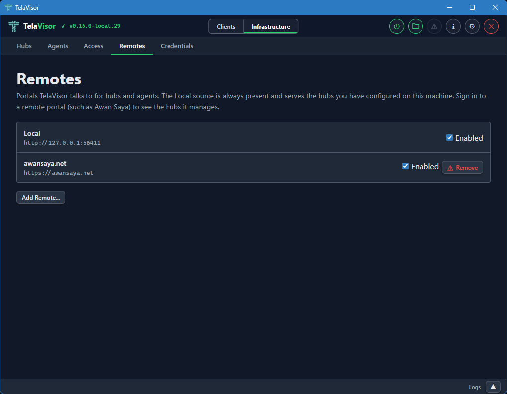

The view shows a table of registered remotes with two columns:

- **Name.** The short name you assigned to the remote. This is the
  name the `tela` command line and TelaVisor use to look up hub URLs.
- **URL.** The directory's base URL.

A *Remove* button on each row removes the remote, with confirmation.

Below the table, an input row with *Name*, *Portal URL*, and *Add*
fields lets you register a new remote. The Name field is the short
name you want to use; the Portal URL field is the base URL of the
directory.

Once a remote is registered, you can use short hub names like
`tela connect -hub work` and the client resolves *work* through the
remote into a full hub URL. See the
[Hub directories and portals](directories.md) chapter for the directory
protocol itself.

### Credentials

The Credentials tab shows every hub token stored in your local
credential file. This is the desktop equivalent of `tela login` and
`tela logout`.

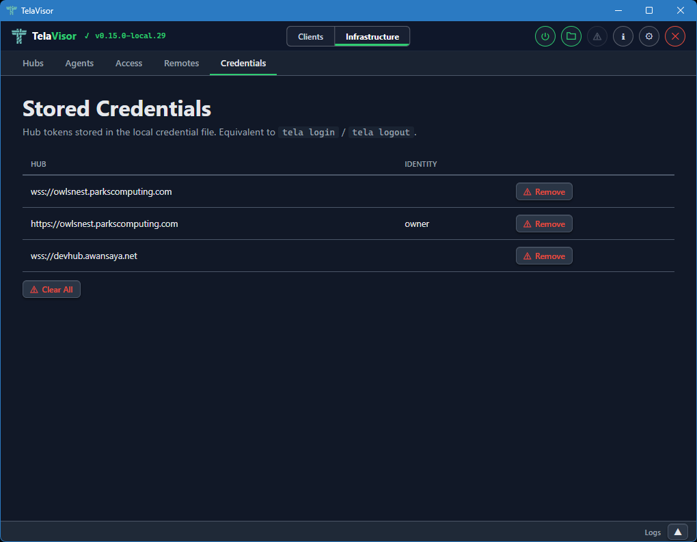

The view shows a table of credential entries with two columns:

- **Hub.** The hub URL the credentials are stored under.
- **Identity.** The identity name on that hub. May be empty for
  legacy entries that were stored before identity tracking was added.

Each row has a *Remove* button to delete that entry from the
credential file. A *Clear All* button at the bottom removes every
stored credential. Both actions ask for confirmation.

Removing a credential entry does not invalidate the token on the hub.
It only removes the local copy. To revoke a token on the hub, use the
[Tokens view](#tokens) on the hub itself.

The credentials file is stored at:

| Platform | Path |
|----------|------|
| Windows | `%APPDATA%\tela\credentials.yaml` |
| Linux | `~/.tela/credentials.yaml` |
| macOS | `~/.tela/credentials.yaml` |

The file is created with `0600` permissions (owner read-write only) on
Unix systems and the equivalent restrictive Access Control List (ACL)
on Windows. The same file is shared with the `tela` CLI, so credentials
added through TelaVisor are visible to `tela` and vice versa.

## Log panel

The log panel is a persistent area at the bottom of the window that
provides tabbed log output visible across both modes. You can resize it
by dragging its top edge, or collapse it to a slim bar showing only a
*Logs* label and an expand chevron.

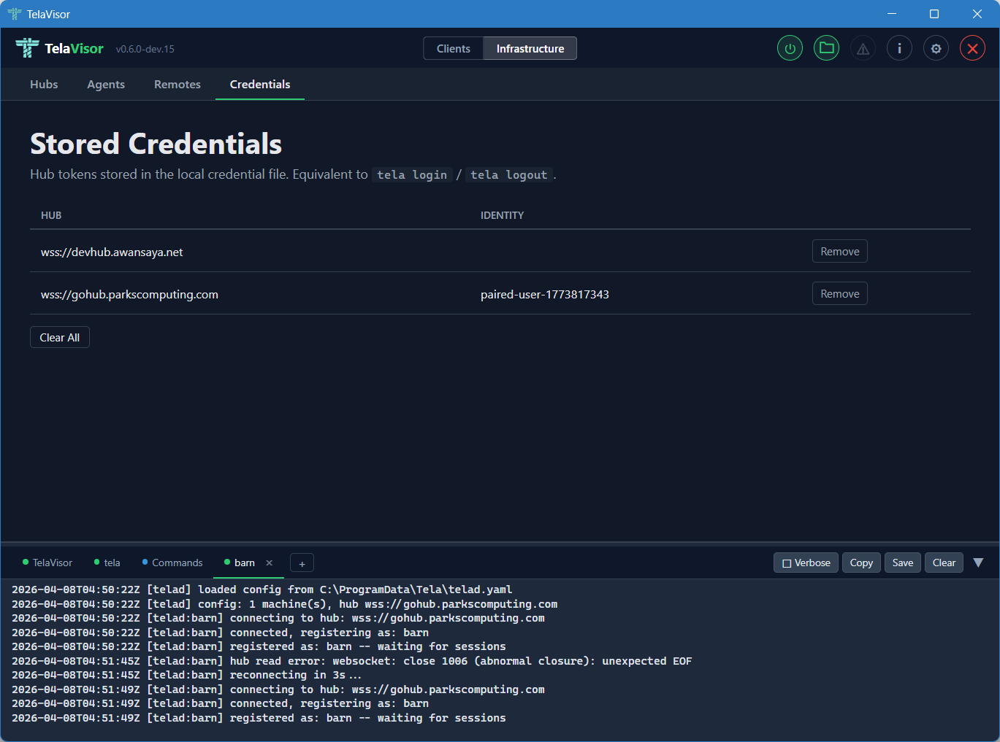

The panel auto-scrolls to the bottom as new lines arrive. If you scroll
up to read history, auto-scroll pauses until you scroll back to the
bottom. Each pane is limited to a configurable maximum number of lines
(default 5000, configurable in
[Application Settings](#application-settings)).

### Built-in tabs

Three tabs are always present.

- **TelaVisor.** Application events: startup, profile loading,
  connection state changes, errors. This is the place to look first
  when something in TelaVisor itself is misbehaving.
- **tela.** Live output from the `tela` child process. The same
  output you would see if you ran `tela connect -profile <path>` in a
  terminal yourself. This is the canonical place to look when the
  tunnel is failing to connect or behaving unexpectedly.
- **Commands.** A filterable log of every API call and CLI command
  TelaVisor issues. Each row shows a method badge (`GET`, `POST`,
  `DEL`, `CLI`), a timestamp, the URL or command line, and a copy
  button. Click a row to expand it for the full request and response.
  The Commands tab is the answer to *what would I have to type at a
  shell to do what TelaVisor just did?*

The Commands tab is also useful for learning the underlying CLI behind
a UI action, troubleshooting an unexpected response, or scripting
equivalent operations.

### Toolbar

The log panel toolbar across the top has four buttons that act on the
currently active tab:

- **Verbose.** Toggles verbose logging for the `tela` process. The
  setting persists for the current session and resets to the default
  on restart unless overridden in
  [Application Settings](#application-settings).
- **Copy.** Copies the active tab's content to the clipboard.
- **Save.** Saves the active tab's content to a file.
- **Clear.** Clears the active tab.

### Attaching log sources

The `+` button at the right end of the tab strip opens the *attach
popover*. The popover lists every hub you have credentials for and
every agent visible across those hubs.


Clicking a hub opens a new tab streaming `GET /api/admin/logs` from
that hub. Clicking an agent opens a new tab fetching the agent's log
ring through the hub's mediated management protocol. The popover
renders next to the `+` button using fixed positioning so it is not
clipped by the scrollable tab strip. Click outside the popover to
dismiss it.

Dynamic log tabs use the same close-button pattern as the built-in
tabs. Each agent or hub log tab shows a coloured status dot:

- **Green.** The log fetched successfully and the source is reporting
  fresh lines.
- **Amber.** The log is being fetched (in flight).
- **Grey.** Idle, or the source is offline.

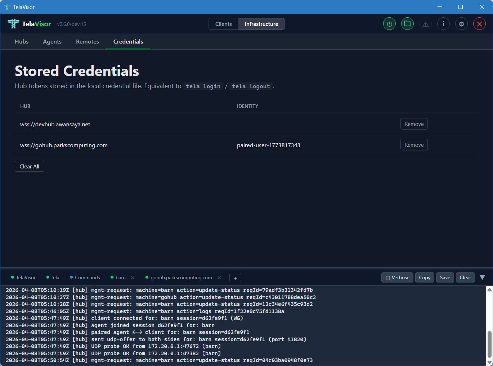

The log panel remembers which dynamic tabs were open between sessions.
Tabs you open via *View Logs* (in the Hubs or Agents tab) or via the
attach popover are saved to the TelaVisor settings file and restored
on the next launch. This makes the log panel a persistent operator
dashboard rather than a transient buffer: the hubs and agents you care
about stay attached across restarts.

## Application Settings

The Application Settings dialog is opened from the gear icon in the
title bar. A toolbar at the top of the dialog provides *Apply*,
*Apply & Close*, and *Cancel* buttons. *Apply* and *Apply & Close* are
disabled until at least one setting changes.

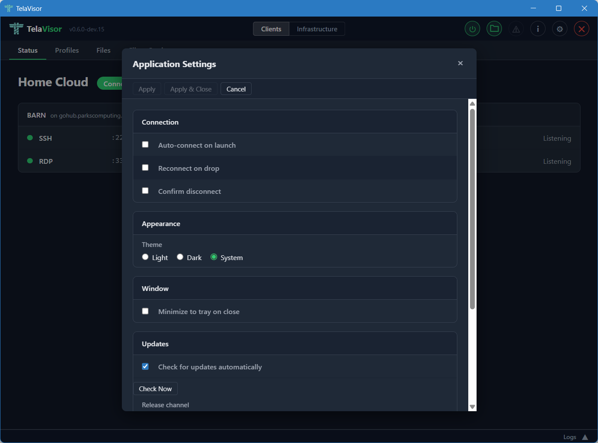

The settings are organized into sections.

### Connection

- **Auto-connect on launch.** When checked, TelaVisor automatically
  connects using the default profile when the application starts.
- **Reconnect on drop.** When checked, TelaVisor attempts to reconnect
  automatically if the connection drops unexpectedly. The reconnect
  logic uses the same backoff schedule as the `tela` CLI.
- **Confirm disconnect.** When checked, TelaVisor shows a confirmation
  prompt before disconnecting or quitting while connected.

### Appearance

- **Theme.** *Light*, *Dark*, or *System* (follows the operating
  system preference). The change takes effect immediately when you
  click Apply.

### Window

- **Minimize to tray on close.** When checked, closing the window
  hides TelaVisor to the system tray instead of exiting. The
  application remains running in the background and can be restored
  by clicking the tray icon. Without this setting, closing the window
  quits the application.

### Updates

- **Check for updates automatically.** When checked, TelaVisor checks
  for new versions at startup against the configured release channel.
- **Release channel.** A dropdown that selects which release channel
  TelaVisor and the `tela` CLI follow for self-update: `dev`, `beta`,
  or `stable`. The preference is stored in the user credential store
  (`~/.tela/credentials.yaml` on Unix, `%APPDATA%\tela\credentials.yaml`
  on Windows) and shared with the `tela` CLI; running `tela channel
  set <name>` from a shell and changing this dropdown are equivalent.
  Hubs and agents have their own release channels, configured
  separately in their YAML files or through the *Release channel*
  controls in [Hub Settings](#hub-settings) and the agent
  [Management](#management-and-danger-zone) card.

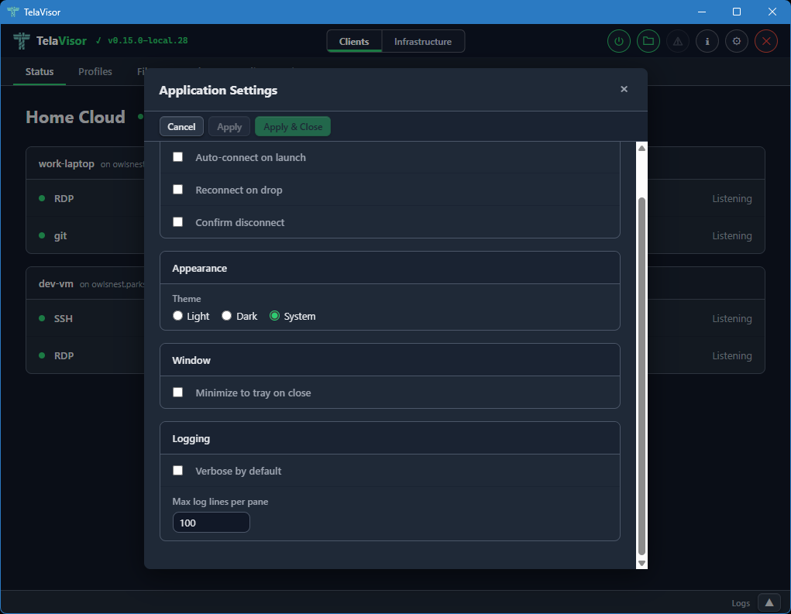

### Logging

- **Verbose by default.** When checked, the `tela` process is started
  with verbose logging on every connection. Useful for diagnostic
  builds.
- **Max log lines per pane.** Limits the number of lines kept in each
  log tab in the [Log panel](#log-panel). The default is 5000. Older
  lines are evicted as new ones arrive.

## About dialog

The About dialog is opened by clicking the **TelaVisor** title in the
top-left corner of the title bar, or by clicking the information icon
in the title bar. It shows version numbers for both TelaVisor and the
`tela` CLI, project links, license information, dependency credits, and
the path to the CLI binary.

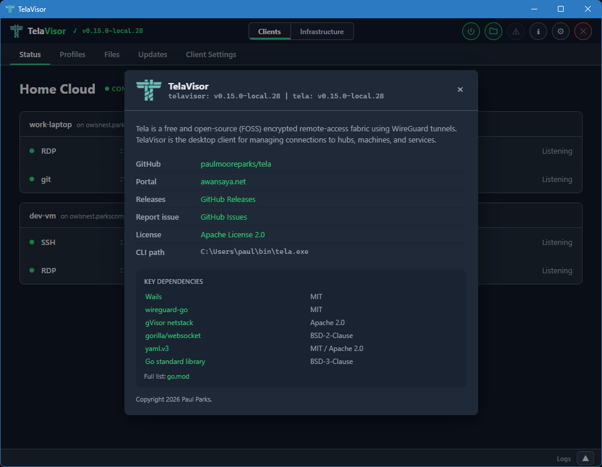

The dialog is the canonical place to confirm what version of TelaVisor
and `tela` you are running, and which channels they are configured to
follow. Use it when filing bug reports.

## Update indicator

When an update is available for any of the binaries TelaVisor manages,
an orange warning icon appears in the title bar. Clicking the icon
opens an update dialog that shows current and latest versions for each
binary, with per-binary *Update* and *Install* buttons.

The update dialog is the same workflow as the
[Installed Tools table in Client Settings](#installed-tools), exposed
as a one-click affordance from the title bar so you do not have to
navigate to find it. The dialog also has *Remind Later* (hides the
indicator until the next restart) and *Skip This Version* (hides the
indicator until a newer version is released) options.

If TelaVisor was installed via a system package manager (winget,
Chocolatey, apt, brew), the self-update mechanism is disabled. Use the
package manager to update instead. The update indicator will not
appear in this case.

## Connection status icon

The power button in the title bar indicates the current connection
state at a glance:

- **Grey.** Disconnected.
- **Amber, pulsing.** Connecting or disconnecting.
- **Green.** Connected.

You can click the button at any time from any tab to toggle the connection.
When connected, clicking it disconnects. When disconnected, clicking it
connects using the current profile.

## System tray

When *Minimize to tray on close* is enabled in
[Application Settings](#application-settings), closing the window
hides TelaVisor to the system tray (the notification area) instead of
quitting. The application remains running and the tunnel stays up.

You can left-click or double-click the tray icon to show the window
again. Right-clicking the tray icon opens a small menu with *Show* and
*Quit* options. *Quit* exits the application and tears down the tunnel.

The tray feature is useful for keeping a long-running tunnel out of
the way without committing to installing a system service.

## How TelaVisor works with tela

TelaVisor does not implement WireGuard, gVisor, the hub protocol, the
agent protocol, or any of the other parts of the Tela fabric directly.
It is a control surface around the `tela` command-line process. The
flow of a connection is:

1. **TelaVisor writes a profile YAML file** with your selected hubs,
   machines, and services. This is the same
   file format documented in [REFERENCE.md](https://github.com/paulmooreparks/tela/blob/main/REFERENCE.md).
2. **TelaVisor runs `tela connect -profile <path>`** as a child process.
3. **The `tela` process opens a local control API** on a random
   localhost port with a random one-time bearer token. The token is
   passed to TelaVisor via a private channel (an environment variable
   on the child process) so other processes on the same machine cannot
   guess it.
4. **TelaVisor connects to the control API's WebSocket endpoint** to
   receive real-time events: `service_bound`, `tunnel_activity`,
   `connection_state`. These are the events that drive the Status tab
   updates.
5. **The `tela` process output streams to the *tela* tab** in the log
   panel through the same control API.
6. **When you click Disconnect**, TelaVisor signals the `tela` process
   to shut down gracefully. The process closes the WireGuard tunnels,
   releases the local listeners, and exits.

The profile YAML that TelaVisor writes is the same format that the
`tela` CLI consumes. Profiles are interchangeable between the two: a
profile created in TelaVisor works at the command line, and a profile
written by hand for the command line works in TelaVisor.

For administration features (Hubs, Agents, Remotes, Credentials),
TelaVisor talks to the hubs directly over their HTTPS APIs using the
credentials in the local credential file. There is no `tela` child
process involved in those requests; TelaVisor uses the same hub admin
endpoints that the CLI's `tela admin` family uses.

## Profile storage

Profiles are stored in the user's application data directory:

| Platform | Path |
|----------|------|
| Windows | `%APPDATA%\tela\profiles\` |
| Linux | `~/.tela/profiles/` |
| macOS | `~/.tela/profiles/` |

Each profile is a single YAML file. The file name (minus the `.yaml`
extension) is the profile name. You can edit profile files by hand
with any text editor; TelaVisor reloads them on the next time it
opens the profile.

The default profile, used at startup and by the system service, is
configured in [Client Settings](#client-settings).

## Configuration

TelaVisor's own settings are stored in `telavisor-settings.yaml` in
the same Tela configuration directory as the credential file. Window
position and size are saved automatically on close and restored on the
next launch. All other settings (theme, default profile, release
channel, log lines, attached log tabs) take effect when you click
*Apply* or *Apply & Close* in the Application Settings dialog and
persist across restarts.

## Building from source

TelaVisor requires [Wails v2](https://wails.io/docs/gettingstarted/installation)
and its prerequisites: Go 1.25 or newer, Node.js, and the platform
WebView runtime (WebView2 on Windows, webkit2gtk on Linux, the system
WebKit on macOS).

```bash
cd cmd/telagui
wails build
```

The output binary is in `cmd/telagui/build/bin/`.

For development with live reload:

```bash
cd cmd/telagui
wails dev
```

Note that the JavaScript, HTML, and CSS frontend is bundled into the Go
binary at build time, not at runtime, so editing the frontend requires
a `wails build` to take effect.
