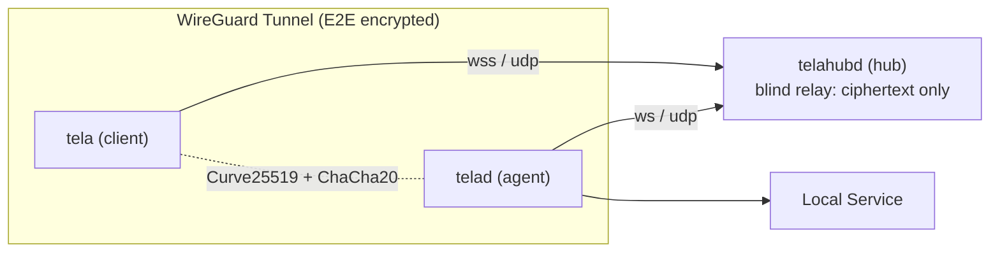

# The three binaries

Tela is built around three cooperating Go binaries. Each one runs from a
single static executable with no runtime dependencies.

| Binary | Role | Where it runs |
|--------|------|---------------|
| `telahubd` | Hub relay. Brokers encrypted sessions between agents and clients. Sees only ciphertext. | A publicly reachable server. |
| `telad` | Agent / daemon. Registers a machine with a hub and exposes selected TCP services through the encrypted tunnel. | The machine you want to reach. |
| `tela` | Client CLI. Connects to a machine through a hub and forwards local TCP ports through the encrypted tunnel. | Any machine you want to connect *from*. |

A connection involves all three:

Both `tela` and `telad` make outbound connections to the hub. Neither side
needs to open inbound ports or configure port forwarding. The hub is the only
component that needs to be publicly reachable.

The hub is a blind relay. It pairs clients with agents and forwards
WireGuard packets between them, but it cannot decrypt the contents -- only
the agent and the client share the keys. Even if the hub is compromised,
session contents are not exposed.

For the full architecture, see [Design overview](../architecture/design.md).
For the CLI surface of each binary, see [CLI reference](reference.md).
