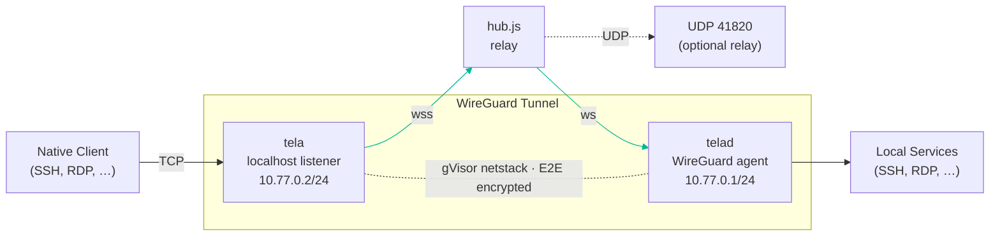

# Tela — Secure Remote Access via WireGuard over WebSocket

Tela tunnels TCP services (SSH, RDP, HTTP, etc.) through a WireGuard L3
tunnel relayed over WebSocket, with an optional UDP fast path. No admin
privileges required on either end.

## Architecture



### Components

| Component | Language | Role |
|-----------|----------|------|
| **tela** | Go | Client — WireGuard endpoint, auto-binds localhost listeners for each advertised port |
| **telad** | Go | Agent/daemon — WireGuard endpoint, forwards tunnel traffic to local services |
| **hub.js** | Node.js | Relay — pairs agents and clients, relays WS frames, optional UDP relay |
| **serve.js** | Node.js | Test web server (for quick smoke tests only) |

### Security

- **End-to-end encryption:** WireGuard (Curve25519 + ChaCha20-Poly1305) between tela and telad. The hub sees only ciphertext.
- **Token auth:** Both tela and telad authenticate to the hub with a shared secret (`HUB_TOKEN` / `-token`).
- **No admin/TUN:** Both sides use gVisor netstack — pure userspace, no elevated privileges.

## Prerequisites

- **Go 1.24+** (to build tela and telad)
- **Node.js 20+** (to run hub.js)
- **Docker + Docker Compose** (for production deployment)

## Quick Start — Local Development

### 1. Build the Go binaries

```bash
go build -o tela.exe ./cmd/tela      # Windows
go build -o telad.exe ./cmd/telad    # Windows
# On Linux/macOS, omit the .exe extension
```

### 2. Start the hub

```bash
cd poc
npm install
node hub.js
```

Output: `[hub] HTTP on :8080  ·  UDP relay on :41820`

### 3. Start telad (on the machine with services)

```bash
./telad -hub ws://localhost:8080 -machine mybox -ports "22,3389"
```

telad registers with the hub, generates its WireGuard keypair, and waits for a client.

### 4. Start tela (on your laptop)

```bash
./tela connect -hub ws://localhost:8080 -machine mybox
```

tela connects, completes the WireGuard handshake, and prints the local port bindings:

```
[tela] listening 127.0.0.1:22   → mybox:22
[tela] listening 127.0.0.1:3389 → mybox:3389
```

### 5. Connect

```bash
ssh localhost          # SSH
mstsc /v:localhost     # RDP (Windows Pro/Enterprise only)
```

## Production Deployment (Docker)

The repo root contains a `docker-compose.yml` with three services:
**caddy** (TLS reverse proxy), **hub** (WebSocket + UDP relay), and
**telad** (WireGuard agent).

```bash
# Set your Cloudflare API token for DNS-01 ACME
export CLOUDFLARE_API_TOKEN=your_token_here

# Build and start
docker compose up --build -d

# Run tela on your laptop
./tela connect -hub wss://tela-local.awansatu.net -machine barn
```

See `IMPLEMENTATION.md` §8 for the full Docker Compose skeleton and Caddyfile.

## CLI Reference

### tela (client)

Subcommand-based CLI. Run `tela` with no arguments for usage.

**Hub name resolution** — the `-hub` flag accepts a full URL (`wss://...`) or
a short hub name. Short names are resolved by: (1) querying the portal you
logged into via `tela login`, (2) falling back to a local `hubs.yaml` file.

**Environment variables** — set these to avoid repeating flags:

| Variable | Description |
|----------|-------------|
| `TELA_HUB` | Default hub URL or name (overridden by `-hub`) |
| `TELA_MACHINE` | Default machine ID (overridden by `-machine`) |
| `TELA_TOKEN` | Default auth token (overridden by `-token`) |

#### tela connect

Open a WireGuard tunnel to a registered machine.

```
tela connect -hub <url> -machine <name> [-token <secret>]

# With env vars:
export TELA_HUB=wss://tela.awansatu.net TELA_MACHINE=barn
tela connect
```

| Flag | Default | Description |
|------|---------|-------------|
| `-hub` | `$TELA_HUB` | Hub WebSocket URL (`ws://` or `wss://`) or hub name |
| `-machine` | `$TELA_MACHINE` | Machine name to connect to |
| `-token` | `$TELA_TOKEN` | Authentication token (must match `HUB_TOKEN`) |

#### tela login

Authenticate with a Tela portal to enable hub name resolution.

```
tela login https://awansatu.net
```

Prompts for an API token (press Enter for open-mode portals). Stores portal URL
and token in `%APPDATA%\tela\config.yaml` (Windows) or `~/.tela/config.yaml`.

Once logged in, `-hub` accepts short hub names (e.g., `owlsnest`) that are
resolved via the portal's `/api/hubs` endpoint. Local `hubs.yaml` is used as
a fallback if the portal is unreachable.

#### tela logout

Remove stored portal credentials.

```
tela logout
```

#### tela machines

List machines registered on the hub.

```
tela machines -hub <url> [-token <secret>] [-json]
tela machines              # uses $TELA_HUB
```

#### tela services

List services advertised by machines.

```
tela services -hub <url> -machine <name> [-token <secret>] [-json]
tela services              # uses $TELA_HUB + $TELA_MACHINE
```

#### tela status

Show a summary of hub status (machine counts, session counts).

```
tela status -hub <url> [-token <secret>] [-json]
tela status                # uses $TELA_HUB
```

### telad (agent)

**Config-file mode** (recommended for production and multi-machine):

```yaml
# telad.yaml
hub: ws://hub:8080
token: secret              # optional, shared default

machines:
  - name: barn
    ports: [22, 3389]
    target: host.docker.internal

  - name: nas
    ports: [22, 445]
    target: 192.168.1.50
```

```
telad -config telad.yaml
```

**Single-machine mode** (flags):

```
telad -hub <url> -machine <name> -ports <list> [-target-host <host>] [-token <secret>]
```

| Flag | Default | Description |
|------|---------|-------------|
| `-config` | `$TELA_CONFIG` | Path to YAML config file |
| `-hub` | `$TELA_HUB` | Hub WebSocket URL |
| `-machine` | `$TELA_MACHINE` | Machine name to register as |
| `-ports` | `$TELA_PORTS` or `3389` | Comma-separated ports to advertise |
| `-target-host` | `$TELA_TARGET_HOST` or `127.0.0.1` | Host where services are running |
| `-token` | `$TELA_TOKEN` | Authentication token |

### hub.js

```
HUB_PORT=8080 HUB_UDP_PORT=41820 HUB_TOKEN=secret node hub.js
```

| Env var | Default | Description |
|---------|---------|-------------|
| `HUB_PORT` | `8080` | HTTP/WebSocket listen port |
| `HUB_UDP_PORT` | `41820` | UDP relay port for WireGuard datagrams |
| `HUB_TOKEN` | (none) | Shared authentication token |

### serve.js (test only)

```
node serve.js [port]
```

Default port: `3000`. Serves a static test page.

## Glossary

| Term | Definition |
|------|------------|
| **Hub** | Central relay server (`hub.js`). Routes control + data between agents and clients. |
| **Hub Console** | Web dashboard served at the hub root URL. Shows live machine/service status. |
| **Agent (telad)** | Daemon running on a machine that registers with the hub and exposes services. |
| **Client (tela)** | CLI tool that connects to a machine through the hub and opens a WireGuard tunnel. |
| **Machine** | A named endpoint registered by an agent (e.g. `barn`). |
| **Service** | A network port advertised by an agent (e.g. SSH/22, RDP/3389). |
| **Session** | An active tunnel between a client and a machine. |

## What This Proves

- WireGuard L3 tunneling over WebSocket works for real protocols (SSH, RDP)
- gVisor netstack eliminates the need for TUN interfaces or admin privileges
- The outbound-only hub relay model works across NATs and firewalls
- UDP relay provides a fast path when available, with automatic WS fallback
- Asymmetric UDP mode (one side UDP, other side WS) works via hub bridging
- Token authentication prevents unauthorized pairing
- Auto-reconnect keeps sessions resilient
- Hub Console provides live visibility into registered machines and services

## What's Next

- Binary multiplexed framing (DESIGN.md §6.3)
- Multiple simultaneous sessions per machine

See `TODO.md` for the full roadmap.

## Troubleshooting

**"Machine not found"** — Start telad before tela. The machine’s daemon must register first.

**"auth failed"** — Token mismatch. Ensure `-token` matches `HUB_TOKEN`.

**Connection hangs after pairing** — Check that the WireGuard handshake completes. Look for `[wg] handshake complete` in the logs. If missing, there may be a WebSocket framing issue.

**RDP black screen / NLA error** — Ensure RDP is enabled (Windows Pro/Enterprise only). Tela uses a WireGuard tunnel so NLA/CredSSP works correctly (unlike L4 TCP proxies).

**UDP relay not upgrading** — The hub's UDP port (41820) must be reachable from the client. If behind NAT without port forwarding, the system falls back to WebSocket automatically.

**Port already in use** — Another process is using that port. tela will report the conflict at startup.
